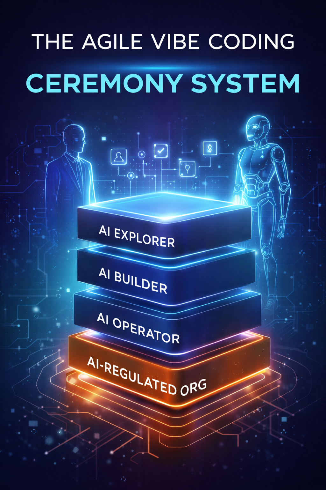

# The Agile Vibe Coding - the 4-level adaptive ceremony system

> Most narratives surrounding AI development currently overemphasize speed and overlook accountability. But let me start with a manifesto.

## Manifesto for Agile Vibe Coding

We are discovering better ways to build software in collaboration with intelligent systems, by doing so and by helping others do the same. Through this work, we have come to value:
- Human judgment and accountability over autonomous generation.
- Structured context and explicit intent over ad hoc guidance and unconditional faith in design patterns.
- Validated, sustainable increments over rapid but opaque results.
- Continuous learning and human-AI collaboration over siloed automation and context-free generation.
- Sustainable architecture over short-term speed and raw velocity.
- Transparency and traceability over magic outputs.

While autonomous generation, speed, and automation have their value, we value disciplined collaboration, transparency, and long-term integrity more.

> **Agile Vibe Coding** turns AI from a coding assistant into a governed software delivery system. **Agile Vibe Coding is not low code.**

## The Agile Vibe Coding Adaptive Ceremony System

> The AVC Adaptive Ceremony system is key to Agile Vibe Coding's scalability. It would be a mistake to adopt a single, rigid ceremony model for all. Instead, design a Progressive Governance Model.

### Level 1 — Explorer Mode

Audience
- Non-technical founders
- Product managers
- Domain experts
- Idea validation

Primary Goal
- Speed + clarity

Characteristics
- 5-question sponsor call
- 1 validation loop (max 2 iterations)
- Safe default architecture
- No CI/CD integration
- No formal drift detection
- AI auto-fills missing fields

Constraints
- No advanced infrastructure options
- No sensitive data deployment without warning
- No production SLA guarantees

Risk model
- User risk, not system risk.

### Level 2 — Builder Mode

Audience
- Small dev teams
- Startup engineers
- Internal tooling teams

Primary Goal
- Ship MVPs safely

Characteristics
- Structured sponsor call
- 3–5 iteration validation loop
- Architecture options (simple comparison)
- Basic risk register
- Definition of Done auto-generated
- Test cases scaffolded
- Security defaults enforced

Constraints
- Limited architectural drift allowed
- Scope change requires validation rerun

Risk model
- Moderate project risk control.

### Level 3 — Professional Mode

Audience
- Growing SaaS teams
- Multi-service systems
- Production-critical systems

Primary Goal
- Controlled scalability

Characteristics
- Full sponsor call artifact
- Transparent scoring rubric
- Versioned architecture
- Drift detection before regeneration
- Contract validation
- Performance assumptions required
- CI/CD integration hooks
- Observability spec generated
- Threat model auto-generated

Constraints
- Architectural changes require approval step
- Risk scoring must meet threshold
- Validation rubric public and auditable

Risk model
- Operational risk management.

### Level 4 — Enterprise Mode

Audience
- Regulated industries
- Financial services
- Healthcare
- Large distributed cloud systems

Primary Goal
- AI-assisted compliance and governance

Characteristics
- Mandatory non-functional requirements
- Data classification enforcement
- Regulatory domain tagging
- Multi-model validation roles
- Drift justification required
- CI/CD policy injection
- Artifact versioning
- Audit log of AI decisions
- Architecture alternatives required
- Risk register integrated into pipeline

Constraints
- Human sign-off gates
- Iteration cap
- Security scan mapping
- SLA + RPO/RTO mandatory

Risk model
- Organizational and regulatory risk containment.

## Key Insight

- Ceremonies are not linear.
- They are dynamic control loops.
- The product should allow:
  - increase governance when risk increases,
  - decrease governance when speed matters more.

> 👍 That flexibility is the innovation.

[Agile Vibe Coding Manifesto](https://agilevibecoding.org/)
