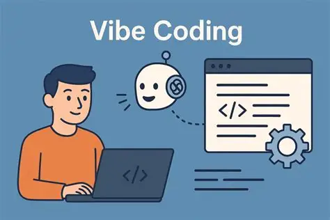

AI - nobody has this figured out. 

> ℹ️ AI is hard in ways we didn’t expect.

A month ago, **Martin Fowler** and **Thoughtworks** organized an Open Space conference titled ___"The Future of Software Development"___.  The location is Deer Valley, Utah, specifically referencing the famous **Agile Manifesto**. The event organizers have no official plans to create a new manifesto (yet).

And there's some truth to the opinion of the world's leading IT gurus that we don't know how to write a new Manifesto, because there are so many unanswered questions. However, current Agile practices have already revealed so many shortcomings, and progress in AI is so significant, that the need for improvement seems more than urgent.

But does this confirm the thesis that waiting for a new, super-version of Agile, taking into account the presence of AI in software development, is a good solution?

I don't share this view. My experience with **Red-Green-Refactor** tells me that even a small improvement now is better than perfect improvement in the indefinite future.

Well, nobody is perfect, and practice has already proven that AI is an amplifier and a mirror for programmers. Therefore, by complaining about the imperfection of what AI suggests, are we perhaps criticizing ourselves? I think so, and perhaps that's also why LLM either terrifies or fascinates many.

For now, perhaps [Nacho](https://www.linkedin.com/in/nacho-coll/?lipi=urn%3Ali%3Apage%3Ad_flagship3_pulse_read%3Bslluj5WmR3OkwP3uieLZqg%3D%3D) and [I's](https://www.linkedin.com/in/marek-kubis-236ab211/) proposal for a new Agile approach will help or inspire someone. We invite you to join the community.

## See also: 
- [Agile Vibe Coding Manifesto](https://agilevibecoding.org/)
- [The future of software engineering](https://www.thoughtworks.com/content/dam/thoughtworks/documents/report/tw_future%20_of_software_development_retreat_%20key_takeaways.pdf)
- [Agile doesn’t eliminate uncertainty. It manages it](https://www.garethjmsaunders.co.uk/2026/02/24/agile-doesnt-eliminate-uncertainty-it-manages-it/)
- [Finding Comfort in the Uncertainty ](https://annievella.com/posts/finding-comfort-in-the-uncertainty/)
- [The “funhouse mirror”: How AI reflects the hidden truths of your software pipeline ](https://thenewstack.io/ai-velocity-debt-accelerator/)
- [Humans and Agents in Software Engineering Loops ](https://martinfowler.com/articles/exploring-gen-ai/humans-and-agents.html)
- [AgileVibeCoding](https://www.reddit.com/r/AgileVibeCoding/)
- [DORA Research: 2025 - Choosing measurement frameworks to fit your organizational goals](https://dora.dev/research/2025/measurement-frameworks/)
