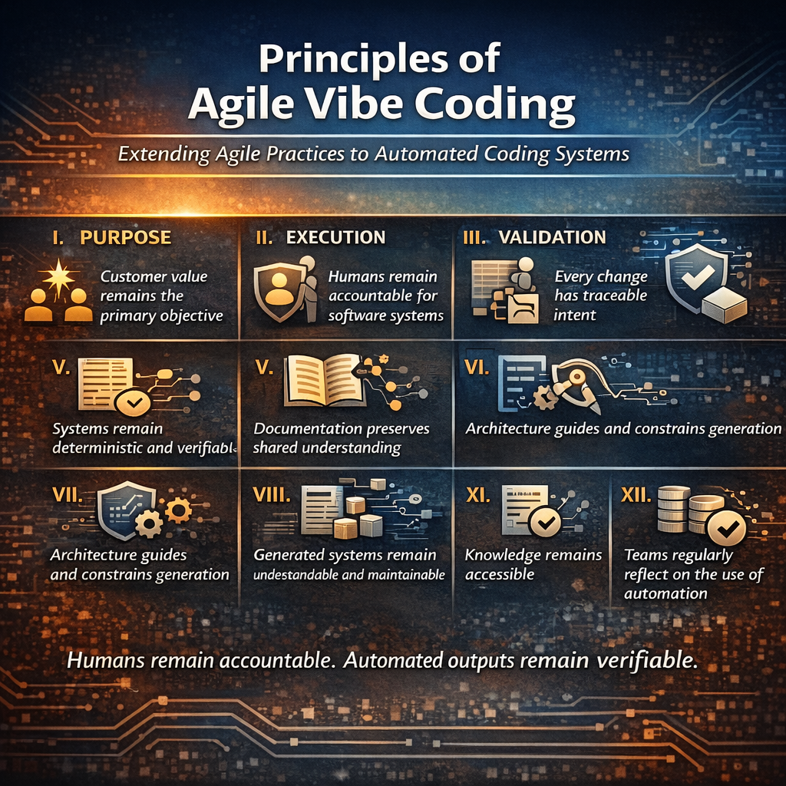

# Redesign Agile Vibe Coding, AVC ceremony for “Enterprise Mode”

## Assumptions:
- Regulated environment
- Cloud infrastructure
- Multiple teams
- CI/CD enforcement
- Security and compliance requirements

> [!IMPORTANT]
> **👍 The goal is not speed. The goal is controlled AI acceleration.**

## Enterprise Ceremony Stack

### Sponsor Call (Strategic Gate)

Outputs must include:
- Business objective
- Measurable success criteria
- Budget boundary
- Risk appetite
- Compliance constraints
- Data classification level
- Expected scale

New Additions:
- Risk register (auto-generated + human-approved)
- Assumptions list
- Non-functional requirements (explicit)

> [!IMPORTANT]
> * AI may suggest.
> * Human must approve.
> * Gate: Cannot proceed without sign-off.

### Reinforced validation loop
- Separate model for Validator (or at least separate role prompt)
- Explicit scoring rubric (public and visible)
- Maximum 10 iterations
- Stop if delta < X improvement

Scoring dimensions example:
- Scope clarity (0–20)
- Measurability (0–15)
- Risk identification (0–15)
- Feasibility (0–15)
- Completeness (0–15)
- Architectural implications identified (0–20)

> [!TIP]
> **❗️ No hidden scoring.**

### Architecture Design Ceremony

Before recommending an architecture, it is required:
- SLA target
- RPO / RTO
- Data sensitivity
- Regulatory domain
- Cost tier expectation

AI proposes 2–3 architecture variants:
- Conservative
- Balanced
- Cost-optimized

> [!IMPORTANT]
> - ✅ Human chooses. 
> - ✅ Architecture becomes versioned artifact.

### Drift Detection Layer

Before every regeneration system compares:
- Current architecture vs original
- Contract changes
- Infrastructure changes
- Naming consistency
- Boundary violations

> [!CAUTION]
> AI must justify drift. **This is essential in enterprise.**

### CI/CD Integrated Gates

Ceremony outputs must feed pipeline:
- Definition of Done → test cases
- Risk register → security scan checklist
- Architecture → Bicep validation rules
- Data classification → policy enforcement

> [!IMPORTANT]
> ❗️ Ceremonies become enforceable, not decorative.

### Where the workflow could break in Enterprise

- If validator independence and scoring transparency is low.
- If scoring rubric is opaque → false confidence.
- If validator = generator → self-reinforcing bias.
- If auto-fill hides missing constraints → architectural fragility.
- If iteration loop over-refines language instead of substance → cosmetic improvement.

### Enterprise Mode Summary

- ✅ High friction.
- ✅ High governance.
- ✅ High reproducibility.
- ✅ Low chaos.

Enterprise Mode is suitable for:
- Azure-heavy environments
- Financial systems
- Healthcare
- Large distributed systems

[Agile Vibe Coding Manifesto](https://agilevibecoding.org/)

