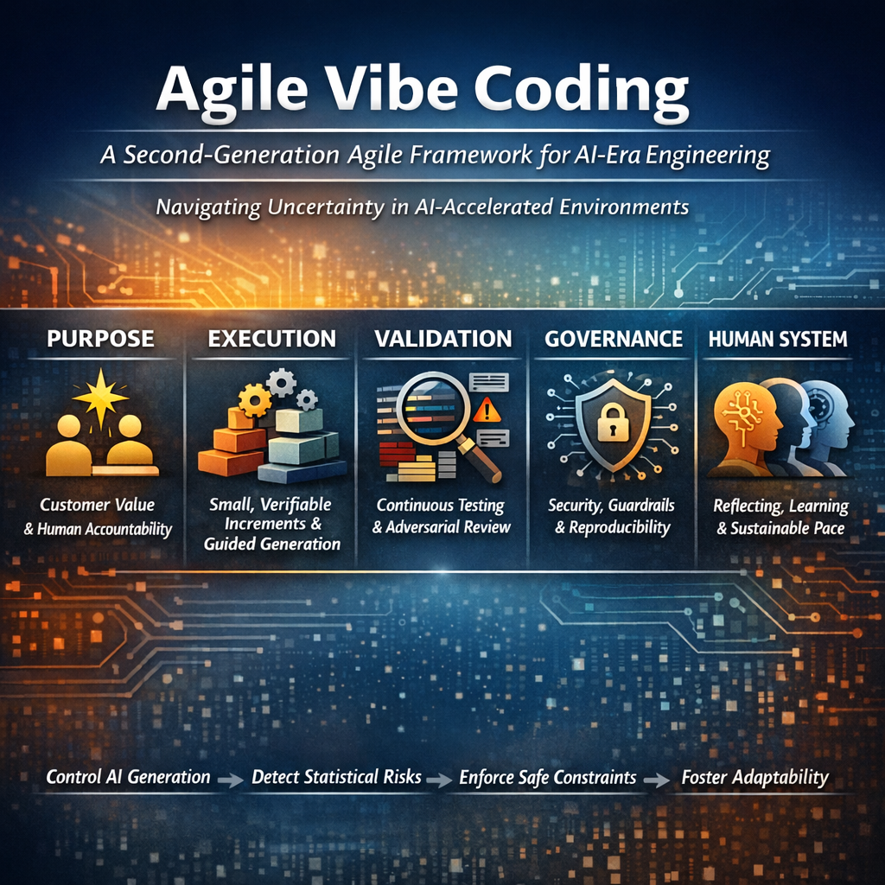

# The Agile Vibe Coding, AVC ceremony in Lightweight Mode for non-developers

## Assumptions:
- Domain expert
- No dev team
- Building niche SaaS
- Small internal tool
- MVP validation

The goal here is:
- Speed + safety rails
- Not full governance.

## Lightweight Ceremony Model

### 1️. Smart, simplified **Sponsor Call **

Ask 5 essential questions instead of 20 ones:
- What problem are you solving?
- Who is the user?
- What does success look like?
- What data does it use?
- Does it handle sensitive information?

> [!NOTE]
> Everything else optional. No long scoring rubric.

### 2️. Safe Architecture Defaults

System auto-selects instead of complex choices:
- Standard secure stack
- Managed services
- Minimal infra
- Logging enabled
- Basic observability

> [!WARNING]
> Do not expose advanced architecture variants. Prevent dangerous freedom.

### 3️. Reduced iteration loop
- Max 3 refinement cycles.
- Focus on clarity, not perfection.

### 4️. Safety guardrails instead of governance

Mandatory:
- Input validation
- Authentication template
- Basic logging
- Error handling
- Dependency security scan

> [!TIP]
> Non-negotiable defaults.

### 5️. Clear Warning Labels

If user skips:
- Data sensitivity
- Security requirements
System displays: "This product may not be safe for production use."

> [!NOTE]
> Transparency is more then control.

## Lightweight Mode Summary:

- Lower friction.
- High accessibility.
- Safe-by-default architecture.
- Limited customization.
- Designed for empowerment.

[Agile Vibe Coding Manifesto](https://agilevibecoding.org/)
