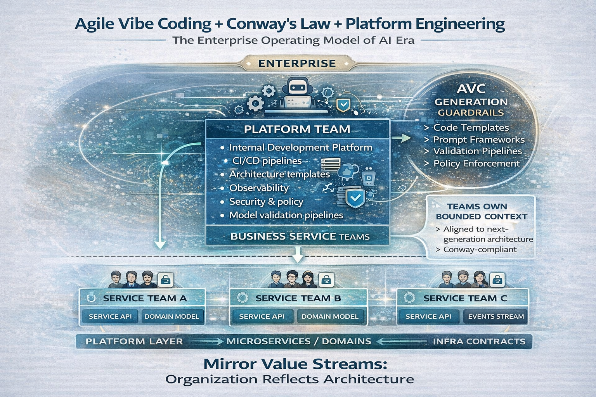

# The Agile Vibe Coding and Conway's Law

> When a new idea enters the market, to be accepted it must not break existing laws.
> It must respect rules that have been proven over time.
> So let's see whether **Agile Vibe Coding** and **Conway's Law** perform better together than traditional **Agile**.

> [!IMPORTANT]
> **Conway’s Law** states:
> “Organizations design systems that mirror their communication structure.” 
> 
> -- [Melvin Conway](https://www.melconway.com/Home/Conways_Law.html)



**Agile Vibe Coding (AVC)** explicitly treats software development as a socio-technical system: `humans + AI + architecture + governance`. 
So, if teams are siloed, the architecture becomes siloed. 
If teams are modular and autonomous, the architecture becomes modular.

In other words:
```
Team structure
      ↓
Communication paths
      ↓
Software architecture
```

## What Conway’s Law Means in Practice

If an organization is structured like this:
```
Frontend team
Backend team
Database team
QA team
```

The resulting system will likely become:
```
Frontend system
Backend services
Data layer
Testing gates
```
Even if this architecture was **never intentionally designed**.
> This phenomenon is extremely well observed in large enterprises.


## Where Traditional Agile Breaks

Traditional Agile focuses on:
- iterative delivery
- customer feedback
- small increments
- team autonomy

However:
> Agile does not explicitly address organizational architecture.

Typical Agile structure:
```
Product Owner
Scrum Team
Scrum Team
Scrum Team
```
Architecture ownership often becomes unclear.

In practice organizations evolve into:
```
Frontend Team
Backend Team
Data Team
AI Team
DevOps Team
```
This creates **Conway fragmentation**.

Architecture then reflects these silos:
```
Frontend stack
Backend stack
Data platform
AI subsystem
DevOps pipelines
``` 

Result:
- cross-team dependencies
- integration friction
- slow feedback loops

> [!IMPORTANT]
> **Agile** improves **process speed**, but not **socio-technical alignment**.

## Agile Vibe Coding Designs the Socio-Technical System

Agile Vibe Coding intentionally integrates:
- platform engineering
- domain ownership
- AI code generation boundaries
- architectural constraints

Instead of generic Scrum teams: `Scrum Teams`
AVC proposes:
```
Platform Team (IDP)

Domain Service Team A
Domain Service Team B
Domain Service Team C
```
Resulting architecture:
```
Platform Layer
   ↓
Domain Services
   ↓
Event / API Contracts
``` 

> [!IMPORTANT]
> This is **almost a perfect Conway mirror**.


## AI Makes Conway’s Law Even Stronger

In traditional engineering: `Organization → Software Architecture`

In AI-accelerated engineering: `Organization → Architecture → AI Generation Patterns`.

AI generates code based on:
- prompts
- context
- architecture
- interfaces

If the organization is fragmented, AI will **replicate the fragmentation faster**.
> [!IMPORTANT]
> The Key Insight: **Conway’s Law** becomes amplified.

## The Agile Vibe Coding + Conway Alignment Model

In an AVC enterprise two structures dominate.

1. Internal Development Platform (IDP) team provides:
- developer platform
- CI/CD
- observability
- AI coding guardrails
- infrastructure templates

2. Business Service teams deliver:
- customer-facing capabilities
- domain logic
- APIs
- value streams

Architecture mirrors this structure.

## The Correct Conway Alignment

### Layer 1 — Platform Layer

___Team___: Internal Development Platform (IDP)

___Produces___:
- CI/CD pipelines
- model validation pipelines
- architecture templates
- observability stack
- policy enforcement

___Architecture reflection___:
```
Platform APIs
Infrastructure contracts
AI generation guardrails
```

### Layer 2 — Domain Layer

___Team___: Business Service teams

___Produces___:
- business capabilities
- services
- domain logic
- product features

___Architecture reflection___:
```
Service APIs
Event streams
Domain models
```
Each team owns a **bounded context**.

### Resulting Architecture

When Conway’s Law is respected:
```
Enterprise Structure

[ IDP Team ]
      ↓
Platform + Guardrails
      ↓
---------------------------------
| Business Service Team A       |
| Business Service Team B       |
| Business Service Team C       |
---------------------------------

↓

Software Architecture

Platform Layer
      ↓
Microservices / Domains
```
Each service corresponds to a **team boundary**.

### The Inverse Conway Maneuver

A concept discussed by Martin Fowler:
**change the organization to produce the architecture you want**.

For AVC: **Design the team topology first**.

<pre><code>
Desired Architecture	Required Organization
----------------------------------------------------------------
Modular services	Domain-aligned teams
Platform layer	Platform/IDP team
Independent deployments Autonomous teams
Stable interfaces   API contracts between teams
</code></pre>   

### Typical Agile Vibe Coding Organizational Pattern

```
                Enterprise

            +----------------+
            |  Platform Team |
            |  (IDP)         |
            +--------+-------+
                     |
     +---------------+---------------+
     |               |               |
+----+----+     +----+----+     +----+----+
| Service |     | Service |     | Service |
| Team A  |     | Team B  |     | Team C  |
+---------+     +---------+     +---------+
```

___Responsibilities___:

Platform team
- platform APIs
- AI tooling
- architecture standards
- validation pipelines

Business teams
- customer value
- domain logic
- service interfaces  

### How Agile Vibe Coding Uses Conway’s Law

AVC applies five practical rules.

1. Teams own architecture boundaries
   - Each business team owns a bounded context service.

2. Platform team owns generation guardrails
   - The IDP team defines:
     - code templates
     - prompt frameworks
     - CI validation
     - security policies

3. Communication defines APIs
   - Team interaction becomes: `Team API → Software API`
   - Communication contracts map to system contracts.

4. AI generation follows team boundaries
   - AI tools generate code inside service boundaries, not across them.
   - This prevents architectural drift.

5. Feedback loops follow value streams
   - `Customer → Business Team → Platform → AI tooling`


#### What Happens If You Ignore Conway’s Law

___Organization___:
```
Frontend Team
Backend Team
Data Team
AI Team
QA Team
```

___Architecture produced___:
```
Frontend system
Backend system
Data pipelines
AI subsystem
QA gating
```

___Result___:
- handoffs
- integration bottlenecks
- slow delivery

> [!CAUTION]
> This happens even in **Agile organizations**.


### Agile vs Agile Vibe Coding

#### "Traditional" **Agile**
```
Organization

Scrum Team A
Scrum Team B
Scrum Team C
DevOps Team
AI Team

↓

Architecture

Mixed ownership
Shared services
Cross-team coupling
Integration friction
```

#### **Agile Vibe Coding**
```
Organization

Platform Team (IDP)
Service Team A
Service Team B
Service Team C

↓

Architecture

Platform Layer
Service APIs
Event Streams
Bounded Contexts
```

> [!IMPORTANT]
> This is a **clear Conway mapping**.

### The AVC-Conway Alignment Matrix

#### Organization → Communication → Architecture

<pre><code>
Dimension	Traditional Agile	Agile Vibe Coding (AVC) Conway Alignment
------------------------------------------------------------------------
Team structure	Generic Scrum teams	Platform team + domain service teams	AVC mirrors architecture
Communication model	Cross-team coordination and ceremonies	API-like communication between teams	AVC reduces communication complexity
Architecture ownership	Shared or unclear ownership	Each team owns a bounded context	AVC enforces Conway mapping
Platform responsibility	DevOps or infrastructure team	Internal Development Platform (IDP) team	Explicit platform boundary
System modularity	Emerges organically	Designed intentionally	AVC designs Conway alignment
AI code generation	Often cross-cutting and uncontrolled	Constrained by architecture boundaries	Prevents architecture drift
Deployment independence	Often coordinated releases	Teams deploy independently	Strong Conway alignment
Knowledge distribution	Knowledge scattered across teams	Knowledge localized within domains	Clear communication paths
Feedback loops	Multiple teams involved	Direct team → service → user loop	Faster learning cycles
Scaling the organization	More teams increase coupling	More teams increase modularity	AVC scales cleanly
</code></pre>   

### The Conway Alignment Score

<pre><code>
Level	Conway Alignment
--------------------------------------------------
Level 1 Architecture conflicts with team structure
Level 2 Architecture partially aligned
Level 3 Teams roughly map to services
Level 4 Platform + domain team architecture
Level 5 Full socio-technical alignment
</code></pre>   

Traditional Agile organizations typically sit at Level 2–3.

**AVC organizations target Level 4–5.**

## The Agile Vibe Coding Principle

**AVC** would express **Conway’s Law** like this:
- Architecture must mirror value streams, not departments.

or more formally:
- System boundaries should mirror value delivery teams.


## Measuring Alignment

You can measure alignment empirically.

Key indicators:

#### 1. Team-Service Ownership 

`Ideal: 1 Team → 1 Service`

Traditional Agile often produces: `3 Teams → 1 Service`

#### 2. Cross-Team Dependencies

Measure: `PRs requiring multiple teams`

Lower = better Conway alignment.

#### 3. Deployment Independence

AVC target: `Team deploys independently`

Traditional Agile often requires coordinated releases.

#### 4. Delivery performance

Aligned architectures produce faster delivery.

Metric from [Accelerate: The Science of Lean Software and DevOps](https://www.amazon.com/Accelerate-Software-Performing-Technology-Organizations/dp/1942788339):
`
Lead time for change
Deployment frequency
`

> [!IMPORTANT]
> **AVC** improves both.

### The AVC Socio-Technical Principle

**AVC** effectively formalizes **Conway’s Law** into a principle:

> [!IMPORTANT]
> Organizational boundaries must match architectural boundaries.

Which leads to: `Team → Service → Value Stream`

> [!WARNING]
> This is something classic **Agile** never explicitly required.


## The Strategic Benefit

When **AVC** and **Conway’s Law** are aligned you get:
- modular services
- autonomous teams
- safe AI code generation
- fast feedback loops

When they are misaligned, you get:
- fragile AI-generated systems
- integration chaos
- architectural drift

### The Key AVC Insight

Agile focused on `process`

AVC focuses on `process + architecture + organization + AI generation`

Which means AVC deliberately designs the **socio-technical system** predicted by **Melvin Conway**.


### Why AVC May Become a Next-Generation Practice

AVC integrates four major modern trends:
- Agile iteration
- Platform engineering
- AI-assisted coding
- socio-technical architecture design

> [!CRITICAL]
> Traditional Agile only covered the first.
> 
> That’s why frameworks like **Agile Vibe Coding** are starting to appear in AI-era engineering practices.


### In one sentence

> [!SUCCESS]
> Agile improves delivery speed,
> but **Agile Vibe Coding aligns the organization, architecture, and AI generation model** — making it far more compatible with Conway’s Law.


[Agile Vibe Coding Manifesto](https://agilevibecoding.org/)