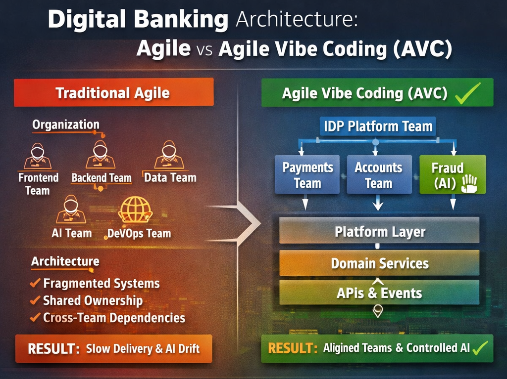

# Using a digital banking solution to prove Conway’s Law in AI-Driven engineering - example 1



> To convincingly demonstrate the effective use of Agile methodology when building software with AI, we need an example that:
> - is complex enough to demonstrate the Conway effect,
> - is realistic for the enterprise,
> - contains clear domain boundaries,
> - uses AI-assisted programming,
> - and management must be able to see the benefits of the AVC-Conway alignment in a new or existing project.

**At the same time, we want to avoid a contrived example that feels artificial or forced.**

Let me show you how I think we should prepare for such a project.

## Digital banking project

> [!NOTE]
> An example that will work perfectly is a digital banking or FinTech platform.
>
> I see many more very good examples, but let's choose this one for discussion 
> because implementing electronic payments is a "must-have" business application today.

I believe this example will work exceptionally well because:
- it naturally breaks down into clear domains,
- high compliance + management pressure,
- it incorporates an event-driven + API-driven architecture,
- realistic use of AI (fraud, scoring, automation),
- strong need for a platform (IDP).

#### Example Domains
```
Customer Service
Payments Service
Accounts Service
Fraud Detection (AI)
Notifications
```

#### Platform layer:
```
CI/CD
Observability
Security
Model validation
API gateway
```

This maps perfectly to AVC model:
```
Platform Team (IDP)
+
Domain Service Teams
```

### What we really want to prove

> [!IMPORTANT]
> We're not proving Conway's Law (which has already been proven). 
> 
> We're proving:
>
> **Agile Vibe Coding management provides stronger Conway compliance than traditional Agile approaches.**
> 
> So our proof must demonstrate:
> 
> `Organization ≈ Architecture ≈ Communication ≈ AI Behavior`

### The Practical Proof Design

#### Step 1 — Define Intended Structure (Target State)

**Organisation**

```
                IDP Platform Team
                       │
 ┌──────────────┬──────┴───────┬─────────────┐
 │              │              │             │
Payments     Accounts      Fraud (AI)     Customer
 Team          Team           Team           Team
```
⬇
**Architecture**
```
Platform Layer
↓
Payments Service
Accounts Service
Fraud Service
Customer Service
```

**Communication Model**
```
Service APIs + Events only
```

#### Step 2 — Implement Agile Vibe Coding Governance

Apply concrete controls:

##### Governance Rules
- each service has one owning team
- no shared database access
- all integration via:
  - APIs
  - events
- AI generation:
  - must use service templates
  - must respect contracts

##### Tooling
- repo-per-service
- CI checks:
  - dependency rules
  - API usage
- observability:
  - service interaction tracing

#### Step 3 — Run Two Modes (Critical for Proof)

##### Mode A — “Traditional Agile”
- Scrum teams
- no strict boundaries
- AI tools used freely

##### Mode B — “Agile Vibe Coding Governance”
- strict team-service ownership
- enforced contracts
- controlled AI generation

### What we measure (the evidence)

> This is the most important part.

#### 1. Conway Alignment Score

**Compare:**
```
Team graph vs Service dependency graph
```

___Higher similarity = better alignment___

#### 2. Team-Service Ownership Ratio

```
Ideal: 1 team → 1 service
```

___Measure violations.___

#### 3. Cross-Team Changes

___Metric:___

```
% of PRs touching multiple services
```

___Expectation:___
- Agile: high
- AVC: low

#### 4. Deployment Independence

**Measure:**

```
% of deployments requiring coordination
```

___Expectation:___
- Agile: high
- AVC: low

#### 5. AI Drift Detection

❗️ Very important (AVC-specific):

**Measure:**
- unauthorized dependencies created by AI
- contract violations

#### 6. Lead Time & Throughput

___From Accelerate:___

**The Science of Lean Software and DevOps:**
- lead time
- deployment frequency

#### 7. Failure Modes

___Track:___
- integration failures
- rollback frequency
- defect origin (cross-team vs local)

### Expected Results

#### Traditional Agile
- architecture diverges from teams
- cross-team coupling increases
- AI introduces hidden dependencies
- slower feedback loops

#### AVC Governance
- architecture mirrors team boundaries
- clear service ownership
- AI respects boundaries
- faster, safer iteration

### The “Proof Artifact” we should produce

> [!IMPORTANT]
> To make this publishable / convincing:

#### 1. Before/After Architecture Diagrams

**Show:**

```
Fragmented vs Aligned architecture
```

#### 2. Measurable Outcomes

<pre><code>
| Metric	| Agile	| AVC |
|------------------|-------|------|
| Team-Service mapping	| Low	| High |
| Cross-team PRs	| High	| Low |
| Deployment independence	| Low	| High |
| AI drift	| High	| Low |
</pre></code>


#### 3. Dependency Graph Visualization
- nodes = services
- edges = dependencies
- color = team ownership

👉 I'm expecting this wll be extremely powerful visually.

#### 4. Governance Rules → Outcomes Mapping

**Example:**

<pre><code>
Rule	Effect
API-only communication	Reduced coupling
Service ownership	Clear boundaries
AI constraints	No drift
</pre></code>


###  Minimal version (if we want faster validation)

If full experiment is too heavy:

Do a single-team pilot:
- build 3–4 services
- enforce AVC rules
- compare with:
  - previous project
  - or baseline metrics

Still valid.

### Conclusion 

> [!IMPORTANT]
> If we publish we’ll be able to claim:
> 
> “In AI-assisted development, Conway’s Law is not just observed—it is amplified.
> Agile Vibe Coding provides the governance mechanisms required to align organization, architecture, and AI behavior, resulting in measurable improvements in modularity, deployment independence, and feedback speed.”
>
> AI Amplification Effect:
> - **Bad Structure → AI scales chaos**
> - **Good Structure → AI scales modularity**

### See also:
- [Agile Vibe Coding Manifesto](https://agilevibecoding.org/)
- [The Agile Vibe Coding and Conway's Law](https://www.linkedin.com/pulse/agile-vibe-coding-conways-law-marek-kubis-m0wpe/?trackingId=wNYc5fRxyx3oQGxE3KYx8Q%3D%3D)
- [Using a .NET 10 migration project to prove Conway’s Law in AI-Driven engineering - example 2](https://www.linkedin.com/pulse/using-net-10-migration-project-prove-conways-law-ai-driven-kubis-abqae/?trackingId=%2FAxxEBhQ3Kz4dbLMKDokgg%3D%3D)
