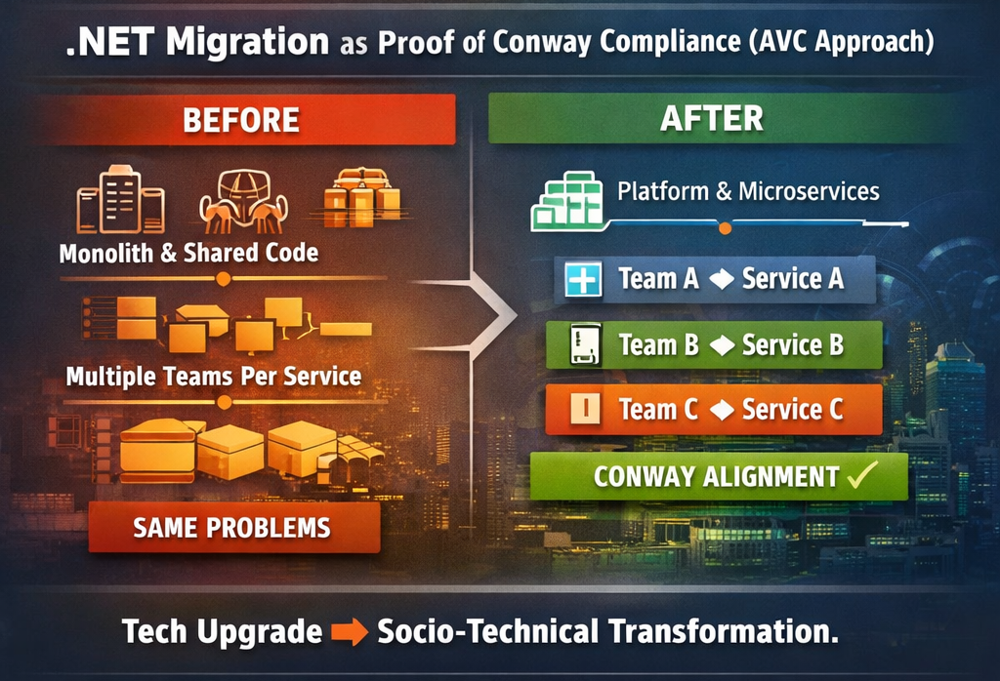

# Using a .NET 10 migration project to prove Conway’s Law in AI-Driven engineering - example 2




> To convincingly demonstrate the effective use of Agile methodology when building software with AI, we need an example that:
> - is complex enough to demonstrate the Conway effect,
> - is realistic for the enterprise,
> - contains clear domain boundaries,
> - uses AI-assisted programming,
> - and management must be able to see the benefits of the AVC-Conway alignment in a new or existing project.

**At the same time, we want to avoid a contrived example that feels artificial or forced.**

Let me show you how I think we should prepare for such a project.

## Migration to the .NET 10 project

> [!IMPORTANT]
> Another compelling example would be a migration of a legacy .NET application to .NET 10, using AI-assisted code transformation.
> This would demonstrate how AVC governance can prevent architectural drift during a large refactor, 
> but only if we structure the upgrade correctly.

> [!WARNING]
> - If we treat migration as a technical upgrade, it proves nothing.
> - If we treat it migration a socio-technical restructuring exercise, it becomes very strong evidence.

### The Key Idea

> [!NOTE]
> A framework upgrade is one of the few moments where you can safely reshape architecture and team boundaries at the same time.
> 
> That’s exactly what **Conway's Law** is about.

### When a .NET Upgrade Becomes a Valid Proof

#### ❌ Weak (no proof)
- upgrade projects in place
- keep shared libraries
- keep team structure
- no governance changes

___Result:___
```
Same organization → Same architecture → Same problems
```

#### ✅ Strong (valid proof)

___Use the upgrade to enforce:___
```
New team boundaries
New service boundaries
New platform layer
New governance rules
```

___Now we are testing:___

> “Does changing organization + governance produce aligned architecture?”

### How to design the .NET 10 migration as an experiment

#### Step 1 — Define Target Conway-Aligned State

___Organization___
```
IDP Team

Accounts Team
Payments Team
Fraud Team
Customer Team
```

___Architecture (target)___
```
Platform (.NET 10)

Accounts Service
Payments Service
Fraud Service
Customer Service
```

#### Step 2 — Enforce AVC During Migration

___Key rule:___
> No “big solution upgrade”

___Instead:___

🔹 Break into services

    - each service:
      - separate repo
      - separate pipeline
      - separate deployment

🔹 Introduce IDP (Platform Layer)

    Platform team delivers:
    - .NET 10 templates
    - CI/CD pipelines
    - observability
    - AI guardrails
    - security policies

🔹 Enforce API-only communication

   - no shared DB
   - no shared internal libraries
   - only:
     - REST/gRPC
     - events

🔹 Constrain AI usage

   AI must:
   - generate code inside service boundaries
   - use:
     - templates
     - contracts

#### What we are actually proving

We are testing:
```
AVC governance → Conway alignment → measurable system properties
```

#### Concrete proof metrics during migration

##### 1. Structural Alignment

___Measure:___
```
# services == # teams
```
and:
```
1 team → 1 service
```

##### 2. Dependency Graph

___Before:___
```
Monolith / shared libs / tight coupling
```
___After:___
```
Service graph aligned with teams
```

##### 3. Cross-Team Work

___Measure:___
```
PRs involving multiple teams
```
___Expectation:___
- before: high
- after: low

##### 4. Deployment Independence

___Before:___
```
coordinated release
```
___After:___
```
independent deployments
```

##### 5. AI Drift (VERY IMPORTANT)

___Track:___
- invalid dependencies introduced by AI
- violations of service boundaries

___Expectation:___
- uncontrolled without AVC
- minimal with AVC

##### 6. Lead Time

Using metrics from accelerate: The Science of Lean Software and DevOps:
- lead time for change
- deployment frequency


#### What makes .NET 10 specifically useful

Even though the exact features may evolve, modern .NET direction supports:
- microservices (ASP.NET Core)
- cloud-native patterns
- containerization
- minimal APIs
- high-performance services

This makes it ideal for:
```
Service-per-team architecture
```

#### The Strongest Proof Pattern
 
##### Before (typical .NET solution)
```
Single solution
Shared libraries
Multiple teams touching same code
```

##### After (AVC + .NET 10)
```
Platform templates (IDP)
↓
Independent services
↓
Owned by independent teams
```

##### Visual Proof
```
Before:
Teams → tangled codebase

After:
Teams → services → APIs → clean graph
```


### The Critical Insight

> [!IMPORTANT]
> The proof does NOT come from:
> 
> “We upgraded to .NET 10”
> 
> The proof comes from:
> 
> “During the upgrade, we enforced AVC governance and observed Conway alignment emerge.”


### Conclusion

> [!IMPORTANT]
> - A .NET upgrade alone changes technology.
> - A .NET upgrade with AVC governance changes the socio-technical system—and that’s what proves Conway alignment.
> 
> **A migration proves Conway compliance only when it changes teams, architecture, and governance together.**

### See also:
- [Agile Vibe Coding Manifesto](https://agilevibecoding.org/)
- [The Agile Vibe Coding and Conway's Law](https://www.linkedin.com/pulse/agile-vibe-coding-conways-law-marek-kubis-m0wpe/?trackingId=wNYc5fRxyx3oQGxE3KYx8Q%3D%3D)
- [Using a digital banking solution to prove Conway’s Law in AI-Driven engineering - example 1](https://www.linkedin.com/pulse/using-digital-banking-solution-prove-conways-law-ai-driven-kubis-xqlre/)
