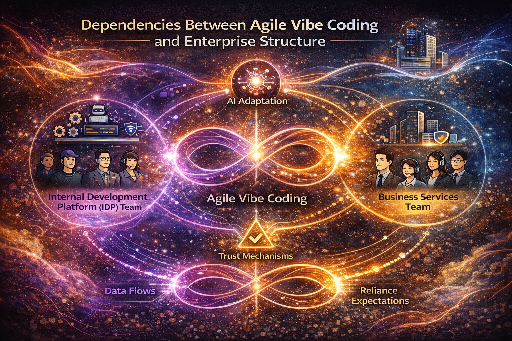

# Agile Vibe Coding Maturity Model

## Level 1–5 AI-Enabled Organisation

> [!IMPORTANT]
> The levels describe systemic capability — not tool adoption.

### Level 1 — AI-Assisted Activity

> [!CAUTION]
> “We use AI tools.”

**Primary Characteristic:**  
AI is used for productivity acceleration, but governance and validation are informal.

#### Traits

* AI generates code, documentation, or tests.
* Review processes remain conventional and inconsistent.
* Prompts are ad-hoc and undocumented.
* Limited observability of AI impact.
* ML validation is shallow or example-based.
* Governance reacts to incidents rather than preventing them.

#### Risks

* Automation bias.
* Undetected data leakage or logic flaws.
* Architectural drift.
* Illusion of increased velocity.

#### Feedback Loops

Local and human-driven only.  
No systemic learning discipline.

### Level 2 — Controlled AI Adoption

> [!CAUTION]
> “We review what AI produces.”

**Primary Characteristic:**  
Human accountability is formalised.

#### Traits

* Mandatory review of AI-generated artifacts.
* Structured review checklists.
* Basic CI/CD validation and security scans.
* Versioned prompts and documented context.
* Early attempts at observability.

#### Governance

Reactive but structured.

#### Risks

* Validation happens at release time only.
* Feedback loops remain slow.
* Architecture still vulnerable to drift.

#### Feedback Loops

Present, but mostly post-generation.

### Level 3 — Feedback-Driven Engineering

> [!CAUTION]
> “We validate continuously.”

**Primary Characteristic:**  
Continuous validation and observability are embedded.

#### Traits

* Small, verifiable increments.
* Observability defined before delivery.
* Runtime metrics tied to success thresholds.
* Drift detection (schemas, contracts, infra).
* Blind dataset testing for ML systems.
* Red-team simulations for AI and distributed systems.

#### Governance

Encoded into pipelines and policies.

#### Cultural Shift

Trust is replaced with verification discipline.

#### Feedback Loops

Fast, measurable, multi-layered:

* Code → CI
* Model → statistical validation
* Runtime → telemetry
* Business → measurable outcomes

### Level 4 — Architected Regeneration

> [!CAUTION]
> “We design systems for safe AI collaboration.”

**Primary Characteristic:**  
Architecture intentionally constrains and enables regeneration.

#### Traits

* Clear architectural patterns guide generation.
* Controlled regeneration of components.
* Guardrails for critical boundaries.
* Independent re-generation for high-risk systems.
* Economic governance over compute and retraining cadence.
* Infrastructure fully reproducible.

#### Governance

Proactive and preventative.

#### Cultural Shift

Regeneration is a capability — not a gamble.

#### Feedback Loops

Self-reinforcing:

* Drift detected automatically.
* Architecture prevents entropy.
* Cost signals influence design.

### Level 5 — Adaptive, Uncertainty-Aware Organisation

> [!CAUTION]
> “We optimise for learning velocity.”

**Primary Characteristic:**  
Uncertainty is explicitly recognised and managed as a systemic property.

#### Traits

* Learning velocity measured at executive level.
* Governance protects responsiveness (avoids control traps).
* Human–AI retrospection formalised.
* Dual-mode review institutionalised.
* Sustainability monitored (human + compute).
* Business decisions tied to validated feedback, not projection.

#### Leadership Mindset

The goal is not certainty.  
The goal is rapid discovery and adjustment.

#### Feedback Loops

Organisation-wide:

* Market → product increments → telemetry → roadmap shifts.
* Model drift → validation → regeneration → redeployment.
* Process friction → retrospection → governance refinement.

## System Identity

* Adaptable under uncertainty.
* Resistant to agility theatre.
* Resilient to AI-induced drift.
* Economically disciplined.
* Architecturally coherent.

## Maturity Summary Table

|Level|Identity|Focus|Risk Profile|Learning Speed|
|:-|:-|:-|:-|:-|
|1|AI User|Tool adoption|Hidden systemic risk|Slow, accidental|
|2|AI Reviewer|Control after generation|Process-heavy validation|Moderate|
|3|Feedback System|Continuous validation|Managed operational risk|Fast|
|4|Architected AI System|Safe regeneration|Controlled structural risk|Very Fast|
|5|Adaptive Organisation|Learning velocity|Strategically resilient|Strategic Advantage|

## Diagnostic Questions Per Level

### If you are Level 1:

* Can you trace why a generated artifact is correct?
* Can you detect silent degradation?

### If you are Level 2:

* Is validation continuous or release-gated?
* Is architecture protected from AI drift?

### If you are Level 3:

* Do metrics influence roadmap decisions?
* Is drift detected automatically?

### If you are Level 4:

* Can you safely regenerate subsystems?
* Are critical boundaries explicitly guarded?

### If you are Level 5:

* How quickly can you discover what is true?
* Does governance accelerate learning — or slow it?

## What This Model Emphasises

❗️ This maturity model deliberately shifts focus:

___from:___
* Tool adoption
* Velocity metrics
* Certainty theatre

___to:___
* Structural validation
* Controlled regeneration
* Governance intelligence
* Organisational learning velocity
 

[Agile Vibe Coding Manifesto](https://agilevibecoding.org/)