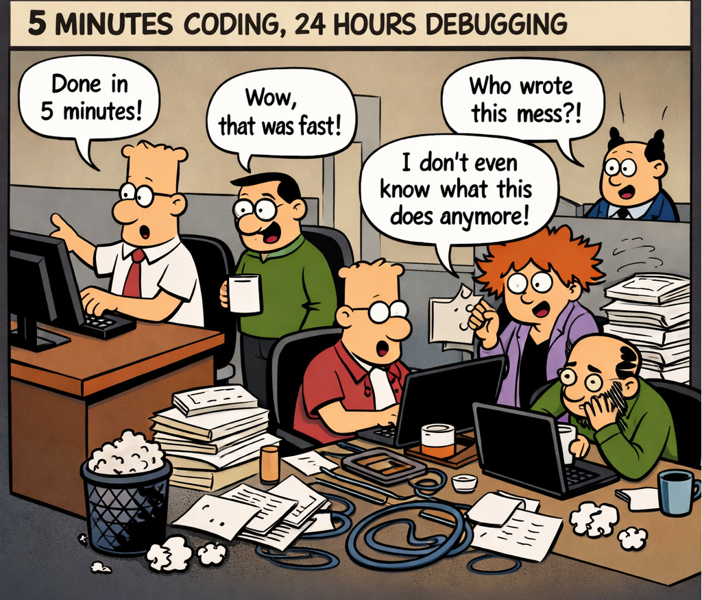

# Agile Vibe Coding versions with example - Scenario 1

> The term “vibe coding” is used loosely, and that’s the problem.



## Where the misunderstanding comes from

**Vibe Coding** actually refers to two very different behaviors.

### ❌ Version 1 — Undisciplined “vibe coding”
- Large prompts → large code output
- Minimal review
- Trusting AI “because it looks right”
- Debugging later
- Weak ownership

> ❗️ This leads to: **fast generation + slow confusion**, and is often misunderstood as true “vibe coding”.

### ✅ Version 2 — Disciplined AI-driven development 
- Small prompts
- Incremental generation
- Explicit constraints
- Human verification at every step
- Refactoring immediately

> 👉 This leads to: **fast generation + controlled understanding**, and is often misunderstood as “too much discipline” or “not vibe coding”.

It’s not chaotic. It's interactive guided development. It’s actually:
- structured
- iterative
- feedback-driven

## Agile Vibe Coding types

Let’s give them names:
1. “**Interactive Unguided Development**”
2. “**Constraint-driven AI coding**”

The core idea:
> 🔥 **Agile Vibe Coding is not about using AI. It’s about where control lives.**

### ❌ Bad model - plain vibe coding

AI controls:
- structure
- decisions
- complexity
**Human reacts afterward.**

### ✅ Good model

Human controls:
- scope
- structure
- acceptance criteria
**AI assists within constraints.**


## A realistic C# notification handler - Scenario 1

> Let's make this real by simulating what's actually happening within the team.

🧨 A developer submits a prompt:
> “Add retry + Service Bus publishing to notification handler”.

### ❌ The prompt response, PR (AI-generated, typical)

```
public async Task HandleAsync(Notification notification)
{
    if (notification == null)
        throw new ArgumentNullException(nameof(notification));

    try
    {
        int retries = 3;

        while (retries > 0)
        {
            try
            {
                if (notification.Type == "OrderCreated")
                {
                    await _serviceBusClient.SendMessageAsync(notification.Payload);
                }
                else if (notification.Type == "OrderCancelled")
                {
                    await _serviceBusClient.SendMessageAsync(notification.Payload);
                }

                _logger.LogInformation("Message sent");
                return;
            }
            catch (Exception ex)
            {
                retries--;
                _logger.LogWarning(ex, "Retrying...");
                await Task.Delay(500);
            }
        }
    }
    catch (Exception ex)
    {
        _logger.LogError(ex, "Failed");
    }
}
```

### 1. Bad prompt response review (what usually happens)

1. Reviewer says: “Looks good 👍”.
2. Maybe reviewer adds: “Consider constants for retry count”.
3. Then merges.

What was missed?
- Why retry 3 times?
- Are all exceptions retryable?
- Why same logic for both types?
- What happens after retries fail?
- Why is logging mixed with logic?
- Why is Service Bus directly coupled here?

> 👉 Nobody actually understands the behavior.

### 2. Good prompt response review (AI-era discipline) ✅ 

Now let’s do this properly.

#### Step 1 — Force explanation

> Reviewer asks: “Explain the control flow in plain English.”

If the author struggles → prompt response is already failing

#### Step 2 — Identify problems (explicitly)

❌ Mixed concerns
- business logic
- retry
- infrastructure
- logging

❌ Hidden policy
- retry count is magic
- delay is arbitrary

❌ Poor extensibility
- adding new types = modify method

❌ Hard to test
- everything tightly coupled

#### Step 3 — Reject prompt instructions with clear direction 🛑

Not: “Needs improvement”

But: “Split responsibilities:
  - core handler
  - retry policy
  - message publisher
  
then resubmit.”


### 3. Improved Version (after review) ✅

####  Step 1 — Core logic only
```
public async Task HandleAsync(Notification notification)
{
    Validate(notification);
    await PublishAsync(notification);
}
```

####  Step 2 — Validation
```
private void Validate(Notification notification)
{
    if (notification == null)
        throw new ArgumentNullException(nameof(notification));

    if (string.IsNullOrEmpty(notification.Type))
        throw new ArgumentException("Type required");
}
```

####  Step 3 — Clean routing
```
private Task PublishAsync(Notification notification)
{
    return notification.Type switch
    {
        "OrderCreated"   => _publisher.PublishAsync(notification.Payload),
        "OrderCancelled" => _publisher.PublishAsync(notification.Payload),
        _ => throw new NotSupportedException(notification.Type)
    };
}
```

####  Step 4 — Retry policy (separate!)
```
public async Task ExecuteWithRetryAsync(Func<Task> action)
{
    int attempts = 3;

    for (int i = 0; i < attempts; i++)
    {
        try
        {
            await action();
            return;
        }
        catch when (i < attempts - 1)
        {
            await Task.Delay(500);
        }
    }

    throw new Exception("Retry failed");
}
```

####  Step 5 — Composition
```
public Task HandleWithRetryAsync(Notification notification)
{
    return ExecuteWithRetryAsync(() => HandleAsync(notification));
}
```

### Why this prompt response is now good

Reviewer can say:
- “I understand every piece” ✅
- “Retry is reusable” ✅
- “Core logic is clean” ✅
- “Easy to test” ✅

> 👉 Now it’s safe to merge.


### 4. Apply this to YOUR Azure setup

Based on your architecture:
- Azure Gateway
- Azure Function
- Service Bus
- Kubernetes app

#### ❌ What AI will try to do?

Generate something like: 

> “Azure Function that:
  - receives HTTP
  - validates
  - retries
  - sends to Service Bus
  - logs
  - handles errors”

👉 **One giant function = future nightmare**

#### ✅ What you should enforce

🔹 Azure Function = thin entry point
```
public async Task Run(HttpRequest req)
{
    var notification = await ParseRequest(req);
    await _handler.HandleWithRetryAsync(notification);
}
```

🔹 Application layer = your clean logic
- NotificationHandler (pure logic)
- RetryPolicy (separate)
- Publisher (Service Bus wrapper)

🔹 Infrastructure layer
- Service Bus client
- Azure SDK stuff

👉 Each layer is:
- small
- testable
- understandable

### 5. What a GOOD prompt response comment looks like 

Instead of vague feedback:
```
This method mixes multiple concerns (validation, retry, publishing).

Please refactor into:
1. Core handler (no retry, no logging)
2. Retry wrapper
3. Publisher abstraction

Goal: each unit should be understandable in isolation.
```

👉 Clear, actionable, enforceable.

### 6. The real shift in prompt response, PR culture

> Old: **“Is this correct?”**
> 
> New: **“Will someone understand this in 6 months?”**

Now our process becomes:
1. AI generates → fast

2. Humans **decompose + constrain** → critical
  
3. Prompt response, PR enforces **understanding** → essential

> [!IMPORTANT]
> The one sentence that defines a strong team now: 
> 
> “We don’t merge code that requires a meeting to understand.” 


## How to design prompts themselves so they enforce structure automatically?

> This is where things get really interesting, because prompt design becomes an engineering skill, not just “asking nicely.” ⚙️ 

Answer: **encode discipline directly into prompts**, so the AI can’t easily produce messy, opaque code in the first place.

### The “Constraint-First Prompt” Pattern

> _Bad prompt_: **“Write a notification handler with retry, logging, validation, and Service Bus.”**
>
> _Good prompt_: **“Write ONLY the core logic for routing a notification. No logging, no retry, no infrastructure.”**

**✅ Template**

> The difference is not wording — it’s control over complexity.

```
Context:
(what this is part of)

Goal:
(single responsibility only)

Constraints:
(what must NOT be included)

Output format:
(how the answer should look)
```

**Example**

```
Context:
C# .NET service handling notifications.

Goal:
Implement ONLY the core method that routes a notification based on type.

Constraints:
- No logging
- No retry logic
- No error handling beyond basic validation
- No external dependencies except injected services

Output:
Single method, max 40 lines.
```

> 👉 This prevents 80% of bad AI output.

### The “Decomposition Prompting” Technique 

Instead of: “Build feature”

You do:
- Step 1 - “List responsibilities of this feature. No code.”
- Step 2 - “Split into smallest possible units.”
- Step 3 - “Implement ONLY unit #1.”

> 👉 We’re forcing AI to think in architecture, not just code.

### The “Explain Before Code” Prompt 

This is extremely powerful and underused. Before generating code:
```
Explain how you would implement this.
List:
- responsibilities
- edge cases
- assumptions
Do not write code yet.
```

> 👉 If the explanation is messy → the code will be worse.

### The “Test-Driven Prompting” Pattern 

Instead of trusting code, we shift validation earlier.

- Step 1 - `List edge cases for this method.`
- Step 2 - `Write unit tests for these cases. No implementation.`
- Step 3 - `Now write code that satisfies these tests.`

> 👉 This forces correctness + clarity.

### The “Anti-Bloat Prompt”

___AI loves adding unnecessary complexity.___

So explicitly say:
```
Requirements:
- Use the simplest possible solution
- Avoid patterns unless strictly necessary
- No abstractions unless they reduce duplication
```

> 👉 This alone dramatically improves output quality.

### The “Refinement Loop Prompt” 

Instead of debugging messy code, refine it.
```
After generation:

Rewrite this code to:
- reduce complexity
- improve readability
- remove unnecessary abstractions

Do not change behavior.
```
> 👉 This is like an automatic senior developer pass.

### The “Explain Like I Own It” Prompt 

This is your safety net.
```
Explain this code as if I need to maintain it for 2 years.
Include:
- control flow
- failure points
- assumptions
```
> 👉 If the explanation is hard to follow → the code is not acceptable.

### Prompts to Avoid (these cause chaos) 

- ❌ “Complete solution”
- ❌ “Production-ready code”
- ❌ “Best practices included”
- ❌ “Full implementation”

👉 These trigger:
- over-engineering
- hidden complexity
- loss of control

### Prompting at Different Levels 

🔹 Method level
```
Write a pure function that validates input.
No side effects.
```
🔹 Class level
```
Implement a class with a single responsibility.
List its public methods first.
```
🔹 Service level
```
Define interfaces and boundaries only.
No implementation yet.
```
🔹 System level
```
Describe architecture and data flow.
No code.
```

> 👉 We scale prompts the same way we scale design.

### The “Hard Stop” Prompt (very powerful)

Use this when AI starts drifting:

```
Stop.
This is too complex.

Rewrite with:
- fewer concepts
- fewer abstractions
- maximum clarity

Assume a junior developer must understand it.
```

> 👉 This resets the output quality instantly.

### The Meta Insight 

We’re not prompting for code.

We’re prompting for:
- structure
- constraints
- clarity

**Code is just the byproduct.**

## What elite developers are starting to do 

They build personal prompt playbooks, like:
- “core logic prompt”
- “refactor prompt”
- “test-first prompt”
- “anti-bloat prompt”

> 👉 Reusable, consistent, predictable


### So is Agile still relevant?

> ___Agile Vibe Coding___ = **Agile + Constraint-driven AI coding** → ✅ very strong

Because Agile already gives:
- iteration
- feedback loops
- small increments

And disciplined AI-driven development adds:
- control over AI
- enforced understanding

###  Where teams go wrong?

Many teams think they are doing what I described…

…but in reality:
- prompts are too big
- reviews are shallow
- understanding is assumed

…and **then it degrades into bad “vibe coding”**.

### So what happens in real teams?

Under pressure, a real teams drift toward:
> generate → skim → ship

**That’s the real danger — not the method itself**.

### The real conclusion

> **AI-assisted development does NOT imply minimal discipline**. 💬
> 
> In fact:
> **Done properly, it requires more discipline than traditional coding**.

- “Vibe coding” is not inherently bad.
- **Undisciplined use of AI is bad**.
- The **structured approach is actually the best emerging practice**.

> **“AI doesn’t reduce the need for discipline — it punishes the lack of it.”** 🔥

## Final mental model

We saw:
- Same system
- Same AI
- Same goal

But:
- Bad prompt → opaque system
- Good prompt → maintainable architecture

> _Sentence to remember_: **“The quality of AI code is determined more by constraints than by intelligence.”** 🔥

## See also:
- [Agile Vibe Coding versions with example - Scenario 2](https://www.linkedin.com/pulse/agile-vibe-coding-versions-example-scenario-2-marek-kubis-9lq5e/)
 
- [Is there a need to change the way software is developed today?](https://www.linkedin.com/pulse/need-change-way-software-developed-today-marek-kubis-dntie)
- [This Isn’t Rebranding. It’s a Structural Shift in Software Development](https://www.linkedin.com/pulse/isnt-rebranding-its-structural-shift-software-marek-kubis-sanpe)
- [Murphy’s law and more in AI time - one by one with examples](https://www.linkedin.com/pulse/murphys-law-more-ai-time-one-examples-marek-kubis-fkaze)
- [The Agile Vibe Coding and Conway's Law](https://www.linkedin.com/pulse/agile-vibe-coding-conways-law-marek-kubis-m0wpe)
- [Using a digital banking solution to prove Conway’s Law in AI-Driven engineering - example 1](https://www.linkedin.com/pulse/using-digital-banking-solution-prove-conways-law-ai-driven-kubis-xqlre/)
- [Using a .NET 10 migration project to prove Conway’s Law in AI-Driven engineering - example 2](https://www.linkedin.com/pulse/using-net-10-migration-project-prove-conways-law-ai-driven-kubis-abqae)
- [Where traditional Agile breaks in AI-driven systems](https://www.linkedin.com/pulse/where-traditional-agile-breaks-ai-driven-systems-marek-kubis-4wq6e/)
- [AI - It seems nobody has it fully figured out yet](https://www.linkedin.com/pulse/ai-nobody-has-figured-out-marek-kubis-bkyge)
- [Internal Development Platform and Agile Vibe Coding](https://www.linkedin.com/pulse/internal-development-platform-agile-vibe-coding-marek-kubis-kyhqe/?trackingId=5w3lWKp%2F0BLUpwNdrSmAcg%3D%3D&lipi=urn%3Ali%3Apage%3Ad_flagship3_pulse_read%3BqH%2FwqbkZRkmo%2Fagtxvqyrw%3D%3D)
- [Everyone will be vibe coders](https://www.linkedin.com/pulse/everyone-vibe-coders-marek-kubis-tlgze)
- [The Structural problems AI introduces into the SDLC](https://www.linkedin.com/pulse/structural-problems-ai-introduces-sdlc-marek-kubis-qyt6e)
- [Signals That Reveal the True Maturity of Organisations Claiming “AI-Driven Development”](https://www.linkedin.com/pulse/signals-reveal-true-maturity-organisations-claiming-ai-driven-kubis-urule)
- [AI - It seems nobody has it fully figured out yet](https://www.linkedin.com/pulse/ai-nobody-has-figured-out-marek-kubis-bkyge)
- [Agile Vibe Coding positioning and if this works, what changes?](https://www.linkedin.com/pulse/agile-vibe-coding-positioning-works-what-changes-marek-kubis-r4ate)
- [Agile Vibe Coding – Ceremony Modes](https://www.linkedin.com/pulse/agile-vibe-coding-ceremony-modes-marek-kubis-meq9e)
- [Agile Vibe Coding ceremonies approach compared to a simple one-prompt-per-task approach](https://www.linkedin.com/pulse/agile-vibe-coding-ceremonies-approach-compared-simple-marek-kubis-ecx5e)
- [Agile Vibe Coding Maturity Model](https://www.linkedin.com/pulse/agile-vibe-coding-maturity-model-marek-kubis-bbtqe)
- [The Agile Vibe Coding - the 4-level adaptive ceremony system](https://www.linkedin.com/pulse/agile-vibe-coding-4-level-adaptive-ceremony-system-marek-kubis-jizke)

- [Agile Vibe Coding Manifesto](https://agilevibecoding.org/)
- [Principles Behind the Agile Vibe Coding Manifesto - extended version](https://github.com/marekartur-dev/agilevibecoding/blob/main/Docs/Home/Principles.md)

- [Agile Vibe Coding](https://www.reddit.com/r/AgileVibeCoding/)
- [Marek Kubis - blog](https://github.com/marekartur-dev/agilevibecoding/tree/main)