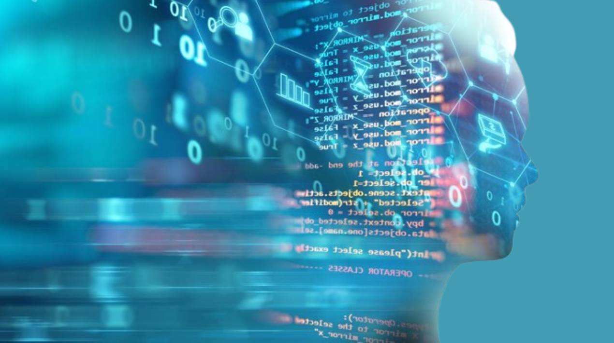

# Everyone will be vibe coders

> Recently, I came across a provocative prediction: 
> [!IMPORTANT]
> "There will only be two engineering teams in the future 
> - ✅ **data + ai team**: applied research to engineer intelligence, data engineers to engineer knowledge, and platform/operating.
> - ✅ **platform team**: for baby sitting vibe coders and operating vibe coded services. Everyone else will be vibe coders."

At first glance, this framing feels reductive. But instead of reacting to it, I think it’s worth reflecting on what it reveals about where our industry is heading.

## Does Using AI Reduce Professionalism?

If developers use AI-assisted tools, does that imply:
- lower skill?
- lack of professionalism?
- dependency?
- immaturity?

### It’s hard to argue that it does.

AI assistance is being deeply integrated into development ecosystems across the industry — from Microsoft to Google and beyond. AI is no longer a niche experiment. It is becoming part of the standard toolchain.

Labeling developers who use AI as “vibe coders” may oversimplify a much more significant shift: **software engineering is moving up the abstraction ladder**.

## AI Changes the Abstraction Level — Not the Need for Engineering 

It’s true that AI-generated code can introduce:
- unnecessary complexity
- overengineering
- odd abstractions

But we already have mature engineering practices to address this:
- **Red–Green–Refactor**
- strong review culture
- architectural governance
- automated testing

A senior engineer without AI may produce clean code efficiently. A senior engineer with AI may operate at a higher abstraction layer.

The real shift is not about replacing engineers — it’s about changing the cognitive focus of engineering.

## What This Perspective May Miss

Reducing the future to two engineering categories overlooks critical domains:
- product engineering
- distributed systems
- security
- systems architecture
- reliability engineering
- human-centered design.

Even organizations investing heavily in AI — such as OpenAI, Google, and Microsoft — continue to rely on diverse engineering expertise.

AI increases abstraction. It does not eliminate system complexity — it redistributes it.

## A Broader View of the Future

> [!NOTE]
> In 1975, **Niklaus Emil Wirth**, a Swiss computer scientist and Ph.D. from the University of California, Berkeley, wrote:
> **"Algorithms + Data Structures = Programs"**
### That formula still holds.

What may change is:
- how algorithms are generated,
- how abstractions are constructed,
- how quickly knowledge is operationalized.

Perhaps the future belongs to:
- data & algorithms teams,
- platform teams,
- research & science groups,
- and engineers across domains augmented by AI.

Not fewer engineers. Not diminished engineers. But engineers operating differently.

## Final Thought

> [!IMPORTANT]
> Instead of asking whether ___“everyone will be vibe coders”___ perhaps the better question is:
> **Are we ready to think at a higher level of abstraction while preserving engineering rigor?**

> [!IMPORTANT]
> AI is not the end of engineering diversity. It is a catalyst for its evolution.

[Agile Vibe Coding Manifesto](https://agilevibecoding.org/)