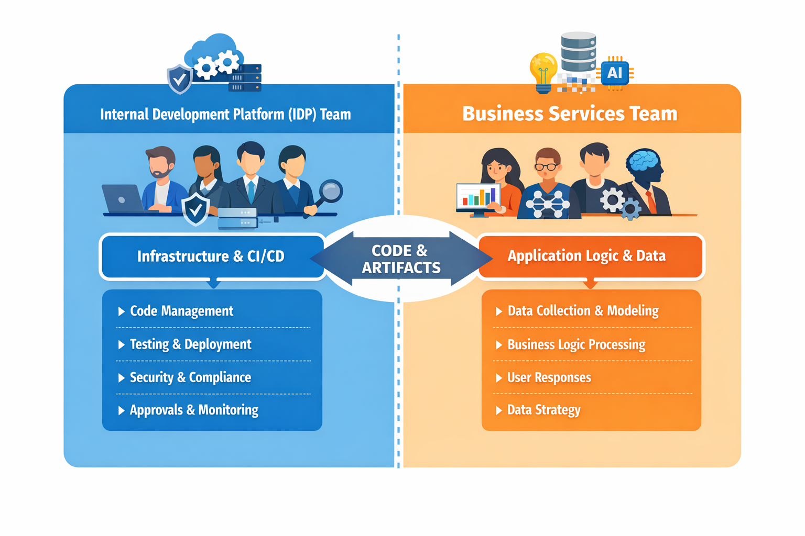

# Internal Development Platform and Agile Vibe Coding

## A New Model for the Internal Development Platform Team

> In a previous article, I asked a simple question: [Is there a need to change the way software is developed today?](https://www.linkedin.com/pulse/need-change-way-software-developed-today-marek-kubis-dntie/?trackingId=%2FxQ1NYFjP26Hhsh9vfFAaA%3D%3D). I hope I have already encouraged many readers to answer **yes**.

If we accept that change is necessary, the next question becomes: **how should software teams be structured in the future?**

Perhaps better names will emerge, but for the purpose of this discussion I will use the following terms:
- Internal Development Platform (IDP) team,
- Business Services (BS) team.

For many small and medium-sized enterprises (SMEs), this structure may be sufficient. Larger organizations will likely introduce additional groups responsible for governance, security, sovereignty control, or formal approval processes.

### IDP team
However, in many companies the following responsibilities could be consolidated within the **Internal Development Platform team**:
- code management
- testing
- publishing and deployment
- security control
- compliance and approvals

At the same time, responsibilities such as:
- collecting and preparing data
- designing data models and structures
- deciding how and where data should be stored
- implementing business logic
- generating responses for end users
belong to the **Business Services team**.

> [!CAUTION]
> ❗️If someone sees only a change of team names in this proposal and not a qualitative shift in how software is developed, I respectfully disagree.

Put simply, the **Internal Development Platform team** builds and maintains the infrastructure that enables software delivery. This interdisciplinary team may include DevOps engineers, security and quality specialists, developers, product managers, and cloud, database, and platform administrators. Their mission is to create and maintain the environment that allows software to be reliably built, tested, and deployed across any hardware platform.

> [!NOTE]
> Continuous integration and deployment in such environments requires strong use of **Infrastructure as Code (IaC)**, and the presence of experienced developers inside the IDP team becomes essential for many complex applications.

### BS team
The **Business Services team**, on the other hand, focuses on delivering business value. It typically includes application specialists, data analysts, business analysts, developers, and increasingly AI specialists and AI tools.

This team is responsible for producing solution logic and submitting code and artifacts to the IDP platform for integration and deployment.

Today it is also clear that humans are no longer the only authors of source code.
AI systems can already generate significant portions of application logic. However, building solutions that solve real-world problems still requires reliable data, domain expertise, and clear problem definitions.

This is why the Business Services team must remain diverse and multidisciplinary. Without deep domain knowledge and well-defined requirements, neither humans nor intelligent systems can produce reliable solutions.

> [!WARNING]
> At the intersection of humans and AI, one principle remains unchanged: **garbage in — garbage out**.
> ❗In fact, in AI-driven systems the effect can be even stronger: **garbage in — amplified garbage out**.

Many high-profile software failures are not simply technical problems. They often originate from **overestimating our own understanding**. Too often we assume that requirements are “obvious” and that not everything needs to be clearly defined.

As a result, incomplete design documentation and poorly defined requirements become some of the most common problems developers face.

Ironically, one of the benefits of introducing AI into the development process may be that it **forces us to be more precise**. Machines are far less forgiving than humans when faced with ambiguity.

## Is Agile Becoming Obsolete?

> [!WARNING]
> Organizational change is only one part of the transformation required in the age of AI. The **software development process itself** must also evolve.

Just as the **Waterfall model** eventually became outdated, it may be time to ask whether traditional **Agile practices** are reaching their limits in an AI-driven development environment.

Across the industry, more and more voices are raising this question. Thought leaders such as [Martin Fowler](https://martinfowler.com/bliki/FutureOfSoftwareDevelopment.html) have already explored how software development may evolve in the coming years.

I have also discussed this topic in previous LinkedIn posts, including reflections on the transition [from code scarcity to intent-driven development](https://www.linkedin.com/pulse/from-code-scarcity-intent-marek-kubis-5r2ye/?trackingId=xUN69HivdaacniaTVAdDJA%3D%3D).

I am not claiming that Agile should simply be replaced by something entirely new. However, emerging concepts such as **Agile Vibe Coding (AVC)** deserve serious consideration.

Many technical and philosophical questions still remain unanswered. But navigating uncertainty is not a challenge for tomorrow — it is a challenge for today.

A detailed explanation of Agile Vibe Coding would repeat much of what I have already shared in earlier posts. Instead, I encourage readers to explore the topic further, starting with my article: [“Where traditional Agile breaks in AI-driven systems”](https://www.linkedin.com/pulse/where-traditional-agile-breaks-ai-driven-systems-marek-kubis-4wq6e/?trackingId=MBAzBukb3bGt1MPb4NUFzw%3D%3D).

Beyond that, the internet offers an abundance of perspectives on the future of software development. I strongly encourage everyone interested in this topic to explore these ideas and contribute to the ongoing discussion.

[Agile Vibe Coding Manifesto](https://agilevibecoding.org/)
