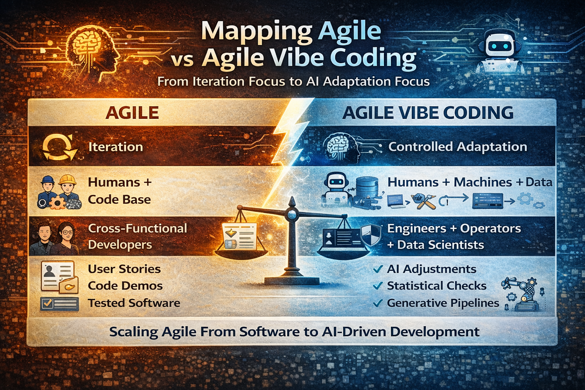

# Mapping Agile Vibe Coding to the Classic Agile Principles

> 👍 The Agile Manifesto has 12 principles. Most of AVC rules extend them rather than replace them.

## Agile Principle 1

> “Our highest priority is to satisfy the customer through early and continuous delivery of valuable software.”

#### Mapping in Agile Vibe Coding
- Customer Value Is the North Star
- Small, Verifiable Increments
- Learning Velocity Over Planning Certainty

#### Extension

> AVC adds validated value, not just delivery.

Agile assumes:
- delivered software = value

AVC says:
- only validated outcomes = value

This matters because AI systems can produce convincing but wrong solutions quickly.

## Agile Principle 2

> “Welcome changing requirements, even late in development.”

#### Mapping
- Uncertainty Is the System
- Learning Velocity Over Planning Certainty
- Organisational Responsiveness Is the Ultimate Metric

#### Extension

> Classic Agile treats change as normal.

AVC treats uncertainty as fundamental, especially when:
- models evolve
- data shifts
- system behaviour changes

> AI systems create **continuous uncertainty**, not just changing requirements.

## Agile Principle 3

“Deliver working software frequently.”

#### Mapping
- Small, Verifiable Increments
- Continuous Validation
- Observability by Design

#### Extension

> Agile assumes "working software" can be validated with tests.

AI systems require additional validation:
- statistical validation
- dataset integrity checks
- runtime drift detection

## Agile Principle 4

> “Business people and developers must work together daily.”

#### Mapping
- Customer Value Is the North Star
- Context Is a Versioned Artifact

#### Extension
AVC introduces shared structured context.

> AI development fails when context is implicit or undocumented.

## Agile Principle 5

> “Build projects around motivated individuals.”

#### Mapping
- Humans Own Outcomes
- Sustainable Pace
- Human–AI Retrospection

#### Extension

AVC explicitly addresses human-AI collaboration and cognitive biases:
- automation bias
- plausibility bias
- authority bias

> Classic Agile never anticipated machines writing code.

## Agile Principle 6

> “The most efficient communication is face-to-face conversation.”

#### Mapping
- Context Is Versioned
- Documentation Preserves Understanding

#### Extension
AI systems require explicit context artifacts, because AI cannot read informal conversation.

> AVC shifts from: `communication → codified context`

## Agile Principle 7

> “Working software is the primary measure of progress.”

#### Mapping
- Continuous Validation
- Observability by Design
- Organisational Responsiveness

#### Extension

AI systems can produce software that appears to work but is:
- statistically biased
- economically unsustainable
- unstable under distribution shift

> So AVC adds measurable runtime validation.

## Agile Principle 8

> “Agile processes promote sustainable development.”

#### Mapping
- Sustainable Pace for Humans and Systems
- Economic Responsibility

#### Extension

Classic Agile sustainability meant people.

AVC includes:
- compute costs
- retraining cycles
- infrastructure scaling

> AI systems introduce resource sustainability problems.

## Agile Principle 9

> “Continuous attention to technical excellence enhances agility.”

#### Mapping
- Architecture Constrains Generation
- Simplicity Enables Regenerability
- Controlled Regeneration

#### Extension
AVC reframes technical excellence as AI-safe architecture.

Architecture now protects against:
- LLM drift
- uncontrolled code generation
- system fragmentation

## Agile Principle 10

> “Simplicity—the art of maximizing the amount of work not done—is essential.”

#### Mapping
- Simplicity Enables Regenerability
- Small Increments

Equivalent principle.

## Agile Principle 11

> “The best architectures emerge from self-organizing teams.”

#### Mapping
- Architecture Guides Generation
- Guardrails for Critical Boundaries

#### Extension
This is where AVC disagrees slightly with classic Agile.

AVC states:
- Architecture must guide AI generation, not emerge randomly.
- Because AI can rapidly produce architectural chaos.

## Agile Principle 12

> “At regular intervals the team reflects on how to become more effective.”

#### Mapping
- Human–AI Retrospection
- Protect Responsiveness from Control Traps

AVC extends retrospectives to:
- AI collaboration quality
- governance effectiveness
- organisational learning speed

[Agile Vibe Coding Manifesto](https://agilevibecoding.org/)