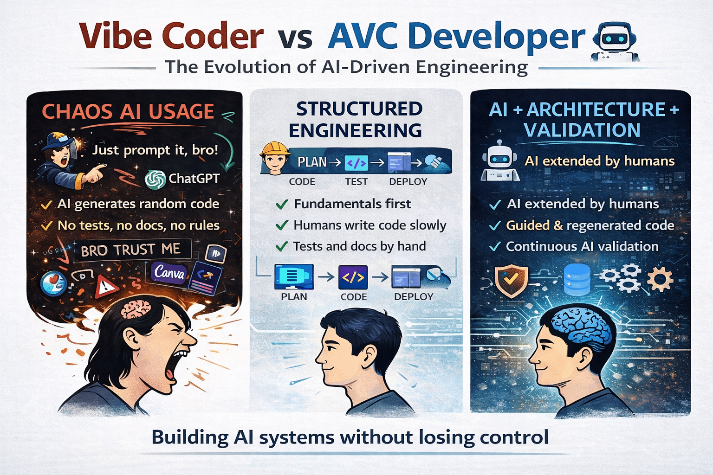

# Signals That Reveal the True Maturity of Organisations Claiming “AI-Driven Development”

**The transformation toward AI-driven development has already begun.**

Many engineers still react with scepticism toward AI-generated code. Yet the direction of the market is clear — this shift will not reverse. The question is no longer whether AI will participate in software development, but how organisations integrate it into their engineering systems.

Today, high-quality software is no longer defined solely as human-written code. Therefore, such a cynical, dismissive and provocative contrast between ___vibe coders___ and a ___normal developer___ as in the attached image has nothing to do with reality and is unfair.

There is significant misunderstanding around the dismissive label of ___vibe coders___ as simple copy-and-paste specialists. That approach only works for trivial tasks. **Building useful software still requires engineering discipline.** 
> Therefore, a professional **vibe coder** today is actually an **Agile Vibe Coding developer**. Perhaps these names will be changed by someone, but not by the essence.

**Solving real business problems with AI requires more than using AI tools.** It demands redefining the software development process itself. Organisational structures, engineering practices, and governance mechanisms must evolve alongside the tools.

This evolution reveals an organisation’s true maturity level.

A possible maturity model:
- **👋** Level 1 — AI-Assisted Activity
- **👋** Level 2 — Controlled AI Adoption
- **👋** Level 3 — Feedback-Driven Engineering
- **👋** Level 4 — Architected Regeneration
- **👋** Level 5 — Adaptive, Uncertainty-Aware Organisation

## Key Question
How can we distinguish organisations that genuinely practice AI-driven engineering from those simply using it as a marketing label?

Despite the widespread promotion of AI, most organisations today:
- use AI tools such as `Copilot` or `ChatGPT`
- but have not changed their engineering system

They operate with AI-assisted coding, not AI-governed engineering.

In maturity terms, they remain at **Level 1–2**. And this distinction matters.

Five questions often reveal the true maturity of organisations claiming AI-driven development:
- 👍 Can the organisation detect silent failure in AI systems?
- 👍 Does architecture guide AI code generation?
- 👍 Are AI outputs validated statistically?
- 👍 Is system knowledge independent of the AI tool?
- 👍 Does governance accelerate or slow organisational learning?

## Signal 1 — Is AI only a productivity tool?
AI systems often fail quietly due to:
- model drift
- data distribution shifts
- prompt injection vulnerabilities
- degraded performance under new conditions

If an organisation cannot clearly answer the question:
- “How do we detect silent degradation?”
then it is operating below Level 3 maturity.

Truly AI-enabled organisations implement:
- operational monitoring
- drift detection
- statistical validation of outputs

## Signal 2 — Does architecture guide AI generation?
In many organisations today:
- AI generates code freely
- architecture adapts afterwards

#### ⚠️ This is backwards. 
#### ⚠️ High-maturity organisations invert this relationship. 
#### ⚠️ Architecture constrains generation. 

Typical constraints include:
- domain-driven boundaries
- explicit service contracts
- event schemas
- defined API surfaces

> ❗️Without these constraints, AI accelerates architectural entropy.

## Signal 3 — Are AI outputs validated statistically?
Traditional software validation focuses on:
- unit tests
- integration tests
- code reviews

But AI-assisted systems require additional safeguards such as:
- blind evaluation datasets
- adversarial input testing
- distribution testing

> ❗️If testing only covers developer-created examples, statistical errors remain invisible.

## Signal 4 — Is system knowledge independent of the AI tool?
In immature organisations:
- knowledge exists primarily inside prompts
- developers depend on AI tools for context
- reasoning steps remain undocumented

Mature organisations maintain:
- architectural decision records
- versioned prompts
- explicit domain models
- reproducible environments

> ✅ The system remains understandable even without AI assistance.

## Signal 5 — Does governance accelerate learning?
Many organisations fall into a common trap.

In response to AI risks, leadership introduces:
- additional approval layers
- extensive reporting requirements
- rigid process controls

> ⚠️ Ironically, these measures often slow learning.

High-maturity organisations design governance that:
- detects problems early
- enables safe experimentation
- preserves organisational responsiveness

## The Most Common Illusion

> [!CAUTION]
> A widespread assumption today is:
> - ❗️“AI increases developer productivity, therefore we are improving.”

But productivity without validation often produces:
- faster errors
- faster architectural drift
- faster technical debt

### 👍 The real indicator of maturity is not how fast code is produced, but how quickly an organisation learns what is wrong.

## The Real Competitive Advantage
In AI-enabled engineering environments, leading organisations optimise three feedback loops simultaneously:
- Product feedback — user behaviour → product adjustments
- System feedback — telemetry → operational improvements
- Model feedback — data → retraining → validation

> [!IMPORTANT]
> 👍 Organisations that tightly integrate these loops become adaptive systems.

## Human-Controlled AI Usage

> 🥇 Over the coming decade, many experts expect organisations to measure a new strategic metric: **Learning Velocity**.

This includes:
- time to detect incorrect assumptions
- time to validate new ideas
- time to correct system behaviour

👍 Organisations optimising learning velocity will outperform those focused solely on delivery speed. This shift also reflects a deeper transition — from planning-centric engineering toward iteration-driven adaptation.

👍 Emerging approaches such as Agile Vibe Coding attempt to formalise this shift. They recognise that modern software systems are not just codebases but complex socio-technical systems involving humans, machines, and continuously evolving data.

👍 Managing such systems requires not only faster development, but also disciplined mechanisms for learning, validation, and architectural control.

👍 Organisations that succeed will adopt human-controlled AI usage — and **move beyond the early maturity levels of AI-assisted coding**.

[Agile Vibe Coding Manifesto](https://agilevibecoding.org/)
