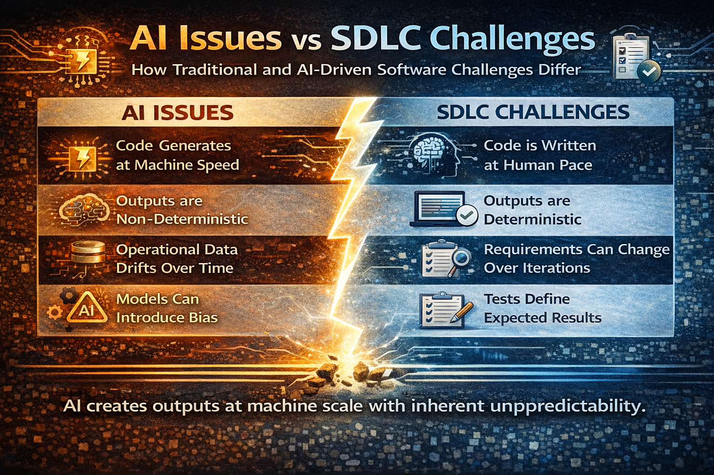

# The Structural problems AI introduces into the SDLC

> Traditional methodologies such as Scrum, DevOps, and the principles behind the Agile Manifesto were designed for a world where:
> - humans wrote the code,
> - software behaviour was largely deterministic,
> - system complexity grew gradually.
> 
> **AI changes all three assumptions.**

## 1. Code Production Becomes Asymmetric

### The problem

**Before AI:**
- A developer could write perhaps 20–100 lines of production code per hour.
- Code review scale roughly matched code generation scale.

**With AI-assisted development:**
- Thousands of lines can be generated quickly.
- Entire modules, tests, and infrastructure may be created in minutes.

**The result:**
- Code production now scales faster than human review capacity.

**This creates new risks:**
- subtle logic flaws
- hallucinated dependencies
- inconsistent architecture
- unverified security assumptions

**Classic Agile assumes:**
- Developers produce code at roughly human speed.
- That assumption no longer holds.

### Why AVC addresses it?

**Principles such as:**
- Mandatory review of generated artifacts
- Independent regeneration
- Architecture constraining generation
- Small, verifiable increments
exist specifically to control AI generation scale.

## 2. Systems Become Partly Non-Deterministic

### The problem

**Traditional software behaves deterministically.**

Example:
- `input → code → output`
- AI systems behave statistically:
  - `input → model → probability distribution → output`

**This introduces new failure modes:**
- dataset leakage
- model drift
- distribution shift
- training contamination
- hallucination

Classic Agile practices assume that:
- **passing tests = system correctness.**

But for ML and LLM systems:
- **tests alone cannot guarantee correctness.**

### Why AVC addresses it?

New validation mechanisms appear:
- blind dataset testing
- adversarial testing
- continuous validation
- observability-driven metrics

> These principles extend Agile quality practices into statistical systems engineering.

## 3. Architectural Drift Accelerates

### The problem
**AI tools can generate code without deep architectural awareness.**

Even when code compiles and passes tests, it may:
- violate domain boundaries
- duplicate logic
- introduce hidden dependencies
- break system invariants
This produces architectural entropy.

> Traditional Agile allowed architecture to emerge from team collaboration.

But with AI generation:
- **architecture must guide generation explicitly**
- otherwise systems degrade rapidly.

### Why AVC addresses it?

Key principles enforce architectural stability:
- Architecture constrains generation
- Guardrails for critical boundaries
- Drift detection
- Controlled regeneration
> Architecture becomes a control surface, not an emergent property.

## 4. Organisations Mistake Velocity for Progress

### The problem
> AI dramatically increases visible output:
> - more code
> - faster commits
> - more features generated

**But speed can mask problems:**
- unvalidated assumptions
- hidden statistical errors
- unstable infrastructure
- rising operational costs

Without strong feedback loops, organisations enter:
- **certainty theatre**

> They believe delivery is improving while risk accumulates.

> This already happened with Agile in many enterprises.

> **AI accelerates the problem.**

### Why AVC addresses it?

**AVC explicitly introduces organisational safeguards:**
- learning velocity over planning certainty
- observability-driven success metrics
- economic responsibility
- protection against control traps
- organisational responsiveness as the key metric

> This shifts the focus from output to validated outcomes.

## Why frameworks like AVC will likely emerge?

> There are three major forces pushing software engineering in this direction.

### 1. AI changes the economics of software development

> Historically, software engineering cost was dominated by human labour.

AI shifts the cost structure toward:
- compute
- model training
- infrastructure
- validation systems

> This changes engineering priorities.
> **The biggest cost risk is no longer writing code.**

It becomes:
- **operating complex AI systems safely.**

> **Frameworks like AVC explicitly integrate economic governance.**

### 2. The Feedback Loop Becomes the Most Valuable Asset

> **The organisations that win are not the ones that plan best.**
> **They are the ones that learn fastest.**

AI accelerates experimentation dramatically, but also increases error potential.

**The real advantage becomes:**
- fast validation
- fast detection of wrong assumptions
- fast correction

This is why AVC emphasises:
- observability
- validation
- responsiveness
over prediction and planning.

### 3. Engineering Governance Must Catch Up with Automation

Historically:
- engineers wrote code
- processes managed humans

Now:
- machines generate code
- humans supervise machines

This requires new governance structures:
- human accountability
- AI validation pipelines
- architecture guardrails
- adversarial testing

> **Frameworks like AVC formalise machine-assisted engineering governance**.

## What This Means for the Future of Software Engineering

We are likely to see a progression similar to this:

| Era	| Dominant | Concern |
|:------|:--------:|:------|
| 1990s	| code     | correctness | 
| 2000s	| delivery | speed (Agile) |
| 2010s	| operational | reliability (DevOps) |
| 2020s	| AI-assisted | development |
| 2030s	| AI-governed | engineering systems |

AVC fits into the emerging stage where:
- software is partly generated,
- systems are probabilistic,
- organisations must optimise learning rather than planning.

## The Core Shift

Traditional software engineering optimised:
- productivity

Next-generation engineering will optimise:
- controlled adaptability

That means:
- faster learning
- safer automation
- resilient architecture
- measurable outcomes

> **Frameworks like Agile Vibe Coding emerge because the engineering environment has fundamentally changed.**

[Agile Vibe Coding Manifesto](https://agilevibecoding.org/)
