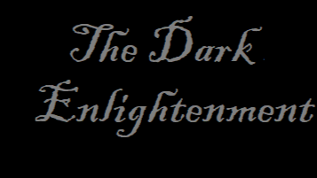

# The Dark Enlightenment

That everything flows (Latin: panta rei) has been known since ancient times. So there is nothing surprising in the fact that the world around us is changing. 
The rule that the worse drives out the better, e.g. worse money drives out the better, is also not a new discovery. But the fact that the brutally simple message of populists, 
people sick with power, narcissistic characters, has probably stopped worrying today, or rather has begun to terrify many.

For me, the surprising discovery of this weekend is the realisation that the ideas created in the heads of people from the IT environment have a significant impact on shaping the sick world order. 
I do not mean the numerous ideas of the IT technological revolution, which has changed and is changing everything and everyone for the better, although there is no shortage of disadvantages. 
But the overall balance is such that probably no one would like to return to a world without IT technology. At this point, I have in mind the idea of a new world order. 
An order based on the elimination of democracy as a system.

Well, Silicon Valley was and is the birthplace of many fortunes and spectacular careers of businessmen and politicians. Today, however, the "prophet of Silicon Valley", Curtis Yarvin, joins this group. 
His teachings resonate behind the scenes of today's establishment of the American administration of Donald Trump and are being transformed into specific actions of the new right. 
An eccentric programmer may have radical views, but when the government attempts to materialize the idea of an authoritarian monarchy, this should already raise concerns.

First, to "make America great again" does not mean to me, dismantle it to its foundations. And this is how it seems to be interpreted by people who actually influence politics. 
Second, a wise and just king who exercises absolute power lives far beyond seven forests, beyond seven seas, beyond seven mountains, in other words in... a fairy tale.

I can agree with the view that highly developed countries operate on an outdated "operating system" of liberal democracy and it would be a good idea to do an upgrade. 
I understand the belief that a state can operate like a corporation: citizens are customers, the government is management staff, and the president is the CEO. 
The analogy is understandable. But to claim that the Parliament is redundant, that the media is an outdated structure, that the government should be privatized, is indeed the "Dark Enlightenment", with the emphasis on dark.

The naivety of this philosophy is striking, shocking.

This ideology already exists, so I have no right to question that it was created by geeks, nerds, because many names of people associated with cybernetics or programming engineering appear here. 
But I absolutely disagree with the view that the neo-recreational movement, NRx, as Yarvin claims, is good for other geeks.

On the wave of the crisis of trust in democratic institutions, disappointment with the free market economy, I understand that one can have mixed feelings about what is good. 
But I personally put the texts that authoritarian monarchy will be what is good for the general public down to fairy tales.

It is surprising, discussing in podcasts how one could bring to power an "American Caesar". It is surprising, publishing essays with the vision that decisions should be made by "great people"
unrelated to the restrictions of the law. It is surprising, unconditional praise for the development of technology in opposition to the state of "anti-capitalist ideology" 
as it is proclaimed in the "Techno-optimist Manifesto". The assumptions of the "Butterfly Revolution" are surprising:

- campaign for autocracy,

- firing all public administration officials,

- ignoring the courts,

- taking over the Congress/Parliament/Senate,

- taking control of the police force,

- liquidation of the media and academic institutions,

- organizing mass protests, mobilizing supporters.

Well, I guess it's time to actually confirm the fact that the "Dark Enlightenment" is coming. Ideologists are no longer just writing about the future, but helping to co-create it. 
It's interesting or not interesting who will be the programmer of the new system, because we already know the catalysts.