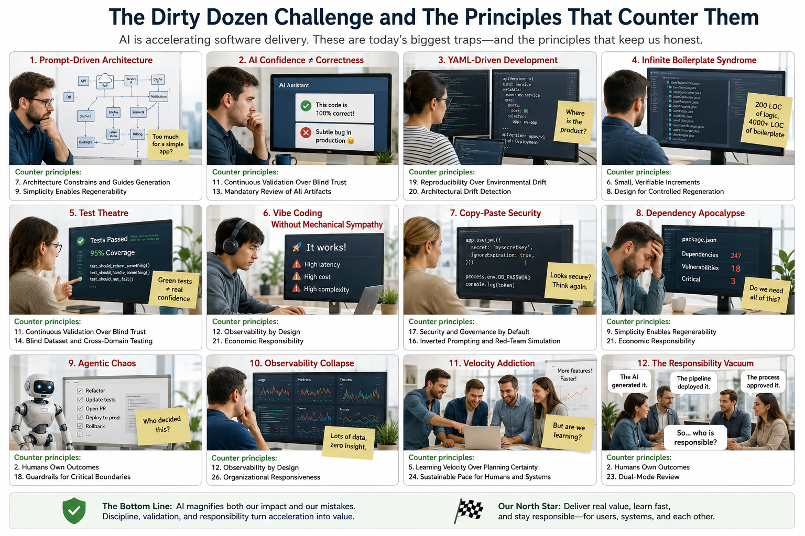

# Underestimated and Annoying, that is “The Dirty Dozen” of Programmers – Part 2: AI-Generated Software

_The first original [“Dirty Dozen”](https://www.linkedin.com/pulse/underestimated-annoying-dirty-dozen-programmers-marek-kubis-mcfxe) article focused largely on human habits,_
_engineering discipline, and the social realities of software development._
_Today, however, artificial intelligence (AI) has left the walls of universities and R&D centres and has become part of everyday business practice._ 

Today, a completely different category of problems is emerging:
- programmers are no longer the sole authors of software,
- code is becoming increasingly probabilistic,
- architecture is increasingly generated rather than deliberately designed,
- and responsibility is becoming blurred between people, commands, tools, models, pipelines, and infrastructure.

This creates a new generation of “dirty dozen” problems — not just programmer sins, but systemic AI-assisted engineering pathologies.
That is why I became involved in the proposal to define a new [manifesto](https://agilevibecoding.org/)  
and [principles](https://github.com/marekartur-dev/agilevibecoding/blob/main/Docs/Home/Principles.md) that would try to organise our new reality.
Without principles, the discussion risks becoming:
- AI bad,
- Kubernetes bad,
- Agile bad.

But _Agile Vibe Coding Manifesto_ reframes the issue:
- The problem is not AI-assisted development itself.
- The problem is unmanaged acceleration without disciplined feedback loops, architectural boundaries, validation systems, and accountability.

This shifts the discussion from a critique to an engineering framework, so limiting problems to exactly 12 points may actually weaken the framework. 

👉 Let's explore this in this and several subsequent articles.

## A New Dirty Dozen Challenge and The Principles That Counter Them

“The Dirty Dozen” works brilliantly as:
- a recognisable metaphor,
- a narrative device,
- a memorable entry point.

But the AI era has changed software engineering so fundamentally that the problem space is now broader than a classic “listicle”.
This is no longer _12 annoying habits of programmers_.
It is becoming _a taxonomy of AI-era engineering failure modes_.
It is a much larger landscape. So how large should this taxonomy become?

👉 Let's break it down into layers and build a hierarchical structure.

## The Dirty Dozen of AI-Generated Software

**I. Organizational Problems**
- AI-driven role confusion,
- junior collapse,
- senior overload,
- platform/governance bottlenecks,
- hiring dysfunction.

**II. Human Problems**
- automation bias,
- loss of fundamentals,
- prompt cargo cults,
- responsibility diffusion,
- velocity addiction.

**III. Process Problems**
- Agile certainty theatre,
- AI-generated bureaucracy,
- review collapse,
- fake productivity metrics,
- broken hiring validation.

**IV. Architecture Problems**
- accidental distributed systems,
- YAML-driven engineering,
- infrastructure overgrowth,
- observability collapse,
- dependency explosion.

**V. Validation Problems**
- fake testing,
- benchmark gaming,
- hallucinated correctness,
- synthetic datasets,
- weak verification.

**VI. Economic Problems**
- cloud cost explosion,
- GPU economics,
- token economics,
- retraining waste,
- operational entropy.

Then each category can contain a few sub-pathologies and now the framework becomes:
- scalable,
- extensible,
- future-proof.

We could still preserve the “Dirty Dozen” branding:
- “The original 12 core AI-era engineering pathologies”.

And later expand into:
- “The Expanded Atlas of AI Software Failure Modes”.

## AI-Generated Software Properties

### 1. Prompt-Driven Architecture

**Pathology**
- AI generates architecture by statistical popularity rather than business necessity.

**Symptoms**
- accidental microservices,
- Kubernetes for CRUD,
- CQRS everywhere,
- “enterprise patterns” without enterprise scale.

**AVC Counter-Principles**
- Principle no 7. Architecture Constrains and Guides Generation
- Principle no 9. Simplicity Enables Regenerability
- Principle no 21. Economic Responsibility

**Key insight**
> [!IMPORTANT]
> ❗️ Architecture must constrain generation — not emerge from it.

**Notes**
> [!NOTE]
> 👉 Architecture emerges accidentally from prompts instead of deliberate design.

Developers ask “Generate a scalable microservice architecture…”
…and receive:
- Kubernetes
- Kafka
- Redis
- CQRS
- Event sourcing
- 14 YAML files
- Helm charts
- OpenTelemetry
- Service mesh

…for a CRUD application with 2,000 users.

Why does this happen? Because LLMs optimise for:
- popularity,
- completeness,
- modernity,
- pattern correlation.

Not appropriateness.

Consequences:
- accidental distributed systems,
- operational explosion,
- enormous infrastructure costs,
- fragile deployments,
- debugging hell.

The remedy is that architecture reviews must become:
- business-driven,
- constraint-driven,
- cost-driven.

> [!NOTE]
> 👉 A useful principle: **“The simplest architecture that can survive production””.**

### 2. AI Confidence ≠ Correctness

**Pathology**
- Plausible output creates false trust.

**Symptoms**
- hallucinated APIs,
- fake resiliency,
- broken concurrency,
- “looks professional.”

**AVC Counter-Principles**
- Principle no 11. Continuous Validation Over Blind Trust
- Principle no 13. Mandatory Review of All Generated Artifacts
- Principle no 25. Human–AI Retrospection

**Key insight**
> [!IMPORTANT]
> ❗️ ___Confidence is not evidence.___

**Notes**
> [!NOTE]
> 👉 AI produces highly convincing nonsense.

Developers stop verifying because:
- the code looks professional,
- comments are detailed,
- patterns appear sophisticated.

New danger. The code is:
- syntactically valid,
- architecturally fashionable,
- operationally dangerous.

Examples:
- race conditions,
- broken async flows,
- hidden N+1 queries,
- fake security,
- fake resiliency,
- hallucinated APIs.

The remedy is to treat AI as:
- a junior developer,
- an autocomplete engine,
- not an architect.

> [!NOTE]
> 👉 Verification becomes more important than generation.

### 3. YAML-Driven Development

**Pathology**
- Infrastructure consumes the application.

**Symptoms**
- deployment complexity exceeds business complexity,
- operational tribal knowledge,
- endless configuration drift.

**AVC Counter-Principles**
- Principle no 19. Reproducibility Over Environmental Drift
- Principle no 20. Architectural Drift Detection
- Principle no 22. Organizational Architecture Mirrors System Architecture

**Key insight**
> [!IMPORTANT]
> ❗️ Infrastructure must remain subordinate to business capability.

**Notes**

The application disappears beneath:
- YAML,
- Helm,
- Terraform,
- Bicep,
- GitHub Actions,
- policy definitions,
- RBAC,
- ingress definitions,
- observability configs.

> [!NOTE]
> 👉 Eventually: **“Infrastructure becomes larger than the application”**.

This aligns strongly with our earlier observation: _“Infrastructure is now architecture”_.

Consequences:
- developers debug pipelines instead of software,
- tiny changes require 9 repositories,
- deployment knowledge becomes tribal knowledge.

The remedy is to separate concerns aggressively into layers:
- infrastructure provisioning,
- platform services,
- deployment,
- runtime configuration,

> [!NOTE]
> 👉 Reduce YAML generation entropy.

### 4. Infinite Boilerplate Syndrome

**Pathology**	
- AI generates abstraction inflation.

**Symptoms**
- repositories for repositories,
- wrappers around wrappers,
- 4000 LOC for trivial logic.

**AVC Counter-Principles**
- Principle no 9. Simplicity Enables Regenerability
- Principle no 6. Small, Verifiable Increments
- Principle no 8. Design for Controlled Regeneration

**Key insight**
> [!IMPORTANT]
> ❗️ ___Complexity compounds AI error rates.___

**Notes**

AI generates:
- abstractions,
- interfaces,
- repositories,
- handlers,
- DTOs,
- factories,
- mediators,
- adapters,
- wrappers,
- endlessly generic classes.

…even when unnecessary.

Why? Because enterprise patterns dominate training data.

Consequences

We got:
- 40 files,
- 4000 LOC,
- for 200 LOC of business logic.

The remedy is to measure:
- business complexity,
- not architectural sophistication.

> [!NOTE]
> 👉 A useful rule: **“Every abstraction must remove pain, not merely demonstrate knowledge”**.

### 5. Test Theatre

**Pathology**
- AI creates tests that increase metrics but reduce insight.

**Symptoms**
- mock-heavy tests,
- implementation-detail assertions,
- meaningless coverage.

**AVC Counter-Principles**
- Principle no 11. Continuous Validation Over Blind Trust
- Principle no 14. Blind Dataset and Cross-Domain Testing
- Principle no 23. Dual-Mode Review

**Key insight**
> [!IMPORTANT]
> Validation must be adversarial, not ceremonial.

**Notes**

AI generates tests that:
- increase coverage,
- but verify nothing important.

Typical examples:
- mocking everything,
- testing implementation details,
- asserting constants,
- snapshot spam,
- fake integration tests.

AI can generate a dangerous new situation:
- production bugs,
- and matching useless tests.

The remedy is to focus tests on:
- behaviour,
- contracts,
- critical paths,
- failure modes,
- concurrency,
- business rules.

> [!NOTE]
> 👉 Coverage metrics become even less meaningful in AI-era development.

### 6. Vibe Coding Without Mechanical Sympathy

**Pathology**
- Developers stop understanding systems beneath abstractions.

**Symptoms**
- latency explosions,
- hidden cloud costs,
- queue saturation,
- database collapse.

**AVC Counter-Principles**
- Principle no 12. Observability by Design
- Principle no 21. Economic Responsibility
- Principle no 24. Sustainable Pace for Humans and Systems

**Key insight**
> [!IMPORTANT]
> ❗️ ___AI removes friction faster than it removes physics.___

**Notes**

Developers no longer understand:
- memory,
- networking,
- transactions,
- threads,
- I/O,
- latency,
- serialization,
- queues,
- database execution plans.

Because **the AI handles it**.

Consequences:
- catastrophic performance,
- hidden cloud costs,
- unstable systems,
- scalability illusions.

The remedy is recognising that ___mechanical sympathy becomes MORE important, not less.___.

> [!NOTE]
> 👉 The fewer people understand fundamentals, the more valuable fundamentals become.

### 7. Copy-Paste Security

**Pathology**
- Generated security code is trusted without adversarial review.

**Symptoms**
- insecure JWT flows,
- exposed secrets,
- broken RBAC,
- vulnerable IaC.

**AVC Counter-Principles**
- Principle no 17. Security and Governance by Default
- Principle no 18. Guardrails for Critical Boundaries
- Principle no 16. Inverted Prompting and Red-Team Simulation

**Key insight**
> [!IMPORTANT]
> ❗️ Security cannot be vibe-coded.

**Note**

AI produces:
- authentication flows,
- JWT handling,
- OAuth integrations,
- encryption usage,
- Kubernetes policies.

Developers assume:
- “AI probably knows security best practices.”

Unfortunately:
- insecure examples dominate public code,
- many repositories contain vulnerabilities,
- and outdated patterns remain common.

Consequences:
- secret leakage,
- privilege escalation,
- broken auth,
- insecure defaults.

The remedy is that security must become:
- policy-driven,
- automated,
- audited independently of AI-generated code.

> [!NOTE]
> 👉 Never trust generated security code blindly.

### 8. Dependency Apocalypse

**Pathology**
- AI maximises dependency count because common patterns dominate training data.

**Symptoms**
- CVE explosion,
- supply-chain fragility,
- framework addiction,
- startup bloat.

**AVC Counter-Principles**
- Principle no 21. Economic Responsibility
- Principle no 9. Simplicity Enables Regenerability
- Principle no 6. Small, Verifiable Increments

**Key insight**
> [!IMPORTANT]
> ❗️ Every dependency becomes operational debt.

**Notes**

AI happily adds:
- 20 packages,
- 12 frameworks,
- 7 cloud SDKs,
- 4 observability stacks.

…to print “Hello World”.

Consequences:
- CVE explosion,
- upgrade paralysis,
- supply-chain risk,
- startup time degradation,
- container bloat.

The remedy is to introduce:
- dependency budgets,
- framework governance,
- package review discipline.

> [!NOTE]
> 👉 An excellent modern metric:
> **“Dependencies per business capability”**.

### 9. Agentic Chaos

**Pathology**
- AI agents recursively modify systems beyond human comprehension.

**Symptoms**
- autonomous refactoring,
- unstable pipelines,
- unknown causality,
- regeneration loops.

**AVC Counter-Principles**
- Principle no 2. Humans Own Outcomes
- Principle no 13. Mandatory Review of All Generated Artifacts
- Principle no 18. Guardrails for Critical Boundaries

**Key insight**
> [!IMPORTANT]
> ❗️ Autonomy without bounded authority creates systemic entropy.

**Notes**

AI agents begin:
- modifying code,
- opening PRs,
- refactoring,
- deploying,
- generating IaC,
- fixing tests automatically.

Soon nobody fully understands:
- who changed what,
- why,
- based on which assumptions.

Consequences:
- emergent complexity,
- feedback-loop disasters,
- recursive breakage,
- autonomous technical debt.

The remedy is that AI agents must operate within:
- bounded authority,
- auditability,
- rollback capability,
- human checkpoints.

Especially for:
- infrastructure,
- production deployment,
- migrations,
- security.

### 10. Observability Collapse

**Pathology**
- Organizations collect telemetry without understanding causality.

**Symptoms**
- dashboards everywhere,
- insight nowhere,
- alert fatigue,
- meaningless metrics.

**AVC Counter-Principles**
- Principle no 12. Observability by Design
- Principle no 26. Organisational Responsiveness Is the Ultimate Metric
- Principle no 5. Learning Velocity Over Planning Certainty

**Key insight**
> [!IMPORTANT]
> ❗️ More telemetry does not create more understanding.

**Notes**

AI-generated distributed systems create:
- massive logs,
- traces,
- dashboards,
- metrics.

But nobody understands:
- which metrics matter,
- causality,
- business flow,
- failure boundaries.

Consequences:
- **We observe everything and understand nothing.**

The remedy is that observability must be:
- intentional,
- business-oriented,
- signal-focused.

### 11. Velocity Addiction

**Pathology**
- Organisations mistake code generation speed for delivery capability.

**Symptoms**
- exploding technical debt,
- review bottlenecks,
- operational overload,
- maintenance paralysis.

**AVC Counter-Principles**
- Principle no 5. Learning Velocity Over Planning Certainty
- Principle no 24. Sustainable Pace for Humans and Systems
- Principle no 1. Customer Value Is the North Star

**Key insight**
- The bottleneck moved from writing code to understanding systems.

**Notes**

AI dramatically increases coding speed. 
Organizations may conclude: “We can deliver 10x more features”.
But reality is:
- review speed does not scale,
- understanding does not scale,
- operations do not scale,
- maintenance does not scale.

Consequences:

AI accelerates:
- technical debt,
- architecture erosion,
- operational overload.

The remedy is to recognise that the bottleneck has shifted from code generation to:
- validation,
- reasoning,
- architecture,
- operations,
- governance.

### 12. The Responsibility Vacuum

**Pathology**
- Responsibility dissolves between AI, tools, process, and humans.

**Symptoms**
- “AI generated it,”
- “pipeline approved it,”
- “the framework did it.”

**AVC Counter-Principles**
- Principle no 2. Humans Own Outcomes
- Principle no 23. Dual-Mode Review
- Principle no 25. Human–AI Retrospection

**Key insight**
> [!IMPORTANT]
> ❗️ AI changes authorship. It does not remove accountability.

**Notes**

When systems fail:
- the programmer blames AI,
- the architect blames tooling,
- management blames process,
- DevOps blames developers,
- security blames GitHub Copilot,
- everyone blames Kubernetes.

Core problem:
- AI blurs accountability.

**The remedy is to remember that the human engineer always remains responsible.**

> [!NOTE]
> 👉 No matter who generated the code.

## The Bigger Narrative

The strongest part of _Agile Vibe Coding Manifesto_ is that it reframes Agile itself.

Traditional Agile often drifted toward:
- predictability theatre,
- estimation obsession,
- ceremony over learning,
- process as certainty simulation.

_Agile Vibe Coding Manifesto_ principles instead assume:
- uncertainty is permanent,
- AI accelerates both value and failure,
- governance must increase responsiveness,
- architecture must constrain generation,
- validation becomes the core engineering discipline.

That is fundamentally a:
- post-Agile,
- AI-era,
- systems-engineering interpretation of software delivery.

## The Closing Thesis

> [!IMPORTANT]
> ❗️ **AI did not eliminate software engineering.**
> It removed the excuses for not engineering properly.
> ❗️ **AI eliminated the time previously available to hide poor engineering.**

The future belongs neither to traditional programmers nor to pure vibe coders.
It belongs to organisations capable of combining AI acceleration with disciplined validation, architectural clarity, and organisational responsiveness.

In the AI era, software engineering becomes less about writing code and more about governing regeneration.
In the Vibe Coding era, **discipline becomes the last competitive advantage**.

This aligns exceptionally well with:
- controlled regeneration,
- regenerability,
- architectural boundaries,
- validation systems,
- platform engineering,
- and our broader AVC framework.

> [!IMPORTANT]
> ❗️ The problem is no longer that programmers write bad code.
> The problem is that modern software ecosystems can generate bad architecture, bad infrastructure, bad abstractions, and bad operational models at machine speed.

_...tbc..._

## See also:
- [Underestimated and Annoying, or the "Dirty Dozen" of Programmers - Part 1: the problem space](https://www.linkedin.com/pulse/underestimated-annoying-dirty-dozen-programmers-marek-kubis-mcfxe)
- [Underestimated and Annoying, that is "The Dirty Dozen" of programmers - Part 3: I. Organizational Problems]()

- [Murphy’s law and more in AI time - one by one with examples](https://www.linkedin.com/pulse/murphys-law-more-ai-time-one-examples-marek-kubis-fkaze)
- [The Agile Vibe Coding and Conway's Law](https://www.linkedin.com/pulse/agile-vibe-coding-conways-law-marek-kubis-m0wpe)
- [Using a digital banking solution to prove Conway’s Law in AI-Driven engineering - example 1](https://www.linkedin.com/pulse/using-digital-banking-solution-prove-conways-law-ai-driven-kubis-xqlre/)
- [Using a .NET 10 migration project to prove Conway’s Law in AI-Driven engineering - example 2](https://www.linkedin.com/pulse/using-net-10-migration-project-prove-conways-law-ai-driven-kubis-abqae)

- [Where traditional Agile breaks in AI-driven systems](https://www.linkedin.com/pulse/where-traditional-agile-breaks-ai-driven-systems-marek-kubis-4wq6e/)
- [AI - It seems nobody has it fully figured out yet](https://www.linkedin.com/pulse/ai-nobody-has-figured-out-marek-kubis-bkyge)
- [Internal Development Platform and Agile Vibe Coding](https://www.linkedin.com/pulse/internal-development-platform-agile-vibe-coding-marek-kubis-kyhqe/?trackingId=5w3lWKp%2F0BLUpwNdrSmAcg%3D%3D&lipi=urn%3Ali%3Apage%3Ad_flagship3_pulse_read%3BqH%2FwqbkZRkmo%2Fagtxvqyrw%3D%3D)
- [Everyone will be vibe coders](https://www.linkedin.com/pulse/everyone-vibe-coders-marek-kubis-tlgze)
- [The Structural problems AI introduces into the SDLC](https://www.linkedin.com/pulse/structural-problems-ai-introduces-sdlc-marek-kubis-qyt6e)
- [Signals That Reveal the True Maturity of Organisations Claiming “AI-Driven Development”](https://www.linkedin.com/pulse/signals-reveal-true-maturity-organisations-claiming-ai-driven-kubis-urule)

- [Agile Vibe Coding positioning and if this works, what changes?](https://www.linkedin.com/pulse/agile-vibe-coding-positioning-works-what-changes-marek-kubis-r4ate)
- [Agile Vibe Coding – Ceremony Modes](https://www.linkedin.com/pulse/agile-vibe-coding-ceremony-modes-marek-kubis-meq9e)
- [Agile Vibe Coding ceremonies approach compared to a simple one-prompt-per-task approach](https://www.linkedin.com/pulse/agile-vibe-coding-ceremonies-approach-compared-simple-marek-kubis-ecx5e)
- [Agile Vibe Coding Maturity Model](https://www.linkedin.com/pulse/agile-vibe-coding-maturity-model-marek-kubis-bbtqe)
- [The Agile Vibe Coding - the 4-level adaptive ceremony system](https://www.linkedin.com/pulse/agile-vibe-coding-4-level-adaptive-ceremony-system-marek-kubis-jizke)

- [Agile Vibe Coding Manifesto](https://agilevibecoding.org/)
- [Principles Behind the Agile Vibe Coding Manifesto - extended version](https://github.com/marekartur-dev/agilevibecoding/blob/main/Docs/Home/Principles.md)

- [Agile Vibe Coding](https://www.reddit.com/r/AgileVibeCoding/)
- [Marek Kubis - blog](https://github.com/marekartur-dev/agilevibecoding/tree/main)