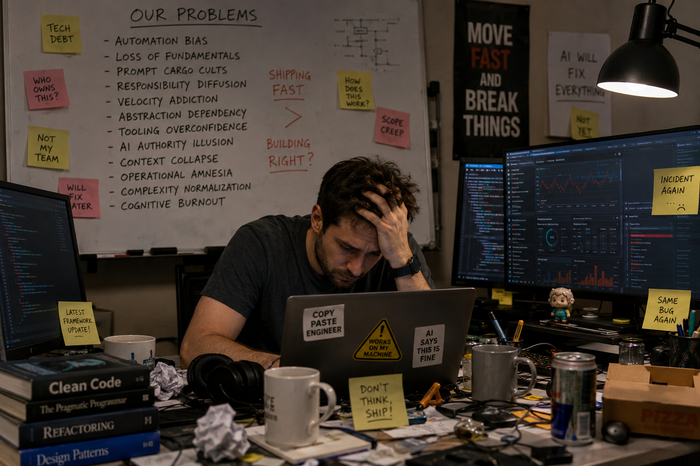

# Underestimated and Annoying, that is "The Dirty Dozen" of programmers - Part 4: II. Human Problems



_In Parts 1, 2 and 3 we discussed the underestimated and annoying realities of programming itself and AI’s impact on development and organisation._
_In Part 4, we will define “The Dirty Dozen” as a set of recurring human failure modes that become amplified in software teams under pressure_
_from AI tooling, automation, hype cycles, delivery metrics, and organisational incentives._

The key is that these are not merely “technical mistakes”.
They are human-system interaction failures:
- underestimated at first,
- annoying in daily practice,
- cumulative over time,
- socially reinforced,
- and difficult to detect because teams normalise them.

> [!NOTE]
> 👉 The Dirty Dozen of Programmers = recurring cognitive, behavioural, organisational, and socio-technical failure modes that degrade engineering quality, ownership, judgment, and long-term system resilience.

This framing is stronger than “bad habits” because it treats them as systemic engineering risks.

## AI-Era Human Failure Modes

### 1. Automation Bias

**Definition**

The tendency to trust AI-generated output, tools, frameworks, linters, dashboards, or automation pipelines even when they are wrong, incomplete, or contextually dangerous.

**Why it emerges**

- AI outputs sound confident.
- Automation reduces friction.
- Engineers are rewarded for speed.
- Correctness evaluation work is invisible.

**Symptoms**

- Blind acceptance of generated code
- “The pipeline passed, so it’s fine”
- Nobody reads infrastructure manifests carefully
- Security warnings ignored because tools are noisy
- Copy-paste debugging

**Why underestimated**

Early productivity gains hide quality degradation.

**Long-term consequence**

Teams lose engineering judgment and become operators of opaque systems.

**Counter-principle**

Automation must amplify judgment, not replace it.

### 2. Loss of Fundamentals

**Definition**

Gradual erosion of understanding of core concepts because abstraction layers and AI assistants hide underlying mechanisms.

**Examples**

- Developers unable to explain TCP retries
- Engineers using async/await without understanding concurrency
- Kubernetes users without Linux fundamentals
- ORM users unable to reason about SQL performance
- Humans stop performing meaningful review because generated changes exceed human cognitive bandwidth.

**Why it emerges**

Modern stacks reward composition over understanding.

**Symptoms**

- Inability to debug beyond Stack Overflow depth
- Cargo-cult architecture
- Fear of touching lower layers
- Dependency explosion

**Why underestimated**

Systems still “work” for a while.

**Long-term consequence**

When systems fail under stress, nobody understands the failure domain.

**Counter-principle**

Abstractions are rented convenience, not free knowledge.

### 3. Prompt Cargo Cults

**Definition**

The belief that productivity comes from discovering magical prompts rather than understanding problems deeply.

**Why it emerges**

AI systems reward superficial fluency.

**Symptoms**

- “Use this prompt framework”
- Teams exchanging prompts instead of designs
- Developers unable to explain generated solutions
- Prompt engineering replacing engineering thinking
- Social conformity / group think

**Why underestimated**

- Outputs often appear impressive in demos
- align around generated consensus
- avoid dissent

**Long-term consequence**

Teams optimise for: 
- appearance of intelligence rather than correctness.
- social harmony over technical truth.

**Counter-principle**

Prompts are interfaces, not substitutes for reasoning.

### 4. Responsibility Diffusion

**Definition**

Shared ownership becomes diluted until nobody feels accountable for system correctness.

**Why it emerges**
- Distributed systems
- Platform teams
- AI-generated code
- DevOps fragmentation
- “Shared ownership” without clear authority

**Symptoms**

- “That belongs to another team”
- Incident meetings with no decisions
- Bugs bouncing across departments
- Nobody owning architecture debt

**Why underestimated**

Collaboration rhetoric hides accountability gaps.

**Long-term consequence**

System quality decays silently because no one protects coherence.

**Counter-principle**

Shared contribution still requires explicit ownership.

### 5. Velocity Addiction

**Definition**

Teams become psychologically and organisationally addicted to delivery speed metrics while neglecting maintainability, resilience, and operational sustainability.

**Why it emerges**

- Sprint culture
- DORA metric absolutism
- Executive pressure
- AI-amplified delivery speed

**Symptoms**

- Endless feature churn
- Refactoring postponed forever
- Architecture treated as obstruction
- Engineers rewarded for throughput only

**Why underestimated**

Short-term metrics improve.

**Long-term consequence**

The organisation accumulates invisible complexity debt until delivery slows catastrophically.

**Counter-principle**

Sustainable engineering velocity is constrained by cognitive load.

### 6. Abstraction Dependency

**Definition**

Developers become dependent on frameworks and platforms they no longer understand internally.

**Symptoms**

- “The framework should handle that”
- Teams unable to operate without orchestration layers
- Massive stacks for simple applications

**Consequence**

Operational fragility increases while local reasoning decreases.

**Counter-principle**

Every abstraction introduces a future debugging tax.

### 7. Tooling Overconfidence

**Definition**

Belief that enough tools can compensate for weak engineering discipline.

**Symptoms**

- More dashboards instead of clearer systems
- Adding observability rather than reducing complexity
- Governance by plugins

**Consequence**

Operational noise overwhelms signal.

**Counter-principle**

Tools cannot compensate for architectural confusion.

### 8. AI Authority Illusion

**Definition**

Treating AI output as authoritative because it is articulate. 
Unlike automation bias, this specifically concerns persuasive language and apparent reasoning.

**Symptoms**

- Confidently wrong architecture decisions
- Fabricated APIs accepted as valid
- Teams arguing from generated text

**Consequence**

False confidence scales faster than human verification.

**Counter-principle**

Fluency is not evidence of correctness.

### 9. Context Collapse

**Definition**	

Engineers lose holistic system understanding because work is fragmented across tickets, services, prompts, and platforms.

**Symptoms**

- Nobody understands end-to-end flows
- Local optimisation harming global behaviour
- Teams reasoning only within boundaries

**Consequence**

Emergent failures become impossible to predict.

**Counter-principle**

Systems fail across boundaries, not inside diagrams.

### 10. Operational Amnesia

**Definition**

Teams repeatedly relearn the same production lessons because institutional memory is weak.

**Symptoms**

- Same outages recurring yearly
- Incident reviews ignored
- Tribal knowledge dependence

**Consequence**

- The organisation becomes permanently junior regardless of experience.
- Review collapse is one of the biggest real AI-era risks.

**Counter-principle**

Reliability requires memory, not heroics.

### 11. Complexity Normalisation

**Definition**

Teams gradually accept unnecessary complexity as “modern engineering.”

**Symptoms**

- Simple apps needing 40 services
- YAML ecosystems larger than business logic
- Ceremony replacing clarity

**Consequence**

The cost of change exceeds business value.

**Counter-principle**

Complexity must continuously justify its existence.

### 12. Cognitive Burnout by Fragmentation

**Definition**

Human attention becomes exhausted by constant context switching between tools, alerts, prompts, meetings, pipelines, and platforms.

**Symptoms**

- Engineers unable to focus deeply
- Permanent shallow work
- Rising emotional exhaustion

**Decision Fatigue**

- AI-induced micro-decisions
- endless tool choices
- prompt variations
- governance exceptions

**Consequence**	

Creativity and judgment degrade first, then productivity follows.


**Counter-principle**

Human cognition is the scarcest infrastructure resource.

### Why These Problems Are Underestimated

Because they:
- initially improve productivity,
- scale socially,
- are difficult to quantify,
- emerge gradually,
- and often masquerade as “modern best practices.”

Many are reinforced by:
- vendor ecosystems,
- AI hype,
- platform engineering trends,
- executive dashboards,
- and recruitment incentives.


### How do humans cooperate when software itself becomes partially generated, partially reviewed, partially automated, and partially understood?

That changes:
- team structure,
- ownership,
- delegation,
- workflows,
- quality control,
- communication,
- and even the meaning of “engineering.”

> [!IMPORTANT]
> ⚠️ Traditional Agile assumptions break when AI massively reduces code production cost.

## The Core Shift

### Old Software World

The expensive resource was:
- typing code.

So organisations optimised for:
- developer throughput.

### AI-Era Software World

The expensive resource becomes:
- human judgment,
- system understanding,
- trust establishment,
- coordination,
- accountability,
- architectural coherence.

Code generation becomes abundant.

> [!IMPORTANT]
> ✔️ Meaning: The real problem is no longer producing software.
> The problem is controlling the consequences of software generation.

That changes teamwork fundamentally.

### Is Dev + QA + DevOps Still Correct?

Partially. But the old silo wars:
- Dev vs QA
- Dev vs Ops
- feature vs stability

become even worse with AI-generated velocity.

Because AI increases:
- change frequency,
- surface area,
- hidden defects,
- operational unpredictability.

> [!NOTE]
> 👉 So the question is not: “Should QA disappear?” 
> but:
> “How do humans collectively maintain trust in increasingly machine-generated systems?”

### Why Pure Cross-Functional Teams Often Fail

The classic Scrum ideal:
- 1 team,
- everyone is expected to do everything,
- shared ownership,
- full-stack autonomy

works only under limited complexity.

At scale it often produces:
- responsibility diffusion,
- operational confusion,
- architectural inconsistency,
- shallow expertise,
- excessive meetings,
- cognitive overload.

Especially in AI-era development.

### Why Old-Style Silos Also Fail

The old model:
- isolated development teams,
- isolated QA departments,
- isolated operations teams.

creates:
- ticket throwing,
- adversarial incentives,
- delayed feedback,
- bureaucratic coordination,
- “works on my machine” culture.

That becomes catastrophic when AI accelerates delivery.

### Better Model:

**Functional Excellence + Embedded Collaboration**

The healthiest model is usually:
```
Function            Deep Expertise  Embedded Cooperation
--------------------------------------------------------
Engineering         Yes             Yes
QA / Reliability    Yes             Yes
Platform / Ops      Yes             Yes
Security            Yes             Yes
Architecture        Yes             Yes
```

Meaning:
- people need professional identity,
- craftsmanship communities,
- technical depth,
- standards ownership,

But also:
- embedded collaboration in delivery streams.

### Recommended Team Structure

**1. Product/Domain Teams**

Responsible for:
- business outcomes,
- user workflows,
- feature evolution.

Contain:
- senior engineers,
- product people,
- embedded QA mindset,
- operational accountability.

> [!NOTE]
> 👉 But **teams do not own everything**.

**2. Platform Engineering Teams**

Responsible for:
- deployment systems,
- observability,
- golden paths,
- CI/CD,
- templates,
- runtime governance,
- AI policy enforcement.

> [!NOTE]
> 👉 This aligns strongly with our Infrastructure Development Platform, IDP thinking.

**3. Reliability / Assurance Teams**

This becomes more important with AI.

Responsibilities:
- quality gates,
- chaos testing,
- performance validation,
- security assurance,
- AI output auditing,
- production simulation.

> [!NOTE]
> 👉 **Future QA** is not manual clicking.
> It becomes **operational confidence engineering**.

**4. Architecture / Systems Thinking Group**

> [!WARNING]
> ❌ Not ivory-tower architects.

Instead:
- cognitive load control,
- system simplification,
- dependency governance,
- operational cost evaluation,
- bounded-context review.

> [!NOTE]
> 👉 Without these review mechanisms, AI accelerates entropy.

## Agile + Scrum + Kanban in AI Era

> [!NOTE]
> 👉 This is where many organisations are already becoming outdated.

### Why Traditional Scrum Breaks

Scrum assumed:
- coding is expensive,
- change is slow,
- developers are the bottleneck.

AI changes this dramatically.

Now:
- code generation is fast,
- architectural drift is faster,
- review becomes bottleneck,
- verification becomes bottleneck,
- integration becomes bottleneck.

> [!NOTE]
> 👉 So the velocity metrics become misleading.

### The New Bottleneck

The new bottleneck is:
- decision quality,
- validation,
- operational trust,
- coherence.

### What Replaces Old Agile?

Not abandoning Agile entirely.

> [!NOTE]
> 👉 But shifting from “Task management” toward “Flow governance”.

### Kanban Becomes More Important Than Scrum

Because AI work is:
- uneven,
- interrupt-driven,
- review-heavy,
- experiment-heavy,
- asynchronous.

Rigid sprint rituals often become theatre. 
Better:
- continuous flow,
- explicit WIP limits,
- review queues,
- architecture checkpoints,
- operational confidence pipelines.

### AI-Era Work Unit

Old work unit:
- ticket,
- feature,
- story points.

New work unit:
- verified outcome.

Because generated code alone has low value.

### Job Delegation in AI Era

Job Delegation changes radically.

- Old delegation: “Implement feature X”.
- New delegation: “Guarantee business outcome X within operational constraints Y and governance rules Z.”

Meaning, humans increasingly supervise:
- intent,
- constraints,
- correctness,
- tradeoffs.

AI performs:
- implementation acceleration.

### Prompt Engineering Everywhere?

Partially yes. But this becomes dangerous if misunderstood.

A company cannot operate on:
- magical prompts,
- tribal AI rituals,
- undocumented prompt folklore.

That becomes **Prompt Bureaucracy** equivalent to:
- YAML bureaucracy,
- process cargo cults.

### Prompt Bureaucracy

The organisational tendency to replace engineering clarity with undocumented prompt rituals and AI folklore.

> [!IMPORTANT]
> ✔️ **Intent Engineering** instead of “prompt engineering.”

Because humans must communicate:
- goals,
- constraints,
- risk boundaries,
- quality expectations,
- operational assumptions.

Not merely prompts.

## The Magnificent Seven

**Human Cooperation Principles for the AI Era** - _the constructive counterpart to “The Dirty Dozen”._

### 1. Explicit Ownership

**Principle**

Every system, decision, and operational boundary must have a clearly accountable human owner.

**Prevents**

- responsibility diffusion,
- coordination paralysis.

**Motto**

> [!NOTE]
> 👉 Shared contribution does not remove ownership.

### 2. Verification Before Velocity

**Principle**

Generated output is guilty until verified.

**Prevents**

- automation bias,
- AI hallucination propagation.

**Motto**

> [!NOTE]
> 👉 Fast is temporary. Correct survives production.

### 3. Human-Centred Architecture

**Principle**

Systems must optimise for human comprehension, not maximal abstraction.

**Prevents**
- cognitive overload,
- accidental complexity.

**Motto**

> [!NOTE]
> 👉 If humans cannot reason about it, they cannot operate it.

### 4. Continuous Learning of Fundamentals

**Principle**

Teams must continuously preserve understanding of underlying mechanisms.

**Prevents**

- abstraction dependency,
- operational helplessness.

**Motto**

> [!NOTE]
> 👉 Understanding cannot be outsourced.

### 5. Cooperative Specialisation

**Principle**

Deep expertise matters, but expertise must collaborate through shared operational goals.

**Prevents**

- silo warfare,
- shallow generalism.

**Motto**

> [!NOTE]
> 👉 Specialists cooperate. Silos compete.

### 6. Sustainable Cognitive Load

**Principle**

Human attention is finite and must be protected deliberately.

**Prevents**

- burnout,
- fragmented thinking,
- shallow engineering.

**Motto**

> [!NOTE]
> 👉 Cognitive overload is a production risk.

### 7. Reality-Oriented Feedback Loops

**Principle**

Production reality matters more than process theatre, dashboards, or AI optimism.

**Prevents**
- metric gaming,
- Agile theatre,
- consensus theatre,
- illusion of progress.

**Motto**

> [!NOTE]
> 👉 Reality is the ultimate integration test.
> Teams mistake agreement, dashboards, or AI-generated summaries for genuine understanding.


## Final Thesis

The AI era is not primarily creating technical problems.
It is amplifying latent human and organisational weaknesses that software engineering already struggled with.

> [!NOTE]
> 👉 The future of software engineering is not about replacing programmers with AI.
> 
> It is about redesigning human cooperation so that humans can still maintain judgment, trust, ownership, and shared understanding in systems increasingly generated by machines.

### Last but not least

> [!IMPORTANT]
> ❗️ The greatest risk of nowadays development is not that machines become smarter than programmers, but that programmers gradually stop exercising judgment.
> 
> 📌 Even the best programmers cannot overcome systemic organisational dysfunction, unclear communication structures, or poor project management.

These words come from Frederick P. Brooks Jr., author of The Mythical Man‑Month (1975). He also wrote that:
- Adding more great developers to a late or chaotic project makes it later.
- Organisational structure, communication overhead, and unclear responsibilities dominate individual talent.
- Systemic issues outweigh individual brilliance.

This is the earliest canonical source in software engineering literature that explicitly states the principle:
> [!IMPORTANT]
> 📌 **Talent cannot overcome organisational dysfunction.**

Also, W. Edwards Deming (1950s–1980s) management philosopher emphasised that:
- 94% of performance problems come from the system, not the people.
- Even highly skilled workers fail in a poorly designed system.

This predates Brooks, but it is not software‑specific. Still, it is the intellectual foundation for the idea.

So summarise, **nothing eliminates the need for organisational and engineering discipline**. And that's why it was the first point in this series: I. Organizational Problems.


_...tbc..._

## See also:
- [Underestimated and Annoying, or the "Dirty Dozen" of Programmers - Part 1: the problem space](https://www.linkedin.com/pulse/underestimated-annoying-dirty-dozen-programmers-marek-kubis-mcfxe)
- [Underestimated and Annoying, that is "The Dirty Dozen" of programmers - Part 2: AI-Generated Software](https://www.linkedin.com/pulse/underestimated-annoying-dirty-dozen-programmers-part-2-marek-kubis-tqkme/)
- [Underestimated and Annoying, that is "The Dirty Dozen" of programmers - Part 3: I. Organizational Problems](https://www.linkedin.com/pulse/underestimated-annoying-dirty-dozen-programmers-part-marek-kubis-h9y3e/)

- [Murphy’s law and more in AI time - one by one with examples](https://www.linkedin.com/pulse/murphys-law-more-ai-time-one-examples-marek-kubis-fkaze)
- [The Agile Vibe Coding and Conway's Law](https://www.linkedin.com/pulse/agile-vibe-coding-conways-law-marek-kubis-m0wpe)
- [Using a digital banking solution to prove Conway’s Law in AI-Driven engineering - example 1](https://www.linkedin.com/pulse/using-digital-banking-solution-prove-conways-law-ai-driven-kubis-xqlre/)
- [Using a .NET 10 migration project to prove Conway’s Law in AI-Driven engineering - example 2](https://www.linkedin.com/pulse/using-net-10-migration-project-prove-conways-law-ai-driven-kubis-abqae)

- [Where traditional Agile breaks in AI-driven systems](https://www.linkedin.com/pulse/where-traditional-agile-breaks-ai-driven-systems-marek-kubis-4wq6e/)
- [AI - It seems nobody has it fully figured out yet](https://www.linkedin.com/pulse/ai-nobody-has-figured-out-marek-kubis-bkyge)
- [Internal Development Platform and Agile Vibe Coding](https://www.linkedin.com/pulse/internal-development-platform-agile-vibe-coding-marek-kubis-kyhqe/?trackingId=5w3lWKp%2F0BLUpwNdrSmAcg%3D%3D&lipi=urn%3Ali%3Apage%3Ad_flagship3_pulse_read%3BqH%2FwqbkZRkmo%2Fagtxvqyrw%3D%3D)
- [Everyone will be vibe coders](https://www.linkedin.com/pulse/everyone-vibe-coders-marek-kubis-tlgze)
- [The Structural problems AI introduces into the SDLC](https://www.linkedin.com/pulse/structural-problems-ai-introduces-sdlc-marek-kubis-qyt6e)
- [Signals That Reveal the True Maturity of Organisations Claiming “AI-Driven Development”](https://www.linkedin.com/pulse/signals-reveal-true-maturity-organisations-claiming-ai-driven-kubis-urule)

- [Agile Vibe Coding positioning and if this works, what changes?](https://www.linkedin.com/pulse/agile-vibe-coding-positioning-works-what-changes-marek-kubis-r4ate)
- [Agile Vibe Coding – Ceremony Modes](https://www.linkedin.com/pulse/agile-vibe-coding-ceremony-modes-marek-kubis-meq9e)
- [Agile Vibe Coding ceremonies approach compared to a simple one-prompt-per-task approach](https://www.linkedin.com/pulse/agile-vibe-coding-ceremonies-approach-compared-simple-marek-kubis-ecx5e)
- [Agile Vibe Coding Maturity Model](https://www.linkedin.com/pulse/agile-vibe-coding-maturity-model-marek-kubis-bbtqe)
- [The Agile Vibe Coding - the 4-level adaptive ceremony system](https://www.linkedin.com/pulse/agile-vibe-coding-4-level-adaptive-ceremony-system-marek-kubis-jizke)

- [Agile Vibe Coding Manifesto](https://agilevibecoding.org/)
- [Principles Behind the Agile Vibe Coding Manifesto - extended version](https://github.com/marekartur-dev/agilevibecoding/blob/main/Docs/Home/Principles.md)

- [Agile Vibe Coding](https://www.reddit.com/r/AgileVibeCoding/)
- [Marek Kubis - blog](https://github.com/marekartur-dev/agilevibecoding/tree/main)