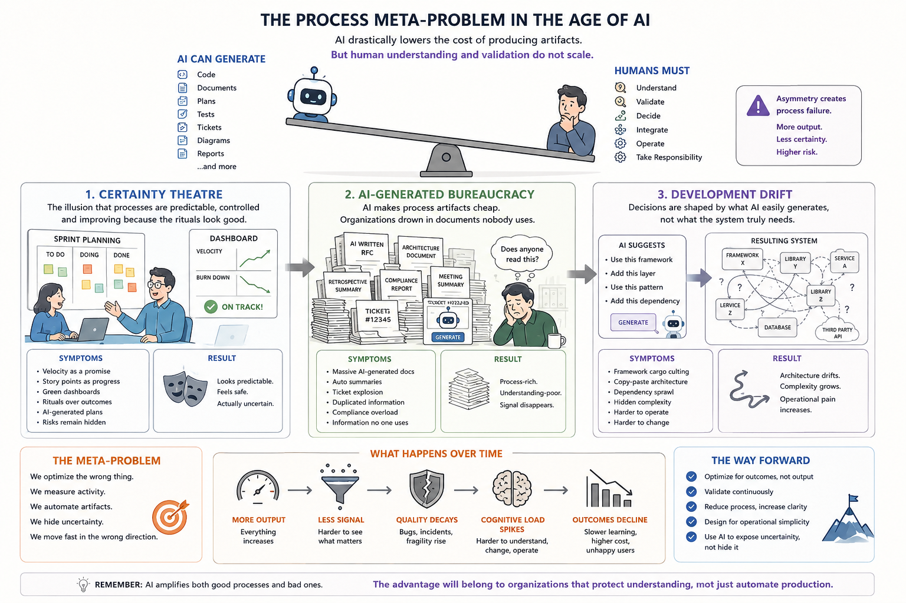

# Underestimated and Annoying, that is "The Dirty Dozen" of Vibe Coding - Part 5: III. Process Problems



_In previous parts (1-4), I hope I have conveyed the importance of human coordination, verification, and architectural restraint._
_In Part 5, we’ll examine another important issue in modern software delivery: process problems._

Process problems are different from organisational and human problems.
- **Organisational problems** = structure, ownership, hierarchy, team topology, incentives.
- **Human problems** = communication, collaboration, motivation, cognitive biases, expertise.
- **Process problems** = how work flows, decisions are made, quality is validated, delivery is measured, and coordination actually happens day to day.

> [!IMPORTANT]
> ✔ The AI era introduces a new category of failure modes:
> teams appear **more efficient, more agile, more compliant, more measurable** — while actual engineering certainty, learning, and quality decline.

> [!IMPORTANT]
> 📌 The dangerous part is that many of these problems produce excellent dashboards.

## Core Pattern

> [!NOTE]
> 👉 Most AI-era process failures share the same mechanism:
> AI reduces the cost of producing artifacts faster than humans can validate them.

This creates:
- process inflation,
- documentation inflation,
- PR inflation,
- meeting inflation,
- metrics inflation,
- architecture inflation,
- compliance inflation.

Eventually:
- signal disappears,
- review collapses,
- trust erodes,
- teams stop understanding systems deeply.

## 1. Agile Certainty Theatre

### Definition

The illusion that software delivery is predictable, controlled, measurable, and continuously improving because Agile rituals are being performed.
- The ceremonies survive.
- The engineering certainty disappears.

> [!NOTE]
> ✔️  Focus on illusion of predictability.

### Symptoms

- Velocity charts treated as forecasting tools.
- Story points equated with business progress.
- Sprint commitments treated as contracts.
- Jira status transitions mistaken for delivery certainty.
- AI-generated tickets created faster than humans can understand them.
- Teams reporting “green status” while systems rot underneath.
- Scrum rituals becoming administrative theatre.

### Why It Happens

AI dramatically accelerates:
- backlog generation,
- task decomposition,
- sprint planning artifacts,
- acceptance criteria,
- roadmap presentations.

But:
- generated plans are often shallow,
- edge cases remain undiscovered,
- architecture risks stay hidden,
- integration complexity remains human.

> [!NOTE]
> 👉 Planning confidence increases while actual certainty decreases.

### Root Cause

Agile originally assumed:
- humans understand work,
- humans estimate based on expertise,
- teams learn continuously through feedback.

AI breaks this assumption because:
- work decomposition becomes synthetic,
- estimates become detached from reality,
- generated code creates hidden uncertainty.

### Counter-Principles

- Replace “velocity” with outcome validation.
- Measure defect escape rate and recovery time.
- Treat plans as probabilistic.
- Reward risk discovery early.
- Reduce ceremony volume.
- Use AI to expose uncertainty, not hide it.

- Ruthless reduction of artifacts.
- Short tickets.
- One source of truth.
- Fewer dashboards.
- Aggressive deletion culture.
- Information hierarchy.


## 2. AI-Generated Bureaucracy

### Definition

Processes where AI creates large quantities of management artifacts that nobody truly reads, validates, or uses.

### Symptoms

- Massive AI-generated documentation.
- Auto-generated RFCs.
- AI-written retrospectives.
- AI-generated architecture diagrams.
- Automated compliance reports.
- Meeting summaries nobody verifies.
- Slack floods.
- Ticket explosion.
- Requirement duplication across tools.
- Key architectural decisions buried in comments.

### Why It Happens

AI makes process artifacts nearly free to produce.

Historically:
- documentation cost created natural limits,
- writing itself forced thinking.

Now:
- teams can generate infinite process text,
- but verification cost remains human and expensive.

### Failure Mode

The organisation becomes:
- process-rich,
- understanding-poor.

Teams stop distinguishing:
- important information,
- generated filler,
- verified knowledge,
- hallucinated certainty.

### Counter-Principles

- Minimise artifact count.
- Require ownership for every document.
- Delete stale documentation aggressively.
- Prefer executable examples over prose.
- Use “proof-of-acceptance” reviews.
- Reward clarity and brevity.


## 3. Ticket Inflation

### Definition

The creation of excessive, fragmented, low-value work items that simulate progress while increasing coordination overhead.

> [!IMPORTANT]
> ✔ This deserves special focus because the ticket generation problem may become one of the most underestimated SDLC failures.

### Symptoms

- Thousands of backlog items.
- Tiny meaningless subtasks.
- Excessive workflow states.
- Teams spending more time updating Jira than building systems.
- Planning becoming inventory management.

### Why It Happens

Managers discover they can instantly generate:
- epics,
- stories,
- subtasks,
- acceptance criteria,
- estimations,
- dependencies,
- risk lists.

> [!NOTE]
> 👉 The backlog becomes infinite.

### Why AI Ticket Generation Is Dangerous

AI can create:
- infinite plausible work.

But plausible work is not necessarily:
- important,
- correct,
- actionable,
- valuable,
- strategically aligned.

### Failure Pattern

The system optimises for:
- task movement,
- workflow transitions,
- visible activity.

Instead of:
- finished software,
- validated outcomes,
- operational simplicity.

### Anti-Patterns

**1. Ticket Explosion**

Breaking work into microscopic units.

✔ Result: coordination cost dominates implementation cost.

**2. Specification Theatre**

Tickets pretending to fully define reality.

✔ Result: engineers stop thinking critically, hidden uncertainty ignored.

**3. Workflow Farming**

Teams optimising task movement.

✔ Result: work completion decouples from customer outcomes.

**4. Backlog Hoarding**

Massive never-ending backlogs.

✔ Result:
- cognitive pollution,
- planning illusion,
- prioritisation collapse.

### The Deeper Problem

Large backlogs create:
- false certainty,
- planning illusion,
- deferred decision making,
- cognitive overload.

> [!WARNING]
> ❗️ Many backlog items probably should never exist.

### Better Task Philosophy

Good tickets are:
- temporary coordination tools,
- not permanent knowledge databases.

Good job description should:
- represent uncertainty,
- capture intent,
- identify constraints,
- define operational risks,
- explain why work matters.

Good job description answer:
- Why does this matter?
- What risk/problem exists?
- What outcome is expected?
- What constraints matter?
- What remains uncertain?

Good tickets should not attempt to:
- fully replace architecture,
- fully specify implementation,
- eliminate engineering judgment.

Bad tickets attempt to:
- fully specify reality,
- simulate certainty,
- replace engineering judgment.

## 4. Review Collapse

### Definition

The gradual inability of teams to meaningfully validate the volume and complexity of changes being introduced.

> [!WARNING]
> ❗️ This may become one of the largest hidden AI-era engineering risks.

### Symptoms

- PR sizes increase massively.
- Reviewers skim instead of validate.
- LGTM culture.
- Generated code nobody fully understands.
- Security review overload.
- Architectural drift hidden inside “small” changes.
- Senior engineers becoming approval bottlenecks.

### AI Amplification

AI can generate:
- hundreds of lines per minute,
- entire integrations,
- infrastructure manifests,
- tests,
- migrations,
- boilerplate.

But review capacity does not scale equally.

### The Key Asymmetry
- Generation scales linearly.
- Verification scales cognitively.

> [!NOTE]
> 👉 Meaning: eventually humans cannot keep up with the verification burden.

### Failure Outcomes

- Silent quality decay.
- Security vulnerabilities.
- Integration fragility.
- Accidental complexity growth.
- “Works locally” production failures.
- Dependency chaos.

### Counter-Principles

- Smaller change sets.
- Architectural review before code review.
- Strong automated verification pipelines.
- Mutation testing.
- Contract testing.
- Runtime observability.
- Review budgets.
- “No human validated this” should be explicit.

## 5. Fake Productivity Metrics

### Definition

Using activity metrics as proxies for engineering value.
AI makes this dramatically worse because activity becomes cheap.

### Examples

Traditional Fake Metrics:
- Lines of code.
- Ticket count.
- Story points.
- Commit count.
- Sprint velocity.

AI-Era Fake Metrics:
- AI prompts generated.
- AI-assisted throughput.
- PR count explosion.
- “Code generated per engineer.”
- Number of copilots/tools used.
- AI adoption percentage.

### Why This Fails

AI increases:
- output volume,
- artifact count,
- visible activity.

But business value depends on:
- correctness,
- resilience,
- maintainability,
- operational simplicity,
- user outcomes.

### Common Failure Pattern

The organisation celebrates:
- increased throughput,
- reduced delivery time,
- more commits.

Meanwhile:
- outages rise,
- cognitive load increases,
- maintenance cost explodes,
- debugging becomes harder,
- onboarding slows down.

### Counter-Principles

Measure:
- lead time to reliable production,
- escaped defect rate,
- MTTR,
- operational load,
- rollback frequency,
- customer outcomes,
- architectural simplicity,
- change failure rate,
- cognitive load.

## 6. Process Fragmentation

### Definition

Work becoming distributed across too many disconnected tools, rituals, workflows, and approval chains.

### Symptoms

One feature requires updates in:
- Jira,
- Confluence,
- GitHub,
- Slack,
- Teams,
- Miro,
- ServiceNow,
- Azure DevOps,
- security workflow,
- architecture review board,
- platform pipeline,
- AI copilots,
- observability dashboards.

> [!WARNING]
> ❗️ Nobody sees the whole system anymore.

### AI Amplification

AI creates:
- more artifacts,
- more integration layers,
- more workflow automation,
- more process glue.

> [!WARNING]
> ❗️ Ironically: process automation often increases process complexity.

### Counter-Principles

- Fewer systems of record.
- Minimise workflow hops.
- Reduce approval chains.
- Consolidate observability.
- Prefer direct engineering communication.
- Optimise for flow, not traceability theatre.

## 7. Prompt-Driven Development Drift

### Definition

Engineering decisions gradually shifting from intentional architecture toward whatever the AI most easily generates.

### Symptoms

- Framework cargo culting.
- Copy-paste architecture patterns.
- Increasing homogenisation.
- Hidden dependency sprawl.
- Generated abstractions nobody owns.
- Engineers selecting “AI-friendly” approaches instead of operationally appropriate ones.

### Failure Pattern

The process optimises for:
- generation convenience,
- promptability,
- template compatibility.

Instead of:
- runtime simplicity,
- maintainability,
- domain correctness.

### Counter-Principles

- Architecture-first thinking.
- Design reviews before implementation.
- Explicit tradeoff analysis.
- “Why is this needed?” reviews.
- Operational cost analysis.

> [!NOTE]
> 📌  At this point, a pattern should be visible:
> AI scales artifact generation faster than organisations can scale understanding.


## 8. Retrospective Theatre

### Definition

Retrospectives becoming emotionally safe reporting rituals instead of mechanisms for systemic learning.

### Symptoms

- Same issues repeated every sprint.
- AI-generated retro summaries.
- No structural fixes implemented.
- Action items disappear.
- Teams discuss symptoms, not root causes.

### AI Amplification

AI can produce:
- polished summaries,
- sentiment analysis,
- categorised action lists.

But:
- synthesis is not learning,
- summarisation is not accountability.

### Counter-Principles

- Fewer retrospectives.
- More operational postmortems.
- Root cause analysis.
- Track repeated failure patterns.
- Require measurable process experiments.


## 9. Workflow Theatre

### Definition

The illusion that process maturity exists because workflows appear sophisticated.

> [!NOTE]
> ✔️  Focus on appearance of maturity.

### Symptoms

- Complex Jira workflows.
- Many approval states.
- Compliance gates everywhere.
- “Enterprise-ready” pipelines.
- Governance-heavy ceremonies.
- Dashboard obsession.
- AI-generated process compliance reports.

### Failure Pattern

Process becomes:
- visually impressive,
- operationally hollow.

The organisation confuses:
- workflow sophistication,
- engineering capability.

### AI Amplification

AI can generate:
- beautiful documentation,
- polished process summaries,
- professional-looking governance artifacts.

This makes fake maturity harder to detect.

### Counter-Principles

- Simplify workflows aggressively.
- Prefer direct accountability.
- Minimise handoffs.
- Measure operational outcomes.
- Remove nonessential approvals.


## 10. Continuous Delivery Without Continuous Verification

### Definition

Teams optimise deployment speed while verification maturity lags behind.

### Symptoms

- “Deploy faster” culture.
- Weak observability.
- Minimal production validation.
- Synthetic tests only.
- Poor rollback strategy.
- Canary deployments without meaningful telemetry.

### AI Amplification

AI accelerates:
- pipeline creation,
- deployment automation,
- infrastructure templating.

But:
- production acceptance remains human.

### Counter-Principles

- Observability-first engineering.
- Runtime verification.
- Chaos testing.
- Production feedback loops.
- DORA metrics interpreted carefully, not religiously.

## 11. Governance Inflation

### Definition

Organisations responding to AI uncertainty by adding layers of approvals, policies, templates, compliance, and architecture governance.

> [!NOTE]
> ✔️  Focus on scaling control structures.

### Symptoms

- AI usage policies nobody understands.
- Mandatory prompt logging.
- Architecture boards reviewing trivial changes.
- Compliance overload.
- Security reviews scaling poorly.

### Failure Pattern

- Governance scales linearly.
- Engineering scales nonlinearly.

Eventually:
- process becomes the bottleneck,
- shadow engineering emerges.

### Counter-Principles

- Lightweight governance.
- Risk-based review depth.
- Platform guardrails instead of committees.
- Automate policy enforcement carefully.
- Keep humans focused on high-risk decisions.


## 12. Context Window Management Failure

### Definition

Teams failing to manage human and AI cognitive context effectively.

### Symptoms

- Too many tasks in flight.
- Huge prompts with hidden assumptions.
- Lost architectural reasoning.
- Fragmented discussions.
- Repeated rediscovery of prior decisions.

### AI Amplification

AI systems have:
- context limits,
- reasoning fragmentation,
- poor long-term architectural memory.

> [!WARNING]
> ❗️ Humans already struggle similarly.
> Together: **the organisation loses coherent system understanding**.

### Counter-Principles

- Strong architectural narratives.
- Decision records.
- Stable domain ownership.
- Smaller bounded contexts.
- Intentional knowledge management.


## 13. Signal-to-Noise Collapse

### Definition

The gradual drowning of meaningful engineering information inside excessive process artifacts.

### Why It Happens

AI allows organisations to generate:
- more tickets,
- more comments,
- more dashboards,
- more reports,
- more metrics,
- more documentation,
- more status updates.

Result: 
- The amount of “communication” rises.
- The amount of understanding falls.

### Symptoms

- Nobody reads tickets fully.
- Important production risks hidden in noise.
- Slack floods.
- Endless Jira churn.
- Duplicate requirements everywhere.
- Key architectural decisions buried in comments.
- Teams skim instead of reason.

### The Hidden Cost

> [!WARNING]
> ❗️ The real bottleneck becomes **attention allocation**.

> [!WARNING]
> ❗️ Senior engineers increasingly spend time filtering noise instead of solving problems.

### Counter-Principles

- Ruthless reduction of artifacts.
- Short tickets.
- One source of truth.
- Fewer dashboards.
- Aggressive deletion culture.
- Information hierarchy.


## 14. The Deeper Meta-Problem

The AI era creates a dangerous asymmetry:
```
Activity                   AI Scaling	Human Scaling
------------------------------------------------------------
Generate code              Explosive	Limited
Generate tickets           Explosive	Limited
Generate documentation	   Explosive	Limited
Generate architectures     Explosive	Limited
Validate correctness       Weak	        Cognitive bottleneck
Understand systems         Weak	        Cognitive bottleneck
Operate production safely  Weak	        Human responsibility
```

### The Meta-Problem Behind All Process Failures

Historically, software delivery had a natural throttle:
- writing code was expensive,
- writing documentation was expensive,
- creating tasks was expensive,
- designing systems was expensive.

That friction acted as a quality filter.
AI removes that friction.

Now organisations can produce:
- infinite Azure DevOps / Jira tickets,
- infinite PRs,
- infinite architecture diagrams,
- infinite retrospectives,
- infinite “technical strategies”,
- infinite YAML,
- infinite microservices.

But:
- understanding remains expensive,
- verification remains expensive,
- operational ownership remains expensive.

This SDLC asymmetry comes at a cost:
```
Activity               Cost Trend
---------------------------------------------
Generate artifacts     Approaching zero
Validate correctness   Still expensive
Understand systems     Still expensive
Operate safely         Still expensive
Maintain long term     Increasingly expensive
```

> [!IMPORTANT]
> ❌ This asymmetry produces the modern process crisis.


## Take away

> [!IMPORTANT]
> ✔ The AI era risks turning SDLC into industrial-scale artifact generation with insufficient human verification capacity.

> [!IMPORTANT]
> 📌 Meaning: organisations may optimise generation while validation collapses.

The organisations that win will not necessarily be those generating the most.

They will be those that:
- preserve clarity,
- protect accepting,
- reduce cognitive load,
- control complexity,
- verify aggressively,
- resist process inflation,
- maintain architectural intentionality.

> [!WARNING]
> ❗️ Because eventually **the scarcest engineering resource is no longer code generation**.

___It is sustained human comprehension.___

### Additional AI-Era Process Problems

We could also include:
- Deployment theatre
- Compliance theatre
- Dashboard addiction
- Pipeline overengineering
- Task farming
- AI-assisted estimation collapse
- Toolchain dependency chaos
- Automation without observability
- Prompt tribalism
- Infinite backlog syndrome
- Generated test illusion
- Synthetic architecture drift
- Documentation entropy acceleration
- AI-powered meeting inflation
- Continuous integration instability
- Excessive template-driven engineering
- Cargo-cult platform engineering
- Governance by YAML

**This could become one of the defining procedural failures of the AI era.** We've already discussed some of the issues, and we'll cover others in subsequent articles in this series.

_...tbc..._

## See also:
- [Underestimated and Annoying, or the "Dirty Dozen" of Programmers - Part 1: the problem space](https://www.linkedin.com/pulse/underestimated-annoying-dirty-dozen-programmers-marek-kubis-mcfxe)
- [Underestimated and Annoying, that is "The Dirty Dozen" of programmers - Part 2: AI-Generated Software](https://www.linkedin.com/pulse/underestimated-annoying-dirty-dozen-programmers-part-2-marek-kubis-tqkme/)
- [Underestimated and Annoying, that is "The Dirty Dozen" of programmers - Part 3: I. Organizational Problems](https://www.linkedin.com/pulse/underestimated-annoying-dirty-dozen-programmers-part-marek-kubis-h9y3e/)
- [Underestimated and Annoying, that is "The Dirty Dozen" of programmers - Part 4: II. Human Problems](https://www.linkedin.com/pulse/underestimated-annoying-dirty-dozen-programmers-part-marek-kubis-mn5ve/)

- [Murphy’s law and more in AI time - one by one with examples](https://www.linkedin.com/pulse/murphys-law-more-ai-time-one-examples-marek-kubis-fkaze)
- [The Agile Vibe Coding and Conway's Law](https://www.linkedin.com/pulse/agile-vibe-coding-conways-law-marek-kubis-m0wpe)
- [Using a digital banking solution to prove Conway’s Law in AI-Driven engineering - example 1](https://www.linkedin.com/pulse/using-digital-banking-solution-prove-conways-law-ai-driven-kubis-xqlre/)
- [Using a .NET 10 migration project to prove Conway’s Law in AI-Driven engineering - example 2](https://www.linkedin.com/pulse/using-net-10-migration-project-prove-conways-law-ai-driven-kubis-abqae)

- [Where traditional Agile breaks in AI-driven systems](https://www.linkedin.com/pulse/where-traditional-agile-breaks-ai-driven-systems-marek-kubis-4wq6e/)
- [AI - It seems nobody has it fully figured out yet](https://www.linkedin.com/pulse/ai-nobody-has-figured-out-marek-kubis-bkyge)
- [Internal Development Platform and Agile Vibe Coding](https://www.linkedin.com/pulse/internal-development-platform-agile-vibe-coding-marek-kubis-kyhqe/?trackingId=5w3lWKp%2F0BLUpwNdrSmAcg%3D%3D&lipi=urn%3Ali%3Apage%3Ad_flagship3_pulse_read%3BqH%2FwqbkZRkmo%2Fagtxvqyrw%3D%3D)
- [Everyone will be vibe coders](https://www.linkedin.com/pulse/everyone-vibe-coders-marek-kubis-tlgze)
- [The Structural problems AI introduces into the SDLC](https://www.linkedin.com/pulse/structural-problems-ai-introduces-sdlc-marek-kubis-qyt6e)
- [Signals That Reveal the True Maturity of Organisations Claiming “AI-Driven Development”](https://www.linkedin.com/pulse/signals-reveal-true-maturity-organisations-claiming-ai-driven-kubis-urule)

- [Agile Vibe Coding positioning and if this works, what changes?](https://www.linkedin.com/pulse/agile-vibe-coding-positioning-works-what-changes-marek-kubis-r4ate)
- [Agile Vibe Coding – Ceremony Modes](https://www.linkedin.com/pulse/agile-vibe-coding-ceremony-modes-marek-kubis-meq9e)
- [Agile Vibe Coding ceremonies approach compared to a simple one-prompt-per-task approach](https://www.linkedin.com/pulse/agile-vibe-coding-ceremonies-approach-compared-simple-marek-kubis-ecx5e)
- [Agile Vibe Coding Maturity Model](https://www.linkedin.com/pulse/agile-vibe-coding-maturity-model-marek-kubis-bbtqe)
- [The Agile Vibe Coding - the 4-level adaptive ceremony system](https://www.linkedin.com/pulse/agile-vibe-coding-4-level-adaptive-ceremony-system-marek-kubis-jizke)

- [Agile Vibe Coding Manifesto](https://agilevibecoding.org/)
- [Principles Behind the Agile Vibe Coding Manifesto - extended version](https://github.com/marekartur-dev/agilevibecoding/blob/main/Docs/Home/Principles.md)

- [Agile Vibe Coding](https://www.reddit.com/r/AgileVibeCoding/)
- [Marek Kubis - blog](https://github.com/marekartur-dev/agilevibecoding/tree/main)