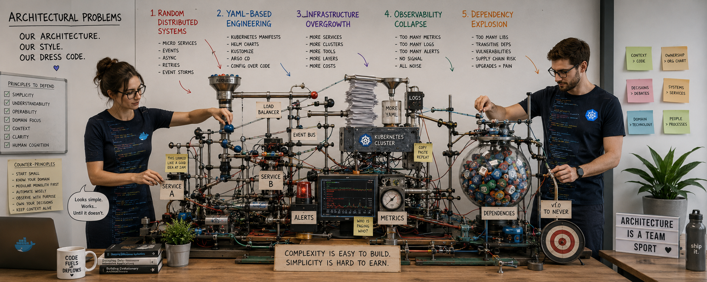

# Underestimated and Annoying, that is "The Dirty Dozen" of Programmers - Part 6: IV. Architecture Problems

_In previous parts 1-5, I introduced the complexities of processes, human involvement, teamwork, and organizational discipline._
_In Part 6, we'll discuss how modern applications are ecosystems, not just collections of interconnected components._ 
_So let's look at how AI can help, how it will lead, and how it will hinder._

Today's computer program is a collection of interdependent processes, data flows, and human interactions, organized within a coherent architecture. 
Complexity management is becoming a key differentiating factor in designing stable and resilient software systems. Let's discuss this.

## The Dirty Dozen of AI-Era Architecture Failure Modes

Architecture problems in the AI era are rarely caused by a single bad technology choice. They emerge when systems evolve faster than understanding, 
governance, and operational capacity. AI accelerates code production, but also accelerates architectural entropy.

The most dangerous architectural problems are not usually catastrophic design mistakes visible on day one.

They are slow-moving structural failures:
- systems that become harder to reason about,
- organisations that lose shared understanding,
- platforms that consume more energy than the product itself,
- and architectures that imperceptibly approach and transcend the human cognitive horizon.

Unlike classical programming mistakes, architectural problems compound over time. They increase operational cost, reduce predictability, slow delivery, and gradually disconnect systems from business reality.

Modern AI-assisted development amplifies this because intricacy can now be generated faster than teams can absorb, validate, or operationalise it.

The following are some of the most underestimated and annoying architecture failure modes in modern software engineering.

## 1. Accidental Distributed Systems

### Definition

A system becomes distributed not because the business requires it, but because teams unconsciously introduce distributed complexity through frameworks, 
cloud-native patterns, AI-generated templates, or organisational fashion.

> [!NOTE]
> 📌 Developers often believe they are building “modern architecture,” while in reality they are constructing a fragile coordination problem.

### Why It Is Dangerous

Distributed systems introduce:
- network failure,
- partial consistency,
- asynchronous timing,
- retry storms,
- observability ramification,
- and coordination overhead.

These are not implementation details. They fundamentally change the nature of software engineering.

### Symptoms

- Multiple microservices for tightly coupled business logic
- Excessive asynchronous communication
- Network calls replacing local function calls
- Transaction boundaries spread across services
- Event storms and retry cascades
- Sagas compensating for artificial fragmentation
- Simple workflows requiring orchestration layers
- Local debugging becoming nearly impossible
- Teams spending more time on infrastructure than business logic

### Root Causes

- Cargo-cult adoption of microservices
- Kubernetes-first thinking
- AI-generated “best practice” architectures
- Premature scalability assumptions
- Organisational mirroring (“one team = one service”)
- Fear of monoliths without understanding modular monoliths

### Consequences

- Increased latency and operational cost
- Exponential debugging complexity
- Hidden consistency failures
- Deployment dependency chains
- Reliability degradation
- Slower feature delivery despite “scalable” architecture

### Core Anti-Pattern

The architecture optimises for hypothetical scale before validating real intricacy.

> [!IMPORTANT]
> ❌ The system becomes distributed before it becomes large.

## 2. YAML-Driven Engineering

### Definition

Infrastructure, deployment, networking, security, observability, and even application behaviour become dominated by declarative configuration files whose complexity exceeds the actual business code.

> [!NOTE]
> 📌 The system stops being software-driven and becomes configuration-driven.

### Why It Is Dangerous

The more layers introduced:
- Helm,
- Kustomize,
- ArgoCD,
- service meshes,
- CRDs,
- operators,
- infrastructure templates,

the less engineers understand actual runtime behaviour.

### Symptoms

- Thousands of lines of YAML for relatively small applications
- Business changes requiring infrastructure edits
- Helm charts nested within Helm charts
- Configuration inheritance nobody fully understands
- Hidden inheritance and environment drift
- Copy-pasted manifests across environments
- Engineers debugging manifests instead of writing software
- Deployment failures caused by indentation or schema mismatch
- AI generating unreadable configuration templates

### Root Causes

- Kubernetes ecosystem complication
- Toolchain layering (Helm, Kustomize, ArgoCD, Istio, Terraform, Crossplane)
- Excessive abstraction over infrastructure
- Infrastructure treated as product rather than support capability
- Platform engineering without simplification discipline

### Consequences

- Configuration drift
- Reduced developer productivity
- Increased onboarding difficulty
- Hidden operational coupling
- Review fatigue
- Infrastructure becoming opaque and unmaintainable

### Core Anti-Pattern

Complexity migrates from code into configuration without becoming simpler.

> [!IMPORTANT]
> ❌ The architecture becomes a document-processing pipeline instead of a software system.

## 3. Infrastructure Overgrowth

### Definition

Infrastructure expands faster than business value, often because modern platforms make adding components easier than removing them.

> [!NOTE]
> 📌 The organisation accumulates operational surface area faster than it accumulates customer value.

### Why It Is Dangerous

Modern infrastructure ecosystems encourage accumulation:
- another broker,
- another cache,
- another gateway,
- another sidecar,
- another observability layer.

> [!WARNING]
> ❗️ Each addition appears rational individually.
> But collectively they create a sprawling, unmanageable system.

### Symptoms

- Excessive numbers of supporting services
- Multiple databases for unclear reasons
- Service mesh for small systems
- Separate queues, caches, brokers, gateways, sidecars, operators, controllers
- More platform engineers than product engineers
- Internal platforms requiring dedicated governance departments
- Infrastructure governance meetings dominating engineering time
- Cloud bills rising without proportional business growth
- Continuous platform maintenance becoming normalised

### Root Causes

- Technology-first decision making
- Vendor ecosystem pressure
- Fear-driven architecture (“we may need this later”)
- Benchmark-driven optimisation
- AI-generated infrastructure recommendations
- Misunderstanding scalability requirements

### Consequences
- Operational costs dominating development costs
- Slower delivery pipelines
- Increased security exposure
- Upgrade paralysis
- Platform dependency lock-in
- Teams spending more time maintaining infrastructure than solving customer problems

### Core Anti-Pattern

The organisation starts serving the platform instead of the customer.

> [!IMPORTANT]
> ❌ The platform becomes more important than the product.

## 4. Observability Collapse

### Definition

The volume of logs, traces, metrics, dashboards, alerts, and telemetry exceeds human comprehension, causing visibility to decrease despite increased instrumentation.
The quantity of telemetry exceeds human interpretability.

> [!NOTE]
> 📌 More observability data paradoxically produces less operational clarity and understanding.

### Why It Is Dangerous

Observability systems frequently evolve into noise-generation systems:
- millions of logs,
- thousands of metrics,
- hundreds of dashboards,
- endless alerts.

The organisation becomes data-rich but insight-poor.

### Symptoms

- Thousands of alerts ignored or silenced
- Dashboards nobody trusts
- Metrics without actionable meaning
- Log floods during incidents
- Incidents requiring tribal knowledge
- Traces too expensive to retain
- Engineers unable to identify root causes quickly
- Monitoring systems generating significant infrastructure cost

> [!WARNING]
> ❗️ AI summarising incidents that nobody fully investigates.

### Root Causes

- Instrument everything mentality
- Lack of observability strategy
- Metrics disconnected from business outcomes
- Distributed systems complexity
- Tool sprawl (Prometheus, Grafana, OpenTelemetry, ELK, Datadog, Jaeger, Tempo, Loki, etc.)
- Alerting designed without operational ownership

### Consequences

- Alert fatigue
- Incident response paralysis
- Longer outages
- Hidden production degradation
- False confidence in platform health
- Increased operational anxiety

### Core Anti-Pattern
> [!IMPORTANT]
> ❌ The system produces more signals than understanding.

## 5. Dependency Explosion

### Definition

Applications become increasingly dependent on external libraries, frameworks, SDKs, services, AI-generated integrations, and transitive packages whose combined complexity exceeds the understanding of the engineering team.

> [!NOTE]
> ✔ The real system is no longer just the codebase — it is the dependency graph.

### Why It Is Dangerous

Modern applications often contain:
- thousands of transitive dependencies,
- multiple frameworks,
- generated SDKs,
- external APIs,
- runtime plugins,
- AI-generated integrations.

The result is systemic fragility.

### Symptoms

- Thousands of transitive packages
- Upgrade paralysis
- Frequent security vulnerability alerts
- Incompatible framework upgrades
- Large startup times and container sizes
- Supply chain risks
- Teams afraid to upgrade dependencies
- Build instability
- Runtime unpredictability
- AI-generated code introducing unnecessary packages

### Root Causes

- Framework maximalism
- Copy-paste development
- Rapid AI-assisted prototyping
- “Do not reinvent the wheel” taken to extremes
- Ecosystem fragmentation
- Convenience-first engineering culture

### Consequences

- Security exposure
- Reduced maintainability
- Version lock-in
- Upgrade paralysis
- Hidden runtime behaviour
- Operational unpredictability

### Core Anti-Pattern

Engineers stop understanding the software stack they operate.

> [!IMPORTANT]
> ❌ The application becomes a temporary assembly of other people’s software.

## 6. Context Fragmentation

### Definition

Loss of coherent system understanding because knowledge becomes distributed across too many tools, prompts, tickets, chats, repos, dashboards, and AI conversations.

> [!NOTE]
> ✔  No single coherent operational understanding exists anymore.

### Why It Is Worse Now

AI systems themselves are context-fragmented:
- limited windows,
- weak long-term memory,
- shallow architectural continuity.

Organisations mirror this fragmentation.

### Why It Is Dangerous

Modern systems increasingly distribute context across:
- Jira,
- Confluence,
- GitHub,
- Slack,
- Teams,
- dashboards,
- runbooks,
- prompts,
- PR comments,
- AI-generated documentation,
- architecture diagrams,
- infrastructure repositories,
- meeting recordings.

Information exists everywhere, but understanding exists nowhere.
Nobody holds the full mental model.

### Symptoms

- Different teams holding contradictory assumptions
- Architecture decisions without traceability
- Engineers repeatedly rediscovering historical constraints
- AI producing outputs inconsistent with system reality
- Incident resolution depending on specific individuals

### Consequences

- Organisational memory decay
- Reduced onboarding effectiveness
- Decision inconsistency
- Architectural incoherence
- Increased operational risk

### Core Anti-Pattern

> [!IMPORTANT]
> ❌ The system becomes too distributed cognitively, not just technically.

## 7. Developmental Drift

### Definition

The implemented system gradually diverges from:
- its original architecture,
- business intent,
- conceptual boundaries,
- operational assumptions,
- what the system actually needs,
- and what the process naturally produces.

The system evolves continuously but without coherent direction.

### Why It Happens

AI strongly biases toward:
- common patterns,
- template architectures,
- familiar frameworks,
- cargo-cult solutions.

Process starts optimising for:
- generation convenience,
- tooling compatibility,
- platform standardisation.

Instead of:
- operational fit,
- business constraints,
- simplicity.

### Why It Is Dangerous

AI acceleration worsens developmental drift because:
- code generation increases delivery speed,
- local optimisations accumulate rapidly,
- architectural review cannot keep pace,
- and generated changes often lack long-term structural awareness.

The system changes faster than its conceptual model evolves.

### Symptoms

- Inconsistent patterns across services
- Multiple architectural styles coexisting chaotically
- Duplicate capabilities implemented differently
- Business rules scattered across layers
- “Temporary” workarounds becoming permanent
- Kubernetes everywhere.
- Microservices without scale requirements.
- YAML overgrowth.
- Excessive abstraction layers.
- Platform-first instead of domain-first engineering.
- Infrastructure becoming more important than product logic.

### The Hidden Cost

Development drift creates:
- accidental distributed systems,
- dependency explosion,
- observability overload,
- rising cognitive load.

### Consequences
- Architectural entropy
- Increased maintenance cost
- Loss of conceptual integrity
- Growing onboarding difficulty
- Reduced predictability of future changes

### Counter-Principles

- Architecture reviews before implementation.
- Operational cost analysis.
- Simplicity as a KPI.
- Runtime-first thinking.
- Domain-first design.

### Core Anti-Pattern

> [!IMPORTANT]
> ❌ The software evolves continuously, but in no coherent direction.

## 8. Cognitive Load Saturation

_Although it emerges from all previous problems, cognitive load saturation deserves special attention._

### Definition

The gradual exhaustion of human reasoning capacity caused by excessive system complexity, process overhead, context switching, and artifact volume.

The architecture exceeds the human cognitive capacity required to:
- understand,
- debug,
- reason about,
- and safely evolve the system.

This is the true scaling limit of most organisations.
- Not CPU.
- Not memory.
- Not Kubernetes nodes.

> [!NOTE]
> ✔  The scaling limit is human cognition.

_This is probably the least discussed and most important SDLC problem._

### Why It Matters

Software engineering is fundamentally:
- a cognitive activity,
- not a typing activity.

AI optimises typing.
It does not eliminate cognitive limits.

### Symptoms

- Engineers afraid to modify systems.
- Engineers constantly context switching.
- Excessive reliance on tribal knowledge.
- Long onboarding periods.
- Large dependency graphs nobody understands.
- Fatigue from reviewing generated artifacts.
- Architectural decisions deferred indefinitely.
- Increased dependency on AI explanations.
- Reduced deep work.
- Review quality degradation.
- Slower debugging.
- Operational paralysis during incidents.
- Architectural confusion.

### The Dangerous Illusion

> [!NOTE]
> ✔  Organisations often assume that “more automation reduces cognitive load”.

Often the opposite happens.

Automation frequently:
- increases system surface area,
- increases hidden interactions,
- increases operational ambiguity.

### Result

Teams become:
- slower despite more tooling,
- less confident,
- more reactive,
- dependent on rituals instead of understanding.

### Counter-Principles

- Reduce moving parts.
- Reduce dependencies.
- Prefer modular monoliths where possible.
- Protect deep work time.
- Optimise for comprehensibility.
- Design for operability.
- Reduce process churn.

### Why AI Makes This Worse

AI reduces the cost of generating:
- code,
- services,
- abstractions,
- configurations,
- integrations,
- and infrastructure.

But it does not proportionally reduce:
- comprehension cost,
- debugging intricacy,
- operational reasoning,
- or architectural coherence management.

### Core Anti-Pattern

This creates a dangerous asymmetry:
> [!IMPORTANT]
> ❌ Complexity scales faster than understanding.

### The Deeper Pattern - The Meta-Problem

These architecture problems are rarely independent.

They reinforce one another:
- Accidental distributed systems increase observability intricacy.
- YAML-driven engineering accelerates infrastructure overgrowth.
- Infrastructure overgrowth amplifies dependency explosion.
- Dependency explosion increases operational unpredictability.
- Observability collapse hides the consequences of all previous failures.

AI intensifies these feedback loops because it dramatically lowers the cost of generating architectural intricacy 
while doing relatively little to reduce the cost of understanding it.

The result is a dangerous asymmetry:
> [!WARNING]
> ❗️ Complication is now cheap to create, but still extremely expensive to comprehend, operate, and maintain.

## 9. Ownership Diffusion

### Definition

Ownership diffusion occurs when no individual, team, or organisational unit fully understands, controls, 
or accepts responsibility for the behaviour of the system as a whole.

Responsibility becomes fragmented across:
- platform teams,
- infrastructure teams,
- security teams,
- cloud providers,
- framework vendors,
- AI-generated components,
- external SaaS dependencies,
- and microservice boundaries.

The result is a system that is technically operational, but organisationally ownerless.

> [!NOTE]
> 📌 Modern systems increasingly have many contributors, but no true owners.

### Why It Is Dangerous

Classical software systems usually had relatively clear ownership:
- one application,
- one deployment pipeline,
- one database,
- one operational team.

Modern architectures often distribute responsibility across dozens of layers:
- Kubernetes,
- CI/CD pipelines,
- service meshes,
- observability platforms,
- platform engineering teams,
- cloud-native tooling,
- AI-generated infrastructure,
- external APIs,
- and multiple autonomous teams.

Each layer appears locally manageable, but globally:
- architectural ownership disappears,
- runtime behaviour becomes emergent,
- accountability becomes ambiguous, 
- and operational responsibility becomes diluted, blurred.

When incidents occur, organisations increasingly struggle to answer:
- Who owns this behaviour?
- Who understands the entire execution path?
- Who is responsible for reliability?
- Who can safely change the system?
- Who approves architectural intricacy?
- Who understands the operational consequences?

> [!WARNING]
> ❗️ The answer is often: **“Everyone partially”**. 
> Which operationally means: **“Nobody completely”**.

### Why AI Makes This Worse

AI accelerates ownership diffusion because:
- generated code obscures authorship,
- generated infrastructure obscures intent,
- AI-assisted development reduces architectural continuity,
- teams accept generated solutions without fully understanding them,
- and velocity pressures encourage local optimisation over systemic ownership.

AI systems themselves introduce unclear accountability:
- Was the issue introduced by the engineer?
- The prompt?
- The model?
- The framework?
- The generated template?
- The platform abstraction?

The more generation pipelines exist, the harder ownership becomes to trace.

> [!WARNING]
> ❗️ AI can generate implementation faster than organisations can generate accountability.

### Connection to Conway’s Law

> [!NOTE]
> 📌 [Conway's Law](https://www.linkedin.com/pulse/agile-vibe-coding-conways-law-marek-kubis-m0wpe) 
> has been cited many times by me as a fundamental principle of software architecture:
> _systems mirror the communication structures of the organisations that build them._

Ownership diffusion is often Conway’s Law operating at organisational scale.
Therefore, when discussing problems with building program architecture, it is impossible not to mention it.

When organisations fragment into:
- platform teams,
- infrastructure teams,
- product teams,
- DevOps teams,
- observability teams,
- AI governance teams,
- cloud teams,
- architecture committees,

their systems naturally mirror those fragmented responsibility boundaries.

The architecture becomes:
- organisationally partitioned,
- cognitively fragmented,
- and operationally incoherent.

Instead of:
- cohesive systems with clear ownership,

organisations create:
- distributed negotiation systems.

### Connection to Platform Engineering

Platform engineering often begins with good intentions:
- reducing duplication,
- improving standardisation,
- enabling developer productivity,
- centralising operational expertise.

But without strong simplification discipline, platforms can unintentionally weaken ownership.

Application teams increasingly depend on:
- internal platforms,
- templates,
- deployment abstractions,
- shared infrastructure,
- generated pipelines,
- organisational guardrails.

Over time:
- teams lose direct operational understanding,
- runtime behaviour becomes abstracted away,
- and developers stop understanding the infrastructure beneath their applications.

The platform becomes responsible for “everything underneath”.

But the application teams still own delivery outcomes.

This creates a dangerous accountability mismatch:
- responsibility remains local,
- but control becomes centralised elsewhere.

> [!IMPORTANT]
> ❌ Teams become responsible for systems they no longer fully control.

### Connection to Organisational Entropy

Ownership diffusion is also a form of organisational entropy.

As organisations scale:
- communication paths multiply,
- governance layers accumulate,
- approval systems expand,
- operational boundaries blur,
- and architectural authority weakens.

Over time:
- nobody fully understands the system,
- decisions become local rather than systemic,
- and architectural coherence degrades gradually.

The organisation starts optimising for:
- coordination,
- governance,
- process routing,
- and dependency management,

instead of:
- clarity,
- simplicity,
- and ownership.

This creates:
- slower decision making,
- incident escalation chains,
- operational confusion,
- and institutional dependency on tribal knowledge.

### Connection to Microservices

Microservices frequently amplify ownership diffusion.

In theory:
- **“you build it, you run it”**
creates clear ownership.

In practice:
- services share infrastructure,
- APIs depend on multiple teams,
- failures propagate asynchronously,
- observability is fragmented,
- and runtime behaviour spans many systems.

A single customer request may traverse:
- gateways,
- service meshes,
- queues,
- caches,
- authentication systems,
- orchestration layers,
- external APIs,
- AI services,
- and dozens of microservices.

No individual engineer can realistically reason about the full execution path.

The result:
- distributed systems become distributed accountability systems.

### Symptoms
- unclear incident ownership,
- nobody understands full runtime behaviour.
- Incidents escalate across multiple teams.
- Root cause analysis requires cross-organisational coordination.
- Teams blame tooling, platforms, or vendors.
- Developers avoid modifying critical systems.
- Platform abstractions become “magic.”
- Operational responsibility becomes unclear.
- Architectural decisions lack ownership.
- AI-generated changes have unclear accountability.
- Engineers inherit systems nobody originally designed coherently.

### Consequences

- Operational paralysis
- Slow incident response
- Reduced reliability
- Organisational blame-shifting
- Architectural incoherence
- Increased cognitive load
- Loss of engineering autonomy
- Institutional fragility
- Dependency on key individuals
- Reduced long-term maintainability

###	The Deeper Problem

Ownership diffusion is fundamentally:
- a systems thinking problem,
- not merely a tooling problem.

Modern engineering increasingly optimises for:
- scalability,
- autonomy,
- acceleration,
- abstraction,
- and platform reuse.

But systems remain constrained by:
- human coordination,
- cognitive limits,
- operational understanding,
- and accountability structures.

Distributed systems distribute:
- computation,
- data,
- failure,
- and increasingly:
- responsibility itself.

### Counter-Principles

- Clear runtime ownership boundaries.
- Smaller operational surfaces.
- Domain-aligned architectures.
- Fewer organisational handoffs.
- Simpler deployment paths.
- Explicit architectural accountability.
- Runtime visibility owned by delivery teams.
- Platform engineering focused on simplification, not abstraction proliferation.
- “You build it, you understand it.”
- Human ownership preserved even in AI-assisted systems.

###	Core Anti-Pattern

> [!IMPORTANT]
> ❌ The system becomes operationally critical, but organisationally ownerless.

## Take away

These architectural failures share a common root cause:
- the industrialisation of software complexity.

Most modern architectural failure modes emerge when:
- scalability assumptions replace validated requirements,
- abstraction replaces understanding,
- tooling replaces engineering judgment,
- operational convenience for platforms overrides product simplicity,
- and generated dependencies exceed human cognitive limits.

In summary, modern ecosystems optimise heavily for:
- generation,
- scalability,
- abstraction,
- automation,
- and deployment velocity.

But they often underinvest in:
- comprehensibility,
- conceptual integrity,
- operational simplicity,
- and human cognitive sustainability.

The result is predictable:
> [!IMPORTANT]
> 📌 Systems become operationally larger than the organisations capable of understanding them.

The problem is not cloud-native architecture itself.
> [!IMPORTANT]
> 📌 The problem is architecture without proportional necessity, ownership, operational maturity, and simplification discipline.

**That is the defining architectural risk of the AI era.**

_...tbc..._

## See also:
- [Underestimated and Annoying, or the "Dirty Dozen" of Programmers - Part 1: the problem space](https://www.linkedin.com/pulse/underestimated-annoying-dirty-dozen-programmers-marek-kubis-mcfxe)
- [Underestimated and Annoying, that is "The Dirty Dozen" of Programmers - Part 2: AI-Generated Software](https://www.linkedin.com/pulse/underestimated-annoying-dirty-dozen-programmers-part-2-marek-kubis-tqkme/)
- [Underestimated and Annoying, that is "The Dirty Dozen" of Programmers - Part 3: I. Organizational Problems](https://www.linkedin.com/pulse/underestimated-annoying-dirty-dozen-programmers-part-marek-kubis-h9y3e/)
- [Underestimated and Annoying, that is "The Dirty Dozen" of Programmers - Part 4: II. Human Problems](https://www.linkedin.com/pulse/underestimated-annoying-dirty-dozen-programmers-part-marek-kubis-mn5ve/)
- [Underestimated and Annoying, that is "The Dirty Dozen" of Programmers - Part 5: III. Process Problems](https://www.linkedin.com/pulse/underestimated-annoying-dirty-dozen-vibe-coding-part-marek-kubis-83jre/)

- [Murphy’s law and more in AI time - one by one with examples](https://www.linkedin.com/pulse/murphys-law-more-ai-time-one-examples-marek-kubis-fkaze)
- [The Agile Vibe Coding and Conway's Law](https://www.linkedin.com/pulse/agile-vibe-coding-conways-law-marek-kubis-m0wpe)
- [Using a digital banking solution to prove Conway’s Law in AI-Driven engineering - example 1](https://www.linkedin.com/pulse/using-digital-banking-solution-prove-conways-law-ai-driven-kubis-xqlre/)
- [Using a .NET 10 migration project to prove Conway’s Law in AI-Driven engineering - example 2](https://www.linkedin.com/pulse/using-net-10-migration-project-prove-conways-law-ai-driven-kubis-abqae)

- [Where traditional Agile breaks in AI-driven systems](https://www.linkedin.com/pulse/where-traditional-agile-breaks-ai-driven-systems-marek-kubis-4wq6e/)
- [AI - It seems nobody has it fully figured out yet](https://www.linkedin.com/pulse/ai-nobody-has-figured-out-marek-kubis-bkyge)
- [Internal Development Platform and Agile Vibe Coding](https://www.linkedin.com/pulse/internal-development-platform-agile-vibe-coding-marek-kubis-kyhqe/?trackingId=5w3lWKp%2F0BLUpwNdrSmAcg%3D%3D&lipi=urn%3Ali%3Apage%3Ad_flagship3_pulse_read%3BqH%2FwqbkZRkmo%2Fagtxvqyrw%3D%3D)
- [Everyone will be vibe coders](https://www.linkedin.com/pulse/everyone-vibe-coders-marek-kubis-tlgze)
- [The Structural problems AI introduces into the SDLC](https://www.linkedin.com/pulse/structural-problems-ai-introduces-sdlc-marek-kubis-qyt6e)
- [Signals That Reveal the True Maturity of Organisations Claiming “AI-Driven Development”](https://www.linkedin.com/pulse/signals-reveal-true-maturity-organisations-claiming-ai-driven-kubis-urule)

- [Agile Vibe Coding positioning and if this works, what changes?](https://www.linkedin.com/pulse/agile-vibe-coding-positioning-works-what-changes-marek-kubis-r4ate)
- [Agile Vibe Coding – Ceremony Modes](https://www.linkedin.com/pulse/agile-vibe-coding-ceremony-modes-marek-kubis-meq9e)
- [Agile Vibe Coding ceremonies approach compared to a simple one-prompt-per-task approach](https://www.linkedin.com/pulse/agile-vibe-coding-ceremonies-approach-compared-simple-marek-kubis-ecx5e)
- [Agile Vibe Coding Maturity Model](https://www.linkedin.com/pulse/agile-vibe-coding-maturity-model-marek-kubis-bbtqe)
- [The Agile Vibe Coding - the 4-level adaptive ceremony system](https://www.linkedin.com/pulse/agile-vibe-coding-4-level-adaptive-ceremony-system-marek-kubis-jizke)

- [Agile Vibe Coding Manifesto](https://agilevibecoding.org/)
- [Principles Behind the Agile Vibe Coding Manifesto - extended version](https://github.com/marekartur-dev/agilevibecoding/blob/main/Docs/Home/Principles.md)

- [Agile Vibe Coding](https://www.reddit.com/r/AgileVibeCoding/)
- [Marek Kubis - blog](https://github.com/marekartur-dev/agilevibecoding/tree/main)