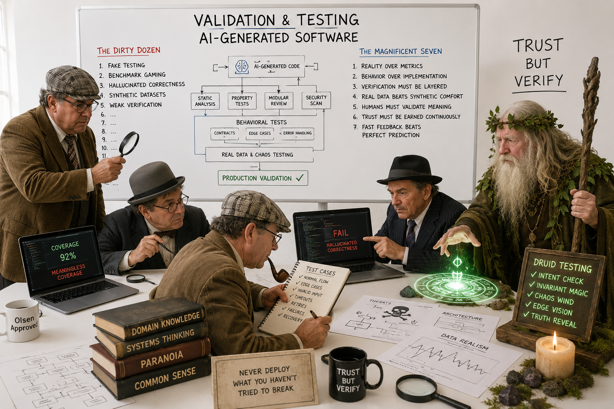

# Underestimated and Annoying, that is "The Dirty Dozen" of Programmers - Part 7: V. Validation Problems



_In previous parts 1–6, we discussed a whole range of problems that can arise in software development, from requirements gathering to design and implementation._
_In this part 7, we will focus on the most underestimated and annoying issues related to validation and testing._

Why? Because validation often creates the illusion of quality, safety, and correctness while silently weakening trust in the system.

## Core Insight

### What Is Validation in the AI Era?

Nowadays, validation itself is increasingly becoming probabilistic, automated, synthetic, and detached from real-world behaviour. 
Systems may appear “green” in dashboards, pass thousands of tests, and satisfy benchmarks — yet still fail catastrophically in production.

> [!NOTE]
> 📌 The “Dirty Dozen” are the destructive patterns that create false confidence, unreliable quality signals, and procedural compliance without substance.

**This category represents the breakdown of assertiveness mechanisms.**

### 1. Fake Testing

**Definition**

Tests exist primarily to satisfy process requirements, dashboards, compliance gates, or coverage targets rather than to validate meaningful behaviour.

**Symptoms**

- Tests verify implementation details instead of business outcomes
- Snapshot tests approve everything automatically
- High coverage with low defect detection
- Copy-paste AI-generated tests nobody understands
- Unit tests mocking the entire world
- Assertions that validate nothing important

**Why It Is Worse Now**

AI can generate thousands of tests extremely quickly:
- superficial tests,
- duplicated tests,
- brittle tests,
- meaningless assertions.

The organisation sees:
- “90% coverage,”
- “all pipelines green,”
- “thousands of tests.”

But the system itself remains weakly validated.

**Result**

> [!WARNING]
> ❗️ Testing becomes validation theatre.

### 2. Benchmark Gaming

**Definition**

Systems are optimised to score well on artificial benchmarks rather than to perform well in real-world environments.

**Symptoms**

- Optimising for demo scenarios
- Cherry-picked performance metrics
- Unrealistic load-testing conditions
- AI models tuned for leaderboard scores
- Ignoring operational complexity and maintainability
- “Fast in benchmark, slow in production”

**Why It Is Worse Now**

AI accelerates benchmark optimisation:
- code generated specifically for metrics,
- architectures selected for popularity,
- synthetic evaluation pipelines,
- overfitting to test harnesses.

The benchmark becomes the target rather than the measurement.

**Result**

> [!WARNING]
> ❗️ The organisation confuses benchmark success with operational success.

### 3. Hallucinated Correctness

**Definition**

Outputs appear plausible, structured, professional, and internally coherent while being incorrect, incomplete, or fundamentally invalid.

**Symptoms**

- AI-generated source code “looks right”
- Confident but wrong architectural recommendations
- Fabricated APIs, methods, libraries, or configurations
- Incorrect assumptions hidden behind polished explanations
- False confidence during reviews

**Why It Is Worse Now**

Humans are highly vulnerable to:
- polished language,
- confident formatting,
- syntactic correctness.

AI systems produce convincing artefacts at industrial scale.

This creates:
- automation bias,
- reviewer fatigue,
- validation scarcity,
- lowered scepticism thresholds.

**Result**

> [!WARNING]
> ❗️ Correctness becomes aesthetic rather than factual.

### 4. Synthetic Datasets

**Definition**

Validation relies excessively on generated, artificial, simplified, or self-referential datasets that fail to represent real-world complexity.

**Symptoms**

- AI-generated test data validating AI-generated systems
- Missing edge cases
- Unrealistic traffic patterns
- Sanitised business scenarios
- No adversarial inputs
- Lack of production entropy

**Why It Is Worse Now**

Synthetic data is:
- cheap,
- scalable,
- privacy-friendly,
- easy to automate.

But real systems fail because of:
- messy human behaviour,
- inconsistent workflows,
- unexpected integrations,
- operational chaos,
- incomplete context.

**Result**

> [!WARNING]
> ❗️ The system becomes validated against fiction rather than reality.

### 5. Weak Verification

**Definition**

Verification mechanisms are too shallow, too automated, too overloaded, or too disconnected from domain understanding to detect critical failures.

**Symptoms**

- Reviewers approving changes they do not understand
- AI reviewing AI-generated source code
- Security scanning without threat modelling
- “LGTM” culture
- Automated approvals replacing reasoning
- No domain-level validation


**Why It Is Worse Now**

> [!WARNING]
> ❗️ The Core Asymmetry. 

AI generates:
- code,
- tests,
- infrastructure,
- pipelines,
- documents.

Humans must still:
- validate assumptions,
- detect edge cases,
- understand interactions,
- assess operational risk.

Modern systems exceed human cognitive limits:
- too many services,
- too many pipelines,
- too much generated code,
- too many dependencies,
- too much deployment velocity.

> [!NOTE]
> 📌 Verification capacity does not scale linearly with generation capacity.

**Result**

> [!WARNING]
> ❗️ Errors propagate faster than organisations can detect them.

### Why Validation Problems Are Underestimated

Validation is often treated as:
- a QA activity,
- a compliance requirement,
- a pipeline stage,
- a tooling problem.

But in reality, validation is:
- an epistemology problem,
- a trust problem,
- a systems reliability problem,
- a governance problem.

The AI era dramatically increases:
- output volume,
- change velocity,
- artefact complexity,
- cognitive overload.

> [!NOTE]
> 📌 This means weak validation compounds exponentially.

### Why Validation Problems Are Annoying

They are annoying because:
- they waste a huge amount of engineering effort,
- they create exhausting and low-value PR review cycles,
- they make debugging significantly more difficult,
- they generate test suites that no one trusts,
- they require "Looks Good To Me, LGTM" approval,
- they generate tests that verify generated bugs,
- they delay the detection of actual bugs,
- they cause security review overload,
- they have observability gaps,
- they hide failures,
- they create false trust,
- they undermine trust between teams,
- they generate political metrics instead of operational truth,
- they generate endless "green but broken" systems.

> [!NOTE]
> 📌 The most frustrating aspect is that:
> the organisation often believes quality is improving while reliability is actually collapsing.
> 
> Organisations think: “automation increased quality.”
> But often: automation increased unvalidated change volume.

## Operational Reality — Principles That Counter Validation Collapse

### 1. Reality Over Metrics

A production incident teaches more than a thousand vanity benchmarks.

Measure:
- operational outcomes,
- customer impact,
- recovery capability,
- defect escape rates,
- system resilience.

Not just:
- coverage,
- benchmark scores,
- pipeline greenness.

### 2. Behaviour Over Implementation

Tests should validate:
- business behaviour,
- contracts,
- invariants,
- workflows,
- failure handling.

Not internal implementation details.

### 3. Verification Must Be Layered

Reliable systems require multiple independent verification layers:
- automated tests,
- property-based testing,
- observability,
- chaos testing,
- domain reviews,
- production telemetry,
- human reasoning.

> [!NOTE]
> 📌 No single mechanism is sufficient.

### 4.Traceability Over Convenience

AI-generated systems require strong traceability between:
- prompts,
- requirements,
- generated artefacts,
- tests,
- deployment decisions,
- runtime behaviour.

Without traceability:
- responsibility diffuses,
- debugging becomes forensic archaeology,
- governance collapses.

### 5. Real Data Beats Synthetic Comfort

Synthetic datasets are useful, but production-like reality is irreplaceable.

Validation must include:
- messy inputs,
- adversarial scenarios,
- operational failures,
- incomplete information,
- integration chaos.

### 6. Humans Must Validate Meaning

AI can assist verification, but humans must validate:
- intent,
- correctness,
- domain semantics,
- architectural consequences,
- risk trade-offs.

> [!NOTE]
> 📌 Syntax is not understanding.

### 7. Trust Must Be Earned Continuously

Confidence is not binary.

Validation should continuously reassess:
- assumptions,
- dependencies,
- performance,
- security,
- operational behaviour,
- architectural drift.

### 8. Fast Feedback Beats Perfect Prediction

The goal is not to predict every failure.

The goal is to:
- detect failures early,
- contain blast radius,
- recover quickly,
- learn continuously.

> [!NOTE]
> 📌 Resilience matters more than validation perfection.


## Architectural Implication

### The future of testing and QA

> [!IMPORTANT]
> ❌ The old model: **“developers build → QA tests → operations deploy”** is collapsing.

The new reality requires:
- continuous validation,
- production observability,
- operational feedback loops,
- business telemetry,
- infrastructure verification,
- customer signal integration.

> [!NOTE]
> 📌 The future QA organisation is no longer a “testing department”.

> [!WARNING]
> ❗️ It becomes a: **System Reliability & Validation Organisation**
> 
> or: **Continuous Verification Organisation**.

### Runtime Governance

Modern validation increasingly depends on runtime control mechanisms:
- feature flags,
- canary deployments,
- rollback automation,
- kill switches,
- progressive exposure,
- AI capability gating.

These mechanisms allow organisations to:
- reduce blast radius,
- validate behaviour incrementally,
- contain uncertainty,
- react faster than traditional release cycles allow.

> [!NOTE]
> 📌  In the AI era, governance increasingly moves from static approval toward dynamic runtime control.

### Why Traditional QA Breaks

Old QA validated:
- source code correctness.

New QA must validate:
- system behaviour,
- production reality,
- operational safety,
- business workflows,
- AI behaviour,
- infrastructure interactions,
- resilience,
- customer experience.

> [!NOTE]
> 📌 The centre of gravity moves from pre-release testing
> to continuous production validation.

Traditional QA assumes:
- releases are infrequent,
- requirements are stable,
- systems are deterministic,
- environments are controlled,
- humans are the authors of most programs.

None of this is fully true anymore.

Modern systems are:
- continuously deployed,
- partially AI-generated,
- infrastructure-defined,
- distributed,
- dynamically configured,
- feature-flagged,
- operationally emergent.

> [!IMPORTANT]
> 📌 This means **production itself becomes part of the validation environment**.

### The New Organisational Shape

Not a pyramid. Not even a classic diamond.

> [!IMPORTANT]
> 📌 The new organisational structure is more like **A Validation Mesh** with multiple feedback loops.

But structurally, the closest organisational analogy is:
- **The Operational Diamond**
- because the middle layers expand massively.

**Traditional Structure**
```
               CTO
                |
         Engineering Managers
                |
   Developers --- QA --- Ops
                |
             Customers
```

Problems:
- siloed ownership,
- delayed feedback,
- QA bottlenecks,
- weak production visibility,
- infrastructure disconnected from business validation.

**AI-Era Continuous Validation Organisation**
```
                     Strategy
                 Product / Business
                         |
          --------------------------------
          |                              |
  Business Services             Infrastructure Platform
          |                              |
          --------------------------------
                         |
              Continuous Validation
         (QA + SRE + Observability + AI Governance)
                         |
      ------------------------------------------------
      |                    |                         |
 Application Teams   Production Intelligence   Customer Signals
      |                    |                         |
      ------------------------------------------------
                         |
                     Operations
```

### Key Organisational Change

> [!NOTE]
> 📌 QA is no longer below development.

QA becomes:
- horizontal,
- embedded,
- operational,
- telemetry-driven,
- production-connected.

QA evolves into:
- Validation Engineering,
- Reliability Engineering,
- Quality Intelligence,
- Continuous Verification.

## Organisational Consequence

> [!IMPORTANT]
> 📌 The recommended team structure should evolve.

### 1. Business Services Team

**Responsibility**

Own:
- business workflows,
- customer journeys,
- domain validation,
- SLAs/SLOs from business perspective,
- process correctness,
- compliance,
- operational semantics.

**They Validate**

- Does the workflow make sense?
- Does the AI produce acceptable outcomes?
- Are business invariants preserved?
- Is customer behaviour understood?
- Are operational metrics aligned with reality?

**They Own**

- business telemetry,
- customer feedback analysis,
- incident business impact,
- domain-level validation rules.

### 2. Infrastructure Platform Team

**Responsibility**

Own:
- cloud platform,
- Kubernetes/platform runtime,
- deployment pipelines,
- observability stack,
- service mesh,
- security platform,
- CI/CD governance,
- reliability tooling.

**They Validate**

- Can the platform safely absorb change?
- Is deployment safe?
- Are dependencies observable?
- Is rollback possible?
- Is resilience measurable?

**They Own**

- infrastructure reliability,
- deployment safety,
- operational tooling,
- production observability,
- runtime governance.

### 3. Continuous Validation Team (New QA)

> [!IMPORTANT]
> 📌 This is the critical transformation.

QA evolves into a hybrid organisation combining:
- QA,
- SRE,
- Observability,
- Chaos Engineering,
- AI Verification,
- Production Analysis,
- Release Intelligence.

### Responsibilities of the New QA

**Not Just:**
- manual testing,
- regression testing.

**But:**
- production verification,
- synthetic monitoring,
- behavioural anomaly detection,
- AI output validation,
- release risk analysis,
- operational verification,
- customer signal analysis,
- chaos testing,
- telemetry validation,
- canary analysis,
- blast-radius analysis.


## Production Validation Workflow

### Old Model
```
Dev -> QA -> Release
```

### New Model
```
Dev
 ↓
Continuous Automated Validation
 ↓
Canary / Feature Flag Deployment
 ↓
Production Telemetry Analysis
 ↓
Customer Behaviour Validation
 ↓
Incident Feedback
 ↓
Learning Loop
 ↓
Architecture & Platform Improvements
```

### Customer Feedback Flow

> [!IMPORTANT]
> 📌 This becomes one of the most important loops.

### Recommended Customer Feedback Pipeline
```
Customers
   ↓
Support / Telemetry / UX Analytics
   ↓
Production Intelligence Team
   ↓
Continuous Validation Team
   ↓
Application Teams
   ↓
Platform / Infrastructure Improvements
```

### Production Bugs in the AI Era

Production bugs must no longer be treated as:
- isolated coding mistakes.

They are often:
- systemic failures,
- architectural failures,
- observability failures,
- AI-generation failures,
- governance failures,
- platform interaction failures.

Therefore bug analysis must become multidisciplinary.

### Recommended Incident Structure

> [!WARNING]
> ❗️ Every significant incident should involve:

**Application Team**
- feature behaviour,
- logic correctness.

**Validation Team**
- why verification failed.

**Infrastructure Team**
- runtime/platform contribution.

**Business Services**
- business impact analysis.


## The Most Important Shift

### Observability Becomes QA

> [!NOTE]
> 📌 This is probably the biggest mental transformation.

Traditional QA:
- validates before release.

Modern QA:
- continuously validates reality itself.

This includes:
- logs,
- traces,
- metrics,
- customer behaviour,
- AI outputs,
- operational anomalies,
- business KPI drift,
- feature usage patterns.

### AI Changes QA Economics

AI will:
- generate code faster,
- generate tests faster,
- generate infrastructure faster.

But verification complexity grows faster than generation speed.

> [!WARNING]
> ❗️ This creates **the validation bottleneck**

Eventually organisations discover:
- source code generation is cheap,
- trustworthy verification is expensive.

> [!NOTE]
> 📌 This is likely one of the defining organisational problems of the next decade.

### Recommended High-Level Model

**Infrastructure Team**

Provides:
- reliability platform,
- deployment platform,
- observability platform,
- operational governance.

**Business Services Team**

Provides:
- domain understanding,
- customer reality,
- operational semantics,
- business validation.

**Validation Organisation**

Bridges:
- engineering,
- operations,
- AI governance,
- observability,
- customer behaviour,
- production reality.

## Takeaways

> [!NOTE]
> 📌 The AI era does not eliminate the need for validation.

### Counter-Principles
- Smaller batches.
- Strong runtime telemetry.
- Architectural verification.
- Mutation testing.
- Chaos testing.
- Contract testing.
- Explicit uncertainty tracking.

### The Emerging Organisational Principle

In the AI era:
- **“Infrastructure is now architecture”**.

But also:
- **“Observability is now validation”**.

And increasingly:
- **“Production is now the primary testing environment”**.

That does not mean: 
- **“test in production recklessly”**.

It means: 
- **production telemetry becomes the ultimate source of truth about system correctness**.


AI massively increases the importance of validation and verification.

Because when software generation becomes cheap, false confidence becomes the new technical debt.

The inability of organisations to scale verification at the same speed as generation may become one of the defining engineering constraints of the AI era.

_...tbc..._

## See also:
- [Underestimated and Annoying, or the "Dirty Dozen" of Programmers - Part 1: The Problem Space](https://www.linkedin.com/pulse/underestimated-annoying-dirty-dozen-programmers-marek-kubis-mcfxe)
- [Underestimated and Annoying, that is "The Dirty Dozen" of Programmers - Part 2: AI-Generated Software](https://www.linkedin.com/pulse/underestimated-annoying-dirty-dozen-programmers-part-2-marek-kubis-tqkme/)
- [Underestimated and Annoying, that is "The Dirty Dozen" of Programmers - Part 3: I. Organizational Problems](https://www.linkedin.com/pulse/underestimated-annoying-dirty-dozen-programmers-part-marek-kubis-h9y3e/)
- [Underestimated and Annoying, that is "The Dirty Dozen" of Programmers - Part 4: II. Human Problems](https://www.linkedin.com/pulse/underestimated-annoying-dirty-dozen-programmers-part-marek-kubis-mn5ve/)
- [Underestimated and Annoying, that is "The Dirty Dozen" of Programmers - Part 5: III. Process Problems](https://www.linkedin.com/pulse/underestimated-annoying-dirty-dozen-vibe-coding-part-marek-kubis-83jre/)
- [Underestimated and Annoying, that is "The Dirty Dozen" of Programmers - Part 6: IV. Architecture Problems](https://www.linkedin.com/pulse/underestimated-annoying-dirty-dozen-programmers-part-marek-kubis-remze/)

- [Murphy’s law and more in AI time - one by one with examples](https://www.linkedin.com/pulse/murphys-law-more-ai-time-one-examples-marek-kubis-fkaze)
- [The Agile Vibe Coding and Conway's Law](https://www.linkedin.com/pulse/agile-vibe-coding-conways-law-marek-kubis-m0wpe)
- [Using a digital banking solution to prove Conway’s Law in AI-Driven engineering - example 1](https://www.linkedin.com/pulse/using-digital-banking-solution-prove-conways-law-ai-driven-kubis-xqlre/)
- [Using a .NET 10 migration project to prove Conway’s Law in AI-Driven engineering - example 2](https://www.linkedin.com/pulse/using-net-10-migration-project-prove-conways-law-ai-driven-kubis-abqae)

- [Where traditional Agile breaks in AI-driven systems](https://www.linkedin.com/pulse/where-traditional-agile-breaks-ai-driven-systems-marek-kubis-4wq6e/)
- [AI - It seems nobody has it fully figured out yet](https://www.linkedin.com/pulse/ai-nobody-has-figured-out-marek-kubis-bkyge)
- [Internal Development Platform and Agile Vibe Coding](https://www.linkedin.com/pulse/internal-development-platform-agile-vibe-coding-marek-kubis-kyhqe/?trackingId=5w3lWKp%2F0BLUpwNdrSmAcg%3D%3D&lipi=urn%3Ali%3Apage%3Ad_flagship3_pulse_read%3BqH%2FwqbkZRkmo%2Fagtxvqyrw%3D%3D)
- [Everyone will be vibe coders](https://www.linkedin.com/pulse/everyone-vibe-coders-marek-kubis-tlgze)
- [The Structural problems AI introduces into the SDLC](https://www.linkedin.com/pulse/structural-problems-ai-introduces-sdlc-marek-kubis-qyt6e)
- [Signals That Reveal the True Maturity of Organisations Claiming “AI-Driven Development”](https://www.linkedin.com/pulse/signals-reveal-true-maturity-organisations-claiming-ai-driven-kubis-urule)

- [Agile Vibe Coding positioning and if this works, what changes?](https://www.linkedin.com/pulse/agile-vibe-coding-positioning-works-what-changes-marek-kubis-r4ate)
- [Agile Vibe Coding – Ceremony Modes](https://www.linkedin.com/pulse/agile-vibe-coding-ceremony-modes-marek-kubis-meq9e)
- [Agile Vibe Coding ceremonies approach compared to a simple one-prompt-per-task approach](https://www.linkedin.com/pulse/agile-vibe-coding-ceremonies-approach-compared-simple-marek-kubis-ecx5e)
- [Agile Vibe Coding Maturity Model](https://www.linkedin.com/pulse/agile-vibe-coding-maturity-model-marek-kubis-bbtqe)
- [The Agile Vibe Coding - the 4-level adaptive ceremony system](https://www.linkedin.com/pulse/agile-vibe-coding-4-level-adaptive-ceremony-system-marek-kubis-jizke)

- [Agile Vibe Coding Manifesto](https://agilevibecoding.org/)
- [Principles Behind the Agile Vibe Coding Manifesto - extended version](https://github.com/marekartur-dev/agilevibecoding/blob/main/Docs/Home/Principles.md)

- [Agile Vibe Coding](https://www.reddit.com/r/AgileVibeCoding/)
- [Marek Kubis - blog](https://github.com/marekartur-dev/agilevibecoding/tree/main)