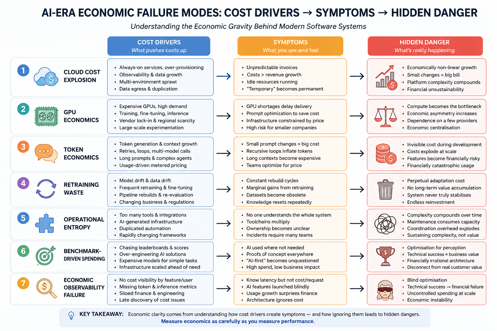

# Underestimated and Annoying, that is "The Dirty Dozen" of Programmers - Part 8: VI. Economic Problems

_In previous parts we explored programming, organisational, human, process, architecture, and validation failure modes in the AI era._
_This part focuses on something many teams still underestimate:_
_- AI systems do not only generate code._
_- They generate economic gravity._

> **ECONOMIC CHALLENGES**

## The Dirty Dozen of AI-Era Economic Failure Modes

The uncomfortable reality is that many modern engineering organisations are quietly transforming software problems into continuous financial liabilities:
- infrastructure bills,
- inference costs,
- GPU scarcity,
- platform sprawl,
- retraining cycles,
- operational inefficiency,
- and permanent cost accumulation.

Traditional software often had a relatively stable economic model:
- build,
- deploy,
- maintain,
- scale gradually.

AI-era systems increasingly behave like:
- continuously rented intelligence,
- permanently running infrastructure,
- probabilistic compute consumption,
- and operationally compounding systems.

Many teams optimise for:
- demo velocity,
- benchmark performance,
- or feature quantity,

while underestimating:
- long-term operational economics,
- cost predictability,
- sustainability,
- and organisational survivability.

## 1. Cloud Cost Explosion

### Definition

Cloud-native and AI-driven architectures frequently create infrastructure costs that grow faster than delivered business value.

### Why It Is Worse Now

AI systems amplify cloud consumption through:
- always-on inference,
- vector databases,
- orchestration layers,
- observability pipelines,
- distributed services,
- GPU workloads,
- excessive data movement,
- and duplicated environments.

Modern systems often accumulate:
- Kubernetes clusters,
- service meshes,
- managed databases,
- queues,
- caches,
- telemetry stacks,
- AI gateways,
- and multiple staging environments.

The result is frequently:
- operational convenience replacing economic discipline.

### Symptoms

- Cloud invoices become unpredictable.
- Infrastructure costs scale faster than revenue.
- Teams avoid discussing hosting costs.
- “Temporary” environments become permanent.
- Idle systems consume significant resources.
- FinOps becomes reactive instead of strategic.

### The Hidden Danger

Many AI-era architectures are economically non-linear:
- small traffic increases create disproportionate cost increases,
- inference costs scale with usage,
- observability pipelines generate hidden storage costs,
- and platform complexity compounds operational spending.

A technically successful system can still become:
- economically unsustainable.

## 2. GPU Economics

### Definition

AI capability increasingly depends on access to scarce and expensive GPU infrastructure.

### Why It Is Worse Now

Modern AI systems require enormous computational resources for:
- training,
- fine-tuning,
- inference,
- embeddings,
- ranking,
- and multimodal processing.

GPU infrastructure introduces:
- high capital costs,
- vendor dependency,
- regional scarcity,
- and operational concentration risks.

### Symptoms

- GPU availability becomes a delivery bottleneck.
- Teams optimise prompts to reduce compute costs.
- Infrastructure decisions become constrained by hardware pricing.
- Smaller companies cannot compete economically.
- Model experiments become financially risky.

### The Hidden Danger

Engineering decisions increasingly become:
- compute-budget decisions.

This creates a new economic asymmetry:
- organisations with infrastructure scale gain disproportionate advantages,
- while smaller teams may become permanently dependent on external providers.

The result is not merely technical centralisation, but:
- economic centralisation.

## 3. Token Economics

### Definition

LLM-based systems transform software execution into metered probabilistic consumption.

### Why It Is Worse Now

Traditional software usually scales through:
- CPU,
- memory,
- storage,
- and bandwidth.

AI systems additionally scale through:
- token generation,
- prompt expansion,
- context accumulation,
- retries,
- agent loops,
- and multi-model orchestration.

Every interaction now carries:
- inference cost.

### Symptoms

- Small prompt changes create major cost differences.
- AI agents accidentally generate recursive token loops.
- Long-context workflows become economically dangerous.
- “Helpful” prompts become expensive prompts.
- Teams optimise prompts primarily for pricing.

### The Hidden Danger

The economics of AI systems can become invisible during development:
- low-volume prototypes appear cheap,
- but production-scale usage multiplies token costs dramatically.

A feature that seems technically trivial may become:
- financially catastrophic at scale.

## 4. Retraining Waste

### Definition

Organisations repeatedly retrain models, pipelines, teams, and workflows without proportional business improvement.

### Why It Is Worse Now

AI systems decay operationally:
- models age,
- datasets drift,
- prompts evolve,
- dependencies change,
- regulations shift,
- and business domains mutate.

This creates pressure for:
- continual retraining,
- continual re-evaluation,
- continual pipeline rebuilding.

### Symptoms

- Teams repeatedly rebuild the same AI pipelines.
- Fine-tuning cycles produce marginal gains.
- Training datasets become obsolete quickly.
- Model upgrades break existing behaviour.
- Organisational knowledge resets every few months.

### The Hidden Danger

Many organisations underestimate the economic cost of:
- perpetual adaptation.

The system never truly stabilises:
- it remains permanently transitional.

This creates:
- endless reinvestment without equivalent long-term accumulation of value.

## 5. Operational Entropy

### Definition

Operational complexity naturally increases over time until the system becomes economically inefficient to maintain.

### Why It Is Worse Now

AI-era platforms accelerate entropy through:
- distributed tooling,
- fragmented ownership,
- AI-generated infrastructure,
- duplicated automation,
- excessive integrations,
- and rapidly changing frameworks.

Every optimisation introduces:
- additional operational surface area.

### Symptoms

- Nobody fully understands the entire system.
- Toolchains multiply continuously.
- Platform ownership becomes unclear.
- Operational incidents require many teams.
- Maintenance costs silently dominate engineering budgets.

### The Hidden Danger

Complexity compounds economically:
- more tooling,
- more specialists,
- more monitoring,
- more integration maintenance,
- and more coordination overhead.

Eventually:
- operational maintenance consumes the majority of engineering capacity.

At this stage, organisations are no longer primarily building products.

They are:
- sustaining accumulated complexity.

## 6. Benchmark-Driven Spending

### Definition

Organisations spend heavily chasing benchmark superiority instead of validated customer value.

### Why It Is Worse Now

The AI industry rewards:
- leader board visibility,
- benchmark scores,
- parameter counts,
- and model prestige.

This encourages:
- optimisation for perception rather than business utility.

### Symptoms

- Expensive models solve simple problems.
- Teams deploy AI where deterministic systems would have been sufficient.
- Infrastructure scales ahead of actual demand.
- “AI-first” becomes financially unquestionable.
- Proof of concept never achieve economic justification.

### The Hidden Danger

Technical ambition can disconnect from:
- economic reality.

A system may be:
- technically impressive,
- architecturally sophisticated,
- and financially irrational simultaneously.

## 7. Economic Observability Failure

### Definition

Organisations measure technical telemetry precisely while poorly understanding the economics of system operation.

### Why It Is Worse Now

Modern engineering teams often monitor:
- latency,
- CPU,
- throughput,
- availability,
- and logs,

but lack equivalent visibility into:
- token costs,
- inference cost per feature,
- marginal user cost,
- GPU utilisation efficiency,
- and economic return on architecture decisions.

### Symptoms

- Teams know latency but not cost-per-request.
- AI features launch without cost forecasting.
- Usage growth creates financial surprises.
- Finance and engineering operate separately.
- Architecture reviews ignore long-term operating cost.

### The Hidden Danger

Without economic observability:
- optimisation becomes blind.

The organisation may unknowingly scale:
- technical success,
- directly into financial instability.

## Summary of Economic Challenges

> **ECONOMIC REALITY**

## Azure vs AWS vs GCP 

### General Cost Characteristics

<table>
<tr>
    <th>Platform</th>
    <th>✅ Typical Strength</th>
    <th>❌ Typical Weakness</th>
    <th>Best Fit</th>
</tr>
<tr>
    <td>Microsoft Azure</td>
    <td>Enterprise integration, Microsoft stack, hybrid cloud</td>
    <td>Complex pricing, expensive networking</td>
    <td>.NET, enterprise, corporate IT</td>
</tr>
<tr>
    <td>Amazon Web Services	</td>
    <td>Mature ecosystem, massive service catalog</td>
    <td>Operational complexity, hidden costs</td>
    <td>Large-scale distributed systems</td>
</tr>
<tr>
    <td>Google Cloud Platform</td>
    <td>AI/ML, Kubernetes, analytics</td>
    <td>Smaller enterprise ecosystem</td>
    <td>Data/AI-heavy workloads</td>
</tr>
</table>

### Approximate Relative Cost Tendencies

_(very simplified)_
<table>
<tr>
    <th>Area</th>
    <th>Azure</th>
    <th>AWS</th>
    <th>GCP</th>
</tr>
<tr>
    <td>Small VM hosting	</td>
    <td>Medium</td>
    <td>Medium</td>
    <td>Often cheaper</td>
</tr>
<tr>
    <td>Kubernetes</td>
    <td>Expensive</td>
    <td>Expensive</td>
    <td>Usually slightly cheaper</td>
</tr>
<tr>
    <td>GPU workloads</td>
    <td>Expensive</td>
    <td>Very expensive</td>
    <td>Often best AI pricing</td>
</tr>
<tr>
    <td>Networking/Egress</td>
    <td>High</td>
    <td>High</td>
    <td>Sometimes lower</td>
</tr>
<tr>
    <td>Managed databases</td>
    <td>Medium-High</td>
    <td>High</td>
    <td>Medium</td>
</tr>
<tr>
    <td>Enterprise licensing</td>
    <td>Strong advantage</td>
    <td>Weak</td>
    <td>Weak</td>
</tr>
<tr>
    <td>AI/LLM integration</td>
    <td>Strong OpenAI ecosystem	</td>
    <td>Strong Bedrock ecosystem</td>
    <td>Strong Gemini ecosystem</td>
</tr>
<tr>
    <td>Operational simplicity</td>
    <td>Medium</td>
    <td>Lower</td>
    <td>Often simpler</td>
</tr>
</table>

## Platforms That People Underestimate

### 1. Cloudflare

Very underestimated economically.

Good for:
- APIs,
- edge computing,
- lightweight services,
- caching,
- security,
- static websites,
- and serverless workloads.

Can replace:
- parts of Kubernetes,
- CDN stacks,
- API gateways,
- and some backend infrastructure.

Excellent for:
- start-ups,
- low-ops systems,
- and global delivery.

### 2. DigitalOcean

Still economically attractive for:
- SMEs,
- monoliths,
- APIs,
- and simpler SaaS platforms.

> [!NOTE]
> 📌 Huge operational simplicity advantage.

### 3. Hetzner

Very popular in Europe for:
- cheap compute,
- predictable pricing,
- and self-managed infrastructure.

Economically difficult for hyper-scalers to compete against for:
- stable workloads,
- predictable traffic,
- non-AI systems.

### 4. Oracle Cloud Infrastructure

Often ignored, but:
- aggressive pricing,
- good networking,
- attractive ARM pricing,
- and decent GPU economics.

> [!NOTE]
> 📌 Sometimes dramatically cheaper for compute-heavy systems.

## The Real Economic Threshold

### When Should You Move from Monolith to Cloud-Native?

**Usually not when:**

- you have 5 developers,
- 5k users,
- one database,
- one region,
- limited traffic,
- and low deployment frequency.

> [!NOTE]
> 📌 A modular monolith is usually economically superior here.

### Cloud-native or distributed architecture starts making sense when you have

**Technical Pressure**

- independent scaling needs,
- high throughput,
- multiple teams,
- geographic distribution,
- high uptime requirements,
- asynchronous workflows,
- queue-heavy systems,
- and event-driven integration.

**Organisational Pressure**

- 5–10+ engineering teams,
- parallel deployments,
- independent ownership,
- platform engineering maturity,
- and dedicated DevOps/SRE capability.

**Economic Pressure**

- downtime becomes extremely expensive,
- deployment speed affects revenue,
- scaling inefficiency exceeds platform cost,
- and infrastructure automation saves real labour cost.

### Rule of Thumb

**Monolith usually wins economically when:**

- under ~50 developers,
- under ~100k–500k active users,
- low-to-medium traffic,
- single-region,
- and business logic dominates complexity.

**Distributed or cloud-native starts paying off when:**

- scale is unpredictable,
- traffic spikes are severe,
- uptime is mission-critical,
- teams become bottlenecks,
- deployment coordination becomes expensive,
- and operational automation replaces manual work.

### Approximate Platform Cost Estimation by System Type

> [!NOTE]
> 📌 Very rough monthly operational estimates.

_These are broad industry-style approximations, not quotations._

_See also: [Kafka & Service Bus — Part 2: In Business Solutions](https://www.linkedin.com/pulse/kafka-service-bus-part-2-business-solutions-marek-kubis-fmxke)_

### 1. Small Website / SME Portal

**Examples**
- company site,
- booking system,
- local services.

**Monolith**
- £20–£300/month

**Cloud-native**
- £500–£5000/month

> [!NOTE]
> 📌 Usually cloud-native is economically irrational here.

### 2. Medium Service API / SaaS Backend

**Examples**

- CRM backend,
- SME SaaS,
- mobile backend.

**Monolith**

- £100–£3000/month

**Distributed**

- £3000–£30k/month

Depends heavily on:
- observability,
- HA,
- compliance,
- and scaling.

### 3. RAG / AI Service

**Examples**

- internal knowledge assistant,
- document analysis,
- AI support system.

**Main cost drivers**

- tokens,
- embeddings,
- vector databases,
- GPUs.

**Typical**

- £1000–£100k+/month

> [!NOTE]
> 📌 This category scales economically very quickly.

Often:
- inference dominates everything else.

### 4. Warehouse Management System (WMS)

**Small warehouse**

- £300–£3000/month

**Enterprise multi-site**

- £20k–£300k/month

Usually integration complexity dominates:
- scanners,
- ERP,
- telemetry,
- and inventory synchronisation.

### 5. Retail Store Platform

**Small retailer**

- £200–£2000/month

**Large retail chain**

- £50k–£1M+/month

Costs driven by:
- POS synchronisation,
- inventory,
- analytics,
- multi-region traffic,
- and seasonal spikes.

### 6. E-Commerce Platform

**SME**

- £300–£10k/month

**Enterprise**

- £100k–millions/month

Biggest drivers:
- traffic spikes,
- recommendation systems,
- CDN,
- search,
- AI personalisation,
- and fraud detection.

> [!NOTE]
> 📌 Black Friday economics matter enormously here.

## 7. ERP / MRP System

**SME**

- £1000–£10k/month

**Enterprise**

- £50k–£500k/month

Usually dominated by:
- integrations,
- compliance,
- reporting,
- custom workflows,
- and operational support.

> [!NOTE]
> 📌 Not necessarily compute-heavy.

## 8. Hospital Patient Monitoring

**Small deployment**

- £5k–£50k/month

**Large hospital network**

- £500k–millions/month

Dominated by:
- redundancy,
- compliance,
- real-time telemetry,
- data retention,
- security,
- and uptime guarantees.

Economic driver:
- failure cost is enormous.

### 9. Highway Traffic Monitoring

**Regional**

- £20k–£200k/month

**National**

- millions/month

Drivers:
- streaming telemetry,
- cameras,
- analytics,
- storage,
- and AI vision processing.

> [!NOTE]
> 📌 Bandwidth alone becomes massive.

### 10. Airport Traffic Control Systems

___Operational economics are very different___

> [!NOTE]
> 📌 The major cost is not cloud compute.

The major cost is:
- certification,
- redundancy,
- safety engineering,
- failover systems,
- specialised hardware,
- testing,
- governance,
- and operational procedures.

Infrastructure cost becomes secondary compared to:
- reliability engineering.

> [!NOTE]
> 📌 These systems often avoid hyperscale cloud entirely.

## Conclusion

The AI era is not only changing:
- how software is written,
- how systems are designed,
- or how teams operate.

It is changing:
- the economics of software itself.

The underestimated danger is that:
- operational complexity,
- inference consumption,
- infrastructure dependence,
- and organisational entropy

can silently transform engineering acceleration into:
- economic fragility.

> [!IMPORTANT]
> 📌  The future winners may not be the organisations that generate the most AI output.

They may be the ones that best control:
- operational complexity,
- economic sustainability,
- and long-term architectural discipline.

### Practical Reality

Most companies today:
- dramatically underestimate operational complexity,
- overestimate scaling needs,
- underestimate observability cost,
- underestimate networking cost,
- and underestimate human operational cost.

The biggest hidden cost is often not:
- compute,
- storage,
- or Kubernetes.

> [!IMPORTANT]
> 📌 **The biggest hidden cost is organisational complexity.**

## See also:
- [Underestimated and Annoying, or the "Dirty Dozen" of Programmers - Part 1: The Problem Space](https://www.linkedin.com/pulse/underestimated-annoying-dirty-dozen-programmers-marek-kubis-mcfxe)
- [Underestimated and Annoying, that is "The Dirty Dozen" of Programmers - Part 2: AI-Generated Software](https://www.linkedin.com/pulse/underestimated-annoying-dirty-dozen-programmers-part-2-marek-kubis-tqkme/)
- [Underestimated and Annoying, that is "The Dirty Dozen" of Programmers - Part 3: I. Organizational Problems](https://www.linkedin.com/pulse/underestimated-annoying-dirty-dozen-programmers-part-marek-kubis-h9y3e/)
- [Underestimated and Annoying, that is "The Dirty Dozen" of Programmers - Part 4: II. Human Problems](https://www.linkedin.com/pulse/underestimated-annoying-dirty-dozen-programmers-part-marek-kubis-mn5ve/)
- [Underestimated and Annoying, that is "The Dirty Dozen" of Programmers - Part 5: III. Process Problems](https://www.linkedin.com/pulse/underestimated-annoying-dirty-dozen-vibe-coding-part-marek-kubis-83jre/)
- [Underestimated and Annoying, that is "The Dirty Dozen" of Programmers - Part 6: IV. Architecture Problems](https://www.linkedin.com/pulse/underestimated-annoying-dirty-dozen-programmers-part-marek-kubis-remze/)
- [Underestimated and Annoying, that is "The Dirty Dozen" of Programmers - Part 7: V. Validation Problems](https://www.linkedin.com/pulse/underestimated-annoying-dirty-dozen-programmers-part-marek-kubis-dqk2e/)

- [Murphy’s law and more in AI time - one by one with examples](https://www.linkedin.com/pulse/murphys-law-more-ai-time-one-examples-marek-kubis-fkaze)
- [The Agile Vibe Coding and Conway's Law](https://www.linkedin.com/pulse/agile-vibe-coding-conways-law-marek-kubis-m0wpe)
- [Using a digital banking solution to prove Conway’s Law in AI-Driven engineering - example 1](https://www.linkedin.com/pulse/using-digital-banking-solution-prove-conways-law-ai-driven-kubis-xqlre/)
- [Using a .NET 10 migration project to prove Conway’s Law in AI-Driven engineering - example 2](https://www.linkedin.com/pulse/using-net-10-migration-project-prove-conways-law-ai-driven-kubis-abqae)

- [Where traditional Agile breaks in AI-driven systems](https://www.linkedin.com/pulse/where-traditional-agile-breaks-ai-driven-systems-marek-kubis-4wq6e/)
- [AI - It seems nobody has it fully figured out yet](https://www.linkedin.com/pulse/ai-nobody-has-figured-out-marek-kubis-bkyge)
- [Internal Development Platform and Agile Vibe Coding](https://www.linkedin.com/pulse/internal-development-platform-agile-vibe-coding-marek-kubis-kyhqe/?trackingId=5w3lWKp%2F0BLUpwNdrSmAcg%3D%3D&lipi=urn%3Ali%3Apage%3Ad_flagship3_pulse_read%3BqH%2FwqbkZRkmo%2Fagtxvqyrw%3D%3D)
- [Everyone will be vibe coders](https://www.linkedin.com/pulse/everyone-vibe-coders-marek-kubis-tlgze)
- [The Structural problems AI introduces into the SDLC](https://www.linkedin.com/pulse/structural-problems-ai-introduces-sdlc-marek-kubis-qyt6e)
- [Signals That Reveal the True Maturity of Organisations Claiming “AI-Driven Development”](https://www.linkedin.com/pulse/signals-reveal-true-maturity-organisations-claiming-ai-driven-kubis-urule)

- [Agile Vibe Coding positioning and if this works, what changes?](https://www.linkedin.com/pulse/agile-vibe-coding-positioning-works-what-changes-marek-kubis-r4ate)
- [Agile Vibe Coding – Ceremony Modes](https://www.linkedin.com/pulse/agile-vibe-coding-ceremony-modes-marek-kubis-meq9e)
- [Agile Vibe Coding ceremonies approach compared to a simple one-prompt-per-task approach](https://www.linkedin.com/pulse/agile-vibe-coding-ceremonies-approach-compared-simple-marek-kubis-ecx5e)
- [Agile Vibe Coding Maturity Model](https://www.linkedin.com/pulse/agile-vibe-coding-maturity-model-marek-kubis-bbtqe)
- [The Agile Vibe Coding - the 4-level adaptive ceremony system](https://www.linkedin.com/pulse/agile-vibe-coding-4-level-adaptive-ceremony-system-marek-kubis-jizke)

- [Agile Vibe Coding Manifesto](https://agilevibecoding.org/)
- [Principles Behind the Agile Vibe Coding Manifesto - extended version](https://github.com/marekartur-dev/agilevibecoding/blob/main/Docs/Home/Principles.md)

- [Agile Vibe Coding](https://www.reddit.com/r/AgileVibeCoding/)
- [Marek Kubis - blog](https://github.com/marekartur-dev/agilevibecoding/tree/main)