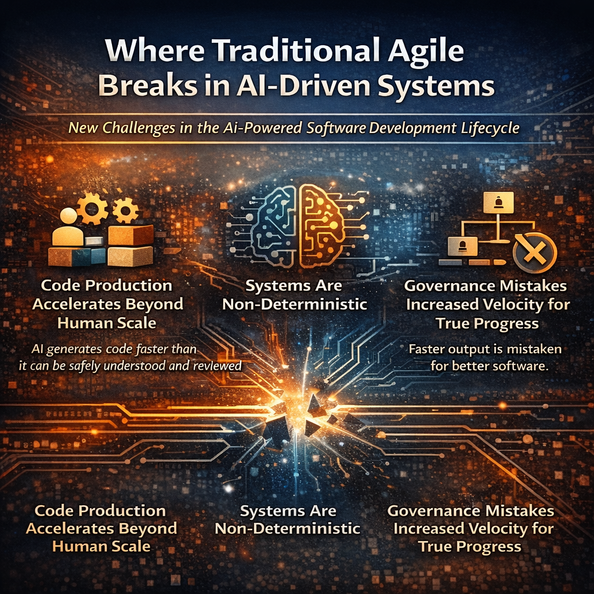

# Where traditional Agile breaks in AI-driven systems

# Agile era

> Agile transformed software development in 2001. It helped teams deliver faster, adapt to change, and avoid the rigidity of heavy waterfall processes. But AI-driven systems expose several structural assumptions Agile was built on — assumptions that no longer fully hold. Three major gaps are emerging.

## Gap 1 — Agile assumes humans write the code

Agile implicitly assumes:
- humans design code,
- humans write code,
- humans fully understand the code they produce.
> 🚧 AI-assisted development breaks that model.

Today we see:
- massive code generation scale,
- hidden reasoning steps inside AI tools,
- hallucinated implementations,
- undocumented architectural drift.

> 🚧 Code is now increasingly machine-generated, not purely human-authored. Traditional Agile practices do not address this risk.

### What AI-era development needs
Frameworks like AVC (Agile Vibe Coding) introduce controls that Agile never defined:
- architecture that constrains generation,
- mandatory review of generated artifacts,
- independent regeneration to verify outputs,
- controlled regeneration instead of uncontrolled iteration.

> ❗️ These did not exist in Agile. These mechanisms help ensure AI accelerates development without losing architectural integrity.

## Gap 2 — Agile Assumes Deterministic Systems

> ℹ️ Traditional software behaves mostly deterministically. Given the same inputs, it produces the same outputs. AI systems do not.

AI software are statistical systems, which introduces new failure modes:
- data leakage,
- model drift,
- training bias,
- evaluation contamination.
> Classic Agile practices never addressed these reliability challenges.
> ⚠️ AI systems require new validation models.

### Modern AI development must include:
- blind dataset testing,
- continuous validation,
- observability by design,
- red-team simulation.
> ⚠️ These are machine-learning reliability mechanisms, not traditional software testing practices.

## Gap 3 — Agile underestimates the control trap, governance failures

> 👍 Agile assumed something optimistic: lightweight processes + motivated teams.

In reality, large organisations often evolve Agile into something very different:
- reporting theatre,
- certainty theatre,
- governance overload.

The intention is understandable.Uncertainty makes leaders uncomfortable:
- budgets wobble
- timelines shift
- stakeholders get nervous

So organisations try to eliminate uncertainty:
- more reporting.
- more approvals.
- more planning meetings about planning meetings.

> ❗️Ironically, this destroys the very feedback loops Agile depends on.

Fortunately, AVC can help because it sets new principles:
- protect responsiveness from control traps,
- organisational responsiveness as metric,
- security and governance by default,
- drift detection.
> ❗️These address organisational failure modes.

## Agile Doesn’t Eliminate Uncertainty — It Manages It

Agile is often misunderstood as a way to make delivery predictable. It isn’t.

> 🛑 Agile is what you use when predictability is not available.

👍 If everything is known in advance — scope, requirements, timeline — then a plan and checklist will work perfectly well.

Agile becomes valuable when you're dealing with:
- unclear requirements
- shifting priorities
- emerging risks
- new information mid-delivery
- real human behaviour
📘 In other words: reality.

## The control trap that makes Agile "fail"

A common pattern appears in many organisations:
1 Teams adopt Agile because work is complex.
2 Leadership asks for more certainty to reduce risk.
3 Governance layers slow feedback and learning.
4 Delivery becomes less responsive.
5 Agile gets blamed for not delivering certainty.

> ⚠️ But Agile didn’t fail. It was turned into a certainty machine — and judged for not being one. That’s like buying an umbrella and complaining it doesn’t stop the rain.

## Why AI amplifies this problem?

This problem already always existed but AI amplifies it because AI dramatically increases:
- development speed,
- architectural drift risk,
- operational complexity.
> ⚠️ This makes governance failures far more dangerous.

Without the right controls, organisations either:
- ❗️ lose architectural control, or
- ❗️ freeze under governance overload.

**Both outcomes are common.**

# How the AVC framework extends clasic Agile.

## The Core Evolution

> Clasic Agile (2001): **Build software faster while staying flexible.**
> AI-era engineering: **Build software faster without losing control of complexity.**
That requires a new capabilities. The Agile Vibe Coding (AVC) framework extends Agile to address these new realities.

### Capability 1 — AI-Safe Architecture

Architecture must now:
- constrain AI generation,
- enable safe regeneration,
- preserve system boundaries.
> 🚧 Architecture becomes a guardrail for AI development, not just documentation.

### Capability 2 — Continuous Validation Systems

Because AI systems can degrade silently, validation must include:
- statistical testing,
- runtime observability,
- adversarial testing.
> ⚠️ Validation becomes continuous, not just part of CI pipelines.

### Capability 3 — Organisational Learning Speed

The real competitive advantage is no longer:
- planning accuracy,
- estimate precision,
- roadmap stability.
> 👍 It is learning velocity. **How quickly can an organisation discover what works and adapt?**

## Final Insight

> ✅ Agile Vibe Coding is not replacing Agile.

Agile Vibe Coding is extending Agile for a world where:
- machines write code,
- humans colaborate with AI,
- systems behave probabilistically,
- software evolves faster than humans can manually review.

In many ways, this evolution mirrors what Agile itself did in 2001.
> - ✅ Agile updated software engineering philosophy to match how systems were built.
> - ✅ AVC does the same thing again — __updating engineering practices for a world where AI is part of the development team__.

[Agile Vibe Coding Manifesto](https://agilevibecoding.org/)

