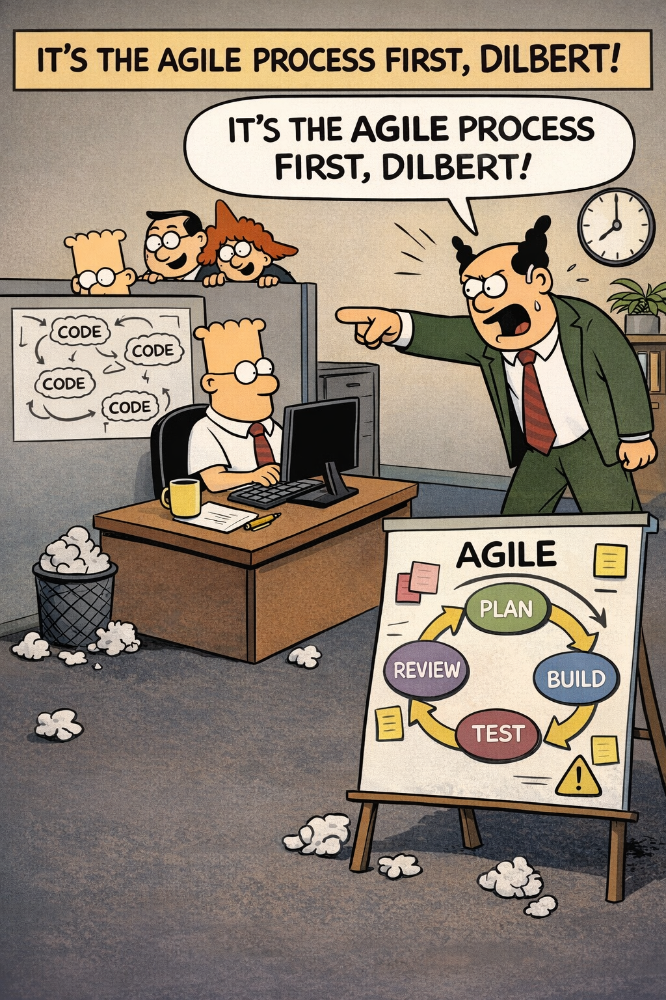

# Down the rabbit holes of AI-based software development process
_It's the process first, stupid._



> Yeah, you are right. The subtitle is a paraphrase of a phrase coined by James Carville in 1992 for Bill Clinton's presidential campaign. 
> The slogan proved effective and drew attention to a real problem.  💥
> In our software development process context: Is Agile still a good approach? 
> Where Agile Vibe Coding becomes operational?

Let me start with a joke. A joke, but also a real shift in how we think about software development.
> 2 hours coding + 6 hours debugging vs. 5 minutes coding + 24 hours debugging

Some people use this joke to devalue artificial intelligence, some to describe human complexity, and some for I don't know what purpose. 
For me this joke shows exactly where the real advantage is now: **not using AI more, but using it correctly**.
This pointing at a real shift — not just in productivity, but in cognitive ownership of code.

 ⚙️ _So_:
- **What is a practical, battle-tested workflow that we can use when building anything from a method 
to a full service without having to turn our code repository into an unmaintainable black box?**
- Also, **do we need new definitions of the software development process?**

With AI, the ratio is changing in a more dangerous way: **generation is cheap, understanding is expensive**.

## Before and with AI: the shift in the bottleneck

Let’s break down what this looks like at different levels. 🔥 

### 🔹 1. Writing a new method

**Before AI**: 
- we write ~20–50 lines, 
- we understand every branch, edge case, and assumption, 
- we debugging => tracing our own logic.

**With AI**: 
- Artificial intelligence generates code instantly and 
- the code runs according to the happy path.

Hidden issues:
- implicit assumptions
- edge cases not obvious
- unclear intent

👉 _New problem_: **We’re no longer debugging logic, we’re reverse-engineering intent.**

### 🔹 2. Creating a new class 

**Before AI**:
- We design structure + responsibility
- We think about cohesion, dependencies
- Code reflects our mental model

**With AI**:
- We get a full class with patterns applied, sometimes over-engineered
- Includes abstractions we didn’t ask for

_New problem_:
- Is this abstraction necessary?
- What are the invariants?
- Why this pattern?

👉 **We didn’t design it, we’re auditing it.**

### 🔹 3. Building a functional unit / module, e.g. payment processor, notification handler

**Before AI**:
- Gradual construction
- Mental model evolves with code
- Tests reinforce understanding

**With AI**: 
We can generate the whole module in one go. Includes:
- error handling
- retries
- logging
- integration hooks

_New problem_:
- Emergent complexity appears instantly
- behaviour is distributed across many files
- Subtle bugs come from interactions, not lines

👉 **We’re debugging system behaviour, not code.**

### 🔹 4. Creating a service, e.g. microservice with APIs, DB, messaging

**Before AI**:
- Architecture decisions are deliberate
- Trade-offs are explicit

**With AI**: 
We can scaffold an entire service:
- controllers
- DTOs
- persistence layer
- messaging integration

_New problem_:
- Architecture may be internally inconsistent
- Patterns may conflict
- Performance/security assumptions unclear

👉 Now we pre-design and verify the architecture, in the simple case we do not design anything.

### 🔹 5. Building a full application

**Before AI**: 
- Built incrementally over weeks/months
- Team shares understanding (even if imperfect)

**With AI**:
- Huge portions can be generated rapidly
- Different parts may come from different prompts/models

_New problem_:
- No single coherent mental model
- Inconsistent conventions
- Hidden coupling

👉 Here, a comparison to Y2K may make sense, not because of a single error, but because of the opacity of the entire system.

## What’s fundamentally changing?

### 1. From `“writing code” → “validating code”`

Developers are shifting into:
- reviewers
- auditors
- investigators

### 2. The bottleneck is now understanding

AI removes the cost of creation, but:
- understanding doesn’t scale
- debugging cost grows nonlinearly

### 3. Ownership is weakening

- ___Previously___: **“I wrote this, I understand it.”**
- ___Now___: **“The system works… I think.”**

> That’s a big cultural shift.

Is this worse than Y2K? Not exactly the same, but our intuition isn’t wrong.
- Y2K = **known global flaw**
- AI-era risk = **unknown distributed complexity**

> More like thousands of tiny, invisible Y2K-like issues scattered across systems.

### What good developers will do differently?

To stay effective, developers will need to:

1. Reduce blind generation
- Generate smaller chunks
- Ask AI why, not just what

2. Enforce explainability
- “Explain this like I need to maintain it for 5 years”
- If it can’t be explained, it shouldn’t ship

3. Treat AI code as untrusted input
- Same mindset as external libraries
- Require tests, validation, review

4. Shift focus to:
- architecture clarity
- boundaries
- invariants

### The real risk scenario

- _The nightmare isn’t_: **“AI writes buggy code”**
- _It’s_: **“Everything works… until something subtle breaks—and no one understands why.”**


> AI doesn’t just amplify productivity. **AI amplifies complexity without comprehension**.

- At small scale (methods), **vibe coding** is manageable.
- At large scale (systems), **vibe coding** can become dangerous if discipline doesn’t evolve, for instance to **Agile Vibe Coding**.

## The practical patterns

_The real challenge is not to use AI more, but to use it correctly._

### Rule 1. The Core Rule (non-negotiable)

> **Never accept code you cannot explain in plain English.**

If you can’t answer:
- What does this do?
- Why is it structured this way?
- What are the edge cases?

> [!IMPORTANT]
> Then the code is **not done**, even if it works. ❌ 

### Rule 2. The “Small Surface Area” Workflow

Wrong way (what causes the problem)

> “Generate a complete microservice with authentication, caching, retries, logging…” ❌ 

Result:
- 2,000+ lines
- mixed patterns
- unclear decisions
- debugging nightmare

#### ✅ Right way - controlled generation

##### Step 1 — Define intent first (no code)


> Ask AI: “Design a simple notification handler. No code. Just responsibilities, inputs, outputs.”

You should get clear boundaries and simple flow.

👉 If this is unclear → stop here

##### Step 2 — Generate one unit only

> Example: “Write ONLY the core method that processes a notification. No logging, no retries.”

👉 Keep it:
- 20–40 lines
- single responsibility

##### Step 3 — Force explanation

> Ask: “Explain this method line by line like I will debug it at 2 AM.”

If explanation feels vague → **reject the code**

##### Step 4 — Add complexity incrementally

Now:
- add logging
- then error handling
- then retries
One at a time.

👉 Each step = understandable diff

### Rule 3. The “Explain Before Trust” Pattern

For every AI-generated piece ask these 4 questions:
1. “What assumptions does this code make?”
2. “What inputs will break this?”
3. “What’s the worst-case behaviour?”
4. “How would I debug this in production?”

👉 If answers are unclear → that’s your bug, waiting.

### Rule 4. The “Test-First Validation Loop”

> Instead of: write code → debug later

Do:
- **Step 1** - Ask AI: **“Give me 5 edge cases for this method.”**
- **Step 2** - Then: **“Write tests ONLY for these cases.”**
- **Step 3** - Then: **“Now write code that passes these tests.”**

👉 This forces:
- clarity
- correctness
- fewer surprises

### Rule 5. Architecture Guardrails (very important)

_When building larger systems:_

#### Rule: AI cannot decide architecture alone

You define:
- boundaries (services, modules)
- communication (API, queue, etc.)
- data ownership

> Then ask AI: **“Implement THIS boundary — not redesign it.”**

#### Example

> Instead of: ___“Create a payment service”___

**Do**:
“We have:
- API layer
- Application layer
- Infrastructure layer
**Implement ONLY the application service for processing payments**”.

👉 This prevents architectural chaos.

### Rule 6. The “Kill Abstractions Early” Rule

AI loves:
- patterns
- interfaces
- generics
- factories

👉 Often unnecessary.

> Ask: “Rewrite this in the simplest possible way. Remove all abstractions unless essential.”

**You’ll often cut complexity by 50–70%.**

### Rule 7. The “Regenerate vs Debug” decision

This is new and critical.

> **Old mindset**: _Spend 3 hours debugging_
>
> **New mindset**: _Spend 2 minutes regenerating correctly_

Use this rule if:
- you don’t understand it
- the fix isn’t obvious in 5 minutes

👉 Delete and regenerate with better constraints


### Rule 8. The “Traceability Trick” (add as a habit)

At the top of AI-generated code, write:
```
// Purpose: Processes incoming notification and validates payload
// Assumptions: Payload is non-null, type is known
// Edge cases: Invalid format, missing fields
// Failure mode: Throws validation exception
```
👉 This restores _human ownership_

### Rule 9. Red Flags - when AI code will hurt you

Watch for:
- Methods > 80 lines
- More than 2 nested conditions
- Unknown libraries/patterns
- “Magic” helpers you didn’t ask for
- Over-generic naming (Processor, Manager, Handler…)

👉 These are future debugging traps.

### Rule 10. The Mental Shift

- _Old role_: **“I write code”**
- _New role_: **“I control complexity”**

AI is:
- a generator
- not a designer
- not accountable

👉 **We are the constraint system**


## Is Agile still a good approach to software development?

> Short answer: **classic Agile is still good, but not sufficient anymore**.

- AI changes where the risk lives. 
- Agile optimizes iteration speed.
- AI introduces understanding debt. 
Those are not the same problem.


### Agile (Scrum-style) – an honest assessment of the methodology

#### What Agile gets right:
- Small increments
- Fast feedback
- Continuous delivery

👉 This helps with AI because we don’t build giant unknown systems at once.

#### Where Agile breaks with AI:

> _Agile assumes_, **“if it works and passes tests, we’re good.”**

But with AI:
- code can pass tests
- and still be poorly understood
- and later become unfixable

With AI Agile doesn’t explicitly protect:
- clarity
- explainability
- cognitive ownership

> Agile: **good foundation, and missing a critical constraint: understandability**

### “Vibe Coding” (AI-first, prompt-heavy, minimal discipline)

Characteristics:
- Generate large chunks
- Trust outputs quickly
- Minimal structure
- Debug later

Result:
- Fast start 
- Exponential confusion 

👉 This leads directly to: **“No one understands the system”**.

> “Vibe Coding”: **fine for prototypes and dangerous for real systems**.

### Waterfall
Gets right:
- Upfront thinking
- Defined architecture
- Documentation

Where it fails (especially now):
- Assumes predictability
- Slow feedback
- Encourages big upfront design (which AI can invalidate quickly)

With AI, ironically, AI makes Waterfall worse:
- you can generate everything upfront
- but you shouldn’t

> Waterfall: **too rigid and encourages large, opaque outputs**

### So what actually works?

#### ✅ The emerging model: Constraint-Driven Iterative Development

> Think of it as: Agile + strict control over complexity

### The process (practical and realistic)

1. Design first (lightweight, but explicit)

Before coding:
- define boundaries
- define responsibilities
- define data flow

> 👉 **Not heavy docs — just clarity**

2. Generate in micro-units 

- method
- small class
- single responsibility

> 👉 Never: **“Generate full service”**

3. Mandatory explain step

Every generated piece must answer:
- What does it do?
- What assumptions exist?
- What breaks it?

> 👉 **This becomes part of “definition of done”**

4. Complexity added in layers

Exactly like we did:
- core logic
- validation
- retry
- logging

> 👉 Not all at once

5. Understanding > velocity

> New rule: **If the team doesn’t understand it, it doesn’t ship.**

Even if:
- tests pass
- deadlines are tight

6. Refactor immediately, not later

In AI era:

> _Old Agile_: **“We’ll clean it later”** - 
> _New reality_: **“Later = never understood”**

### What this fixes?

<pre><code>
Problem with fixing the wrong code	Process
---------------------------------------------
Mixed responsibilities	Micro-unit generation
Hidden retry logic	Explicit layering
Hard to debug		Explain-before-accept
Over-complex method	Forced decomposition
</code></pre>

The real shift:
- _Old bottleneck_: **Writing code**
- _New bottleneck_: **Maintaining understanding over time**

### The final answer to the question, is Agile still a good approach?

- Agile → ✅ still the best base
- Waterfall → ❌ too rigid
- Vibe coding → 🚨 dangerous at scale

> _Best approach_: **Agile + strict constraints on AI usage + enforced understandability**

We can think of **Agile Vibe Coding** as **“AI-Constrained Agile”**
or  **“Cognitive Load–Aware Development”**

> “In the AI era, the goal is not to ship working code—it’s to ship code that can still be understood in 6 months.”

## Where Agile Vibe Coding becomes operational, not just philosophical

### 1. Redefine “Definition of Done” (this is the foundation)

Your current DoD probably includes:
- tests pass
- code reviewed
- deployed

> 👉 That’s no longer enough.

#### New Definition of Done (AI-era)

A task is NOT done unless:
- Code is understandable - another developer can explain it in <5 minutes
- Responsibilities are clear - no method longer then ~50–60 lines, and no mixed concerns (validation + retry + business logic together)
- Assumptions are explicit - inputs, edge cases, failure modes documented (briefly)
- Tests include edge cases - not just happy path
- No “mystery abstractions” - if something looks clever → it must be justified

###  2. Prompt Request, PR Rules — the real control point

> **This is where most teams will either win or lose.**

❌ Old PR mindset: “Looks good, tests pass, merge.”

✅ New PR checklist (use this literally): 

Reviewer must ask:

**Understanding**
- “Can I explain this without rereading it 3 times?”
- “Is the flow obvious?”

**Complexity control**
- Any method too big?
- Any nested logic hard to follow?
- Any unnecessary abstraction?

**Intent clarity**
- Why was it written this way?
- Could it be simpler?

#### AI smell detection

Look for:
- overly generic names (Manager, Processor)
- unnecessary patterns
- inconsistent style within same file

👉 These are signs of blind generation.

#### Hard rule for PRs

> If the reviewer doesn’t understand it → reject, not discuss

This is a cultural shift:
- not “let’s figure it out together”
- but “make it understandable first”

###  3. CI/CD Gates (automated discipline)

We can enforce part of this automatically.

Add gates like:
1. Complexity checks
- Max method length
- Max cyclomatic complexity

👉 Prevents “AI mega-methods”

2. Test coverage (but smarter)
- Require edge case tests (not just %)

3. Linting for clarity
- naming conventions
- no unused abstractions
- no dead code

4. “Explain file” requirement - optional but powerful

Each module must include a short:

```Purpose:
What this module does

Key assumptions:
- ..

Failure modes:
- ..
```

👉 This is cheap but massively valuable.

### 4. Team Rules (this is where most teams fail)

Rule 1 — **Generate small or not at all**
> No AI prompts that generate > ~100 lines of code

Rule 2 — **No blind commits**
> You cannot commit code you don’t understand

Rule 3 — **Prefer rewrite over debug**

> If code is confusing, bug is unclear then **Delete and regenerate with constraints**

Rule 4 — **Simplicity wins arguments**

> If two versions exist clever and simple, 👉 always choose simple

Rule 5 — **Shared ownership = shared understanding**

> Rotate reviewers so the knowledge spreads and no “AI black box owner”.

### 5. Daily Workflow (what a developer actually does)

Step-by-step:

1. Define small task. “Process notification type routing”

2. Ask AI for “Simplest possible implementation. No extras.”

3. Review + understand

4. Ask “What edge cases am I missing?”

5. Add tests

6. Add one concern (e.g., retry)

7. Repeat

👉 This keeps:
- control
- clarity
- confidence

### 6. Anti-patterns to actively ban

These will destroy our codebase over time:

- ❌ “Generate full feature” → leads to hidden complexity
- ❌ “We’ll clean it later” → later = never understood
- ❌ “It works, ship it” → ticking time bomb
- ❌ “Only AI understands this” → unacceptable in production

### 7. What success looks like

After adopting this, we’ll notice:

- ✅ **Code reviews get faster (not slower)** - because code is clearer.
- ✅ **Bugs are easier to fix** - because logic is visible.
- ✅ **Less fear touching code** - because it’s understandable.
- ✅ **AI becomes a tool**, not a liability - because we control it.


## The key leadership insight

> _If we’re leading a team: _**we are no longer managing code quality, we are managing cognitive load**.

Think of AI like this:
- It can generate 10x more code
- But our brain does NOT get 10x better at understanding

👉 So our process **must limit what enters the system**. 

> _One rule to anchor everything_:
> 
> **“We do not optimize for speed of writing code. We optimize for speed of understanding it later.”**


## See also:
- [Is there a need to change the way software is developed today?](https://www.linkedin.com/pulse/need-change-way-software-developed-today-marek-kubis-dntie)
- [This Isn’t Rebranding. It’s a Structural Shift in Software Development](https://www.linkedin.com/pulse/isnt-rebranding-its-structural-shift-software-marek-kubis-sanpe)
- [Murphy’s law and more in AI time - one by one with examples](https://www.linkedin.com/pulse/murphys-law-more-ai-time-one-examples-marek-kubis-fkaze)
- [The Agile Vibe Coding and Conway's Law](https://www.linkedin.com/pulse/agile-vibe-coding-conways-law-marek-kubis-m0wpe)
- [Using a digital banking solution to prove Conway’s Law in AI-Driven engineering - example 1](https://www.linkedin.com/pulse/using-digital-banking-solution-prove-conways-law-ai-driven-kubis-xqlre/)
- [Using a .NET 10 migration project to prove Conway’s Law in AI-Driven engineering - example 2](https://www.linkedin.com/pulse/using-net-10-migration-project-prove-conways-law-ai-driven-kubis-abqae)
- [Where traditional Agile breaks in AI-driven systems](https://www.linkedin.com/pulse/where-traditional-agile-breaks-ai-driven-systems-marek-kubis-4wq6e/)
- [AI - It seems nobody has it fully figured out yet](https://www.linkedin.com/pulse/ai-nobody-has-figured-out-marek-kubis-bkyge)
- [Internal Development Platform and Agile Vibe Coding](https://www.linkedin.com/pulse/internal-development-platform-agile-vibe-coding-marek-kubis-kyhqe/?trackingId=5w3lWKp%2F0BLUpwNdrSmAcg%3D%3D&lipi=urn%3Ali%3Apage%3Ad_flagship3_pulse_read%3BqH%2FwqbkZRkmo%2Fagtxvqyrw%3D%3D)
- [Everyone will be vibe coders](https://www.linkedin.com/pulse/everyone-vibe-coders-marek-kubis-tlgze)
- [The Structural problems AI introduces into the SDLC](https://www.linkedin.com/pulse/structural-problems-ai-introduces-sdlc-marek-kubis-qyt6e)
- [Signals That Reveal the True Maturity of Organisations Claiming “AI-Driven Development”](https://www.linkedin.com/pulse/signals-reveal-true-maturity-organisations-claiming-ai-driven-kubis-urule)
- [AI - It seems nobody has it fully figured out yet](https://www.linkedin.com/pulse/ai-nobody-has-figured-out-marek-kubis-bkyge)
- [Agile Vibe Coding positioning and if this works, what changes?](https://www.linkedin.com/pulse/agile-vibe-coding-positioning-works-what-changes-marek-kubis-r4ate)
- [Agile Vibe Coding – Ceremony Modes](https://www.linkedin.com/pulse/agile-vibe-coding-ceremony-modes-marek-kubis-meq9e)
- [Agile Vibe Coding ceremonies approach compared to a simple one-prompt-per-task approach](https://www.linkedin.com/pulse/agile-vibe-coding-ceremonies-approach-compared-simple-marek-kubis-ecx5e)
- [Agile Vibe Coding Maturity Model](https://www.linkedin.com/pulse/agile-vibe-coding-maturity-model-marek-kubis-bbtqe)
- [The Agile Vibe Coding - the 4-level adaptive ceremony system](https://www.linkedin.com/pulse/agile-vibe-coding-4-level-adaptive-ceremony-system-marek-kubis-jizke)

- [Agile Vibe Coding Manifesto](https://agilevibecoding.org/)
- [Principles Behind the Agile Vibe Coding Manifesto - extended version](https://github.com/marekartur-dev/agilevibecoding/blob/main/Docs/Home/Principles.md)

- [Agile Vibe Coding](https://www.reddit.com/r/AgileVibeCoding/)
- [Marek Kubis - blog](https://github.com/marekartur-dev/agilevibecoding/tree/main)

_I apologize for any possible repetitions with other articles about **Agile Vibe Coding**._
