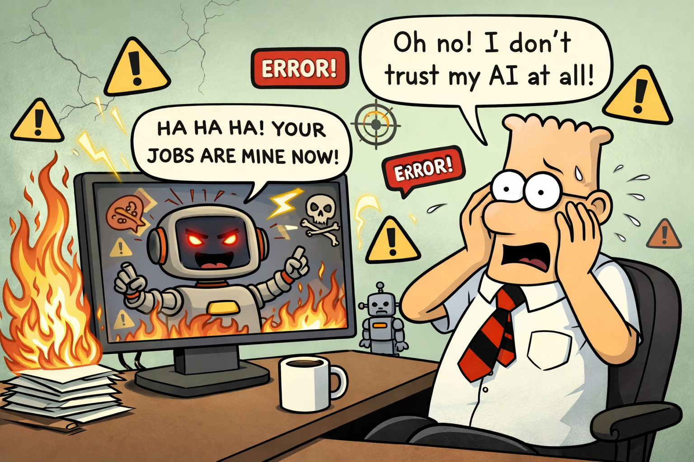

# Application Trust Today and in the Future

 
> How do applications and artificial intelligence systems gain trust? This is one of the most important and challenging questions in modern software engineering.

## Key Insight

Trust is ultimately built based on the answers applications provide. And computer programs produce different types of responses and results depending on the type of application they belong to. 
Let’s examine the types of results generated by applications:
1. Interactive Applications (User-driven)
2. Batch Processing Applications
3. Real-Time Systems
4. Event-Driven Applications
5. Transaction Processing Systems (TPS)
6. Analytical / Data Processing Applications
7. Embedded Systems
8. Command-Line Applications (CLI)
9. Distributed / Cloud Applications
10. AI / Intelligent Applications

The type of application determines:
- Timing → real-time vs delayed
- Format → UI, file, API response, physical action
- Interaction style → synchronous vs asynchronous
- Complexity of result → simple output vs intelligent decision

### What does trust in a computer program mean?

> - _Trust core_: **trust = justified confidence that a program will behave as expected under defined conditions**.
> - ___Trust is not universal___: **trust is defined by the primary risk of the application type**.

This breaks down into three key trust-building concepts:
- **Correctness** → it produces the right results
- **Reliability** → it keeps doing so over time
- **Predictability** → it behaves consistently, even in edge cases	 

> _Trust Keys_ = **The properties whose failure would cause unacceptable consequences**

Depending on the application type, these ideas may materialize in different actions and be represented by different results. 
While reliability is important across all application types, how it is achieved and measured can vary significantly.

### The Foundations of Trust

#### 1. Correctness - does it do the right thing?

- The program follows its specification.
- Outputs match expected results.

📌 How we establish it:

- Unit tests, integration tests.
- Formal verification (in critical systems).

#### 2. Reliability - does it keep working?

Works under load, over time, and in the presence of failures.

📌 Measured by:
- Uptime (e.g., 99.9%)
- Failure rates
- Recovery behaviour

#### 3. Robustness - does it handle the unexpected?

Handles invalid input, crashes, network failures

📌 Example:
- Doesn’t crash when receiving bad data
- Retries when a service is temporarily unavailable

#### 4. Security - can it be trusted not to be exploited?

Protects data and resists attacks

📌 Includes:
- Authentication & authorization
- Data encryption
- Protection against vulnerabilities

#### 5. Transparency & Explainability - can we understand why it behaved a certain way?

Important especially for:
- AI systems
- Financial or legal software

#### 6. Consistency - does it behave the same way in the same conditions?

- Same input → same output (unless explicitly probabilistic)

#### 7. Auditability - can we trace what happened?

📌 Achieved through:
- Logs
- Event tracking
- Monitoring systems

#### 8. Provenance - who built it and how?

- Reputation of developers or organisation
- Development practices used

### Formal view of trust in software

> Trust in software is often framed using the concept of **dependability**.

Dependability includes:
- Availability
- Reliability
- Safety
- Integrity
- Maintainability

For any application, ask:
- What is the worst thing that can go wrong?
- What must never happen?
- What must always happen?
- What delays are acceptable?

**The answers define your trust keys.**

## Trust by Application Type

### 1. Interactive Applications (User-driven)

**Examples**: Desktop apps, web apps, mobile apps

**Responses**:
- Immediate feedback to user actions (clicks, inputs)
- UI updates (forms, dashboards, messages)
 
**Results**:
- Displayed data (tables, charts)
- Navigation changes (new pages/screens)
- Validation messages (errors, confirmations)

> 👉 Example: A banking app shows user balance after login.

**Trust keys**:
- Correctness → it displays the right data, and responds correctly to user actions
- Reliability → fast feedback and it keeps doing so over time
- Predictability → usability consistency and accessibility, even in edge cases (e.g., slow network, screen readers)

**Trust breakers**:
- Wrong data shown (even briefly)
- UI lag or freezing
- Confusing or inconsistent behaviour

> 👉 Trust = ___“What I see is accurate and timely”___

### 2. Batch Processing Applications

Examples: Payroll systems, report generators

Responses:
- No real-time interaction
- Processes large datasets on a schedule

Results:
- Files (CSV, PDFs)
- Aggregated reports
- Database updates

> 👉 Example: Monthly salary reports generated overnight.

**Trust keys**:
- Correctness → ACID properties for database updates, and correct report generation
- Reliability → consistency of results over time (e.g., every month)
- Predictability → durability and consistency of results, even in edge cases (e.g., partial failures, data corruption)

**Trust breakers**:
- Missing records
- Incomplete processing
- Silent data corruption

> 👉 Trust = ___“Money and state cannot be corrupted”___

### 3. Real-Time Systems

Examples: Air traffic control, stock trading systems

Responses:
- Immediate processing with strict timing constraints
-Continuous input/output handling

Results:
- Alerts or signals
- Live data streams
- Instant decisions

> 👉 Example: Stock price updates changing in milliseconds.

**Trust keys**:
- Correctness → deterministic timing and correct processing of inputs
- Reliability → low latency and consistent performance under load
- Predictability → predictable execution times, even in edge cases (e.g., high load, hardware failures)

**Trust breakers**:
- Delays
- Missed deadlines
- Jitter (inconsistent timing)

> 👉 Trust = ___“It reacts exactly when it should”___

### 4. Event-Driven Applications

Examples: Systems using message queues, microservices (like Azure Service Bus setups)

Responses:
- Triggered by events (messages, signals, API calls)

Results:
- Asynchronous processing
- Notifications or downstream actions
- Chained workflows

> 👉 Example: A new order triggers inventory update and email notification.

**Trust keys**:
- Correctness → handles events correctly and triggers appropriate responses, idempotency is key here
- Reliability → delivery guarantees (at-least-once, etc.) and consistent processing over time
- Predictability → observable behaviour, event ordering (when required), and idempotent processing, even in edge cases (e.g., message loss, duplicates)

**Trust breakers**:
- Lost messages
- Duplicate side effects
- Silent failures

> 👉 Trust = ___“Events will be processed correctly—even if not immediately”___

### 5. Transaction Processing Systems (TPS)

Examples: Banking, e-commerce checkout

Responses:
- Confirm or reject transactions

Results:
- Database commits/rollbacks
- Receipts or confirmations
- Consistency guarantees (ACID properties)

> 👉 Example: Payment success or failure message.

**Trust keys**:
- Correctness → data accuracy and integrity, and correct commit/rollback behaviour
- Reliability → completeness and durability of transactions over time
- Predictability → reproducibility of transactions, even in edge cases (e.g., concurrent transactions, system crashes)

**Trust breakers**:
- Double charges
- Lost transactions
- Partial updates

> 👉 Trust = ___“Insights reflect reality”___

### 6. Analytical / Data Processing Applications

Examples: BI tools, machine learning pipelines

Responses:
- Query results or model outputs

Results:
- Insights, predictions
- Visualizations (graphs, dashboards)
- Processed datasets

> 👉 Example: ___Sales trends dashboard.___

**Trust keys**:
- Correctness → prediction accuracy and data integrity
- Reliability → explainability and consistency of insights over time
- Predictability → bias control, confidence estimation and explainability, even in edge cases (e.g., outliers, adversarial inputs)

**Trust breakers**:
- Unexplainable outputs
- Hidden bias
- Confident but wrong predictions

> 👉 Trust = “I understand and can rely on its decisions”

### 7. Embedded Systems

Examples: IoT devices, washing machines, car systems

Responses:
- Sensor-based reactions

Results:
- Physical actions (turn motor on/off)
- Status signals

> 👉 Example: Thermostat adjusts temperature automatically.

**Trust keys**:
- Correctness → safety and correct physical behaviour
- Reliability → fault tolerance and long-term operation without failure
- Predictability → fail-safe behaviour and clear error states, even in edge cases (e.g., power loss, sensor failure)

**Trust breakers**:
- Unsafe actions
- Uncontrolled failure

> 👉 Trust = ___“Failure will not cause harm”___

### 8. Command-Line Applications (CLI)

Examples: Scripts, developer tools

Responses:
- Text-based output

Results:
- Logs
- Exit codes (success/failure)
- Generated files

> 👉 Example: Build tool showing compilation success.

**Trust keys**:
- Correctness → accuracy over large datasets and correct exit codes
- Reliability → completeness and durability of results over time
- Predictability → repeatability and clear error messages, even in edge cases (e.g., invalid input, partial failures)

**Trust breakers**:
- Missing records
- Silent processing errors

> 👉 Trust = ___“All data is processed correctly, even if delayed”___

### 9. Distributed / Cloud Applications

Examples: Microservices, cloud-native apps (Azure, AWS)

Responses:
- Network-based communication (APIs, messaging)

Results:
- JSON/XML responses
- Service-to-service messages
- Scalable processing outcomes

> 👉 Example: API returns user data in JSON format.

**Trust keys**:
- Correctness → confidentiality and integrity of data across services
- Reliability → availability and resilience under load and failure
- Predictability → authentication and authorization, even in edge cases (e.g., network partitions, service failures)

**Trust breakers**:
- Data leaks
- Unauthorized access

> 👉 Trust = ___“Data is protected and untampered”___

### 10. AI / Intelligent Applications

Examples: Chatbots, recommendation systems

Responses:
- Context-aware, dynamic outputs

Results:
- Predictions
- Natural language responses
- Personalized recommendations

> 👉 Example: A chatbot answering questions.

**Trust keys**:
- Correctness → resilience to adversarial inputs and bias control
- Reliability → consistent performance and stability of model behaviour over time
- Predictability → explainability, confidence estimation, and controlled variability

**Trust breakers**:
- Cascading failures
- Resource exhaustion
- Cross-service corruption

> 👉 Trust = ___“The system survives failure and load”___

## How Trust Is Built in Practice

1. Testing
   - Unit, integration, system, acceptance testing
2. Monitoring
   - Real-time metrics, alerts
3. Redundancy
   - Backup systems, failover
4. Gradual Deployment
   - Canary releases, feature flags
5. Standards & Compliance
   - Industry regulations (e.g., finance, healthcare)

> Trust Is Context-Dependent

Not all systems require the same level of trust:
<pre><code>
Application Type → Required Trust Level
----------------------------------------
Game → Low
Social media app → Medium
Banking system → High
Medical device → Critical
</code></pre> 

### Trust Patterns

- Idempotency: Same message processed multiple times → same result
- Observability: You cannot trust what you cannot see. Comprehensive logging and monitoring are essential for building trust in distributed systems.
- Retry + Compensation: If an operation fails, the system can retry or compensate to maintain trust in eventual correctness.
- Circuit Breakers: Prevent cascading failures by stopping calls to a failing service, allowing it to recover and maintain overall system trust.
- Saga Pattern: Manage distributed transactions across multiple services, ensuring that either all steps succeed or compensating actions are taken to maintain consistency and trust.

## The Core Shift: from program trust to system trust

> [!IMPORTANT]
> In a single program:
> - _Trust_ = **“Does this code work correctly?”**
>
> In a distributed system:
> - _Trust_ = **“Will the whole system produce the correct outcome despite partial failures, delays, and inconsistencies?”**
> - The system guarantees defined behaviour under failure.

1. Trust is composed across boundaries
🔹 Each component (API Gateway, Azure Function, Service Bus, Kubernetes services, ..) may be trustworthy individually, but the system is only as trustworthy as the interactions between them.

2. Is the data correct and complete?
🔹 The system may be temporarily inconsistent (messages lost, duplicate messages, out-of-order delivery, ..), but trust comes from knowing it will converge to correctness.

3. Did the message get there?
🔹 Communication can be subject to network failures, timeouts, and retries. Trust is in the system’s ability to handle these gracefully, appropriately.

4. Was the operation actually performed?
🔹 A message can be received, but processing crashes halfway. Trust is in the system’s ability to detect this and recover (e.g., idempotent processing, retries, compensation).

5. When is the result “final”?
🔹 In distributed systems, finality can be elusive. “Now” is ambiguous. Trust is in the system’s ability to provide eventual consistency and clear indicators of completion.

6. Who are you talking to?
🔹 In a distributed system, you may be communicating with multiple services, some of which may be untrusted or compromised. Trust is in the system’s ability to authenticate, authorize, and validate interactions.

## A Final Thought

> [!IMPORTANT]
> It's not true that the application or system is always correct.
> 
> A strong system doesn’t assume: “Failures are rare”.
> It assumes: “Failures are normal and must be handled”.

We don’t “trust a program” blindly. Our trust is based on:
- Evidence (tests, history, metrics)
- Process (engineering practices)
- behaviour over time

> [!IMPORTANT]
> **Trust in a computer program is earned confidence, based on evidence, that it will behave correctly, reliably, and safely within its intended context.**
>
> In distributed systems:
> **Trust is not a property of correctness alone—it is a property of controlled failure, observable behaviour, and guaranteed recovery semantics.**

> [!NOTE]
> We don’t design systems to be “trustworthy” in general.
> We design them to **protect specific trust keys that matter for their purpose**.

What is your perspective?

## See also:   

- [This Isn’t Rebranding. It’s a Structural Shift in Software Development](https://www.linkedin.com/pulse/isnt-rebranding-its-structural-shift-software-marek-kubis-sanpe)
- [Murphy’s law and more in AI time - one by one with examples](https://www.linkedin.com/pulse/murphys-law-more-ai-time-one-examples-marek-kubis-fkaze/?trackingId=DJqIIXTw2pTaJg3dW8UFYg%3D%3D)
- [The Agile Vibe Coding and Conway's Law](https://www.linkedin.com/pulse/agile-vibe-coding-conways-law-marek-kubis-m0wpe/?trackingId=wNYc5fRxyx3oQGxE3KYx8Q%3D%3D)
- [Using a digital banking solution to prove Conway’s Law in AI-Driven engineering - example 1](https://www.linkedin.com/pulse/using-digital-banking-solution-prove-conways-law-ai-driven-kubis-xqlre/)
- [Using a .NET 10 migration project to prove Conway’s Law in AI-Driven engineering - example 2](https://www.linkedin.com/pulse/using-net-10-migration-project-prove-conways-law-ai-driven-kubis-abqae/?trackingId=%2FAxxEBhQ3Kz4dbLMKDokgg%3D%3D)

- [Agile Vibe Coding Manifesto](https://agilevibecoding.org/)
- [Principles Behind the Agile Vibe Coding Manifesto - extended version](https://github.com/marekartur-dev/agilevibecoding/blob/main/Docs/Home/Principles.md)
- [Marek Kubis - blog](https://github.com/marekartur-dev/agilevibecoding/tree/main)