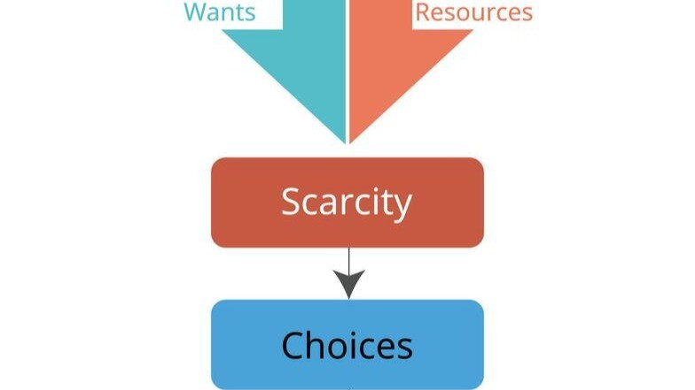

# From Code Scarcity to Intent Scarcity

## I. Structural Shift

In the past:

> Code was scarce. Skilled programmers were the bottleneck.

With Agile Vibe Coding:

> Code becomes abundant. Clear intent, structured thinking, and accountability become scarce.

This flips the economic model of software production. The competitive advantage shifts from writing code to:

- Defining problems precisely
- Designing constraints
- Governing quality
- Structuring context

## Role by role

### 1. Non-Developers

People who have never been interested in software development now have access to a tool that allows them to do so. 
Moreover, thanks to Prompt → Generate → Copy → Deploy they can still show their disinterest in writing programs, 
and yet their own computer programs will be able to appear on the market. 
Such a product may be of poor quality, but it can also be of good quality. 
Everything will depend on:
- the version of LLM used,
- the relevance of the query, prompt.

Increasingly improved versions of LLM will contribute to the creation of better software, 
but will not make the product independent of the quality of prompts. One could, of course, 
argue that prompts could also be generated by artificial intelligence. 
However, this has significant limitations related to the unpredictability of human nature, 
its needs, and the randomness of economic changes, which do not always fit into logical patterns of thought. 
Therefore, if non-programmers are experts in their field and can precisely define needs, 
it is highly likely that their software will provide significant added value.

### What Changes for the Product?

#### A. Explosion of Micro-Products

Expect:
- Highly niche tools
- Industry-specific utilities
- Workflow automations
- Small SaaS tools from domain experts

Many will be:
- Narrow
- Highly practical
- Market-relevant

> Domain expertise + AI is powerful.

#### B. Quality Variability Will Be Extreme

Quality will depend on:
- LLM capability
- Prompt precision
- Hidden architectural assumptions
- Testing discipline (often absent)

Non-developers may produce:
- Functionally correct but structurally fragile systems
- Secure-looking but insecure infrastructure
- Products that work until scale or edge cases appear

#### C. Product Becomes Prompt-Defined

The “specification” becomes:
- The prompt
- The intent statement

> If a subject matter expert can clearly define constraints, edge cases, regulatory requirements, and performance limits, a product can be surprisingly robust. Otherwise, it will be fragile.

#### D. New Risk: Invisible Technical Debt

Non-developers won’t see:
- Architectural coupling
- State management flaws
- Scalability boundaries
- Observability gaps
- Compliance risks

> Non-developers product may look market-ready but be structurally unstable.

#### Strategic Effect

- Software creation democratizes.
- Software maintenance does not.
- The second phase (scaling, securing, refactoring) still demands engineering depth.

### 2. Junior Developers

This is where the impact is spectacular. Previously juniors learned by:
- Writing boilerplate
- Implementing simple CRUD
- Fixing small bugs
- Reading legacy code

AI now does most of that.

#### Risk - juniors may:
- Skip foundational learning
- Rely on generation without understanding
- Become prompt operators instead of engineers

If unmanaged, this creates a generation of:

> Code assemblers without architectural intuition.

#### Opportunities - if guided properly, juniors can:
- Study generated code critically
- Compare AI solutions
- Refactor and improve them
- Focus on understanding trade-offs

AI becomes:
> An infinite mentor and code sample generator.

The key is discipline:
- Juniors must not just generate
- Juniors must analyse and refactor.

### 3. Mid-Level Developers

Mid developers are most disrupted. They traditionally:
- Implement features independently
- Translate requirements to architecture
- Make design decisions

Now AI assists heavily in this layer.

#### Shift in Role

Mid-level developers move from Implementers to Integrators and validators. They must:
- Detect subtle architectural drift
- Enforce boundaries
- Validate contracts
- Manage complexity across modules

> Mid-level developers value becomes judgment under uncertainty.

#### Risk

If mid developers rely too heavily on AI:
- Systems become inconsistent
- Architecture degrades slowly
- Naming conventions drift
- Cross-service contracts fracture

> Mid-level is where silent entropy can begin.

### 4. Senior Developers

Senior developers gain strategic importance. Because in an AI-saturated environment:
- Architecture matters more.
- Constraints matter more.
- Guardrails matter more.

Senior developers become:
- System designers
- Constraint definers
- Risk managers
- Regeneration strategists
- Governance architects

> Senior developers role shifts from: **writing difficult code** to: **designing systems that are safe to generate**.

## II. How This Changes Product Strategy

### 1. Speed of Market Entry Increases

MVP creation time collapses. Markets will see:
- More experiments
- Faster iteration
- More abandoned products
- Higher competition density

### 2. Differentiation Moves Upward

Since anyone can generate code, differentiation moves to:
- Domain expertise
- UX quality
- Data access
- Distribution
- Brand trust
- Reliability
- Security

### 3. Trust Becomes a Competitive Advantage

In a world of AI-generated software customers will ask:
- Is this secure?
- Is it maintained?
- Who is accountable?
- Is the system observable?
- Is it compliant?

> Trust replaces technical novelty as differentiator.

### 4. Maintenance Becomes the Real Barrier

Generation is easy. Sustainable operation is not.
Companies that master:
- Observability
- Infrastructure governance
- Cost control
- Security enforcement
- Architectural consistency
will dominate.

## III. What Agile Vibe Coding Must Do in This Context

If anyone can generate software, AVC must:
- Protect architectural integrity
- Enforce validation gates
- Elevate accountability
- Make context explicit
- Prevent drift

Without discipline, democratization becomes chaos. With discipline, democratization becomes innovation.

## IV. The Core Transformation

Before:
> Software was written by engineers.

Now:
> Software is generated by AI under human intent.

The new scarce skill is not syntax knowledge. It is:
- Precise thinking
- Systems design
- Constraint articulation
- Risk awareness
- Product clarity

## V. The Hard Truth

Agile Vibe Coding will:
- Create more software
- Lower entry barriers
- Increase experimentation
- Increase failure rate
- Increase product noise

But it will also:
- Empower domain experts
- Accelerate innovation
- Reduce repetitive engineering labour
- Shift engineers upward in abstraction

## Final Strategic Insight

> AI democratizes software creation. It does not democratize software responsibility.

The winners will not be the fastest generators. The winners will be:
- The best system thinkers.
- The best constraint designers.
- The most disciplined validators.
- The most trusted maintainers.

## See also:
- [Is there a need to change the way software is developed today?](https://www.linkedin.com/pulse/need-change-way-software-developed-today-marek-kubis-dntie)
- [This Isn’t Rebranding. It’s a Structural Shift in Software Development](https://www.linkedin.com/pulse/isnt-rebranding-its-structural-shift-software-marek-kubis-sanpe)
- [Murphy’s law and more in AI time - one by one with examples](https://www.linkedin.com/pulse/murphys-law-more-ai-time-one-examples-marek-kubis-fkaze)
- [The Agile Vibe Coding and Conway's Law](https://www.linkedin.com/pulse/agile-vibe-coding-conways-law-marek-kubis-m0wpe)
- [Using a digital banking solution to prove Conway’s Law in AI-Driven engineering - example 1](https://www.linkedin.com/pulse/using-digital-banking-solution-prove-conways-law-ai-driven-kubis-xqlre/)
- [Using a .NET 10 migration project to prove Conway’s Law in AI-Driven engineering - example 2](https://www.linkedin.com/pulse/using-net-10-migration-project-prove-conways-law-ai-driven-kubis-abqae)
- [Where traditional Agile breaks in AI-driven systems](https://www.linkedin.com/pulse/where-traditional-agile-breaks-ai-driven-systems-marek-kubis-4wq6e/)
- [AI - It seems nobody has it fully figured out yet](https://www.linkedin.com/pulse/ai-nobody-has-figured-out-marek-kubis-bkyge)
- [Internal Development Platform and Agile Vibe Coding](https://www.linkedin.com/pulse/internal-development-platform-agile-vibe-coding-marek-kubis-kyhqe/?trackingId=5w3lWKp%2F0BLUpwNdrSmAcg%3D%3D&lipi=urn%3Ali%3Apage%3Ad_flagship3_pulse_read%3BqH%2FwqbkZRkmo%2Fagtxvqyrw%3D%3D)
- [Everyone will be vibe coders](https://www.linkedin.com/pulse/everyone-vibe-coders-marek-kubis-tlgze)
- [The Structural problems AI introduces into the SDLC](https://www.linkedin.com/pulse/structural-problems-ai-introduces-sdlc-marek-kubis-qyt6e)
- [Signals That Reveal the True Maturity of Organisations Claiming “AI-Driven Development”](https://www.linkedin.com/pulse/signals-reveal-true-maturity-organisations-claiming-ai-driven-kubis-urule)
- [AI - It seems nobody has it fully figured out yet](https://www.linkedin.com/pulse/ai-nobody-has-figured-out-marek-kubis-bkyge)
- [Agile Vibe Coding positioning and if this works, what changes?](https://www.linkedin.com/pulse/agile-vibe-coding-positioning-works-what-changes-marek-kubis-r4ate)
- [Agile Vibe Coding – Ceremony Modes](https://www.linkedin.com/pulse/agile-vibe-coding-ceremony-modes-marek-kubis-meq9e)
- [Agile Vibe Coding ceremonies approach compared to a simple one-prompt-per-task approach](https://www.linkedin.com/pulse/agile-vibe-coding-ceremonies-approach-compared-simple-marek-kubis-ecx5e)
- [Agile Vibe Coding Maturity Model](https://www.linkedin.com/pulse/agile-vibe-coding-maturity-model-marek-kubis-bbtqe)
- [The Agile Vibe Coding - the 4-level adaptive ceremony system](https://www.linkedin.com/pulse/agile-vibe-coding-4-level-adaptive-ceremony-system-marek-kubis-jizke)

- [Agile Vibe Coding Manifesto](https://agilevibecoding.org/)
- [Principles Behind the Agile Vibe Coding Manifesto - extended version](https://github.com/marekartur-dev/agilevibecoding/blob/main/Docs/Home/Principles.md)

- [Agile Vibe Coding](https://www.reddit.com/r/AgileVibeCoding/)
- [Marek Kubis - blog](https://github.com/marekartur-dev/agilevibecoding/tree/main)