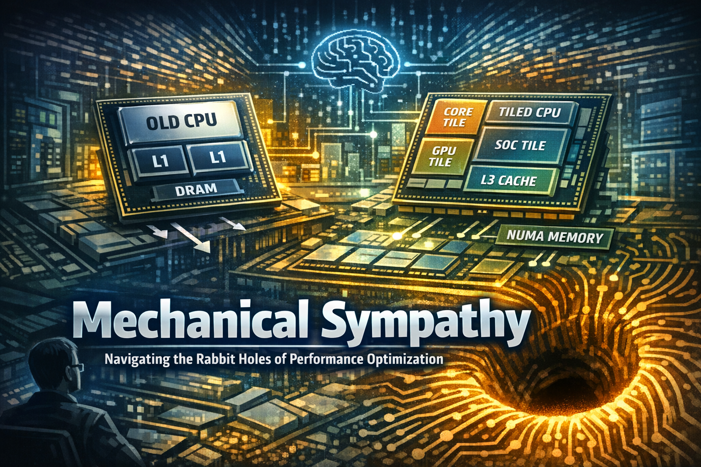
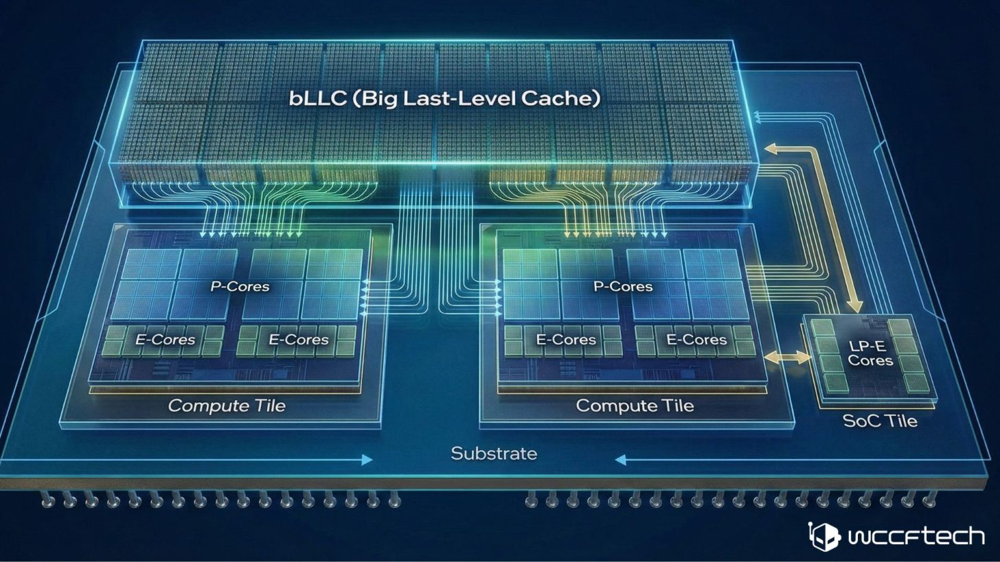

# Mechanical Sympathy — Part 1: Between Insight and Rabbit Holes



## Introduction

I can’t remember the last time I experienced such a flood of mixed thoughts and reactions as I did 
after reading the article on [Mechanical Sympathy Principles](https://martinfowler.com/articles/mechanical-sympathy-principles.html).

On the one hand, any proposal that helps us build better, more efficient software is worth serious consideration. 
That’s why I appreciate the idea of extending “sympathy” toward the systems we build.

On the other hand, the number of potential traps and labyrinths this way of thinking opens is alarming. 
It can easily redirect developers into areas that are deep, complex, and often far removed from their actual goals.

Everything that _Martin Thompson_ popularized and [Caer Sanders](https://martinfowler.com/articles/mechanical-sympathy-principles.html) 
publicized is technically sound and worth understanding. 

However, I doubt this perspective is truly important enough to prioritize over the principles we've been following up to this point.

We should cultivate mechanical empathy in software development when working with complex systems, especially those that are distributed, 
scalable, or leverage AI, but very, very carefully so that the compelling doesn't overshadow the important.

Therefore, I believe that software developers should primarily focus on established design principles, proven best practices, 
and pragmatic performance techniques (e.g., C#, SQL, system-level optimisation) when it matters. Why? Because Mechanical Sympathy 
will force them down a uncomfortable position. Because Mechanical Sympathy focuses on a narrow subset of problems, 
while real systems require a different, broader perspective. 

Software development truly has a lot of problems to solve, a list of which I'll present later, 
and let everyone answer for themselves whether looking from the perspective of Mechanical Sympathy is the desired perspective.

The concept of "mechanical sympathy" encourages a thorough understanding and resolution of problems related to:
- access to working memory,
- access to cache memory,
- processing information by the processor, and
- simultaneous writing of information by a single author.

> The last of these principles is frequently used. The remaining three principles, however, 
address more advanced concepts and address resource access at a very low level. 
This may sound intriguing and appealing, but delving into these issues can easily distract a programmer, 
and the methodology can become potentially distracting.

We can and should try to solve problems as simply as possible, but first we need to understand what we're dealing with.

> I will try to show how complex this problem is and where we can get stuck for hours, days or even longer.

## The rabbit holes

The most dangerous maze:
- Memory management
- Cache lines
- False sharing

Yes — these are real and important, but analyzing them at the level of microprocessor architecture 
and cache hardware hierarchies can move us far from the actual goal:
> Optimizing real systems — from AI inference services to distributed platforms.

So let's bridge levels of abstraction and connect:
- CPU architecture
- OS/runtime behaviour
- application-level patterns
- AI/LLM systems

### Rabbit Hole #1 – CPU Architecture

> To demonstrate how deep this rabbit hole goes, [let’s briefly step into it…](https://www.intel.com/content/www/us/en/gaming/resources/how-hybrid-design-works.html)

#### Evolution Across Intel Families

> For the purpose of this discussion, I refer to upcoming tiled architectures (e.g., Nova Lake) as ‘Family 18’…

##### Family 4 (80486)

```
CPU
 ├─ L1 cache (on-die, small)
 └─ External DRAM
```
- No L2 on-die
- No SMP awareness

##### Family 5 (Pentium)

```
CPU
 ├─ L1 (split I/D)
 └─ External L2 (motherboard)
```
- First superscalar
- Still external cache bottleneck

##### Family 6 (Pentium Pro → Alder/Raptor Lake)

**Early P6 era**
```
CPU die
 ├─ L1
 ├─ L2 (on-package → on-die later)
 └─ Front-side bus → DRAM
```

**Modern (Skylake → Alder Lake)**
```
Cores ── Ring / Mesh ── Shared L3
             │
        Memory Controller
             │
            DRAM
```

- Shared Last-Level Cache, LLC (L3)
- Ring → mesh evolution, interconnect
- Hybrid cores (later)

##### Family 18 (Nova Lake)
```
Multiple Tiles (Non-Uniform Memory Access, NUMA-like)
   │
Distributed LLC (Big Last-Level Cache, bLLC per tile)
   │
SoC Tile (memory + IO)
   │
Shared DRAM
```

<pre><code>
Feature	        Family 6	Family 18
---------------------------------------------
Die	            Monolithic	Tiled
LLC             Shared	    Distributed
Interconnect	Ring/Mesh	Package fabric
Memory	        UMA	        NUMA-like
GPU	    Separate or small	Fully integrated tile
</code></pre>

##### Family 19 (Server — projected)

- Likely extension for Xeon (e.g., Diamond Rapids)
- Expected:
```
Many Compute Tiles
     │
High-bandwidth fabric
     │
HBM + DDR (tiered memory)
     │
CXL memory expansion
```

👉 True heterogeneous memory hierarchy:
- DRAM
- HBM
- CXL-attached memory

##### [Nova Lake-S](https://wccftech.com/roundup/intel-nova-lake-s/) (Family 18) — key shift 

> A structured, diagram-heavy explanation of Intel Nova Lake-S, latest CPU



> This is no longer a CPU — it is a distributed system inside a package.

Key facts:
- Up to 52 cores (P + E + LP-E hybrid)
- Tile-based (chiplet / disaggregated) design
- Dual compute integration, CPU + GPU/media tiles
- Hybrid GPU: Xe3 (graphics) + Xe4 / Xe3P (media/display)
- New Family 18 CPU classification replacing long-standing Family 6

##### High-level tiled architecture

```
Foveros = Intel's 3D packaging technology for stacking dies
P + E cores = Performance + Efficiency cores
LP-E = Low-Power Efficiency core (ultra-efficient, low-power)
SoC = System on a Chip (CPU + GPU + Media + I/O)
IMC = Integrated Memory Controller
PCIe = Peripheral Component Interconnect Express (I/O interface)
GPU Tile = Graphics Processing Unit tile (Xe3 for rendering)
Xe3 = Intel's GPU architecture for graphics workloads
Xe4 / Xe3P = Intel's GPU architectures for media and display workloads

                ┌──────────────────────────────┐
                │        PACKAGE (Foveros)     │
                │                              │
                │  ┌──────────────┐            │
                │  │ Compute Tile │            │
                │  │ (P + E cores)│            │
                │  └──────┬───────┘            │
                │         │                    │
                │  ┌──────▼───────┐            │
                │  │ Compute Tile │ (optional) │
                │  │ (P + E cores)│            │
                │  └──────┬───────┘            │
                │         │                    │
                │  ┌──────▼────────┐           │
                │  │   SoC / I/O   │           │
                │  │  (IMC, PCIe)  │           │
                │  └──────┬────────┘           │
                │         │                    │
                │  ┌──────▼────────┐           │
                │  │ GPU Tile      │           │
                │  │ Xe3 (render)  │           │
                │  └──────┬────────┘           │
                │         │                    │
                │  ┌──────▼────────┐           │
                │  │ Media Tile    │           │
                │  │ Xe4 / Xe3P    │           │
                │  └───────────────┘           │
                └──────────────────────────────┘
```

Key shift
- Not a monolithic die anymore
- Modular tiles connected via advanced packaging (Foveros/EMIB)

##### Core topology (example 52-core SKU)

```
Compute Tile 0:   8 P + 16 E
Compute Tile 1:   8 P + 16 E
Low-power island: 4 LP-E

Total: 16 P + 32 E + 4 LP-E = 52 cores
```

#### Motorola vs Intel 

##### Motorola 68000 family 

Family 0–3 era mindset
```
CPU → Memory

CPU (CISC, orthogonal ISA)
 ├─ Registers (data + address)
 ├─ No on-chip cache (early)
 └─ External memory
```

Key traits
- Simple, 
- Uniform memory 
- Programmer-friendly ISA

> Memory model Uniform Memory Access (UMA) - no deep cache hierarchy

Compared Motorola to Intel:
- Simpler than Intel x86 Family 4
- Easier for compilers, harder for performance scaling

#### PowerPC 

Motorola + IBM + Apple
```
CPU → Cache → Memory

Core
 ├─ L1
 ├─ L2 (on-chip)
 └─ System bus → DRAM
```
Innovations:
- Strong cache hierarchy awareness
- Early RISC discipline
- Early Non-Uniform Memory Access (NUMA) in servers 

> 👉 This is where Motorola lineage becomes closer to modern AMD/Intel philosophy

#### Modern Intel 

`Tile → Cache → Fabric → Memory`

> **Motorola → clarity; Modern Intel → scalability constraints**

Motorola spun off into Freescale → NXP, but architectural ideas live on in:
- IBM POWER (servers)
- ARM (mobile, Apple Silicon influence)

> Motorola emphasized programmer-visible simplicity, though modern implementations also carry hidden complexity.

### Intel Nova Lake vs Motorola Philosophy

#### Core philosophical difference

<pre><code>
Aspect	    Motorola 68k	PowerPC	Intel Nova Lake
----------------------------------------------------------
Design goal	Simplicity	Efficiency	Scalability
Memory model	Flat UMA	Cache-aware UMA	NUMA-like
System view	CPU-centric	CPU + memory	Distributed system
</code></pre>

#### Architectural comparison diagram

```
Motorola 68k:
  CPU → Memory

PowerPC:
  CPU → Cache → Memory

Intel Nova Lake:
  Tile → Local Cache → Fabric → Remote Cache → Memory
```

### Key insight:
- Motorola optimised for programmer clarity
- Intel now optimises for physical scalability limits

> Now that we’ve seen the depth—this is exactly the problem.

## Rabbit Hole #2 - Memory

### Nova Lake Memory Model

```
Logical memory hierarchy:

                ┌──────────────────────────┐
                │        DRAM (DDR5/6)     │
                └──────────┬───────────────┘
                           │
                 ┌─────────▼─────────┐
                 │ Integrated Memory │
                 │ Controller (SoC)  │
                 └─────────┬─────────┘
                           │
         ┌─────────────────┼─────────────────┐
         │                 │                 │
 ┌───────▼──────┐  ┌───────▼──────┐  ┌──────▼──────┐
 │ bLLC / L3    │  │ bLLC / L3    │  │ GPU Cache   │
 │ (Tile-local) │  │ (Tile-local) │  │ (Xe3/Xe4)   │
 └───────┬──────┘  └───────┬──────┘  └──────┬──────┘
         │                 │                │
   ┌─────▼─────┐     ┌─────▼─────┐     ┌────▼─────┐
   │  L2 (per  │     │  L2 (per  │     │  L2 GPU  │
   │  core grp)│     │  core grp)│     │ clusters │
   └─────┬─────┘     └─────┬─────┘     └────┬─────┘
         │                 │                │
   ┌─────▼─────┐     ┌─────▼─────┐     ┌────▼─────┐
   │ L1 caches │     │ L1 caches │     │ EU regs  │
   └───────────┘     └───────────┘     └──────────┘
```
Key changes
- Distributed LLC
- Non-Uniform Memory Access, NUMA-like desktop behaviour
- CPU–GPU convergence

### What’s new vs previous Intel designs

1. Distributed Last-Level Cache (bLLC)
- Large tile-local L3 / bLLC (~100–300MB rumored/projected)
- Shared across CPU + GPU
- Improves bandwidth vs DRAM bottlenecks

👉 This is a major shift from ring/mesh unified Last-Level Cache (LLC)

2. NUMA-like behaviour (even on desktop)
- Each compute tile ≈ local memory domain
- Access cost differs:
  - local tile → fast
  - remote tile → slower
But:
- Still not exposed like server NUMA
- OS abstraction hides most of it

> NUMA-like characteristics may emerge…

3. GPU + CPU memory convergence
GPU shares:
- system memory
- last-level cache

👉 Moves toward APU-style unified memory

### Motorola Memory Architecture Evolution (Unified View)

```
Era 1 (68k):
  Flat memory

Era 2 (Pentium / PowerPC):
  Cache hierarchy

Era 3 (Xeon / NUMA):
  Node-local memory

Era 4 (Nova Lake):
  Distributed cache + tiled compute
```

### OS Memory Management Across Architectures

> Now we connect hardware → OS behaviour.

#### Linux (NUMA - first design)
- Strong NUMA awareness
Policies:
- First-touch allocation
- NUMA balancing
- CPU pinning

```bash
numactl --cpunodebind=0 --membind=0 ./app
```

Best suited for:
- AMD EPYC
- Future Intel tiled CPUs

#### Windows
- Historically Uniform Memory Access, UMA-optimised
Improving NUMA support:
- Processor groups
- Thread scheduling heuristics
Problem:
- Less explicit control vs Linux

#### macOS (Apple Silicon)
- Unified memory (UMA)
- Heavy OS control over placement

Programmer sees: `Flat memory`

But internally:
- Highly optimised locality + bandwidth control

#### Embedded / RTOS (Motorola legacy style)
- Deterministic memory
- No virtual memory or minimal MMU

👉 Still closest to 68k philosophy


#### Universal principles

1. First-touch matters `Thread initializes → owns memory locality`
2. Partition data, not just threads
   - Bad: `All threads access all data`
   - Good: `Thread 0 → data chunk 0`
           `Thread 1 → data chunk 1`
3. Avoid cross-node writes
   - Reads = cheaper
   - Writes = expensive (invalidate everywhere)

#### Use large pages

- Reduces TLB pressure
Important for:
- AI workloads
- large datasets

#### Align with cache lines

- 64-byte alignment still critical

### Memory Take Aways

**Linux**
- Non-Uniform Memory Access, NUMA-aware
- First-touch policy

**Windows**
- Improving NUMA support
- Less explicit control

**macOS**
- Abstracted Uniform Memory Access, UMA

**Embedded / RTOS**
- Deterministic memory
- Closest to Motorola philosophy

**Cross-Platform Principles**
- First-touch matters
- Partition data
- Avoid cross-node writes
- Use large pages
- Align memory

_.. tbc_..

## See also:
- [Mechanical Sympathy — Part 2: What Really Matters from CPU tiles/boards to LLM Systems](https://www.linkedin.com/pulse/mechanical-sympathy-part-2-what-really-matters-from-cpu-marek-kubis-yim4e/)
- [Mechanical Sympathy — Part 3: Suggestions for avoiding software quality rabbit holes](https://www.linkedin.com/pulse/mechanical-sympathy-part-3-suggestions-avoiding-software-marek-kubis-vybbe/)
- [Mechanical Sympathy — Part 4: AI, Profiling, and Non-Naïve optimisation](https://www.linkedin.com/pulse/mechanical-sympathy-part-4-ai-profiling-non-na%C3%AFve-marek-kubis-bub0e)
- [Mechanical Sympathy — Part 5: Mechanical Sympathy — Part 5: AI and Architectural Decisions Where the Most Expensive Mistakes Are Made and Continuous Optimisation](https://www.linkedin.com/pulse/mechanical-sympathy-part-5-ai-architectural-decisions-marek-kubis-6nbae)
- [Down the rabbit holes of AI-based software development process ](https://www.linkedin.com/pulse/down-rabbit-holes-ai-based-software-development-process-marek-kubis-fsyue)
- [Is there a need to change the way software is developed today?](https://www.linkedin.com/pulse/need-change-way-software-developed-today-marek-kubis-dntie)
- [This Isn’t Rebranding. It’s a Structural Shift in Software Development](https://www.linkedin.com/pulse/isnt-rebranding-its-structural-shift-software-marek-kubis-sanpe)
- [Murphy’s law and more in AI time - one by one with examples](https://www.linkedin.com/pulse/murphys-law-more-ai-time-one-examples-marek-kubis-fkaze)
- [The Agile Vibe Coding and Conway's Law](https://www.linkedin.com/pulse/agile-vibe-coding-conways-law-marek-kubis-m0wpe)
- [Using a digital banking solution to prove Conway’s Law in AI-Driven engineering - example 1](https://www.linkedin.com/pulse/using-digital-banking-solution-prove-conways-law-ai-driven-kubis-xqlre/)
- [Using a .NET 10 migration project to prove Conway’s Law in AI-Driven engineering - example 2](https://www.linkedin.com/pulse/using-net-10-migration-project-prove-conways-law-ai-driven-kubis-abqae)
- [Where traditional Agile breaks in AI-driven systems](https://www.linkedin.com/pulse/where-traditional-agile-breaks-ai-driven-systems-marek-kubis-4wq6e/)
- [AI - It seems nobody has it fully figured out yet](https://www.linkedin.com/pulse/ai-nobody-has-figured-out-marek-kubis-bkyge)
- [Internal Development Platform and Agile Vibe Coding](https://www.linkedin.com/pulse/internal-development-platform-agile-vibe-coding-marek-kubis-kyhqe)
- [Everyone will be vibe coders](https://www.linkedin.com/pulse/everyone-vibe-coders-marek-kubis-tlgze)
- [The Structural problems AI introduces into the SDLC](https://www.linkedin.com/pulse/structural-problems-ai-introduces-sdlc-marek-kubis-qyt6e)
- [Signals That Reveal the True Maturity of Organisations Claiming “AI-Driven Development”](https://www.linkedin.com/pulse/signals-reveal-true-maturity-organisations-claiming-ai-driven-kubis-urule)
- [AI - It seems nobody has it fully figured out yet](https://www.linkedin.com/pulse/ai-nobody-has-figured-out-marek-kubis-bkyge)
- [Agile Vibe Coding positioning and if this works, what changes?](https://www.linkedin.com/pulse/agile-vibe-coding-positioning-works-what-changes-marek-kubis-r4ate)
- [Agile Vibe Coding – Ceremony Modes](https://www.linkedin.com/pulse/agile-vibe-coding-ceremony-modes-marek-kubis-meq9e)
- [Agile Vibe Coding ceremonies approach compared to a simple one-prompt-per-task approach](https://www.linkedin.com/pulse/agile-vibe-coding-ceremonies-approach-compared-simple-marek-kubis-ecx5e)
- [Agile Vibe Coding Maturity Model](https://www.linkedin.com/pulse/agile-vibe-coding-maturity-model-marek-kubis-bbtqe)
- [The Agile Vibe Coding - the 4-level adaptive ceremony system](https://www.linkedin.com/pulse/agile-vibe-coding-4-level-adaptive-ceremony-system-marek-kubis-jizke)

- [Agile Vibe Coding Manifesto](https://agilevibecoding.org/)
- [Principles Behind the Agile Vibe Coding Manifesto - extended version](https://github.com/marekartur-dev/agilevibecoding/blob/main/Docs/Home/Principles.md)

- [Agile Vibe Coding](https://www.reddit.com/r/AgileVibeCoding/)
- [Marek Kubis - blog](https://github.com/marekartur-dev/agilevibecoding/tree/main)
