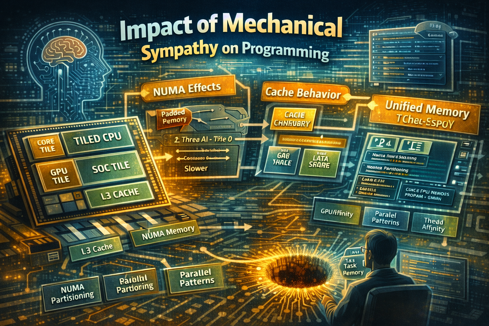

# Mechanical Sympathy — Part 2: What Really Matters from CPU tiles/boards to LLM Systems



## Impact on Programming (High-Level Languages)

**Old model** - Family 6 mindset
- Uniform memory latency (UMA)
- Cache mostly hidden
- OS handles thread scheduling scheduling

**New reality** - Family 18+
- Non-Uniform Memory Access, NUMA effects on desktop
- Thread placement matters again
- CPU behaves like a distributed system

> [NOTE]: On mainstream desktops **OS schedulers still handle most cases well** and **NUMA penalties are usually not dominant**.
> ..in high-core-count or heterogeneous CPUs, this may start to matter…

👉 Example: `Thread A (Board 0) → accessing Board 1 memory → slower`

### Practical consequences - C#, Java, Python, etc.
- Cache-aware programming becomes critical
- Allocation patterns matter: large bLLC ≠ infinite
- Parallel frameworks must evolve

Need:
- data locality
- tiling/blocking algorithms

CPU + GPU unified memory:
- No explicit copies (like old discrete GPUs)
- But bandwidth contention and cache thrashing

> Concurrency complexity increases. The job scheduler and task handlers must work very closely together.

Heterogeneous cores:
- P cores → latency-sensitive
- E cores → throughput
- LP cores → background

### Practical changes
- Thread affinity may matter again
- Memory allocation patterns matter more
- Parallel frameworks must evolve
- Task schedulers must support NUMA architecture
- Data partitioning must be adapted to the tiles/boards

Stays the same:
- Memory latency hierarchy
- Cache coherence costs
- NUMA penalties
- Bandwidth limits

> These remain hard physical constraints

### LLM Machines vs CPUs

What is an **LLM system**?
- GPU clusters
- TPU pods
- Distributed AI accelerators

**LLM machine** is not:
- A desktop CPU with motherboard architecture
- A server CPU with NUMA nodes
- A mobile SoC with heterogeneous cores
- A CPU that abstracts away memory locality and cache behavior from the programmer
- A CPU that do not suffer significant performance penalties when accessing memory across boards or nodes
- A CPU that do not have a complex memory hierarchy that requires understanding of NUMA effects and cache behavior for optimal performance
- A CPU that do not require understanding of the underlying hardware architecture for performance optimization in certain workloads (e.g., high-performance computing, databases, game engines)

**LLM** architecture comparison:
```
Nova Lake CPU: few tiles/boards, coherent memory
LLM system: thousands of nodes, non hardware and memory coherence
```

Memory model:
<pre><code>
Feature	CPU	LLM Cluster
-----------------------------------
Coherence	Hardware	Software
Latency	ns	µs–ms
Memory	Shared	Distributed
Programming	Threads	Message passing
</code></pre>

Key analogy:
- CPU ≈ micro distributed system
- LLM cluster ≈ macro distributed system

### Programming Model Convergence

CPUs becoming like clusters:
- NUMA → like network hops
- Cache → like local storage

There is already significant data movement in LLM systems:
- Sharding
- AllReduce
- Tensor parallelism

> _Converging principle_: **“Move computation to data, not data to computation”**

### Do LLM-Based Programming Change Best Practices?

> _Short answer_: No — LLMs change tooling, not physics.

What LLMs improves? → Faster discovery of:
- parallel decomposition
- automatic code generation

But LLMs do NOT change:
- Memory hierarchy
- Latency, NUMA penalties
- Bandwidth limits

### New risk

LLMs tend to:
- Over-generalize
- Assume uniform memory
- Ignore hardware topology

Especially dangerous on:
- Nova Lake
- AMD EPYC
- GPU clusters

## Why These Are Rabbit Holes?

Because they are:
- Technically correct
- Highly specialized
- Often irrelevant for most applications

For most developers these details are abstracted away by:
- OS
- runtime
- compilers
- frameworks (.NET, JVM, etc.)

### Critical Observation

Performance gains from:
- cache-line tuning
- NUMA awareness
are often negligible compared to:
- algorithmic improvements
- system architecture
- data modeling

### Mechanical Sympathy — Balanced View
- Critical for platform engineers
- Secondary for application developers

It is:
- A set of optimization techniques
- Not a paradigm shift

> _Emerging Principle_: **“Performance-aware prompting may reduce the need for some low-level hand-tuning”**.

### Practical example - processing a large data collection with a compute-intensive function.

#### Bad way, naïve compute:

```csharp
private void DoIt(List<int> data)
{
    for (int i = 0; i < data.Count; i++)
    {
        Compute(data[i]);
    }
}
```
In the above example, a loop is used to process the data collection, and sequential execution of the jobs. 
This does not take advantage of the full potential of modern, multicore CPUs.

#### Better way, parallel compute:

```csharp
Parallel.For(0, N, i =>
{
    result[i] = Compute(data[i]);
});
```
Tiles/boards CPU Problems:
- Threads move between tiles/boards
- Memory allocated on wrong tile/board
- Cache misses + remote access

#### Better parallel compute:

```csharp
private void DoIt(List<int> data)
{
    Parallel.ForEach(data, item => Compute(item));
}
```

> Moving from typical for and foreach loops to their parallel equivalents is a good example of 
> how to dramatically speed up C# code by leveraging parallel computing techniques on multiple processor cores.

#### Improved: partitioned, locality-aware

```
int numBoards = Environment.ProcessorCount / 8; // approx grouping

var partitions = Partitioner.Create(0, N, N / numBoards);

Parallel.ForEach(partitions, range =>
{
    // Each task works on a contiguous chunk
    for (int i = range.Item1; i < range.Item2; i++)
    {
        result[i] = Compute(data[i]);
    }
});
```
To check:
- More complexity
- Less portability
- Often marginal gains

Why this helps:
- Better cache locality
- Fewer cross-board accesses

But:
- Still not perfect 
- Depends on actual board layout
- Requires manual tuning 
- Not portable across architectures
- More complex code
- Not guaranteed thread affinity 
- Requires understanding of underlying hardware topology
- Often not worth the effort 
- Can lead to over-optimization 
- Reduces maintainability, readability, and scalability
- Gains often negligible vs algorithmic improvements

> [NOTE]: Different parallel constructs provide different trade-offs…

#### Advanced: thread affinity (important again)

```
using System.Runtime.InteropServices;

[DllImport("kernel32.dll")]
static extern IntPtr GetCurrentThread();

[DllImport("kernel32.dll")]
static extern UIntPtr SetThreadAffinityMask(IntPtr hThread, UIntPtr dwMask);

// Pin thread to specific cores (example)
SetThreadAffinityMask(GetCurrentThread(), (UIntPtr)0x000000FF);
```

Features:
- Windows-specific
- Requires deep expertise
- Often negligible gains
- Reduces portability
- Increases complexity
- Rarely justified in typical applications


### Practical example - false sharing

Bad:
```
class Counter
{
    public long Value;
}
```

Better:
```
[StructLayout(LayoutKind.Explicit, Size = 64)]
class PaddedCounter
{
    [FieldOffset(0)]
    public long Value;
}
```

👉 Prevents multiple cores fighting over same cache line.

But:
- Cache line size not portable
- 64 bytes is effectively standard on modern CPUs
- Hardware-specific
- Hard to maintain
- Often unnecessary

> Usually 64 bytes, but relying on it reduces portability

### GPU + CPU shared memory (future pattern)

With Xe3/Xe4 unified memory:

```
// Conceptual (future APIs)
Span<float> shared = AllocateSharedBuffer(N);

RunOnGpu(shared);
RunOnCpu(shared);
```

> _New risk_: **Cache contention between CPU & GPU**

Features:
- Still early-stage for unified memory programming models
- Requires careful synchronization 
- Often not be worth the effort for most applications
- Limited practical relevance today

## New Programming Principles (Post-Nova Lake)

### Updated rules

> _Old rule_: **“Don’t worry about memory locality”**
> 
> _New rule_: **“Assume non-uniform memory even on desktop”**

### Critical practices
- Partition data
- Align threads with data
- Avoid cross-board writes
- Minimize sharing
- Batch work (reduce synchronization)

### What LLMs change (realistically)
They help with:
- Generating parallel patterns
- Suggesting optimizations
- Explaining cache behavior

But they fail at:
- Understanding runtime topology
- Predicting NUMA layout
- Avoiding subtle contention

### New workflow

- _Human_ → **Defines architecture-aware constraints**
- _LLM_ → **Generates optimized implementation**
- _Profiler_ → **Validates reality**

## Practical Takeaway

### New Mental Model

Before (Family 6 era):
- CPU = fast black box
- Memory = slow but uniform

Now (Nova Lake and beyond):
System inside CPU:
  - Multiple compute nodes
  - Distributed memory
  - Coherent GPU

Now with AI:
```
NOT:
  "I have threads"

BUT:
  "I have compute nodes with local memory"
```

👉 Modern schedulers often outperform manual pinning

> “Incorrect pinning can degrade performance”.

### Worth repeating

- LLM-based programming do not change software development best practices.
- The principles of mechanical sympathy are important for certain domains, 
  but they do not fundamentally change how we write software at a high level.
- They are more about understanding the underlying hardware for performance-critical code, 
  rather than changing the overall software development process.
- They are not a new paradigm for software development, but rather a set of guidelines for optimizing specific types of code.
- They are not relevant for most software development tasks, and focusing on them can lead to over-optimization and neglect of more important design principles.
- They are focus on tasks that are already solved by BIOS, OS, IDE, frameworks like .NET, and compilers of programming languages. 
- In case of any of the above, **the principles of mechanical sympathy are important for the technology stack developers** (Microsoft, Amazon, Google, ..), **less for the application developers**.


### Closing Thought

> Mechanical Sympathy is a local optimization strategy, not a global engineering principle.

```
Use mechanical sympathy IF:
- CPU > 60–70% time in profiling
- Memory-bound workload
- High concurrency contention

IGNORE it IF:
- I/O bound system
- Typical CRUD / APIs
- Cloud-native distributed system
```

As I have already mentioned, I have a lot of mixed thoughts.

> **Modern systems are distributed — not by design choice, but by necessity.**

_.. tbc.._

## See also:
- [Mechanical Sympathy — Part 1: The Principles and Why They Matter](https://www.linkedin.com/pulse/mechanical-sympathy-part-1-between-insight-rabbit-holes-marek-kubis-a8xle/)
- [Mechanical Sympathy — Part 3: Suggestions for avoiding software quality rabbit holes](https://www.linkedin.com/pulse/mechanical-sympathy-part-3-suggestions-avoiding-software-marek-kubis-vybbe/)
- [Down the rabbit holes of AI-based software development process ](https://www.linkedin.com/pulse/down-rabbit-holes-ai-based-software-development-process-marek-kubis-fsyue)
- [Is there a need to change the way software is developed today?](https://www.linkedin.com/pulse/need-change-way-software-developed-today-marek-kubis-dntie)
- [This Isn’t Rebranding. It’s a Structural Shift in Software Development](https://www.linkedin.com/pulse/isnt-rebranding-its-structural-shift-software-marek-kubis-sanpe)
- [Murphy’s law and more in AI time - one by one with examples](https://www.linkedin.com/pulse/murphys-law-more-ai-time-one-examples-marek-kubis-fkaze)
- [The Agile Vibe Coding and Conway's Law](https://www.linkedin.com/pulse/agile-vibe-coding-conways-law-marek-kubis-m0wpe)
- [Using a digital banking solution to prove Conway’s Law in AI-Driven engineering - example 1](https://www.linkedin.com/pulse/using-digital-banking-solution-prove-conways-law-ai-driven-kubis-xqlre/)
- [Using a .NET 10 migration project to prove Conway’s Law in AI-Driven engineering - example 2](https://www.linkedin.com/pulse/using-net-10-migration-project-prove-conways-law-ai-driven-kubis-abqae)
- [Where traditional Agile breaks in AI-driven systems](https://www.linkedin.com/pulse/where-traditional-agile-breaks-ai-driven-systems-marek-kubis-4wq6e/)
- [AI - It seems nobody has it fully figured out yet](https://www.linkedin.com/pulse/ai-nobody-has-figured-out-marek-kubis-bkyge)
- [Internal Development Platform and Agile Vibe Coding](https://www.linkedin.com/pulse/internal-development-platform-agile-vibe-coding-marek-kubis-kyhqe)
- [Everyone will be vibe coders](https://www.linkedin.com/pulse/everyone-vibe-coders-marek-kubis-tlgze)
- [The Structural problems AI introduces into the SDLC](https://www.linkedin.com/pulse/structural-problems-ai-introduces-sdlc-marek-kubis-qyt6e)
- [Signals That Reveal the True Maturity of Organisations Claiming “AI-Driven Development”](https://www.linkedin.com/pulse/signals-reveal-true-maturity-organisations-claiming-ai-driven-kubis-urule)
- [AI - It seems nobody has it fully figured out yet](https://www.linkedin.com/pulse/ai-nobody-has-figured-out-marek-kubis-bkyge)
- [Agile Vibe Coding positioning and if this works, what changes?](https://www.linkedin.com/pulse/agile-vibe-coding-positioning-works-what-changes-marek-kubis-r4ate)
- [Agile Vibe Coding – Ceremony Modes](https://www.linkedin.com/pulse/agile-vibe-coding-ceremony-modes-marek-kubis-meq9e)
- [Agile Vibe Coding ceremonies approach compared to a simple one-prompt-per-task approach](https://www.linkedin.com/pulse/agile-vibe-coding-ceremonies-approach-compared-simple-marek-kubis-ecx5e)
- [Agile Vibe Coding Maturity Model](https://www.linkedin.com/pulse/agile-vibe-coding-maturity-model-marek-kubis-bbtqe)
- [The Agile Vibe Coding - the 4-level adaptive ceremony system](https://www.linkedin.com/pulse/agile-vibe-coding-4-level-adaptive-ceremony-system-marek-kubis-jizke)

- [Agile Vibe Coding Manifesto](https://agilevibecoding.org/)
- [Principles Behind the Agile Vibe Coding Manifesto - extended version](https://github.com/marekartur-dev/agilevibecoding/blob/main/Docs/Home/Principles.md)

- [Agile Vibe Coding](https://www.reddit.com/r/AgileVibeCoding/)
- [Marek Kubis - blog](https://github.com/marekartur-dev/agilevibecoding/tree/main)
