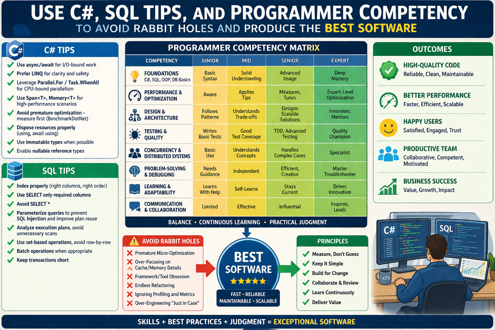

# Mechanical Sympathy — Part 3: Suggestions for avoiding software quality rabbit holes

> Don't focus too much on hardware presented in Parts 1 and 2. Focus on the practical areas listed below.



```
optimisation Priority Pyramid

1. Architecture & Algorithms
2. Data Access & I/O
3. Concurrency Model
4. Memory & Allocation
5. Micro-optimisations (Mechanical Sympathy zone)
```

> This is not a checklist to apply.
> This is a map of areas where **optimisation can happen — only after profiling proves it is necessary**.

```
Importance tiers: 
✅ Common       → Start here (80% high impact) 
⚠️ Situational  → Only after profiling
🚫 Rare         → Only in bottlenecks + expertise required 
```


## Memory Management & Garbage Collection
```
Priority: 4 — Memory & Allocation
Importance: ⚠️ Situational
```

- Remember that garbage collection and using IDisposable are important aspects of tuning C# performance by efficiently using memory resources.
- Avoid premature optimisations that can be counterproductive, making C# code harder to read, maintain, and extend. 
- Focus on writing clean and straightforward code, then optimise only when necessary after thorough profiling. 

## Asynchronous Programming
```
Priority: 1 — Architecture & Algorithms
Importance: ✅ Common (High impact, should be default focus)
```

- Use asynchronous programming with async/await to improve responsiveness and scalability of C# applications, especially for I/O-bound operations.
- Limit the number of concurrent operations. Without limiting concurrency, many tasks will run simultaneously, which can lead to heavy load and degraded overall performance. 

  Bad way:
```
    public async Task ProcessManyItems(List<string> items)
    {
        var tasks = items.Select(async item => await ProcessItem(item));
        await Task.WhenAll(tasks);
    }
```
  Good way:
```
    public async Task ProcessManyItems(List<string> items, int maxConcurrency = 10)
    {
        using (var semaphore = new SemaphoreSlim(maxConcurrency))
        {
            var tasks = items.Select(async item =>
            {
                await semaphore.WaitAsync(); // Limit concurrency by waiting for the semaphore.
                try
                {
                    await ProcessItem(item);
                }
                finally
                {
                    semaphore.Release(); // Release the semaphore to allow other operations.
                }
            });

            await Task.WhenAll(tasks);
        }
    }
```
- Use **ConfigureAwait(false)** when possible to avoid unnecessary context switching and can help prevent deadlocks 
  in our async code and improve efficiency by not forcing continuations to run on the original synchronization context.
  Avoid potential deadlocks example:
```
    public async Task<string> LoadDataAsync()
    {
        var data = await ReadDataAsync().ConfigureAwait(false); 
        return ProcessData(data);
    }
```

## Parallelism (CPU-bound work)
```
Priority: 3 — Concurrency Model
Importance: ⚠️ Situational
```

- Utilize parallel loops with **Parallel.For()** and **Parallel.ForEach()** to take advantage of multiple CPU cores for data processing tasks, 
  but be cautious of thread contention and overhead. Examples have already been given in part 2 of the _Mechanical Sympathy_ series.
- Use Partitioner class for efficient workload distribution in parallel loops, especially when processing large collections. 
  This can help improve performance by reducing contention and improving cache locality. Example already provided.

## Caching Data
```
Priority: 2 — Data Access & I/O
Importance: ✅ Common
```

- Implement data caching with in-memory cache or distributed cache (like **Redis**) to reduce latency and improve performance for frequently accessed data. 
  Caching can significantly speed up data retrieval and reduce load on databases or external services.
  In-memory cache example:
```
    private readonly IMemoryCache _cache;
    public MyService(IMemoryCache cache)
    {
        _cache = cache;
    }

    public async Task<string> GetDataAsync(string key)
    {
        if (!_cache.TryGetValue(key, out string data))
        {
            data = await FetchDataFromDatabaseAsync(key);   // Simulate fetching data from a database or external service.
            _cache.Set(key, data, TimeSpan.FromMinutes(5)); // Cache the data for 5 minutes.
        }
        return data;
    }
```
  Redis cache example:
```
    private readonly IDistributedCache _cache;
    public MyService(IDistributedCache cache)
    {
        _cache = cache;
    }

    public async Task<string> GetDataAsync(string key)
    {
        var data = await _cache.GetStringAsync(key);
        if (data == null)
        {
            data = await FetchDataFromDatabaseAsync(key);   // Simulate fetching data from a database or external service.
            await _cache.SetStringAsync(key, data, new DistributedCacheEntryOptions
            {
                AbsoluteExpirationRelativeToNow = TimeSpan.FromMinutes(5) // Cache the data for 5 minutes.
            });
        }
        return data;
    }
```

## Concurrency and Thread Safety (shared state)
```
Priority: 3 — Concurrency Model
Importance: ⚠️ Situational
```

- Use lock-free data structures when possible to reduce contention and improve performance in concurrent scenarios. 
  Lock-free data structures can help avoid bottlenecks and improve scalability in multi-threaded applications.
  Example of using ConcurrentQueue:
```
    private readonly ConcurrentQueue<string> _queue = new ConcurrentQueue<string>();

    public void Enqueue(string item)
    {
        _queue.Enqueue(item); // Thread-safe enqueue operation.
    }

    public bool TryDequeue(out string item)
    {
        return _queue.TryDequeue(out item); // Thread-safe dequeue operation.
    }
```
- Use efficient synchronization constructs like SemaphoreSlim, ReaderWriterLockSlim, Monitor, or ConcurrentDictionary 
  to manage access to shared resources without causing excessive blocking or contention. 
  These constructs can help improve performance by allowing multiple threads to access resources concurrently while still ensuring thread safety.
  Example of using `lock` on bad way:
```
    // The `lock` keyword is used again for synchronization. 
    // Lock is simple and correct, but may become a bottleneck under high contention.

    private readonly object _lock = new object();
    private readonly List<int> _list = new List<int>();

    public void Add(int item)
    {
        lock (_lock)
        {
            _list.Add(item);
        }
    }
```
  Example of proper using ReaderWriterLockSlim:
```
    private readonly ReaderWriterLockSlim _lock = new ReaderWriterLockSlim();
    private string _sharedResource;
    
    public void WriteResource(string value)
    {
        _lock.EnterWriteLock();
        try
        {
            _sharedResource = value; // Write operation on shared resource.
        }
        finally
        {
            _lock.ExitWriteLock(); // Ensure the lock is released even if an exception occurs.
        }
    }
    
    public string ReadResource()
    {
        _lock.EnterReadLock();
        try
        {
            return _sharedResource; // Read operation on shared resource.
        }
        finally
        {
            _lock.ExitReadLock(); // Ensure the lock is released even if an exception occurs.
        }
    }
```
- Employ the Interlocked class for atomic operations on shared state without relying on locks, reducing contention and improving performance.
  Example of incorrect atomic increment that can result in contention and performance degradation:
```
    private int _counter;
    private readonly object _syncRoot = new object();

    public void IncrementCounter()
    {
        lock (_syncRoot)
        {
            _counter++;
        }
    }
```
  Example of proper using Interlocked for atomic increment:
```
    private long _counter;
    
    public void Increment()
    {
        Interlocked.Increment(ref _counter);   // Atomically increments the counter.
    }
    
    public long GetCounter()
    {
        return Interlocked.Read(ref _counter); // Atomically reads the counter value.
    }
```

## LINQ Performance optimisation
```
Priority: 2 — Data Access & I/O
Importance: ✅ Common
```

- Know the difference between deferred and immediate LINQ execution to avoid unintended performance issues. 
  Deferred execution can lead to multiple enumerations of the same collection, 
  while immediate execution can help improve performance by materializing the results when needed.
  Example of deferred execution that can lead to performance issues:
```
    // Deferred execution, query is not executed until enumerated.
    var query = myCollection.Where(x => x.IsActive); 

    foreach (var item in query)
    {
        // Each enumeration will execute the query again, which can lead to performance issues.
    }
```
  Example of immediate execution that can improve performance:
```
    // Immediate execution, results are materialized in a list.
    var activeItems = myCollection.Where(x => x.IsActive).ToList(); 

    foreach (var item in activeItems)
    {
        // The query is executed only once, and the results are stored in memory for efficient access.
    }
```
- Prefer the syntax (LINQ query or method) that improves readability for your team.
  Complex transformations are often clearer with query syntax, while simple pipelines 
  are usually more concise with method syntax.
  Example of using LINQ query syntax:
```
    // LINQ query syntax for better readability.
    var activeItems = from item in myCollection
                      where item.IsActive
                      select item; 
```
  Example of using LINQ method syntax:
```
    // LINQ method syntax, which can be less readable for complex queries.
    var activeItems = myCollection.Where(x => x.IsActive); 
```
- Be aware of potential pitfalls when using LINQ in a multithreaded environment to avoid issues with thread safety and performance bottlenecks. 
  Bad way, multiple threads enumerating the same `IEnumerable` resulting from a LINQ query, which may lead to unpredictable behaviour:
```
    Parallel.ForEach(items, item =>
    {
        var matchingItems = items.Where(i => i.Name == item.Name);
        Process(matchingItems);
    });
```
  Good way, materializing the results of the LINQ query into a thread-safe collection before processing:
```
    var itemGroups = items.GroupBy(i => i.Name).ToDictionary(g => g.Key, g => g.ToList()); // Materialize groups into a dictionary for thread-safe access.
    Parallel.ForEach(items, item =>
    {
        if (itemGroups.TryGetValue(item.Name, out var matchingItems))
        {
            Process(matchingItems); // Process the matching items safely in a multithreaded environment.
        }
    });
```

## JIT Compilation
```
Priority: 5 — Micro-optimisations
Importance: 🚫 Rare
```

- Perform loop unrolling for better performance in performance-critical sections of code, but be cautious of code readability and maintainability. 
  Loop unrolling can help reduce the overhead of loop control and improve performance, but it can also make the code more complex and harder to understand.
  Example of loop unrolling:
```
    for (int i = 0; i < items.Length; i += 4)
    {
        Process(items[i]);
        if (i + 1 < items.Length) Process(items[i + 1]);
        if (i + 2 < items.Length) Process(items[i + 2]);
        if (i + 3 < items.Length) Process(items[i + 3]);
    }
```
  - Utilize the aggressive inlining attribute for critical methods to reduce method call overhead and improve performance, 
    but be mindful of the potential increase in code size. 
    Aggressive inlining can help improve performance by eliminating the overhead of method calls, 
    but it can also lead to larger code size, which may negatively impact cache performance.
    Example of instructing the JIT compiler to improve performance by reducing the overhead of method call:
  ```
    [MethodImpl(MethodImplOptions.AggressiveInlining)]
    void ProcessItem(Item item)
    {
        // Method implementation
    }
  ```

## Stack and Heap Allocation
```
Priority: 4 — Memory & Allocation
Importance: ⚠️ Situational
```

- Limit the use of heap-allocated objects when possible to reduce garbage collection overhead and improve performance. 
  Heap allocation can lead to increased memory usage and more frequent garbage collection, which can degrade performance.
  Bad way example of heap allocation:
```
    // This method creates a new string object on the heap for each call, 
    // which can lead to increased memory usage and garbage collection overhead.

    private string GetItemName(int index)
    {
        return new string($"Item{index}".ToCharArray());
    }
```
  Good way example of heap allocation:
```
    // By returning the interpolated string directly, we avoid unnecessary extra allocations 
    // (like creating a char array), but the string itself is still allocated on the heap 
    // and reduce the overhead provided by garbage collection.

    private string GetItemName(int index)
    {
        return $"Item{index}";
    }
```
  Example of limiting heap allocation by using value types:
```
    struct Point
    {
        public int X { get; }
        public int Y { get; }
        public Point(int x, int y)
        {
            X = x;
            Y = y;
        }
    }
```
- Use stackalloc keyword for memory allocation on the stack for small, short-lived data structures to improve performance and reduce garbage collection overhead. 
  Stack allocation can help improve performance by avoiding heap allocation and reducing the frequency of garbage collection, 
  but it should be used with caution to avoid stack overflow exceptions.
  Example of using stackalloc for small arrays:
```
    public void ProcessData(int size)
    {
        // Use stackalloc for small arrays, fallback to heap allocation for larger sizes.
        Span<int> data = size <= 1024 ? stackalloc int[size] : new int[size]; // Allocate memory on the stack

        // Process the data...
    }
```

## Efficient Data Structures and Algorithms
```
Priority: 1 — Architecture & Algorithms
Importance: ✅ Common (High impact, should be default focus)
```

- Choose the right data structure for your needs to optimise performance and memory usage. 
  For example, use a **Dictionary** for fast lookups, a List for dynamic arrays, or a LinkedList for efficient insertions and deletions.
  Example of choosing the right data structure:
```
    // Using a Dictionary for fast lookups by key.
    var dictionary = new Dictionary<string, int>();
    dictionary["key1"] = 1;
    dictionary["key2"] = 2;

    // Using a List for dynamic arrays when order matters.
    var list = new List<int> { 1, 2, 3 };
    list.Add(4);

    // Selecting a HashSet instead of a List offers faster look-up times and greater performance.
    HashSet<int> userList = new HashSet<int>();
```
- Employ custom sorting algorithms for specific use cases to improve performance, 
  but be cautious of the complexity and maintainability of the code. 
  Relying on default sorting algorithms may not always be the best choice for specific performance-centric use cases.
  Custom sorting algorithms can help improve performance for specific scenarios, 
  but they can also be more complex and harder to maintain than built-in sorting methods.
  Example of using a custom sorting algorithm:
```
    public void CustomSort(int[] array)
    {
        // Implement a custom sorting algorithm (e.g., QuickSort) for better performance on specific data sets.
        QuickSort(array, 0, array.Length - 1);
    }
    
    private void QuickSort(int[] array, int low, int high)
    {
        if (low < high)
        {
            int pi = Partition(array, low, high);
            QuickSort(array, low, pi - 1);
            QuickSort(array, pi + 1, high);
        }
    }
    
    private int Partition(int[] array, int low, int high)
    {
        int pivot = array[high];
        int i = low - 1;
        for (int j = low; j < high; j++)
        {
            if (array[j] < pivot)
            {
                i++;
                Swap(array, i, j);
            }
        }
        Swap(array, i + 1, high);
        return i + 1;
    }
    
    private void Swap(int[] array, int i, int j)
    {
        int temp = array[i];
        array[i] = array[j];
        array[j] = temp;
    }
```

## Learn advanced data structures and algorithms to optimise performance for specific use cases
```
Priority: 3 — Concurrency Model
Importance: ⚠️ Situational (High impact in specialized domains)
```

- Advanced data structures like B-trees, binomial and Fibonacci heaps, AVL/Red Black self-balancing binary trees, 
  Splay self-adjusting binary trees, or  probabilistic data structure like Skip List can help optimise performance for specific scenarios, 
  but they may require additional complexity and maintenance.
  The ability to recognize different algorithms is essential for identifying NP problems such as the knapsack problem, 
  the traveling salesman problem, the graph colouring problem, and the Bloom filter for membership testing in a space-efficient manner, etc..
  
  Example of using a Trie for efficient prefix searching:
```
    public class TrieNode
    {
        public Dictionary<char, TrieNode> Children { get; } = new Dictionary<char, TrieNode>();
        public bool IsEndOfWord { get; set; }
    }

    public class Trie
    {
        private readonly TrieNode _root = new TrieNode();

        public void Insert(string word)
        {
            var current = _root;
            foreach (var ch in word)
            {
                if (!current.Children.ContainsKey(ch))
                {
                    current.Children[ch] = new TrieNode();
                }
                current = current.Children[ch];
            }
            current.IsEndOfWord = true;
        }

        public bool Search(string word)
        {
            var current = _root;
            foreach (var ch in word)
            {
                if (!current.Children.ContainsKey(ch))
                {
                    return false;
                }
                current = current.Children[ch];
            }
            return current.IsEndOfWord;
        }
    }
```

## Reflection and Code Generation
```
Priority: 5 — Micro-optimisations
Importance: 🚫 Rare
```

- Avoid excessive use of Reflection APIs for performance-critical code paths, as it can lead to significant overhead and degrade performance. 
  Reflection can be useful for certain scenarios, but it should be used judiciously to avoid performance issues.
  Example of excessive use of Reflection:
```
    public void InvokeMethod(object obj, string methodName)
    {
        // Reflection to get method info, which can be slow.
        var method = obj.GetType().GetMethod(methodName); 

        // Reflection to invoke the method, which can also be slow.
        method.Invoke(obj, null); 
    }
```
- Use dynamically generated lambda expressions instead of reflection for better performance when creating delegates or accessing members at runtime. 
  Dynamically generated lambda expressions can help improve performance by avoiding the overhead of reflection, 
  but they can also be more complex to implement and maintain.
  Bad way example of using reflection for property access:
```
    private static void SetPropertyViaReflection(object obj, PropertyInfo property, object value)
    {
        property.SetValue(obj, value);
    }
```
  Good way example of using dynamically generated lambda expressions instead of using reflection:
```
    private static void SetPropertyViaExpression(object obj, PropertyInfo property, object value)
    {
        var setter = property.SetMethod
                             .CreateDelegate(typeof(Action<,>)
                             .MakeGenericType(property.DeclaringType, property.PropertyType));        

        ((dynamic)setter)(obj, value);
    }
```
  Another example of using dynamically generated lambda expressions:
```
    public Func<T, object> CreatePropertyAccessor<T>(string propertyName)
    {
        var param = Expression.Parameter(typeof(T), "x");
        var property = Expression.Property(param, propertyName);
        var convert = Expression.Convert(property, typeof(object));

        // Dynamically generate a lambda expression for property access.
        return Expression.Lambda<Func<T, object>>(convert, param).Compile(); 
    }
```

## Process multiple data elements in parallel
```
Priority: 3 — Concurrency Model
Importance: ⚠️ Situational
```

- Use Vector types and SIMD (Single Instruction, Multiple Data) to process multiple data elements in parallel 
  for improved performance in computationally intensive tasks. 
  SIMD can help improve performance by allowing multiple data elements to be processed simultaneously, 
  but it requires careful consideration of data alignment and may not be suitable for all scenarios.
  Example of using Vector types for SIMD processing:
```
    public void ProcessDataWithSIMD(float[] data)
    {
        // Get the number of elements that can be processed in parallel.
        int vectorSize = Vector<float>.Count; 
        
        for (int i = 0; i < data.Length; i += vectorSize)
        {
            // Load a vector of data from the array.
            var vector = new Vector<float>(data, i); 

            // Perform SIMD operation (e.g., multiply by 2).
            var result = Vector.Multiply(vector, new Vector<float>(2.0f)); 

            // Store the result back into the array.
            result.CopyTo(data, i); 
        }
    }
```
- Ensure compatibility with hardware-accelerated SIMD instructions by using the **System.Numerics.Vectors** library and checking for hardware support at runtime. 
  This can help improve performance by leveraging hardware capabilities, but it may require additional checks to ensure compatibility.
  Example of checking for hardware support for SIMD:
```
    public void ProcessDataWithSIMD(float[] data)
    {
        // Check if the hardware supports SIMD instructions.
        if (Vector.IsHardwareAccelerated) 
        {
            int vectorSize = Vector<float>.Count;
            for (int i = 0; i < data.Length; i += vectorSize)
            {
                var vector = new Vector<float>(data, i);
                var result = Vector.Multiply(vector, new Vector<float>(2.0f));

                result.CopyTo(data, i);
            }
        }
        else
        {
            // Fallback to scalar processing if SIMD is not supported.
            for (int i = 0; i < data.Length; i++)
            {
                data[i] *= 2.0f; // Scalar processing as a fallback.
            }
        }
    }
```

## Task and ValueTask
```
Priority: 3 — Concurrency Model
Importance: ⚠️ Situational
```

- Avoid using ValueTask unless profiling shows Task allocation is a bottleneck, 
  as incorrect usage can lead to subtle bugs and worse performance.
  ValueTask is easy to misuse (multiple awaits, boxing, etc.).
  Example of using ValueTask:
```
    public ValueTask<string> GetDataAsync()
    {
        if (TryGetData(out var data))
        {
            // Return a completed ValueTask if data is available synchronously.
            return new ValueTask<string>(data); 
        }
        else
        {
            // Return a ValueTask that represents an asynchronous operation.
            return new ValueTask<string>(FetchDataAsync()); 
        }
    }
```
- optimise performance with appropriate async operations by using Task for long-running operations and ValueTask 
  for short-lived operations to minimize overhead and improve responsiveness. 
  Choosing the right type of asynchronous operation can help optimise performance and improve the responsiveness of applications.
  Example of optimizing async operations:
```
    public async Task<string> GetDataAsync()
    {
        if (IsDataAvailable())
        {
            // Use synchronous method for short-lived operations.
            return GetDataSynchronously(); 
        }
        else
        {
            // Use asynchronous method for long-running operations.
            return await FetchDataFromDatabaseAsync(); 
        }
    }
```

## Boxing and Unboxing
```
Priority: 4 — Memory & Allocation
Importance: ⚠️ Situational
```

- Understand the cost of boxing and unboxing in C# and how it can lead to performance degradation, especially in scenarios involving value types. 
  Boxing and unboxing can lead to increased memory usage and reduced performance, so it's important to be aware of when it occurs.
  Example of boxing and unboxing:
```
    // Good way - avoiding unnecessary boxing and unboxing:
    int number = 42; 

    // Bad way - not paying attention to boxing and unboxing:
    object boxedValue = number;         // Boxing a value type (int) into an object.
    int unboxedValue = (int)boxedValue; // Unboxing the object back to a value type (int).
```
- Utilize generics and custom interfaces to avoid boxing and unboxing when working with collections or APIs that involve value types. 
  Generics can help avoid boxing and unboxing by allowing you to work with value types directly, improving performance.
  Bad way - the use of object types:
```
    public interface INumber
    {
        object Value { get; set; }
    }

    public class Number : INumber
    {
        public object Value { get; set; }
    }
```  
  Example of using generics to avoid boxing and unboxing:
```
    // Using a generic List to avoid boxing and unboxing of value types.

    // No boxing occurs when adding integers to the list.
    List<int> numbers = new List<int>(); 

    // Adding an integer to the list without boxing.
    numbers.Add(42);                     

    // Using a custom interface to avoid boxing when working with value types.
    public interface IProcessor<T>
    {
        void Process(T item);
    }

    public class IntProcessor : IProcessor<int>
    {
        public void Process(int item)
        {
            // Processing an integer without boxing.
        }
    }
```
  Good way - using generics to avoid boxing and unboxing:
```
    public interface INumber<T>
    {
        T Value { get; set; }
    }

    // Utilize generics to avoid boxing
    public class Number<T> : INumber<T> 
    {
        public T Value { get; set; }
    }
```

## Network Communication optimisation
```
Priority: 3 — Concurrency Model
Importance: ⚠️ Situational
```

- Choose efficient serialisation methods (e.g., Protocol Buffers, MessagePack) for network communication to reduce payload size and improve performance. 
  Efficient serialisation can help reduce the amount of data transmitted over the network, improving performance and reducing latency.
  Example of using Protocol Buffers for efficient serialisation:
```
    // Define a Protocol Buffers message for efficient serialization.
    message MyData
    {
        int32 Id = 1;
        string Name = 2;
    }
```
  Bad way - using a slow and outdated XmlSerializer for data serialization:
```
    private string SerializeObjectToXml<T>(T obj)
    {
        var serializer = new XmlSerializer(typeof(T));
        using (var writer = new StringWriter())
        {
            serializer.Serialize(writer, obj);
            return writer.ToString();
        }
    }
```
  Good way - using a modern and efficient serialiser for data serialisation:
```
    // Using MessagePack for efficient serialization of objects to a compact binary format.
    private byte[] SerializeObjectToMessagePack<T>(T obj)
    {
        // Efficient serialization using MessagePack.
        return MessagePackSerializer.Serialize(obj); 
    }

    // Using Newtonsoft.Json - a faster, more efficient library for serialization compared to XmlSerializer.
    private string SerializeObjectToJson<T>(T obj)
    {
        return JsonConvert.SerializeObject(obj);
    }
```

- Use HttpClientFactory to manage HttpClient instances and avoid socket exhaustion issues in high-throughput applications. 
  HttpClientFactory can help improve performance and reliability by managing the lifecycle of HttpClient instances, 
  but it requires proper configuration to avoid potential issues.
  Example of using HttpClientFactory:
```
    public class MyService
    {
        private readonly HttpClient _httpClient;
        public MyService(IHttpClientFactory httpClientFactory)
        {
            // Create an HttpClient instance from the factory.
            _httpClient = httpClientFactory.CreateClient(); 
        }

        public async Task<string> GetDataAsync(string url)
        {
            // Use the HttpClient instance to make a request.
            var response = await _httpClient.GetAsync(url); 
            response.EnsureSuccessStatusCode();

            // Read the response content as a string.
            return await response.Content.ReadAsStringAsync(); 
        }
    }
```

## Proper Exception Handling
```
Priority: 2 — Data Access & I/O
Importance: ✅ Common
```

- Avoid using exceptions for flow control as it can lead to performance degradation and make code harder to read and maintain. 
  Exceptions should be reserved for truly exceptional conditions, not for regular control flow.
  Bad way - using exceptions for flow control:
```
    public int ParseInt(string input)
    {
        try
        {
            // Using exceptions for flow control, which can degrade performance.
            return int.Parse(input); 
        }
        catch (FormatException)
        {
            // Return a default value on parsing failure, which is not ideal.
            return -1; 
        }
    }
```
  Good way - using TryParse for better performance and readability:
```
    public int ParseInt(string input)
    {
        // Using TryParse to avoid exceptions for flow control.
        if (int.TryParse(input, out int result)) 
        {
            // Return the parsed integer if successful.
            return result; 
        }
        else
        {
            // Return a default value on parsing failure, which is more efficient.
            return -1; 
        }
    }
```

- Use exception filters to minimize catch blocks and improve performance by only catching specific exceptions that you can handle, 
  while allowing other exceptions to propagate up the call stack. 
  Exception filters can help improve performance by reducing the number of catch blocks and allowing unhandled exceptions to be handled by higher-level error handling mechanisms.
  Bad way - catching all exceptions without filters:
```
    public void ProcessData(string input)
    {
        try
        {
            // Perform an operation
        }
        catch (Exception ex)
        {
            if (ex is InvalidOperationException || ex is ArgumentNullException)
            {
                // Handle the specific exceptions
            }
            else
            {
                throw;
            }
        }
    }
```

  Good way - catching exceptions only when a certain condition is met:
```
    public void ProcessData(string input)
    {
        try
        {
            // Code that may throw exceptions.
        }
        catch (Exception ex) when (ex is FormatException || ex is InvalidOperationException)
        {
            // Handle specific exceptions with an exception filter.
            Console.WriteLine($"Handled exception: {ex.Message}");
        }
    }
```

## Nullability & Nullable Reference Types
```
Priority: 2 — Data Access & I/O
Importance: ✅ Common
```

- Leverage null-coalescing operators (??, ??=) to provide default values and simplify null checks, improving code readability and maintainability. 
  Null-coalescing operators can help reduce the amount of boilerplate code needed for null checks, making the code cleaner and easier to read.
  Example of using null-coalescing operators:
```
    public string GetName(string input)
    {
        return input ?? "Default Name"; // Use null-coalescing operator to provide a default value if input is null.
    }
```

- Use nullable reference types to avoid runtime null reference exceptions and improve code safety by explicitly indicating which reference types can be null. 
  Nullable reference types can help catch potential null reference issues at compile time, improving code safety and reducing the likelihood of runtime errors.
  Example of using nullable reference types:
```
    public string? GetNullableName(string input)
    {
        return string.IsNullOrEmpty(input) ? null : input; // Return null if input is null or empty, otherwise return the input.
    }
```

## Efficient buffer management
```
Priority: 4 — Memory & Allocation
Importance: ⚠️ Situational
```

- Know when to use Span over arrays for better performance and reduced memory allocations when working with contiguous memory regions. 
  Span can help improve performance by allowing you to work with slices of arrays or other memory buffers without creating additional allocations.
  Example of using Span for efficient buffer management:
```
    // byte[] data = GetData();
    // Span<byte> dataSpan = data.AsSpan();
    // ProcessData(dataSpan);

    public void ProcessData(Span<byte> data)
    {
        // Process the data in the span without creating additional allocations.
    }
```

- Use ArrayPool to recycle temporary buffers and reduce garbage collection overhead in high-performance scenarios, 
  but be mindful of potential issues with buffer reuse and thread safety. 
  ArrayPool can help improve performance by reusing buffers, but it requires careful management 
  to avoid issues with buffer reuse and thread safety.
  Example of using ArrayPool for efficient buffer management:
```
    public void ProcessData(int size)
    {
        var pool = ArrayPool<byte>.Shared; // Get a shared instance of the ArrayPool.
        byte[] buffer = pool.Rent(size);   // Rent a buffer from the pool.
        try
        {
            // Process the data using the rented buffer.
        }
        finally
        {
            pool.Return(buffer); // Return the buffer to the pool for reuse.
        }
    }
```

## Lazy & Eager Loading Techniques 
```
Priority: 2 — Data Access & I/O
Importance: ✅ Common
```

- Understand the trade-offs between lazy and eager loading to optimise performance and resource usage based on the specific use case. 
  Lazy loading can help improve performance by deferring the loading of resources until they are actually needed, 
  while eager loading can help reduce latency by loading resources upfront.
  Example of lazy loading:
```
    public class LazyLoadedResource
    {
        private readonly Lazy<ExpensiveResource> _resource = new Lazy<ExpensiveResource>(() => new ExpensiveResource());
        
        public ExpensiveResource Resource => _resource.Value; // The resource will be created only when accessed for the first time.
    }
```
  Example of eager loading:
```
    public class EagerLoadedResource
    {
        private readonly ExpensiveResource _resource = new ExpensiveResource(); // The resource is created immediately when the class is instantiated.
        
        public ExpensiveResource Resource => _resource; // The resource is already available when accessed.
    }
```

- Implement lazy properties with the Lazy class to defer expensive computations until the value is actually needed, improving performance and reducing unnecessary work. 
  Lazy properties can help improve performance by avoiding unnecessary computations and only performing them when the value is actually needed.
  Example of implementing lazy properties with the Lazy class:
```
    public class MyClass
    {
        // Using Lazy<T> to initialize resources only when needed
        private readonly Lazy<string> _expensiveValue = new Lazy<string>(() => ComputeExpensiveValue());
        
        // The expensive value will be computed only when accessed for the first time.
        public string ExpensiveValue => _expensiveValue.Value; 

        private static string ComputeExpensiveValue()
        {
            // Simulate an expensive computation.
            Thread.Sleep(1000);
            return "Expensive Value";
        }
    }
```

## String Interpolation and Comparison
```
Priority: 4 — Memory & Allocation
Importance: ⚠️ Situational
```

- Use StringComparison options for efficient string comparison to improve performance and avoid issues with culture-specific comparisons. 
  StringComparison options can help improve performance by allowing you to specify the type of comparison to perform, 
  which can be more efficient than the default ordinal comparison in certain scenarios.
  Bad way string comparison:
```
    public bool AreStringsEqual(string str1, string str2)
    {
        // Allocating additional memory for string conversion before comparison
        bool equal = str1.ToLower() == str2.ToLower();
    }
```  
  Example of using StringComparison for efficient string comparison:
```
    public bool AreStringsEqual(string str1, string str2)
    {
        // Use StringComparison for efficient and culture-insensitive comparison.
        return string.Equals(str1, str2, StringComparison.OrdinalIgnoreCase); 
    }
```

- Opt for StringBuilder over string concatenation in loops to reduce memory allocations and improve performance when building large strings. 
  StringBuilder can help improve performance by reducing the number of intermediate string objects created during concatenation, especially in loops.
  Bad way of string concatenation in a loop:
```
    public string BuildString(IEnumerable<string> parts)
    {
        // This will create a new string object on each concatenation, leading to performance issues.
        string result = string.Empty; 

        foreach (var part in parts)
        {
            // Concatenating strings in a loop can lead to excessive memory allocations.
            result += part;           
        }
        return result;
    }
```
  Example of using StringBuilder for efficient string concatenation:
```
    public string BuildString(IEnumerable<string> parts)
    {
        // Use StringBuilder to efficiently build a large string.
        var stringBuilder = new StringBuilder(); 

        foreach (var part in parts)
        {
            // Append each part to the StringBuilder.
            stringBuilder.Append(part);  
        }

        // Convert the StringBuilder to a string once all parts are appended.
        return stringBuilder.ToString(); 
    }
```

## Optimise SQL database queries and improve performance
```
Priority: 2 — Data Access & I/O
Importance: ✅ Common
```

- Understanding how SQL Server processes queries, manages indexes, and handles transactions can help you write more efficient SQL queries and optimise database performance. 
  This includes knowledge of query execution plans, indexing strategies, and transaction isolation levels.
  Example of optimizing a SQL query by understanding execution plans:
```
    -- Original query that may perform poorly due to lack of indexing
    SELECT * FROM Orders WHERE CustomerId = 123;

    -- optimised query with an index on CustomerId for improved performance
    CREATE INDEX IX_Orders_CustomerId ON Orders(CustomerId);

    SELECT * FROM Orders WHERE CustomerId = 123; -- This query will now utilize the index for faster retrieval.
```


## Closing Thought

> Mechanical Sympathy matters — but only after we’ve exhausted architectural, algorithmic, and system-level optimisations.

The real challenge is not understanding everything…
> …but knowing what matters, and what is just a rabbit hole.

```
Rule of thumb:

If you haven't profiled it,
you shouldn't be optimizing it.

If you haven't hit a bottleneck,
you shouldn't be thinking about cache lines.
```

## See also:
- [Mechanical Sympathy — Part 1: The Principles and Why They Matter](https://www.linkedin.com/pulse/mechanical-sympathy-part-1-between-insight-rabbit-holes-marek-kubis-a8xle/)
- [Mechanical Sympathy — Part 2: What Really Matters from CPU tiles/boards to LLM Systems](https://www.linkedin.com/pulse/mechanical-sympathy-part-2-what-really-matters-from-cpu-marek-kubis-yim4e/)
- [Mechanical Sympathy — Part 4: AI, Profiling, and Non-Naïve optimisation](https://www.linkedin.com/pulse/mechanical-sympathy-part-4-ai-profiling-non-na%C3%AFve-marek-kubis-bub0e)
- [Mechanical Sympathy — Part 5: Mechanical Sympathy — Part 5: AI and Architectural Decisions Where the Most Expensive Mistakes Are Made and Continuous Optimisation](https://www.linkedin.com/pulse/mechanical-sympathy-part-5-ai-architectural-decisions-marek-kubis-6nbae)
- [Down the rabbit holes of AI-based software development process ](https://www.linkedin.com/pulse/down-rabbit-holes-ai-based-software-development-process-marek-kubis-fsyue)
- [Is there a need to change the way software is developed today?](https://www.linkedin.com/pulse/need-change-way-software-developed-today-marek-kubis-dntie)
- [This Isn’t Rebranding. It’s a Structural Shift in Software Development](https://www.linkedin.com/pulse/isnt-rebranding-its-structural-shift-software-marek-kubis-sanpe)
- [Murphy’s law and more in AI time - one by one with examples](https://www.linkedin.com/pulse/murphys-law-more-ai-time-one-examples-marek-kubis-fkaze)
- [The Agile Vibe Coding and Conway's Law](https://www.linkedin.com/pulse/agile-vibe-coding-conways-law-marek-kubis-m0wpe)
- [Using a digital banking solution to prove Conway’s Law in AI-Driven engineering - example 1](https://www.linkedin.com/pulse/using-digital-banking-solution-prove-conways-law-ai-driven-kubis-xqlre/)
- [Using a .NET 10 migration project to prove Conway’s Law in AI-Driven engineering - example 2](https://www.linkedin.com/pulse/using-net-10-migration-project-prove-conways-law-ai-driven-kubis-abqae)
- [Where traditional Agile breaks in AI-driven systems](https://www.linkedin.com/pulse/where-traditional-agile-breaks-ai-driven-systems-marek-kubis-4wq6e/)
- [AI - It seems nobody has it fully figured out yet](https://www.linkedin.com/pulse/ai-nobody-has-figured-out-marek-kubis-bkyge)
- [Internal Development Platform and Agile Vibe Coding](https://www.linkedin.com/pulse/internal-development-platform-agile-vibe-coding-marek-kubis-kyhqe)
- [Everyone will be vibe coders](https://www.linkedin.com/pulse/everyone-vibe-coders-marek-kubis-tlgze)
- [The Structural problems AI introduces into the SDLC](https://www.linkedin.com/pulse/structural-problems-ai-introduces-sdlc-marek-kubis-qyt6e)
- [Signals That Reveal the True Maturity of Organisations Claiming “AI-Driven Development”](https://www.linkedin.com/pulse/signals-reveal-true-maturity-organisations-claiming-ai-driven-kubis-urule)
- [AI - It seems nobody has it fully figured out yet](https://www.linkedin.com/pulse/ai-nobody-has-figured-out-marek-kubis-bkyge)
- [Agile Vibe Coding positioning and if this works, what changes?](https://www.linkedin.com/pulse/agile-vibe-coding-positioning-works-what-changes-marek-kubis-r4ate)
- [Agile Vibe Coding – Ceremony Modes](https://www.linkedin.com/pulse/agile-vibe-coding-ceremony-modes-marek-kubis-meq9e)
- [Agile Vibe Coding ceremonies approach compared to a simple one-prompt-per-task approach](https://www.linkedin.com/pulse/agile-vibe-coding-ceremonies-approach-compared-simple-marek-kubis-ecx5e)
- [Agile Vibe Coding Maturity Model](https://www.linkedin.com/pulse/agile-vibe-coding-maturity-model-marek-kubis-bbtqe)
- [The Agile Vibe Coding - the 4-level adaptive ceremony system](https://www.linkedin.com/pulse/agile-vibe-coding-4-level-adaptive-ceremony-system-marek-kubis-jizke)

- [Agile Vibe Coding Manifesto](https://agilevibecoding.org/)
- [Principles Behind the Agile Vibe Coding Manifesto - extended version](https://github.com/marekartur-dev/agilevibecoding/blob/main/Docs/Home/Principles.md)

- [Agile Vibe Coding](https://www.reddit.com/r/AgileVibeCoding/)
- [Marek Kubis - blog](https://github.com/marekartur-dev/agilevibecoding/tree/main)
