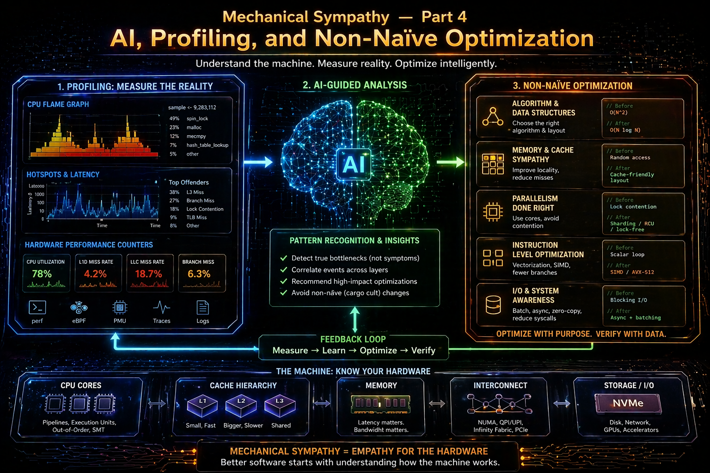

# Mechanical Sympathy — Part 4: AI, Profiling, and Non-Naïve Optimisation

> In Part 3, we explored where engineers fall into rabbit holes.
> Now we focus on how to work correctly before optimising — especially in the age of AI-assisted development.



```
Optimisation Priority Pyramid

1. Architecture & Algorithms
2. Data Access & I/O
3. Concurrency Model
4. Memory & Allocation
5. Micro-Optimisations (Mechanical Sympathy zone)
```

> AI can generate code fast. It cannot decide what actually matters unless we guide it with data.


## The Core Problem with AI-Assisted Optimisation
```
Priority: 1 — Architecture & Algorithms
Importance: ✅ Common
```

AI tends to:
- Over-focus on micro-Optimisations
- Suggest premature improvements
- Ignore system-level bottlenecks
- It often produces locally optimal but globally irrelevant changes

### Typical failure pattern:

```
Problem: Slow API response (2 seconds)

AI suggestion:
- Use Span<T>
- Avoid allocations
- Inline methods

Reality:
- 1.8s is spent waiting on database/network
```

> Without context, AI optimizes what is **visible in code**, not **what dominates runtime**.

## Profiling Before Thinking
```
Priority: 1 — Architecture & Algorithms
Importance: ✅ Common (Critical)
```

> Profiling is not optional. It is the entry point.

Always answer:
- Where is time spent?
- Where is memory allocated?
- What is the throughput bottleneck?

Simple mental model:
```
No profile → No Optimisation
No measurement → No discussion
```

Example workflow:
1) Capture baseline (latency, CPU, memory)
2) Run profiler (e.g., dotnet-trace, PerfView, Application Insights)
3) Identify top hotspots
4) Optimize only top contributors (top 10–20%)

> 80% of performance gains usually come from 1–2 areas.


## Creating a Performance Profile (Before Any Change)
```
Priority: 2 — Data Access & I/O
Importance: ✅ Common
```

Before touching code, define a performance profile:
```
Scenario: Bulk data processing API

Baseline:
- Latency: 1800 ms
- CPU: 25%
- DB time: 1400 ms
- Allocations: 50 MB/request

Conclusion:
- Bottleneck = Data access, not CPU or memory
```
What this prevents:
- Rewriting logic unnecessarily
- Introducing complexity with no gain
- Misusing async/parallelism


## AI as a Tool — Not an Authority
```
Priority: 1 — Architecture & Algorithms
Importance: ✅ Common
```

### Rules for using AI as a tool

**Good usage:**
- Generate alternative implementations
- Explain profiler output
- Suggest trade-offs
- Explore design options

**Bad usage:**
- “Optimize this code” (no context)
- Blindly applying suggestions
- Accepting micro-Optimisations without measurement

> AI should help you explore the solution space — not decide it.


## Non-Naïve Optimisation Workflow
```
Priority: 1 — Architecture & Algorithms
Importance: ✅ Common
```

A practical loop:
```
1. Define scenario
2. Measure (profiling)
3. Identify bottleneck
4. Map to pyramid level
5. Optimize at the correct level
6. Measure again
```

Example:
```
Observation:
High latency in endpoint

Profile:
- 70% DB calls
- 20% serialization
- 10% business logic

Decision:
→ Focus on Data Access (Priority 2)
NOT memory or micro-Optimisations
```

## When Mechanical Sympathy Actually Matters
```
Priority: 5 — Micro-Optimisations
Importance: 🚫 Rare
```

Only after:
- Architecture is correct
- I/O is optimized
- Concurrency is controlled
- Memory profile is understood

Then — and only then:
- Cache locality
- SIMD
- Allocation elimination
- JIT tricks

> This is where Parts 1 & 2 finally become relevant.


## Where AI Actually Helps (High Value Zones)
```
Priority: varies
Importance: ⚠️ Situational
```

### AI is useful when:

1. Exploring algorithmic alternatives
- Suggesting better data structures
- Identifying complexity issues
2. Refactoring for clarity
- Cleaner async flows
- Simplifying concurrency
3. Generating test scenarios
- Load tests
- Edge cases
4. Interpreting performance data
- “Why is this allocation happening?”
- “What does this call stack mean?”

> AI is strongest when paired with real measurements.


## Common Anti-Patterns in AI-Driven Development

### ❌ Optimisation without bottleneck

> “Let’s make it faster” (no data)

### ❌ Micro-Optimisation first

> Jumping to Span, pooling, SIMD too early

### ❌ Parallelism as a default

> Adding concurrency without limits or need

### ❌ Ignoring I/O costs
> The most frequent real bottleneck


## AI Prompt Template for Performance Work
```
Priority: 1 — Architecture & Algorithms
Importance: ✅ Common
```

> The quality of AI output depends entirely on the quality of context we provide.
> Without context, we will get micro-Optimisations. With context, we may get real improvements.

### ❌ Naïve Prompt (What not to do)
```
Optimize this C# code for performance.
```

Typical result:
- Suggests Span<T>
- Recommends inlining
- Mentions allocations

> Completely disconnected from the real bottleneck.

### ✅ Non-Naïve Prompt Template
```
Context:
- Application type: (e.g., ASP.NET Core API, background worker)
- Scenario: (e.g., bulk processing, high-throughput endpoint)
- Workload: (requests/sec, data size, concurrency level)

Current metrics (baseline):
- Latency: X ms
- CPU usage: X %
- Memory allocations: X MB/request
- External dependencies: (DB, HTTP calls, etc.)

Profiling results:
- Top time consumers: (e.g., DB = 70%, serialization = 20%)
- Hot paths: (method names / call stacks if known)

Constraint:
- Must preserve readability and maintainability
- No premature micro-Optimisations

Task:
- Suggest Optimisations ONLY at the dominant bottleneck level (based on the pyramid)
- Explicitly explain why lower-level Optimisations are NOT relevant
- Provide before/after reasoning, not just code
```

### 💡 Example (Filled-In Prompt)
```
Context:
- Application type: ASP.NET Core API
- Scenario: Fetching user dashboard data
- Workload: ~200 requests/sec

Current metrics:
- Latency: 1800 ms
- CPU: 30%
- Memory: 40 MB/request

Profiling results:
- Database calls: 75% of total time
- JSON serialization: 15%
- Business logic: 10%

Constraint:
- Cannot change database technology
- Must keep code readable

Task:
- Suggest Optimisations focusing on Data Access & I/O (Priority 2)
- Avoid memory or micro-Optimisations unless justified
- Explain trade-offs
```

### ✅ Expected Quality Response from AI

Suggest:
- Query Optimisation
- Batching requests
- Caching strategies
- Reducing round-trips

Avoid:
- Span<T>
- stackalloc
- JIT tweaks


### Rule of thumb

```
Bad prompt → Code tweaks
Good prompt → System improvements
```

> AI does not replace engineering judgment. It amplifies it — for better or worse.


## Bad vs Good AI Answer (Same Problem, Different Outcome)

### Scenario
```
API endpoint is slow (~1800 ms)
```

### ❌ Bad Prompt
```
Optimize this method for performance.
```

**Typical AI Answer:**
- Replace string concatenation with `StringBuilder`
- Use `Span<T>` to reduce allocations
- Add `[MethodImpl(AggressiveInlining)]`
- Avoid LINQ

**Result:**
- Code becomes more complex
- Performance improvement: ~0–2%
- Root problem untouched

> The AI optimized visible code, not actual runtime cost.

### ✅ Good Prompt (Using Template)
```	
Context:
- ASP.NET Core API
- Endpoint: User dashboard
- Load: 200 req/sec

Metrics:
- Latency: 1800 ms
- CPU: 30%

Profiling:
- DB calls: 75%
- Serialization: 15%
- Business logic: 10%

Task:
Focus on Data Access & I/O (Priority 2).
Avoid micro-Optimisations unless justified.
```

**High-Quality AI Answer**
- Reduce number of DB round-trips
- Introduce batching / projection queries
- Add caching for repeated reads
- Optimize query indexes

**Result:**
- Latency drops from 1800 ms → ~400–600 ms
- Code complexity: minimal increase
- Real bottleneck addressed

### Key Insight
```
Same AI.
Different prompt.
Completely different outcome.
```

> The difference is not the model. 
> **The difference is engineering context**.


## Example: Profiling → AI → Optimisation Loop

### Step 1 — Measure
```
Endpoint: /api/orders

Baseline:
- Latency: 2200 ms
- CPU: 35%
- Allocations: 60 MB/request
```

### Step 2 — Profile
```
Breakdown:
- SQL queries: 1600 ms (73%)
- JSON serialization: 300 ms (14%)
- Business logic: 300 ms (13%)
```

### Step 3 — Interpret (Human + AI)

**Ask AI:**
```
Given this profile, what is the correct Optimisation level
according to the Optimisation Priority Pyramid?
```

**Expected answer:**
→ Priority 2: Data Access & I/O

### Step 4 — Targeted Prompt
```
We have:
- 73% time spent in SQL queries
- Likely multiple round-trips

Suggest:
- Query consolidation strategies
- Caching options
- Index improvements

Do NOT suggest:
- Memory Optimisations
- JIT tweaks
```

### Step 5 — Apply Fix

Examples:
- Combine queries
- Add projection (SELECT only needed fields)
- Introduce cache for repeated reads

### Step 6 — Measure Again
```
After Optimisation:
- Latency: 2200 ms → 700 ms
- DB time reduced by ~60%
```

### Loop Summary
```
Measure → Profile → Ask AI → Apply → Measure
```

> AI becomes powerful only inside a feedback loop.


## Example: Interpreting Profiler Output with AI

### Raw Profiling Data (Simplified)
```
Top methods by time:

1. GetOrdersFromDatabase() — 1200 ms
2. SerializeToJson()       — 250 ms
3. ProcessOrders()         — 200 ms
4. MapEntities()           — 150 ms
```

### ❌ Naïve AI Prompt
```
How can I optimize this code?
```

**Result:**
- Generic suggestions
- No prioritization

### ✅ Smart AI Prompt
```
Here is profiling data:

- GetOrdersFromDatabase(): 1200 ms
- SerializeToJson(): 250 ms
- ProcessOrders(): 200 ms

Question:
1. What is the dominant bottleneck?
2. Which level of the Optimisation Priority Pyramid applies?
3. What should NOT be optimized yet?
```


###✅ Expected AI Answer

- Bottleneck: Database access (~70%+)
- Priority: Data Access & I/O (Level 2)
- Do NOT optimize:
  - Memory allocations
  - LINQ usage
  - JIT / inlining


### Why This Matters
```
Profilers give data.
AI helps interpret.
Engineers make decisions.
```

> This is the correct collaboration model.


## Closing Thought

> 1 - AI accelerates coding. 2 - Profiling disciplines thinking.

The real skill is not writing faster code.
> It is knowing what not to optimize.

```
AI does not eliminate performance problems.

It makes it easier to:
- Solve the right problem
…or
- Optimize the wrong one faster.

Rule of thumb:

- If AI suggests it, measure it.
- If you didn’t measure it, don’t merge it.
```

## See also:
- [Mechanical Sympathy — Part 1: The Principles and Why They Matter](https://www.linkedin.com/pulse/mechanical-sympathy-part-1-between-insight-rabbit-holes-marek-kubis-a8xle/)
- [Mechanical Sympathy — Part 2: What Really Matters from CPU tiles/boards to LLM Systems](https://www.linkedin.com/pulse/mechanical-sympathy-part-2-what-really-matters-from-cpu-marek-kubis-yim4e/)
- [Mechanical Sympathy — Part 3: Suggestions for avoiding software quality rabbit holes](https://www.linkedin.com/pulse/mechanical-sympathy-part-3-suggestions-avoiding-software-marek-kubis-vybbe/)
- [Down the rabbit holes of AI-based software development process ](https://www.linkedin.com/pulse/down-rabbit-holes-ai-based-software-development-process-marek-kubis-fsyue)
- [Is there a need to change the way software is developed today?](https://www.linkedin.com/pulse/need-change-way-software-developed-today-marek-kubis-dntie)
- [This Isn’t Rebranding. It’s a Structural Shift in Software Development](https://www.linkedin.com/pulse/isnt-rebranding-its-structural-shift-software-marek-kubis-sanpe)
- [Murphy’s law and more in AI time - one by one with examples](https://www.linkedin.com/pulse/murphys-law-more-ai-time-one-examples-marek-kubis-fkaze)
- [The Agile Vibe Coding and Conway's Law](https://www.linkedin.com/pulse/agile-vibe-coding-conways-law-marek-kubis-m0wpe)
- [Using a digital banking solution to prove Conway’s Law in AI-Driven engineering - example 1](https://www.linkedin.com/pulse/using-digital-banking-solution-prove-conways-law-ai-driven-kubis-xqlre/)
- [Using a .NET 10 migration project to prove Conway’s Law in AI-Driven engineering - example 2](https://www.linkedin.com/pulse/using-net-10-migration-project-prove-conways-law-ai-driven-kubis-abqae)
- [Where traditional Agile breaks in AI-driven systems](https://www.linkedin.com/pulse/where-traditional-agile-breaks-ai-driven-systems-marek-kubis-4wq6e/)
- [AI - It seems nobody has it fully figured out yet](https://www.linkedin.com/pulse/ai-nobody-has-figured-out-marek-kubis-bkyge)
- [Internal Development Platform and Agile Vibe Coding](https://www.linkedin.com/pulse/internal-development-platform-agile-vibe-coding-marek-kubis-kyhqe)
- [Everyone will be vibe coders](https://www.linkedin.com/pulse/everyone-vibe-coders-marek-kubis-tlgze)
- [The Structural problems AI introduces into the SDLC](https://www.linkedin.com/pulse/structural-problems-ai-introduces-sdlc-marek-kubis-qyt6e)
- [Signals That Reveal the True Maturity of Organisations Claiming “AI-Driven Development”](https://www.linkedin.com/pulse/signals-reveal-true-maturity-organisations-claiming-ai-driven-kubis-urule)
- [AI - It seems nobody has it fully figured out yet](https://www.linkedin.com/pulse/ai-nobody-has-figured-out-marek-kubis-bkyge)
- [Agile Vibe Coding positioning and if this works, what changes?](https://www.linkedin.com/pulse/agile-vibe-coding-positioning-works-what-changes-marek-kubis-r4ate)
- [Agile Vibe Coding – Ceremony Modes](https://www.linkedin.com/pulse/agile-vibe-coding-ceremony-modes-marek-kubis-meq9e)
- [Agile Vibe Coding ceremonies approach compared to a simple one-prompt-per-task approach](https://www.linkedin.com/pulse/agile-vibe-coding-ceremonies-approach-compared-simple-marek-kubis-ecx5e)
- [Agile Vibe Coding Maturity Model](https://www.linkedin.com/pulse/agile-vibe-coding-maturity-model-marek-kubis-bbtqe)
- [The Agile Vibe Coding - the 4-level adaptive ceremony system](https://www.linkedin.com/pulse/agile-vibe-coding-4-level-adaptive-ceremony-system-marek-kubis-jizke)

- [Agile Vibe Coding Manifesto](https://agilevibecoding.org/)
- [Principles Behind the Agile Vibe Coding Manifesto - extended version](https://github.com/marekartur-dev/agilevibecoding/blob/main/Docs/Home/Principles.md)

- [Agile Vibe Coding](https://www.reddit.com/r/AgileVibeCoding/)
- [Marek Kubis - blog](https://github.com/marekartur-dev/agilevibecoding/tree/main)
