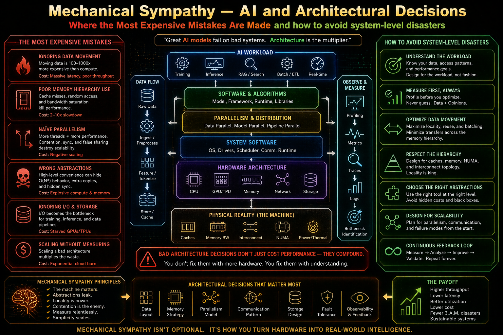

# Mechanical Sympathy — Part 5: AI and Architectural Decisions — Where the Most Expensive Mistakes Are Made and Continuous Optimisation

> In Part 4, we showed how AI can help — if guided by profiling and context.
> 
> In Part 5, we move one level higher: 
> **Architecture — where mistakes are rare… but extremely expensive.**



```
Optimisation Priority Pyramid

1. Architecture & Algorithms
2. Data Access & I/O
3. Concurrency Model
4. Memory & Allocation
5. Micro-Optimisations (Mechanical Sympathy zone)
```

> Most performance problems are not caused by code. They are caused by **decisions made before the code exists**.

Let's continue **how to avoid system-level disasters in the age of AI-driven development**.

## The Illusion of “AI Knows Best”
```
Priority: 1 — Architecture & Algorithms
Importance: ✅ Common
```

AI is very good at:
- Generating patterns
- Recommending “best practices”
- Assembling familiar architectures

AI is very bad at:
- Understanding your real constraints
- Predicting system evolution
- Evaluating long-term trade-offs

> AI suggests plausible architectures — not correct ones.

## Where AI Gets Architecture Wrong

### ❌ 1. Overengineering by Default
```
Priority: 1 — Architecture & Algorithms
Importance: ⚠️ Situational
```

Prompt:
```
Design a scalable system for processing orders
```

**Typical AI output:**
- Microservices
- Message queues
- Event-driven architecture
- Distributed cache
- CQRS

**Reality:**
- We needed a modular monolith
- System complexity increased 5x
- Latency increased
- Debugging became harder

> AI optimises for _impressiveness_, not _appropriateness_.

### ❌ 2. Ignoring the Cost of Distribution
```
Priority: 2 — Data Access & I/O
Importance: ✅ Common
```

Every boundary introduces:
- Network latency
- Serialization cost
- Failure modes
- Observability challenges

**Classic mistake:**
```
Split into 5 services → +5 network hops
```

> What was a function call becomes a distributed system problem.

### ❌ 3. Misplaced Concurrency
```
Priority: 3 — Concurrency Model
Importance: ⚠️ Situational
```

AI often suggests:
- Parallelism everywhere
- Async everywhere
- Background processing everywhere

Without considering:
- Throughput vs latency trade-offs
- Backpressure
- Resource limits

> Concurrency is not free. It is a coordination cost.

### ❌ 4. Premature Scalability Decisions
```
Priority: 1
Importance: ✅ Common
```

AI frequently designs for:
- Millions of users
- Global distribution
- Extreme scale

**When reality is:**
```
Current load: 50 req/sec
```

**Result:**
- Overcomplicated system
- Slower development
- Higher operational cost

### ❌ 5. Data Model Neglect
```
Priority: 2 — Data Access & I/O
Importance: ✅ Common
```

**AI often:**
- Focuses on APIs and services
- Ignores data access patterns

**But in reality:**
```
Data shape and access patterns define performance.
```

**Bad outcome:**
- N+1 queries
- Inefficient joins
- Poor indexing strategy

### The Cost Curve of Architectural Mistakes
```
Level               Cost to Fix
------------------------------------
Micro-optimisation  → Low
Code-level issue    → Medium
Architecture flaw   → Extremely High
```

> Changing architecture late is not refactoring. It is **rebuilding the system.**

### Non-Naïve Use of AI in Architecture
```
Priority: 1
Importance: ✅ Common
```

Use AI for:

**✅ Exploring alternatives**
- Monolith vs microservices
- Sync vs async flows
- Batch vs real-time

**✅ Stress-testing decisions**
```
What are the failure modes of this design?
What happens under 10x load?
Where are the bottlenecks?
```

**✅ Trade-off analysis**
```
What do I gain vs what do I pay?
```

### AI Prompt Template for Architecture Decisions
```
Context:
- System type:
- Expected load:
- Growth expectations:
- Team size:
- Operational maturity:

Constraints:
- Budget:
- Deployment environment:
- Latency requirements:

Task:
- Propose 2–3 architecture options
- For each:
  - Complexity cost
  - Scalability characteristics
  - Failure modes
- Recommend the simplest viable option
```

### Example: Good vs Bad Architectural Decision

**❌ AI-Driven (Naïve)**
```
System:
- Microservices
- Event bus
- Distributed cache
- CQRS
```
**Problem:**
- 80% time spent on coordination
- Hard to debug
- Slow iteration


**✅ Engineering-Driven (With AI Support)**
```
System:
- Modular monolith
- Clear boundaries
- optimised DB access
```

**Result:**
- Faster development
- Easier profiling
- Better real performance


### The “Architecture First” Reality
```
Wrong architecture + optimised code = slow system
Right architecture + average code = fast system
```

### When Mechanical Sympathy Actually Applies (Again)
```
Priority: 5 — Micro-optimisations
Importance: 🚫 Rare
```

At the architectural level:
- CPU cache lines don’t matter
- Single Instruction, Multiple Data (SIMD) doesn’t matter
- JIT tricks don’t matter

> If architecture is wrong, low-level optimisations are irrelevant.

```
Decision Checklist (Before You Ask AI)
1. What is my real scale?
2. Where is my bottleneck likely to be?
3. Do I actually need distribution?
4. What is the simplest thing that works?
```


## How to stay correct over time - continuous optimisation.

> **Optimisation** is not a phase. It **is a continuous feedback process**.

### The Missing Layer: Reality
```	
Priority: 1 — Architecture & Algorithms
Importance: ✅ Common
```	

Everything we’ve discussed so far:
- Design
- Code
- AI suggestions
- Profiling

…happens **before or outside production**.

But real systems:
- Behave differently under real load
- Fail in unexpected ways
- Drift over time

> If we don’t observe reality, we are optimising assumptions, see: [The Secrets of Feedback Loops](https://www.linkedin.com/pulse/secrets-feedback-loops-marek-kubis-yythe).

### Observability vs Monitoring (Critical Distinction)
```	
Priority: 2 — Data Access & I/O
Importance: ✅ Common
```	

**Monitoring:**

```	
“Is the system up or down?”
```	

**Observability:**

```	
“Why is the system behaving this way?”
```	

Observability gives us:
- Context
- Causality
- Debuggability

### The Three Pillars of Observability

**1. Metrics**
```	
Priority: 2
Importance: ✅ Common
```	
- Latency (p50, p95, p99)
- Throughput (req/sec)
- Error rates
- Resource usage (CPU, memory)

> Metrics tell us that something is wrong.

**2. Logs**
```	
Priority: 2
Importance: ✅ Common
```	
- Structured, queryable logs
- Correlated with requests
- Include context (IDs, inputs, decisions)

> Logs tell us what happened.

**3. Traces**
```	
Priority: 2
Importance: ✅ Common
```	
- End-to-end request flow
- Service-to-service latency
- Bottleneck visualization

> Traces tell us where time is spent.

- **Without Observability**: `We guess → We change → We hope`
- **With Observability**: `We measure → We understand → We improve`


### Feedback Loops: The Real Optimisation Engine
```	
Priority: 1
Importance: ✅ Common
```	

The correct loop:
```	
1. Observe (metrics, logs, traces)
2. Detect anomaly
3. Form hypothesis
4. Validate (profiling / analysis)
5. Apply change
6. Measure impact
7. Repeat
```	

> This is where AI becomes powerful again.

### AI Inside the Feedback Loop
```	
Priority: 1
Importance: ⚠️ Situational
```	

AI can help:

**✅ Detect anomalies**
- “Latency increased after deployment”
- “Error rate spike in specific endpoint”

**✅ Interpret traces**
```	
“Why is this request taking 2 seconds?”
“Where is the bottleneck?”
```	

**✅ Suggest hypotheses**
- DB contention
- Cache misses
- Thread pool starvation

### Example: Real Feedback Loop

- **Step 1 — Observation**
```	
p95 latency increased: 400 ms → 1200 ms
```	

- **Step 2 — Trace Analysis**
```	
Breakdown:
- API layer: 100 ms
- Service layer: 200 ms
- Database: 900 ms
```	

- **Step 3 — AI-Assisted Interpretation**
```	
Given this trace:
- DB dominates latency
- Likely query or indexing issue
```	

- **Step 4 — Action**
```	
Add index
optimise query
Introduce caching
```	

- **Step 5 — Validation**
```	
p95 latency: 1200 ms → 450 ms
```	

### Continuous Optimisation vs One-Time Tuning
```	
One-time optimisation:
→ Temporary improvement

Continuous optimisation:
→ System stays efficient over time
```	

Why systems degrade:
- Data grows
- Usage patterns change
- New features introduce regressions

### The Hidden Danger: Silent Regressions
```	
Priority: 2
Importance: ✅ Common
```	

Without observability:
- Performance slowly degrades
- Nobody notices until it’s critical

Typical scenario:
```	
Month 1: 200 ms
Month 3: 400 ms
Month 6: 900 ms
```	

> No single change caused the issue. The system _drifted_.

### What to Measure (Practical Minimum)
```	
- Request latency (p50, p95, p99)
- Error rate
- Throughput
- DB query time
- External API latency
```	

> If you can’t see it, you can’t optimise it.

## Where Mechanical Sympathy Finally Fits
```	
Priority: 5 — Micro-optimisations
Importance: 🚫 Rare
```	

Observability tells you:
- When low-level issues matter
- Where they actually occur

Only then:
- Memory tuning
- Allocation reduction
- Cache alignment
- Single Instruction, Multiple Data (SIMD)

### The Full System View (Parts 3–5 Combined)
```	
Part 3 → Avoid rabbit holes
Part 4 → Use AI correctly
Part 5 → Make correct architectural decisions
Part 6 → Validate everything in reality
```	

Mechanical Sympathy is about **respecting reality at every level**:
- Architecture
- Data
- Concurrency
- Runtime behaviour

```	
You don’t optimise code.

📌 You optimise systems… by continuously learning from how they behave.
```	

## Closing Thought

> AI makes it easier to build complex systems.
> **That does not mean we should.**

> [!IMPORTANT]
```
The biggest risk in AI-driven development is not bad code.

❗️ It is building the wrong system… perfectly.
```

> The best engineers are not the ones who know the most optimisations.
> 
> They are the ones who know **when they matter** — and have the data to prove it.


## See also:
- [Mechanical Sympathy — Part 1: The Principles and Why They Matter](https://www.linkedin.com/pulse/mechanical-sympathy-part-1-between-insight-rabbit-holes-marek-kubis-a8xle/)
- [Mechanical Sympathy — Part 2: What Really Matters from CPU tiles/boards to LLM Systems](https://www.linkedin.com/pulse/mechanical-sympathy-part-2-what-really-matters-from-cpu-marek-kubis-yim4e/)
- [Mechanical Sympathy — Part 3: Suggestions for avoiding software quality rabbit holes](https://www.linkedin.com/pulse/mechanical-sympathy-part-3-suggestions-avoiding-software-marek-kubis-vybbe/)
- [Mechanical Sympathy — Part 4: AI, Profiling, and Non-Naïve optimisation](https://www.linkedin.com/pulse/mechanical-sympathy-part-4-ai-profiling-non-na%C3%AFve-marek-kubis-bub0e)
- [Down the rabbit holes of AI-based software development process ](https://www.linkedin.com/pulse/down-rabbit-holes-ai-based-software-development-process-marek-kubis-fsyue)
- [Is there a need to change the way software is developed today?](https://www.linkedin.com/pulse/need-change-way-software-developed-today-marek-kubis-dntie)
- [This Isn’t Rebranding. It’s a Structural Shift in Software Development](https://www.linkedin.com/pulse/isnt-rebranding-its-structural-shift-software-marek-kubis-sanpe)
- [Murphy’s law and more in AI time - one by one with examples](https://www.linkedin.com/pulse/murphys-law-more-ai-time-one-examples-marek-kubis-fkaze)
- [The Agile Vibe Coding and Conway's Law](https://www.linkedin.com/pulse/agile-vibe-coding-conways-law-marek-kubis-m0wpe)
- [Using a digital banking solution to prove Conway’s Law in AI-Driven engineering - example 1](https://www.linkedin.com/pulse/using-digital-banking-solution-prove-conways-law-ai-driven-kubis-xqlre/)
- [Using a .NET 10 migration project to prove Conway’s Law in AI-Driven engineering - example 2](https://www.linkedin.com/pulse/using-net-10-migration-project-prove-conways-law-ai-driven-kubis-abqae)
- [Where traditional Agile breaks in AI-driven systems](https://www.linkedin.com/pulse/where-traditional-agile-breaks-ai-driven-systems-marek-kubis-4wq6e/)
- [AI - It seems nobody has it fully figured out yet](https://www.linkedin.com/pulse/ai-nobody-has-figured-out-marek-kubis-bkyge)
- [Internal Development Platform and Agile Vibe Coding](https://www.linkedin.com/pulse/internal-development-platform-agile-vibe-coding-marek-kubis-kyhqe)
- [Everyone will be vibe coders](https://www.linkedin.com/pulse/everyone-vibe-coders-marek-kubis-tlgze)
- [The Structural problems AI introduces into the SDLC](https://www.linkedin.com/pulse/structural-problems-ai-introduces-sdlc-marek-kubis-qyt6e)
- [Signals That Reveal the True Maturity of Organisations Claiming “AI-Driven Development”](https://www.linkedin.com/pulse/signals-reveal-true-maturity-organisations-claiming-ai-driven-kubis-urule)
- [AI - It seems nobody has it fully figured out yet](https://www.linkedin.com/pulse/ai-nobody-has-figured-out-marek-kubis-bkyge)
- [Agile Vibe Coding positioning and if this works, what changes?](https://www.linkedin.com/pulse/agile-vibe-coding-positioning-works-what-changes-marek-kubis-r4ate)
- [Agile Vibe Coding – Ceremony Modes](https://www.linkedin.com/pulse/agile-vibe-coding-ceremony-modes-marek-kubis-meq9e)
- [Agile Vibe Coding ceremonies approach compared to a simple one-prompt-per-task approach](https://www.linkedin.com/pulse/agile-vibe-coding-ceremonies-approach-compared-simple-marek-kubis-ecx5e)
- [Agile Vibe Coding Maturity Model](https://www.linkedin.com/pulse/agile-vibe-coding-maturity-model-marek-kubis-bbtqe)
- [The Agile Vibe Coding - the 4-level adaptive ceremony system](https://www.linkedin.com/pulse/agile-vibe-coding-4-level-adaptive-ceremony-system-marek-kubis-jizke)

- [Agile Vibe Coding Manifesto](https://agilevibecoding.org/)
- [Principles Behind the Agile Vibe Coding Manifesto - extended version](https://github.com/marekartur-dev/agilevibecoding/blob/main/Docs/Home/Principles.md)

- [Agile Vibe Coding](https://www.reddit.com/r/AgileVibeCoding/)
- [Marek Kubis - blog](https://github.com/marekartur-dev/agilevibecoding/tree/main)
