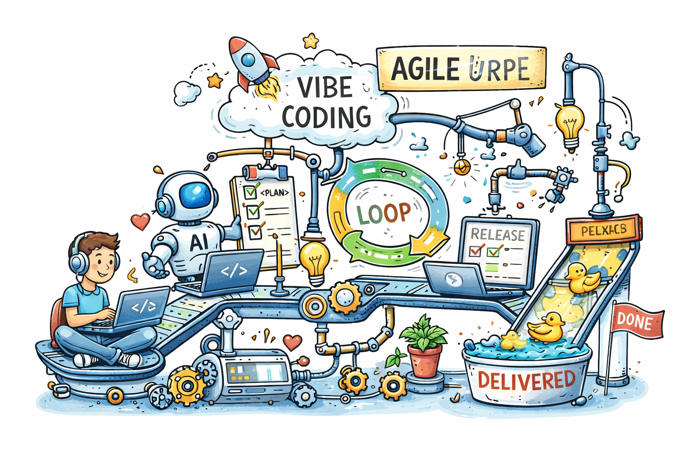

# Murphy’s law and more in AI time - turn into something we can use

> - Practical rules that we can enforce in a real team - especially important in the case of an Azure + distributed system configuration.
> - Engineering Rules mapped to SDLC and Agile.

### 👉 *The key shift*: **AI compresses Implementation — but stretches every other phase if unmanaged.**

## A. Requirements Phase

### Laws:
- Murphy’s Law
- Goodhart’s Law
- Occam’s Razor

### Rules:

> #### ✅ Rule R1 — Assume failure from day 1

**Define**:
- failure modes
- retries
- idempotency

**Example - Azure architecture**:

Azure Function must assume:
- duplicate messages
- partial failures
- Service Bus retries

> #### ✅ Rule R2 — Never turn metrics into goals blindly

**Avoid**:
- “increase velocity”
- “increase test coverage”

**Prefer**:
- “reduce production incidents”
- “reduce MTTR”

> #### ✅ Rule R3 — Prefer simple requirements over clever ones

- If requirement needs long explanation → it’s wrong or premature

**Agile mapping**
Use **Definition of Done, DoD** (**Definition of Ready, DoR**):
- includes failure scenarios
- includes observability expectations

### Vibe coding risk

AI encourages:
- vague prompts
- underspecified requirements

### 👉 *Fix*: **Write prompts like specs, not wishes**

## B. Design Phase

### Laws:
- Conway’s Law
- Law of Leaky Abstractions
- Chesterton’s Fence

### Rules:

> #### ✅ Rule D1 — Architecture must reflect ownership, not org charts

Each service:
- single responsibility
- clear ownership

> #### ✅ Rule D2 — Every abstraction must have an “escape hatch”

If you use:
- ORM → know SQL
- Service Bus → know delivery semantics

> #### ✅ Rule D3 — Never delete “weird” logic without history

**Require**:
- code comments OR
- ADR (Architecture Decision Record)

**Example - Azure context**
Azure Service Bus:
- at-least-once delivery
- ❗️ *Design must include*: **idempotent consumers**

**Agile mapping**
- Add “Design spike” stories
- Maintain lightweight ADRs per sprint

#### Vibe coding risk

AI:
- removes “ugly” code
- simplifies “too much”

### 👉 *Mitigation*: **Require human explanation before removal**

## C. Implementation Phase, where AI dominates

### Laws:
- Brooks’s Law
- Peter Principle
- Cunningham’s Law

### Rules

> #### ✅ Rule I1 — AI is a junior dev, not a peer

All AI code:
- must be reviewed
- must be understood

> #### ✅ Rule I2 — Don’t scale coding before stabilizing patterns

- Avoid: generating 10 services at once
- Prefer: **1 service → validate → replicate**

> #### ✅ Rule I3 — Use AI iteratively, not in one shot

Best workflow:
- Write rough version
- Ask AI to critique
- Refine

**Example**
- Bad: “Generate full event-driven architecture”
- Good: “Here is my message contract—validate edge cases”

**Agile mapping**
- Enforce PR size limits
- Add AI-generated code label in PRs

#### Vibe coding pattern

“Feels right” coding = dangerous when:
- no tests
- no edge-case thinking

### 👉 *Introduce*: **“Vibe → Verify → Harden” loop**

##  D. Testing Phase

### Laws:
- Goodhart’s Law
- Pareto Principle
- Linus’s Law

### Rules:

> #### ✅ Rule T1 — Test behavior, not coverage

- Avoid: shallow AI-generated tests
- Focus on: edge cases & failure scenarios

> #### ✅ Rule T2 — Test the 20% that breaks everything

Identify:
- critical paths
- integration points

> #### ✅ Rule T3 — Many eyeballs ≠ effective review

Require:
- ownership
- accountability

**Example**

Test:
- message duplication
- out-of-order events
- partial failure

**Agile mapping**:
- Add “failure scenario tests” to DoD
- Include contract testing between services

#### Vibe coding risk

AI-generated tests:
- pass easily
- miss real-world issues

### 👉 *Require*: **at least 1 manually designed test per feature**

## E. Deployment Phase

### Laws:
- Murphy’s Law
- Hofstadter’s Law

### Rules:

> #### ✅ Rule DEP1 — Every deployment must be reversible

Use:
- feature flags
- blue/green deployment

> #### ✅ Rule DEP2 — Expect timing issues

Especially with:
- async systems
- cloud infra

**Example**
- Azure Function deployed before Service Bus ready → runtime failures

**Agile mapping**:
- CI/CD pipeline = part of “Done”
- Include deployment validation step

#### Vibe coding risk
- “It worked locally” mindset amplified by AI

### 👉 _Fix_: **mandatory staging validation**

##  F. Operations Phase

### Laws:
Murphy’s Law
Pareto Principle
Hanlon’s Razor

### Rules:

> #### ✅ Rule O1 — Observability is not optional

Must have:
- logs
- metrics
- tracing

> #### ✅ Rule O2 — Assume most failures are boring

Misconfigurations:
- timeouts
- retries

> #### ✅ Rule O3 — Fix root causes, not symptoms

- Avoid: adding retries blindly

**Example**
- Duplicate messages → fix idempotency
- NOT: “just retry more”

**Agile mapping**:
- Include operational stories
Track:
- MTTR
- incident frequency

#### Vibe coding risk
- No instrumentation
- No monitoring

### 👉 Rule: “If it’s not observable, it doesn’t exist”

## Agile vs Vibe Coding - reality check

**Agile (ideal)**
- Iterative
- Measurable
- Collaborative

**Vibe Coding (emerging)**
- Fast
- Intuitive
- AI-assisted

### The Problem

Vibe coding often violates:
- Hofstadter’s Law (underestimates time)
- Goodhart’s Law (optimizes wrong things)
- Peter Principle (operating beyond understanding)

### The Solution: Hybrid Model

“Structured Vibe Coding” loop:
- Vibe (AI-assisted creation)
- Verify (tests + review)
- Explain (human understanding)
- Harden (production readiness)

##  Final Practical Rule Set - short version

If you enforce only these, you’ll avoid most failures:

1. Design for failure first (Murphy)
2. Keep systems understandable (Occam + Peter)
3. Own your architecture (Conway)
4. Never trust AI output blindly (Brooks + Cunningham)
5. Test reality, not metrics (Goodhart + Pareto)
6. Make everything observable (Murphy again)
7. Iterate small, not fast (Hofstadter)

##  Final Insight

> [!IMPORTANT]
> Modern software engineering is no longer:
> **“How do we write code?”**
> It’s now:
> **“How do we control complexity when code is cheap?”**

That’s where these laws matter more than ever.

### See also:
- [Agile Vibe Coding Manifesto](https://agilevibecoding.org/)
- [Murphy’s law and more in AI time - one by one with examples](https://www.linkedin.com/pulse/murphys-law-more-ai-time-one-examples-marek-kubis-fkaze/?trackingId=DJqIIXTw2pTaJg3dW8UFYg%3D%3D)
- [The Agile Vibe Coding and Conway's Law](https://www.linkedin.com/pulse/agile-vibe-coding-conways-law-marek-kubis-m0wpe/?trackingId=wNYc5fRxyx3oQGxE3KYx8Q%3D%3D)
- [Using a digital banking solution to prove Conway’s Law in AI-Driven engineering - example 1](https://www.linkedin.com/pulse/using-digital-banking-solution-prove-conways-law-ai-driven-kubis-xqlre/)
- [Using a .NET 10 migration project to prove Conway’s Law in AI-Driven engineering - example 2](https://www.linkedin.com/pulse/using-net-10-migration-project-prove-conways-law-ai-driven-kubis-abqae/?trackingId=%2FAxxEBhQ3Kz4dbLMKDokgg%3D%3D)
