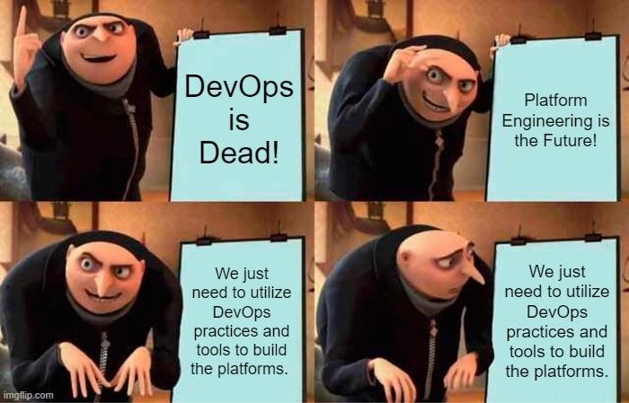

# Is there a need to change the way software is developed today?

> [!IMPORTANT]
> More and more companies are realizing that the software development approach established many years ago — and still widely used —
> is causing increasing problems for both development teams and businesses.

> [!WARNING]
> This traditional way of working, where dedicated operational teams operate in their own closed silos, is proving inflexible today.
> Although modern design patterns and best practices are employed during coding, this often fails to deliver the desired results in terms of speed and software quality.
> Ultimately, despite participating in **Agile ceremonies**, many organizations still operate in a way that closely resembles the **Waterfall model**.

## Why Revisit This Topic Now?

This is not a new discussion. Development, quality assurance, DevOps, technology, and product roles have existed since the early days of IT. 
Although they were called by different names, the emergence of client-server systems solidified this structure.

Later innovations such as Continuous Integration, Domain-Driven Design (DDD), hexagonal architecture, 
layered (N-Tier) architecture, and the Onion Architecture — strongly associated with Domain-Driven Design —
improved code structure but did not fundamentally change organizational boundaries.

For a long time, this model worked well — especially in simpler infrastructure contexts. 
Development teams focused on coding, while QA, DevOps, and technology teams handled operational concerns.

But the environment has changed dramatically.

## Infrastructure Is Now Architecture

Today, infrastructure includes:
- virtual machines
- containers
- cloud environments
- serverless functions
- microservices
- distributed systems

Modern applications are no longer ___monoliths___. They are ___ecosystems___ of interconnected services operating across multiple environments.

In this world, architectural decisions directly influence organisational structure.

Previously, adopting a new architectural pattern improved code organisation but had little impact on how teams were structured. 
Today, that is no longer true.

Despite increasingly advanced tools, many organisations observe:
- **slower delivery**,
- **rising costs**,
- higher operational complexity.

Development teams are not struggling because they lack talent — they are struggling because the system itself has become more complex.

### Are changes welcome?

Given the scale of technological progress, why does software development not consistently translate into better business outcomes?

The issue is not external conditions alone. The roots of the problem also lie in:
- the logic of software development,
- team responsibility boundaries,
- organisational culture.

This is where new approaches emerge.

## Clean Architecture, Platform Engineering, and Modern Tooling

**Clean architecture** is not new. What is new are the tools that make its practical implementation more accessible, 
including the .NET ecosystem and modern IDEs such as Visual Studio.

Additionally, the emergence of .NET Aspire enables structured composition of distributed cloud applications.

Alongside architectural evolution, **Platform Engineering** has emerged as an organisational response to growing complexity.
**Platform Engineering** centralises responsibility for non-functional requirements:
- Version Control System
- CI/CD pipelines
- Execution environments
- Infrastructure provisioning
- Observability
- Security

When coding, testing, and deployment responsibilities are fragmented across teams, 
the classic ___“You build it, you run it”___ principle becomes difficult to sustain at scale.

This does not invalidate **DevOps** — it signals its evolution. 

## The Cognitive Load Problem

Traditional structures often burden engineers with:
- excessive responsibility,
- a high cognitive load,
- duplicated configuration efforts,
- slow end-to-end processes,
- inconsistent standards.

A typical application lifecycle involves:
- security configuration
- monitoring
- CI/CD pipelines
- runtime environment setup
- infrastructure definition
- business logic.

Only business logic differentiates products. The rest are repeatable patterns.

Repeating similar infrastructure modules across multiple applications leads to duplication and operational risk.

## Internal Development Platform (IDP)

This is where the **Internal Development Platform** (**IDP**) concept appears.

An organization effectively develops two products:
1. The Internal Development Platform (IDP),
2. Business services built on top of it

Business services may consist of many components, but they rely on a standardized platform maintained by a dedicated platform team.

The key principle is not identical infrastructure everywhere — but centralised governance and standardisation.

## What Platform Engineering Owns

Platform Engineering typically centralises:
- global security standards,
- monitoring and observability,
- pipelines in one place,
- on-demand execution environment,
- on-demand infrastructure provisioning.

The **Internal Development Platform** shares responsibility with application teams by abstracting complexity rather than eliminating autonomy.

If a use case is not supported, teams collaborate with the platform team to extend the platform in a controlled and reusable way.

For example, one team may use GitHub while another uses **Azure DevOps**. The platform defines standardized pipeline templates for both.

The result is consistency without rigid uniformity.

## Operational Benefits

For operations teams, this model simplifies:
- cluster administration,
- deployments,
- backups,
- security enforcement,
- access management,
- plugin integration.

Responsibility boundaries become clearer. Expertise becomes concentrated rather than fragmented.

## Platform Team Responsibilities

Administrators: 
- Provisioning 
- Networking 
- Access control
- Permission management 
- Load balancing

Operations: 
- tool selection, 
- standardised configuration according to best practices.

Benefits include:
- Reduced cognitive load for application teams
- Faster value delivery
- Pre-configured compliance and security
- Greater operational consistency.

The platform team becomes a focused expert group rather than a reactive support unit.

There's always a risk that an organisation will revert to its previous organisational structure, but to avoid the old way of working, we should:
- maintain platform flexibility,
- add security and pre-configuration.

## How to Bring an IDP to Life

Organizational change should follow an iterative approach:

1. Start with limited, high-value goals
   - pilot use cases,
   - quick wins.

2. Understand the current state of product teams.

3. Gradually migrate teams to the platform.

4. Encourage feedback and collaboration.

5. Treat the IDP as a product — not a project:
   - evolve it continuously,
   - version it properly,
   - extend services incrementally,
   - improve it feature by feature.

   
[Agile Vibe Coding Manifesto](https://agilevibecoding.org/)