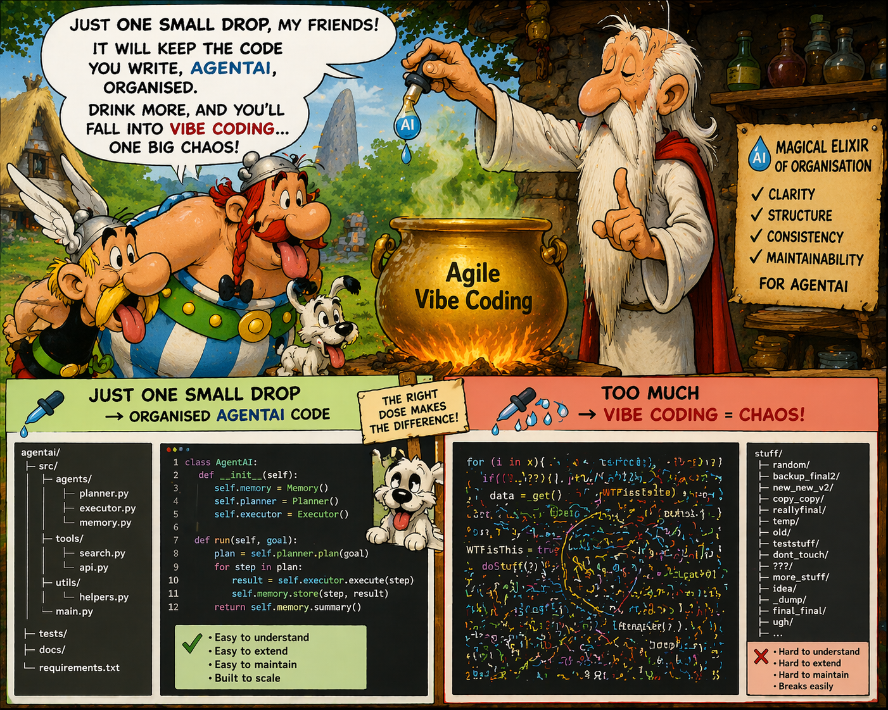

# Is There a Need to Change the Way Software Is Developed Today? – Continuation




_In the article [Is there a need to change the way software is developed?](https://www.linkedin.com/pulse/need-change-way-software-developed-today-marek-kubis-dntie)
I emphasized that the roots of today's software development problems also lie in the logic of Agile processes. I delved deeper into the topic of platform engineering._

_Let's now look at the problem from a different perspective. Let's examine the logic of software development itself._

## The Core Issue

What are the real limitations that many organisations fail to recognise when implementing Agile processes? Scrum and much of mainstream Agile software development primarily optimise the delivery loop, 
not the full organisational learning loop. 

> [!IMPORTANT]
> Agile explains how to iterate implementation - from requirements to production code and again from requirements to new, better production code.
> Agile therefore implicitly assumes that once we have a production version of the software and gain experience from its creation and use, new requirements will emerge automatically.
> 
> Unfortunately, this is a gross oversimplification. This approach only works for bug fixes and small improvements that don't require changing business assumptions. 
> But what happens when operational reality becomes a strategic change? The need to change business assumptions doesn't just apply to large corporations and large projects.

That is exactly why many _“Agile”_ organisations still behave structurally like _Waterfall_ or _mini-Waterfall_ organisations.

Large companies will likely recognise this problem because both _Agile_ and _Waterfall_ are still in use. However, for small companies that rely entirely on _Agile_, 
it may take far too long to discover that current software development problems stem from implementing flawed business assumptions. 

**Once implemented, Agile keeps software developers constantly busy in the SDLC cycle and prioritises fixing what's urgent over what's important.** 
Changing business assumptions is much more difficult for a small or medium-sized company than for a large company. 

### The Missing Loop in Agile

We can visualise the full software development process as a loop that includes not only implementation but also strategic and operational feedback.

```
Maintenance / Operations
    ↓
Business Requirements
    ↓
Business Architecture
    ↓
Enterprise Architecture
    ↓
Solution Architecture
    ↓
Implementation
    ↓
Operations / Maintenance
```

However, classic Scrum primarily covers:
```
Solution Architecture
    ↓
Implementation
    ↓
Testing
    ↓
Release
```

It is easy to see that this does not clearly define:
- operational feedback governance,
- enterprise architectural adaptation,
- organisational learning,
- strategic prioritisation mechanisms.


## The Agile Problem

The reality:
```
Support teams
    ↓
Product managers
    ↓
Delivery organisation
```

while:
- solution architecture,
- business operating models,
- organisational incentives,
- outsourcing decisions,
- regulatory constraints

remain disconnected.

Important:
> So what happens? **The feedback loop breaks down.**

Operational reality never reaches:
- business assumptions,
- enterprise architecture,
- executive governance.

Instead, only implementation-level defects get processed.

**Result**:
- teams iterate rapidly,
- but the organisation itself evolves slowly or incorrectly.

### The Large Organisations

This is extremely common in large corporations. Furthermore, Agile assumes a product organisation there: 
```
User pain
→ Product owner
→ Team
→ Release
→ Metrics
→ Strategy update
```
can happen within days. But enterprises are usually fragmented:
```
Operations
→ outsourcing vendor
→ regional manager
→ reporting layer
→ PM office
→ portfolio committee
→ architecture board
→ budgeting cycle
→ delivery train
```

> [!IMPORTANT]
> **At that point, Agile ceremonies remain, but systemic agility disappears.**
> No single Agile framework can fully solve their problems. 

Organisations usually need additional layers:
```
Concern	                Typical Discipline
--------------------------------------------------
Operational learning	ITIL / SRE / Observability
Enterprise adaptation	Enterprise Architecture
Strategic alignment	    Lean Portfolio Management
Governance	            COBIT / ISO
Continuous improvement	Kaizen / PDCA
Product feedback loops	Product Management
Delivery execution	    Scrum/Kanban
DevOps automation	    CI/CD + Platform Engineering
```

### The Enterprise Loop

In mature organisations, the loop is far larger than _Scrum_ itself. _Scrum_ is just one component inside it.

```
Operations / Support
    ↓
Telemetry / Incidents / KPIs
    ↓
Problem Management
    ↓
Product Management
    ↓
Business Capability Analysis
    ↓
Enterprise Architecture
    ↓
Portfolio Prioritization
    ↓
Solution Architecture
    ↓
Delivery Teams
    ↓
Release
    ↓
Operations
```

Agile alone is insufficient for full enterprise SDLC governance unless the organisation also implements:
- operational feedback integration,
- architectural governance,
- strategic adaptation mechanisms,
- and closed-loop decision systems.

Important:
> So many “Agile transformations” fail because they optimise **local delivery speed**, 
> instead of **enterprise learning throughput**.

That distinction is extremely important especially that today’s software development has to deal with AI too.

## “AI + Vibe Coding” Agile Loop Problem

With:
- Large language model systems,
- AI-assisted development,
- autonomous agents,
- infrastructure automation,
- observability platforms,
- and “vibe coding”,

**today’s bottlenecks differ significantly from those of the past**:
- humans write software,
- architecture changes slowly,
- expensive implementation,
- delayed feedback,

and implementation is no longer the slowest part.

Now the hardest problems become:
- context quality,
- architectural coherence,
- governance,
- operational signal interpretation,
- and business prioritisation.

### The Real Enterprise AI / Vibe Coding Loop

So the modern loop becomes something like this:

```
    Users / Operations / Market Signals
        ↓
    Telemetry + Support + AI Observability
        ↓
    AI-Augmented Problem Discovery
        ↓
┌ → Product + Business Capability Analysis
|       ↓
|   Enterprise & Solution Architecture
|       ↓
|   Policy / Compliance / Risk Validation
|       ↓
|   Human + AI Collaborative Design
|       ↓
|   AI-Assisted Implementation ("Vibe Coding")
|       ↓
|   Automated Verification & Simulation
|       ↓
|   Continuous Deployment
|       ↓
|   Runtime Monitoring + AI Agents
|       ↓
|   Operational Learning
|       ↓
|   Strategic Adaptation
|       ↓
└ ← (back to Business Capability Analysis)
```

What Changes Compared to Classical Agile?
1) Implementation Is No Longer Central
2) “Vibe Coding” Is Actually Intent-Driven Engineering
3) Maintenance Becomes Continuous Intelligence
4) Enterprise Architecture Becomes More Important, Not Less
5) The New Bottleneck = Translating Reality Into Intent


### Real Agile in the AI Era

```
Old world:
    - Requirements → Coding → Testing
New world:
    - Context → Intent → Validation → Governance
```

Traditional maintenance:
- tickets,
- bugs,
- support queues.

AI-native maintenance:
- anomaly detection,
- telemetry clustering,
- user behaviour analysis,
- automated root-cause analysis,
- incident summarization,
- pattern discovery.

Note:
> So **maintenance** evolves into **continuous operational intelligence**.

Important:
> AI accelerates implementation so much that architectural mistakes become massively amplified.

Without governance:
- duplicated services explode,
- hallucinated integrations appear,
- inconsistent APIs spread,
- security gaps multiply,
- technical debt compounds rapidly.

Therefore:
- Enterprise Architecture,
- platform standards,
- domain boundaries,
- governance policies,
- reference architectures

become critical stabilisers.

> Note: 
> AI increases the value of architecture.

Translating reality into intent is the key modern insight.

The hard problem is no longer _How do we implement software?_

The hard problem becomes:
```
How do we correctly interpret
business reality and operational signals
into valid system intent?
```

That requires:
- business capability modelling,
- domain understanding,
- architecture,
- governance,
- systems thinking

which become more valuable than raw coding speed.

> [!IMPORTANT]
> Real agility now means ___fast organisational learning___, not merely _fast sprint delivery_.


### AI-Native Enterprise Delivery Model

A realistic future-state enterprise structure may look like:

```
Layer	                    Primary Actor
-----------------------------------------------------------
Strategy	                Executives + AI analytics
Business Architecture	    Domain leaders + architects
Enterprise Architecture	    Human architects + AI modelling
Solution Architecture	    AI-assisted architects
Implementation	            Developers + coding agents
Testing	                    Autonomous verification agents
Operations	                SRE + AI observability
Governance	                Compliance AI + human oversight
Continuous Improvement	    Cross-layer feedback systems
```

The classical ISO PDCA cycle — `Plan → Do → Check → Act` — evolves into:
`Sense → Interpret → Simulate → Generate → Validate → Deploy → Observe → Learn`

This is closer to:
- cybernetics,
- adaptive systems,
- autonomous operations,
- continuous intelligence systems.

But, still many organisations currently use AI like this:

```
Broken organisation
    +
AI code generation
    =
Faster chaos
```
**That is not agility.**


Real AI agility requires:
- closed-loop learning,
- architecture governance,
- operational intelligence,
- and business adaptation.

**Otherwise enterprises simply accelerate entropy.**


## The most important shifts in modern software engineering

Once we accept that infrastructure is now architecture, the entire _SDLC / Agile / DevOps / AI-native model_ changes structurally.

Because infrastructure is no longer:
- passive hosting,
- deployment plumbing,
- or operational afterthought.

Infrastructure now defines:
- system behaviour,
- scalability,
- resilience,
- security boundaries,
- communication topology,
- governance,
- observability,
- and even business capabilities.

In cloud-native systems, architecture increasingly emerges from infrastructure definitions.

Modern cloud-native reality:

```
Business Capabilities
    ↓
Distributed Platform Topology
    ↓
Infrastructure Policies
    ↓
Runtime behaviours
    ↓
Application Components
```

Now:
- Kubernetes shapes service boundaries,
- Service Bus shapes communication patterns,
- API Gateway shapes security,
- CI/CD shapes release governance,
- observability shapes operations,
- IAM shapes organisational structure.
Infrastructure has become executable architecture.

### Infrastructure as Code Changed Everything

With:
- Terraform
- Bicep
- Kubernetes
- Helm
- GitOps,
- policy-as-code,
- platform engineering,

architecture has moved into repositories.

This means:
- architecture is versioned,
- testable,
- deployable,
- observable,
- and AI-generatable.

That is a massive paradigm shift.

### The New Enterprise Stack

The stack is no longer:
```
Business
→ Application
→ Database
→ Servers
```

Instead:
```
Business Capabilities
→ Policies
→ Platform Architecture
→ Event Topology
→ Identity Boundaries
→ Observability
→ Runtime Orchestration
→ AI-Augmented Services
```

**Applications become only one layer inside the platform.**

### Why This Changes Agile

Classical Agile assumed:
- software teams own application code,
- ops owns infrastructure.

Now:
- infrastructure is the delivery mechanism,
- platform topology defines team autonomy,
- deployment architecture defines release velocity.

So the feedback loop changes from:
```
Requirements
→ Code
→ Deploy
→ Feedback
```

to:
```
Operational Signals
→ Platform Constraints
→ Architectural Intent
→ Infrastructure Policies
→ AI/Human Generation
→ Runtime Telemetry
→ Organisational Learning
```

This is much closer to:
- platform engineering,
- systems engineering,
- cybernetic governance,
- adaptive enterprise architecture.

### In AI-Native Development, Infrastructure Becomes the Stable Layer

This is critical. AI can generate:
- APIs,
- services,
- tests,
- adapters,
- pipelines,
- boilerplate,
- documentation

very quickly.

What remains hard and valuable is:
- topology,
- trust boundaries,
- governance,
- observability,
- event contracts,
- resilience models,
- compliance architecture.

> In other words, ___infrastructure becomes the persistent organisational memory.___
Applications become increasingly ephemeral.

In Kubernetes-centric systems, the real architecture often consists of:
- ingress rules,
- namespaces,
- service mesh,
- network policies,
- operators,
- RBAC,
- secrets management,
- scaling policies,
- GitOps pipelines.

Important:
> The application containers are replaceable.
> 
> The platform defines the system.


Azure example system:
```
Azure Gateway
→ Azure Function
→ Service Bus
→ Kubernetes Worker Services
→ CI/CD
→ IaC
```

is not merely “deployment” - it is already Infrastructure-as-Architecture.

The business behaviour emerges from:
- asynchronous messaging,
- retry semantics,
- queue durability,
- event contracts,
- scaling policies,
- routing,
- observability,
- deployment governance.

> Note: 
> Most architectural decisions are infrastructural.

This Also Changes the Role of Developers. Developers increasingly become:
- platform-aware engineers,
- system orchestrators,
- policy designers,
- runtime behaviour designers.

And AI agents increasingly handle:
- implementation detail generation.

So engineering evolves from:
- writing code
- towards designing executable operational systems.

### The Real AI-Native Loop With Infrastructure = Architecture

```
    Operational Reality
        ↓
    Observability + AI Analysis
        ↓
    Business Capability Interpretation
        ↓
┌ → Architectural Intent
|       ↓
|   Infrastructure Policies & Platform Topology
|       ↓
|   AI/Human Service Generation
|       ↓
|   Automated Verification
|       ↓
|   Continuous Deployment
|       ↓
|   Runtime behaviour
|       ↓
|   Telemetry & Organisational Learning
|       ↓
└ ← (back to Intent)
```

> [!IMPORTANT]
> “Application Coding” is no longer central.

The central layer becomes:
- intent,
- topology,
- policy,
- runtime governance.


## An "Elixir" for SDLC Process

### What Agile Actually Solved

Agile solved several real historical problems:
- excessively long delivery cycles,
- weak customer feedback,
- rigid planning,
- late integration,
- delayed testing,
- and poor adaptability during implementation.

Agile improved:
- iteration speed,
- collaboration,
- delivery cadence,
- and implementation feedback loops.

But Agile mainly optimised:
```
Requirements
→ Implementation
→ Release
→ Feedback
```

It did not fully solve:
- enterprise learning,
- strategic adaptation,
- architecture governance,
- organisational topology,
- or business capability evolution.

**So Agile is:**
- **a delivery optimisation model**,

not:
- a complete enterprise cognition model.

### What Vibe Coding Actually Solves

“Vibe coding” solves another bottleneck entirely.

It dramatically reduces:
- implementation friction,
- boilerplate creation,
- context-switching cost,
- and technical generation effort.

AI-assisted development accelerates:
- coding,
- testing,
- infrastructure generation,
- documentation,
- and automation.

But it does not inherently solve:
- architectural coherence,
- domain understanding,
- governance,
- organisational learning,
- operational interpretation,
- or strategic correctness.

**In weak organisations, vibe coding can actually amplify failure:**
```
Bad assumptions
    +
AI acceleration
    =
Faster wrong systems
```

### The Real Bottleneck Was Never Coding

Historically, software engineering often behaved as if the primary constraint was:
```
How fast can we implement software?
```

**Today, that is increasingly false.**

The modern bottleneck is closer to:
```
How accurately can an organisation
interpret reality,
adapt architecture,
and evolve intent?
```

**That is a fundamentally different problem.**

### The Real "Elixir" Is Closed-Loop Organisational Learning

The closest thing to an SDLC “elixir” is not:
- Agile,
- Scrum,
- DevOps,
- Platform Engineering,
- AI,
- or vibe coding alone.

> It is: **continuous closed-loop organisational learning**.

Meaning the organisation can continuously:
1) observe operational reality,
2) interpret signals correctly,
3) adapt business intent,
4) evolve architecture,
5) validate outcomes,
6) and redeploy safely.

### The Real AI-Native SDLC

The future SDLC is likely a synthesis of:
```
Capability	                Discipline
-----------------------------------------------
Strategic adaptation	    Business architecture
Organisational learning	    PDCA / Systems thinking
Architecture governance	    Enterprise architecture
Delivery execution	        Agile / DevOps
Runtime stability	        Platform engineering
Operational intelligence	SRE / Observability
Fast implementation	        AI-assisted development
Risk management	            Policy & governance
Continuous evolution	    Feedback systems
```

### So What Are Agile and Vibe Coding Really?

**Agile is:**
> an implementation coordination framework.

**Vibe coding is:**
> an intent-to-implementation acceleration mechanism.

Neither alone defines:
- organisational intelligence,
- architecture evolution,
- or strategic correctness.

### The Deeper Shift

The industry may currently be moving through three eras:
```
Era	            Primary Constraint
-----------------------------------------
Waterfall era	Delivery predictability
Agile era	    Delivery adaptability
AI-native era	Organisational cognition
```

**That last stage changes everything.**

Because once AI reduces implementation cost dramatically, the quality of:
- intent,
- architecture,
- governance,
- and operational learning

becomes the dominant factor.


## Final Consequence

> If infrastructure is architecture, then:
> **DevOps is no longer a support function**.

It becomes the operational expression of enterprise architecture.

And Agile evolves from:
- iterative software delivery

into:
- continuous adaptive system governance.

> [!NOTE]
> Agile made software delivery faster.
> 
> Vibe coding makes implementation cheaper.

But neither guarantees that:
- the right system is built,
- the organisation learns,
- the architecture evolves correctly,
- or the business adapts to reality.

The real “elixir” is the ability to continuously transform operational reality to:
- ✅ organisational learning,
- ✅ architectural evolution,
- ✅ validated system behaviour.

> **That is much larger than Agile and much safer than vibe coding alone.**

**That is also a much deeper transformation than most Agile literature recognises.**


## See also:
- [Is there a need to change the way software is developed today?](https://www.linkedin.com/pulse/need-change-way-software-developed-today-marek-kubis-dntie)
- [Deterministic Developers in a Non-Deterministic World](https://www.linkedin.com/pulse/deterministic-developers-non-deterministic-world-marek-kubis-fstte)
- [Down the rabbit holes of AI-based software development process ](https://www.linkedin.com/pulse/down-rabbit-holes-ai-based-software-development-process-marek-kubis-fsyue)
- [This Isn’t Rebranding. It’s a Structural Shift in Software Development](https://www.linkedin.com/pulse/isnt-rebranding-its-structural-shift-software-marek-kubis-sanpe)

- [Mutation testing - Part 1: is it outdated?](https://www.linkedin.com/pulse/mutation-testing-part-1-why-works-all-marek-kubis-rkdde/)
- [Mutation testing - Part 2: Turn into a production-ready tool](https://www.linkedin.com/pulse/mutation-testing-part-2-turn-production-ready-tool-marek-kubis-qymbe/)
- [Mutation testing - Part 3: Mutation testing limits and how to go beyond it](https://www.linkedin.com/pulse/mutation-testing-part-3-limits-how-go-beyond-marek-kubis-taeue/)
- [Mutation testing - Part 4: mutation testing and LLM-written code](https://www.linkedin.com/pulse/mutation-testing-part-4-llm-written-code-marek-kubis-pjpne/)

- [Kafka & Service Bus — Part 1: Two Philosophies of Event-Driven Systems](https://lnkd.in/eiE5dcVp)
- [Kafka & Service Bus — Part 2: In Business Solutions: Real-world Architectures](https://lnkd.in/eAg_R5SZ)
- [Kafka & Service Bus — Part 3: Technical Comparison](https://lnkd.in/eBKcczQF)

- [Murphy’s law and more in AI time - one by one with examples](https://www.linkedin.com/pulse/murphys-law-more-ai-time-one-examples-marek-kubis-fkaze)
- [The Agile Vibe Coding and Conway's Law](https://www.linkedin.com/pulse/agile-vibe-coding-conways-law-marek-kubis-m0wpe)
- [Using a digital banking solution to prove Conway’s Law in AI-Driven engineering - example 1](https://www.linkedin.com/pulse/using-digital-banking-solution-prove-conways-law-ai-driven-kubis-xqlre/)
- [Using a .NET 10 migration project to prove Conway’s Law in AI-Driven engineering - example 2](https://www.linkedin.com/pulse/using-net-10-migration-project-prove-conways-law-ai-driven-kubis-abqae)

- [Where traditional Agile breaks in AI-driven systems](https://www.linkedin.com/pulse/where-traditional-agile-breaks-ai-driven-systems-marek-kubis-4wq6e/)
- [AI - It seems nobody has it fully figured out yet](https://www.linkedin.com/pulse/ai-nobody-has-figured-out-marek-kubis-bkyge)
- [Internal Development Platform and Agile Vibe Coding](https://www.linkedin.com/pulse/internal-development-platform-agile-vibe-coding-marek-kubis-kyhqe/?trackingId=5w3lWKp%2F0BLUpwNdrSmAcg%3D%3D&lipi=urn%3Ali%3Apage%3Ad_flagship3_pulse_read%3BqH%2FwqbkZRkmo%2Fagtxvqyrw%3D%3D)
- [Everyone will be vibe coders](https://www.linkedin.com/pulse/everyone-vibe-coders-marek-kubis-tlgze)
- [The Structural problems AI introduces into the SDLC](https://www.linkedin.com/pulse/structural-problems-ai-introduces-sdlc-marek-kubis-qyt6e)
- [Signals That Reveal the True Maturity of Organisations Claiming “AI-Driven Development”](https://www.linkedin.com/pulse/signals-reveal-true-maturity-organisations-claiming-ai-driven-kubis-urule)
- [AI - It seems nobody has it fully figured out yet](https://www.linkedin.com/pulse/ai-nobody-has-figured-out-marek-kubis-bkyge)

- [Agile Vibe Coding positioning and if this works, what changes?](https://www.linkedin.com/pulse/agile-vibe-coding-positioning-works-what-changes-marek-kubis-r4ate)
- [Agile Vibe Coding – Ceremony Modes](https://www.linkedin.com/pulse/agile-vibe-coding-ceremony-modes-marek-kubis-meq9e)
- [Agile Vibe Coding ceremonies approach compared to a simple one-prompt-per-task approach](https://www.linkedin.com/pulse/agile-vibe-coding-ceremonies-approach-compared-simple-marek-kubis-ecx5e)
- [Agile Vibe Coding Maturity Model](https://www.linkedin.com/pulse/agile-vibe-coding-maturity-model-marek-kubis-bbtqe)
- [The Agile Vibe Coding - the 4-level adaptive ceremony system](https://www.linkedin.com/pulse/agile-vibe-coding-4-level-adaptive-ceremony-system-marek-kubis-jizke)

- [Agile Vibe Coding Manifesto](https://agilevibecoding.org/)
- [Principles Behind the Agile Vibe Coding Manifesto - extended version](https://github.com/marekartur-dev/agilevibecoding/blob/main/Docs/Home/Principles.md)

- [Agile Vibe Coding](https://www.reddit.com/r/AgileVibeCoding/)
- [Marek Kubis - blog](https://github.com/marekartur-dev/agilevibecoding/tree/main)