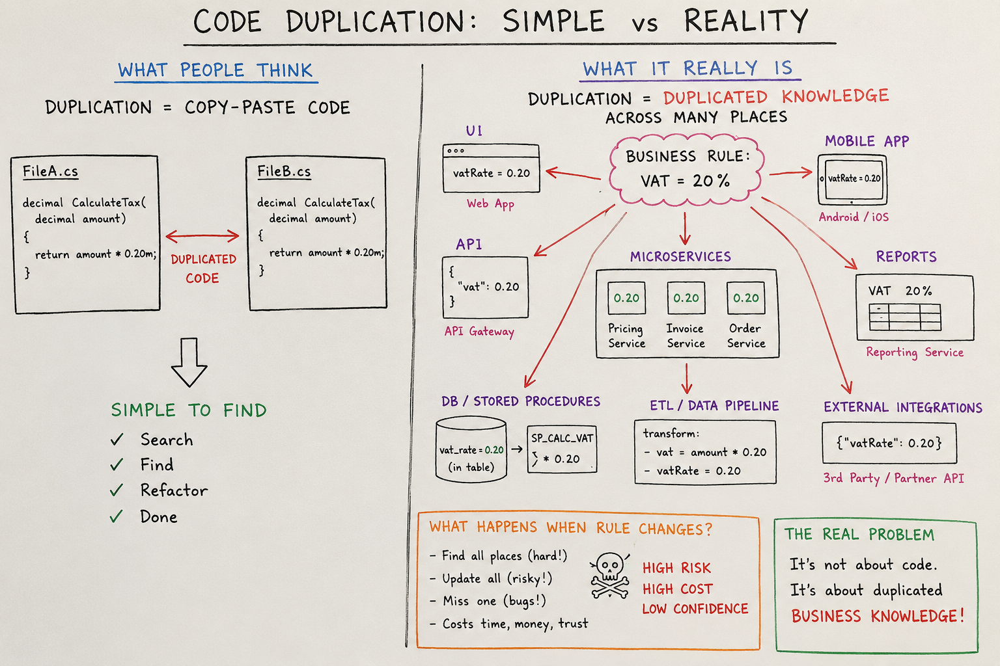

# Once and Only Once with Examples - Part 1: Is It Obvious?



Solving real-world problems using computers is inextricably linked to writing program code, which is itself one vast abstraction of reality.
Such a program is encapsulated in logical structures and ultimately translated into machine instructions.
And this binary world of zeros and ones is managed by equally abstract arithmetic-logical units, the Arithmetic Logic Unit (ALU) and Central Processing Unit (CPU).

In other words, a computer program is one vast abstraction built using the abstract concepts of a chosen programming language, its rules, and instructions.
And if so, why the existence of additional principles of abstraction and the need to remind programmers to adhere to them?
After all, these people are fully aware that programming is abstract.

Well, these rules probably came into being because too much abstraction in programming often leads to chaos.
And this, in turn, is one of the greatest sins in programming. And code duplication is one of the oldest and most persistent software engineering problems.

One of the key aspects of good software design is avoiding code duplication.
This principle is a fundamental concept that helps developers write cleaner, more efficient, and more maintainable code.
In this article, we'll discuss what code duplication avoidance is, why it's important, and how to apply it in practice.

## On the way to clean code

### Is it self-evident why code duplication is undesirable?

The large number of rules addressing this problem, however, suggests that it is not as obvious as it may first appear.

That's true, because creating a program essentially involves writing a carefully organized sequence of instructions, so it's often not obvious when a programmer is repeating themselves.

For example, this simple task.

How and in what order should a developer follow the rules: OAO-YAGNI-KISS-DRY-WET-AHA-SPOT?

- **OAO** - The "Once and Only Once" (OAO) principle is a fundamental concept in programming that states that any piece of knowledge or logic should be represented only once in a system.
- **YAGNI** - The "You Aren't Gonna Need It" (YAGNI) principle is a programming principle that states that programmers should not implement features unless they are absolutely necessary.
- **KISS** - The "Keep It Simple, Stupid" (KISS) principle is a design principle that states that most systems work best when they are simple, not complex.
- **DRY** - The "Don't Repeat Yourself" (DRY) principle advocates avoiding duplication of information altogether, as well as avoiding duplication of human effort involved in the software development process. 
- **WET** - The "Write Everything Twice" (WET) principle is the opposite of the DRY principle and states that sometimes code duplication is acceptable if it improves readability or understandability.
- **AHA** - The "Avoid Hasty Abstractions" (AHA) principle states that developers should avoid creating abstractions until they are truly needed.
- **SPOT** - The "Single Point of Truth" (SPOT) principle states that each piece of knowledge or logic should be represented only once in the system, which aligns with the OAO principle.

As you reflect, I think you've already noticed, dear reader, that what seems obvious at first glance may not be obvious in practice.

Therefore, let's not dwell on the correct order, because there can only be one answer to the question: **it depends** on the context, the situation, the problem, the team, the project, and even the programmer.

### Why is code duplication undesirable?

Code duplication is undesirable for many reasons:
1. **Increased Cost**: Maintaining duplicated code is expensive because it requires more time and resources to manage, update, and test.
2. **Difficulty in Maintaining and Refactoring**: Code duplication makes it more difficult to implement changes and improvements because each change must be applied to all duplicated places.
3. **Increased Code Size**: Code duplication leads to more lines of code, which can make navigation, understanding program structure, and analysis difficult.
4. **Increased Risk of Errors**: Code duplication increases the risk of introducing errors because each copy of the code can be modified independently, leading to inconsistencies and difficulty maintaining consistent business logic.
5. **Increased Difficulty in Documenting**: Code duplication can make documentation more difficult because each copy of the code must be documented separately, increasing the time and effort required to maintain up-to-date documentation. 6. **Increased Difficulty in Debugging**: Code duplication can make debugging more difficult because errors can appear in multiple places, making it difficult to pinpoint the source of the problem.
6. **Increased Difficulty in Testing**: Duplicated code can make testing more difficult and can hinder quality assurance because each copy of the code must be tested separately, increasing the time and effort needed to ensure the software works correctly and meets user requirements.
7. **Increased Difficulty in Scaling**: Code duplication can make scaling more difficult because each copy of the code must be managed and updated separately, increasing the complexity and difficulty of maintaining the system as it evolves.
8. **Increased Difficulty in Maintaining Consistency**: Code duplication can make maintaining consistency more difficult because it can lead to an increased risk of errors as the system evolves. 10. **Increasing Integration Difficulty**: Code duplication can make integration with other systems more difficult because any loss of consistency between different systems can result in consequences that are unpredictable a priori.
9. **Increasing Version Management Difficulty**: Code duplication can make version management more difficult because each copy of the code can be modified independently, leading to conflicts between different versions of the software.
10. **Increasing Technical Debt Management Difficulty**: Code duplication can lead to increased technical debt because each modification can require refactoring across multiple versions of the program simultaneously and bug fixes in the future.
11. **Increasing Innovation Difficulty**: Code duplication can make innovation more difficult because each change or new functionality must be implemented in all places where the code is duplicated, increasing the time and effort required for experimentation and implementation. 
12. **Increasing Team Management Difficulty**: Code duplication can make team management more difficult because different people may be working on different versions of the code, leading to conflict and difficulty coordinating changes, which in turn can lead to lower team morale and effectiveness.

### But what is code duplication?

"What a trivial question", you might say.
___Code duplication is a situation in which the same or very similar code fragment appears in more than one place in a program.___

I won't deny it, but please note, reader, that duplicate code is merely a symptom of duplicated business rules.

The essence of the problem at hand is that the programmer repeatedly implements the same business logic, repeats decisions, repeatedly references the same knowledge, or repeatedly replicates the same design pattern.

Do you see the danger? Consider the previously introduced definitions of the rules and try to reinterpret them, but in the context of the essence of the duplication problem — semantics,
and not just in the context of source code duplication — syntax. Also consider that duplication can affect not only code but also processes, documentation, tests, and even team communication.

And what will this look like in the context of a monolithic application? How about in the context of microservices and distributed applications?

Add to this the context of event-driven or serverless architecture. Add to this the replication of infrastructure and databases, and the replication of knowledge within the team.

Add to this the context of various programming languages, frameworks, libraries, and even project and team management tools.

**Doesn't this become more complicated than simply copy-pasting selected lines of code?**

> [!NOTE]
> 📌 After all, what's repeated doesn't have to be identical, but can be similar, or even only partially repeatable.

### Attention, danger!

The real problem with code duplication is that it not only involves the repetition of errors, but above all, it increases error exposure. We will certainly notice this during debugging, integration, and scaling.

But it can also manifest itself only during production, or even during system development, when new requirements arise and the need for changes and versioning arises.

The interesting part is that duplication occurs at multiple levels:
1. Source code duplication (copy-paste code)
2. Business logic duplication (same rule implemented multiple times)
3. Process duplication (same workflow implemented in different systems)
4. Data duplication (replicated databases, caches, read models)
5. Integration duplication (multiple services performing identical transformations)
6. Configuration duplication (same settings repeated across environments)

> [!NOTE]
> 📌 The further you move from code toward architecture, the more expensive duplication becomes.

## Why Is Code Duplicated?

### 1. Copy-Paste Programming

The simplest reason:
```csharp
    public decimal CalculateTaxUk(decimal amount)
    {
        return amount * 0.20m;
    }

    public decimal CalculateTaxGermany(decimal amount)
    {
        return amount * 0.20m;
    }
```

Developers often duplicate because:
- it is faster initially
- requirements are unclear
- deadlines exist
- abstraction is not obvious

> [!NOTE]
> 📌 This is often called accidental duplication.

**One nuance** - sometimes duplication is deliberate to achieve:
- availability
- resilience
- bounded-context autonomy

For example `Tax Service` may be copied into:

```
    Order Context
    Invoice Context
```

when independent deployment is more important than perfect centralisation.


### 2. Similar But Not Yet Similar Enough

> [!WARNING]
> ❗️ Premature abstraction can be worse than duplication.

**Consider**:
```csharp
    CreateCustomer();
    CreateSupplier();
    CreateEmployee();
```

Initially they differ but after six months:
```csharp
    CreatePerson();
```
becomes obvious.

Many experienced developers intentionally allow some duplication before extracting common behaviour.

This follows the ___Rule of Three___ proposed by _Martin Fowler_ (see **AHA** rule):
- 1st occurrence → write code
- 2nd occurrence → notice pattern
- 3rd occurrence → abstract

### 3. Distributed Systems Force Duplication

> [!NOTE]
> 📌 Microservices intentionally duplicate data.

**Example**:

Order Service:
```json
    {
      "customerId": "123",
      "customerName": "John"
    }
```

Customer Service:
```json
    {
      "id": "123",
      "name": "John"
    }
```

Customer name exists twice. Why?

Because:
- services must remain autonomous
- cross-service joins are expensive
- network calls fail

> [!NOTE]
> 📌 Architectural duplication is often intentional (see **WET** rule).

## Predicting Duplication

A useful question:
> [!NOTE]
> 📌 "How many places must change if this business rule changes?"

If answer > 1 then duplication exists.

**Example**:

VAT rate appears in:
- UI
- API
- Pricing Service
- Reporting Service
- Data Warehouse

When VAT changes:

```
    VAT Rule
    ├── UI
    ├── API
    ├── Service
    ├── Reports
    └── ETL
```

Five updates required -> duplication exists -> **this predicts future maintenance cost**.

## Avoiding Duplication in Distributed Systems

### Strategy 1: Single Source of Truth

One service owns the rule, **SPOT** rule.

**Example**:

```
    Pricing Service
           ↓
     All Consumers
```

Instead of:

```
    Order Service computes VAT
    Invoice Service computes VAT
    Reporting Service computes VAT
```

**Only Pricing Service computes VAT.**

### Strategy 2: Event-Driven Architecture

Rather than recomputing `Customer Updated` publish event:

```csharp
    public record CustomerUpdated(Guid Id, string Name);
```

**Consumers update their own copies.**

> [!NOTE]
> 📌 This avoids duplicated logic while allowing duplicated data.

### Strategy 3: Shared Domain Library

_Useful inside one organisation._

```csharp
    public static class VatCalculator
    {
        public static decimal Calculate(decimal amount)
            => amount * 0.20m;
    }
```

Used by:

```
    Order Service
    Invoice Service
    Report Service
```

> [!NOTE]
> 📌 However shared libraries can become distributed monoliths. **Use carefully.**

### Knowledge Duplication vs Data Duplication

___Not all duplication is harmful.___

> [!NOTE]
> 📌 Duplicating data is often necessary for performance, availability, autonomy, or scalability.

> [!WARNING]
> ❗️ Duplicating knowledge is usually dangerous because a change in the business rule requires multiple updates.

Therefore, **DRY** should primarily be applied to knowledge, not necessarily to data.


## Process Duplication

> [!IMPORTANT]
> ❗️ This is often worse than code duplication.

_See below example._

### Customer Onboarding

System A:

```
    Validate Customer
    Create Account
    Send Email
```

System B:

```
    Validate Customer
    Create Account
    Send Email
    Generate Contract
```

Soon `Validate Customer` exists in 15 systems.

> [!WARNING]
> ❗️ Now changing validation becomes a nightmare.

### Process-Centric Approach

Instead of embedding workflow everywhere:

```
    Workflow Engine
          ↓
       Processes
```

> [!NOTE]
> 📌 Move process definitions outside code.

**Examples**:
- BPMN
- Workflow Engines
- Durable Functions
- State Machines
- State Machine Pattern

> [!NOTE]
> 📌 Very useful for avoiding process duplication.

Example Order:

```csharp
    public enum OrderState
    {
        Draft,
        Submitted,
        Approved,
        Shipped,
        Completed
    }
```

Transitions:

```csharp
    public class Order
    {
        public OrderState State { get; private set; }

        public void Submit()
        {
            if (State != OrderState.Draft)
                throw new InvalidOperationException();

            State = OrderState.Submitted;
        }
    }
```

Instead of:

```csharp
    if(order.Status == ...)
```

spread across dozens of services.

### Workflow Pattern

> [!NOTE]
> 📌 Represent process as steps.

```csharp
    public interface IWorkflowStep
    {
        Task ExecuteAsync();
    }
```

Steps:

```csharp
    public class ValidateCustomerStep : IWorkflowStep
    {
        public Task ExecuteAsync()
        {
            Console.WriteLine("Validating");
            return Task.CompletedTask;
        }
    }
```

Workflow:

```csharp
    public class Workflow
    {
        private readonly IEnumerable<IWorkflowStep> _steps;

        public Workflow(IEnumerable<IWorkflowStep> steps)
        {
            _steps = steps;
        }

        public async Task RunAsync()
        {
            foreach(var step in _steps)
                await step.ExecuteAsync();
        }
    }
```

### Avoiding Logic Between Processes and Subprocesses

A common anti-pattern:

```
     Process A
       ↓
     Subprocess B
       ↓
     Process A Logic
       ↓
     Subprocess C
```

Logic becomes fragmented.

Instead:

```
    Orchestrator
     ├── Step A
     ├── Step B
     └── Step C
```

> [!NOTE]
> 📌 All decision-making lives in one place.

## Patterns That Help

### Strategy Pattern

___Avoid duplicated conditional logic.___

```csharp
    public interface IDiscountStrategy
    {
        decimal Apply(decimal amount);
    }
```

Implementation:

```csharp
    public class VipDiscount : IDiscountStrategy
    {
        public decimal Apply(decimal amount)
            => amount * 0.9m;
    }
```

### Template Method

___Avoid duplicated process skeletons.___

```csharp
    public abstract class OrderProcessor
    {
        public void Process()
        {
            Validate();
            Calculate();
            Save();
        }

        protected abstract void Validate();
        protected abstract void Calculate();
    }
```

### Chain of Responsibility

___Avoid repeated validation pipelines.___

```csharp
     Validation
        ↓
     Fraud Check
        ↓
     Credit Check
        ↓
     Compliance Check
```

> [!NOTE]
> 📌 Each step is reusable.

### Mediator

___Avoid duplicated communication paths.___

Instead of:

```
    A ↔ B
    A ↔ C
    A ↔ D
```

Use:

```
      Mediator
    /    |    \
   A     B     C
```

### Saga Pattern

___Useful in distributed systems.___

Instead of duplicating compensation logic:

```
    Create Order
    Reserve Stock
    Take Payment
```

Saga manages rollback.

```
    Cancel Payment
    Release Stock
```

centrally.

### Event Sourcing

___Avoid duplicated interpretations of state.___

Store:

```csharp
    OrderCreated
    ItemAdded
    PaymentReceived
```

Current state is reconstructed.

> [!NOTE]
> 📌 Every service derives from the same history.

### Specification Pattern

___Very useful for avoiding duplicated validation logic.___

Example:

```csharp
    public interface ISpecification<T>
    {
        bool IsSatisfiedBy(T entity);
    }
```

> [!NOTE]
> 📌 This would fit naturally into the validation/process section.

## Architectural Principle

A useful hierarchy is:

```
    Business Rule
          ↓
    Domain Model
          ↓
    Process
          ↓
    API
          ↓
    UI
```

> [!NOTE]
> 📌 The higher a rule lives in this hierarchy, the fewer times it is duplicated.

For example:
- ❌ VAT calculation in UI, API, reports, database procedures
- ✔ VAT calculation in Domain Model


## Take away

> [!NOTE]
> ✔ Every duplication decision is a trade-off between consistency, coupling, autonomy, performance, and operational complexity.

### How to avoid code duplication?

1. **Clear, precise requirements**: Specifications that allow understanding which business rules are duplicated and why, enabling identification of areas where duplication is most harmful and where it can be effectively eliminated.
2. **Code refactoring**: Regularly reviewing and refactoring code to remove duplication and improve its structure.
3. **Using functions and methods**: Creating functions and methods that can be reused instead of duplicating code.
4. **Using classes and objects**: Creating classes and objects that can be reused instead of duplicating code.
5. **Using libraries and modules**: Using existing libraries and modules instead of duplicating code.
6. **Using design patterns**: Applying design patterns that help avoid code duplication.

> [!IMPORTANT]
> ❗️ Please check the unclear requirements with particular care.

### Practical Rule for Modern .NET Systems

For Azure Functions, Service Bus, Kubernetes, microservices, and distributed applications:

**1. Duplicate data when necessary**
- Read models
- Caches
- Search indexes

**2. Never duplicate business rules**
- One owner
- One implementation
- Exception: sometimes, for availability, resilience, etc. purposes, a snippet of code is intentionally repeated

**3. Centralise workflows**
- State machines
- Durable Functions
- BPMN/workflow engines

**4. Prefer events over shared databases**
- Duplicate facts
- Not decisions

**5. Model processes explicitly**
- Saga
- State Machine
- Workflow Pattern

**6. Measure duplication by change impact**
- If a business rule change requires modifying more than one place, treat it as an architectural smell and investigate whether a single source of truth can be established.

> [!IMPORTANT]
> ❗️In large Azure-based systems, most maintenance cost comes not from duplicated code, but from **duplicated business decisions** hidden across services, databases, reports, pipelines, and workflows. 
> Eliminating duplication at the business-rule and process level usually delivers far more value than removing a few hundred lines of repeated C# code.

**Semantics – this is where the real engineering problem begins.**


_...tbc..._

## See also:
- [Underestimated and Annoying, or the "Dirty Dozen" of Programmers - Part 1: The Problem Space](https://www.linkedin.com/pulse/underestimated-annoying-dirty-dozen-programmers-marek-kubis-mcfxe)
- [Underestimated and Annoying, that is "The Dirty Dozen" of Programmers - Part 2: AI-Generated Software](https://www.linkedin.com/pulse/underestimated-annoying-dirty-dozen-programmers-part-2-marek-kubis-tqkme/)
- [Underestimated and Annoying, that is "The Dirty Dozen" of Programmers - Part 3: I. Organizational Problems](https://www.linkedin.com/pulse/underestimated-annoying-dirty-dozen-programmers-part-marek-kubis-h9y3e/)
- [Underestimated and Annoying, that is "The Dirty Dozen" of Programmers - Part 4: II. Human Problems](https://www.linkedin.com/pulse/underestimated-annoying-dirty-dozen-programmers-part-marek-kubis-mn5ve/)
- [Underestimated and Annoying, that is "The Dirty Dozen" of Programmers - Part 5: III. Process Problems](https://www.linkedin.com/pulse/underestimated-annoying-dirty-dozen-vibe-coding-part-marek-kubis-83jre/)
- [Underestimated and Annoying, that is "The Dirty Dozen" of Programmers - Part 6: IV. Architecture Problems](https://www.linkedin.com/pulse/underestimated-annoying-dirty-dozen-programmers-part-marek-kubis-remze/)
- [Underestimated and Annoying, that is "The Dirty Dozen" of Programmers - Part 7: V. Validation Problems](https://www.linkedin.com/pulse/underestimated-annoying-dirty-dozen-programmers-part-marek-kubis-dqk2e/)
- [Underestimated and Annoying, that is "The Dirty Dozen" of Programmers - Part 8: VI. Economic Problems](https://www.linkedin.com/pulse/underestimated-annoying-dirty-dozen-programmers-part-marek-kubis-7bb6e/)

- [Murphy’s law and more in AI time - one by one with examples](https://www.linkedin.com/pulse/murphys-law-more-ai-time-one-examples-marek-kubis-fkaze)
- [The Agile Vibe Coding and Conway's Law](https://www.linkedin.com/pulse/agile-vibe-coding-conways-law-marek-kubis-m0wpe)
- [Using a digital banking solution to prove Conway’s Law in AI-Driven engineering - example 1](https://www.linkedin.com/pulse/using-digital-banking-solution-prove-conways-law-ai-driven-kubis-xqlre/)
- [Using a .NET 10 migration project to prove Conway’s Law in AI-Driven engineering - example 2](https://www.linkedin.com/pulse/using-net-10-migration-project-prove-conways-law-ai-driven-kubis-abqae)

- [Where traditional Agile breaks in AI-driven systems](https://www.linkedin.com/pulse/where-traditional-agile-breaks-ai-driven-systems-marek-kubis-4wq6e/)
- [AI - It seems nobody has it fully figured out yet](https://www.linkedin.com/pulse/ai-nobody-has-figured-out-marek-kubis-bkyge)
- [Internal Development Platform and Agile Vibe Coding](https://www.linkedin.com/pulse/internal-development-platform-agile-vibe-coding-marek-kubis-kyhqe/?trackingId=5w3lWKp%2F0BLUpwNdrSmAcg%3D%3D&lipi=urn%3Ali%3Apage%3Ad_flagship3_pulse_read%3BqH%2FwqbkZRkmo%2Fagtxvqyrw%3D%3D)
- [Everyone will be vibe coders](https://www.linkedin.com/pulse/everyone-vibe-coders-marek-kubis-tlgze)
- [The Structural problems AI introduces into the SDLC](https://www.linkedin.com/pulse/structural-problems-ai-introduces-sdlc-marek-kubis-qyt6e)
- [Signals That Reveal the True Maturity of Organisations Claiming “AI-Driven Development”](https://www.linkedin.com/pulse/signals-reveal-true-maturity-organisations-claiming-ai-driven-kubis-urule)

- [Agile Vibe Coding positioning and if this works, what changes?](https://www.linkedin.com/pulse/agile-vibe-coding-positioning-works-what-changes-marek-kubis-r4ate)
- [Agile Vibe Coding – Ceremony Modes](https://www.linkedin.com/pulse/agile-vibe-coding-ceremony-modes-marek-kubis-meq9e)
- [Agile Vibe Coding ceremonies approach compared to a simple one-prompt-per-task approach](https://www.linkedin.com/pulse/agile-vibe-coding-ceremonies-approach-compared-simple-marek-kubis-ecx5e)
- [Agile Vibe Coding Maturity Model](https://www.linkedin.com/pulse/agile-vibe-coding-maturity-model-marek-kubis-bbtqe)
- [The Agile Vibe Coding - the 4-level adaptive ceremony system](https://www.linkedin.com/pulse/agile-vibe-coding-4-level-adaptive-ceremony-system-marek-kubis-jizke)

- [Agile Vibe Coding Manifesto](https://agilevibecoding.org/)
- [Principles Behind the Agile Vibe Coding Manifesto - extended version](https://github.com/marekartur-dev/agilevibecoding/blob/main/Docs/Home/Principles.md)

- [Agile Vibe Coding](https://www.reddit.com/r/AgileVibeCoding/)
- [Marek Kubis - blog](https://github.com/marekartur-dev/agilevibecoding/tree/main)