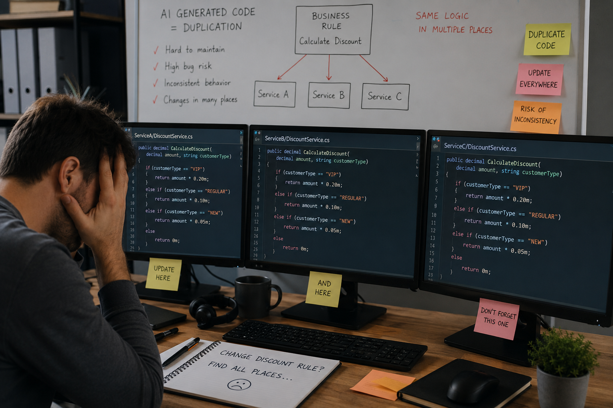

# Once and Only Once with Examples - Part 2: And AI-generated Code



_In the first part of this series, I provided an overview of the problem of code duplication written by developers._ 
_Why? Because developers extract shared utilities too early, create generics that are hard to understand, couple unrelated features that are hard to maintain._

_In this part, I will focus on problems with code generated by AI. The danger isn't that AI writes bad code. The danger is that AI writes good-looking, duplicate code._

_AI-generated code introduces a new dimension to the problem of code duplication. Why a new dimension? Because AI tends to optimise for local, rather than global, architectural correctness._

## Shift AI Up the Abstraction Ladder

_At a senior developer, architect, or engineering manager level, the problem is no longer "AI-generated duplicate methods"._

> [!WARNING]
> ❗️ The real problem is **AI-generated duplicate decisions**.

**That distinction is critical.**

Many teams ask AI:

```
    Generate a repository.
    Generate a controller.
    Generate a service.
```

This produces code-level duplication.

Instead ask:

```
    What bounded contexts exist?
    Who owns this business rule?
    What aggregate should contain this logic?
    What workflow pattern fits this process?
```

> [!NOTE]
> 👉 Generate architecture before code.

### AI Works Best on Stable Patterns

Good candidates:

- **DTOs**
```csharp
    public record CustomerDto(Guid Id, string Name);
```

- **Mappings**
```csharp
    CreateMap<Customer, CustomerDto>();
```

- **CRUD APIs**
```csharp
    app.MapGet("/customers/{id}", ...);
```

- **Infrastructure**
```csharp
    Azure Service Bus setup
    Terraform
    Bicep
    Dockerfiles
    Pipelines
```

> [!NOTE]
> 📌 These are repetitive and low-risk.

### AI Works Worst on Domain Decisions

Consider:

```
    Can an order be cancelled after shipment?
```

**This is not a coding question. It is a business rule!**

> [!NOTE]
> 👉 AI may invent a rule. **Only the business can define it.**

### Use AI to Generate Variability, Not Authority

**Bad**:
- AI decides process flow.

**Good**:
- Architect decides flow.
- AI generates implementation.

**Example**:

Developer defines:

```
    Draft
    Submitted
    Approved
    Rejected
    Completed
```

AI generates:

```
    public enum OrderState
    {
        Draft,
        Submitted,
        Approved,
        Rejected,
        Completed
    }
```

> [!NOTE]
> 📌 The decision came from humans. The boilerplate came from AI.


### The AI Architecture Boundary

A useful principle:

```
Humans own:
-------------
    Business rules
    Architecture
    Processes
    Ownership

AI owns:
---------
    Boilerplate
    Transformations
    Refactoring
    Documentation
    Tests
```

> [!WARNING]
> ❌ When AI crosses the line into business ownership, trouble begins.


## Preventing AI Duplication

### Central Domain Model

**Bad**:

```
Prompt:
    Generate customer validation.
```

-> AI generates validation.

**Later**:

```
Prompt:
    Generate registration endpoint.
```

-> AI generates another validation.

> [!WARNING]
> ❗️ Now there are two versions.

**Good**:

```
Prompt:
    Use CustomerValidator.
```

> [!NOTE]
> 👉 AI must reuse existing code.

**Example**:

```csharp
    public class CustomerValidator : AbstractValidator<Customer>
    {
        public CustomerValidator()
        {
            RuleFor(c => c.Name).NotEmpty();
            RuleFor(c => c.Email).EmailAddress();
        }
    }
```

-> All generated code references it.

### AI-Friendly Architecture

_AI performs much better when architecture is explicit._

**Example**:

```csharp
project folder:

    src/

    Domain/
    Application/
    Infrastructure/
    Api/
```

and: 
- clear rules -> **AI can follow rules**
> [!NOTE]
> 👉 Domain cannot reference Infrastructure
- no rules -> **AI amplifies chaos**
> [!NOTE]
> ❌ Everything references everything

### State Machines Become More Important

AI often generates in many places:

```csharp
    if(status == "Draft")
    {
    }
    else if(status == "Approved")
    {
    }
    else if(status == "Cancelled")
    {
    }
```

> [!WARNING]
> ❌ This duplicates process logic.

Instead:

```csharp
    public class OrderStateMachine
    {
    }
```

AI-generated code calls:

```csharp
    stateMachine.Submit();
```

> [!NOTE]
> 📌 The workflow remains centralised.

This aligns closely with our interest in .NET Worker Services and the Stateless state machine framework.

> [!IMPORTANT]
> 👉 We ought to prompt AI to generate state machines for complex processes, and then call them from generated code.

### Event-Driven Systems and AI

In Azure systems:

```
    Azure Function
        ↓
    Service Bus
        ↓
    Worker Service
```

AI often duplicates transformations with identical fields:

```
    OrderCreatedEvent
    OrderCreatedMessage
    OrderCreatedDto
    OrderCreatedRecord
```

A better approach is to reuse the contract wherever possible:

```csharp
    public record OrderCreated(Guid OrderId, decimal Amount);
```

> [!IMPORTANT]
> 👉 Generate mappings only when genuinely needed.

### AI Governance Pattern

Large organisations are increasingly adopting:

```
    Architecture Decision Records (ADR)
              ↓
    Reference Architecture
              ↓
    AI Generation Rules
              ↓
    Generated Code
```

Example ADR:

```
    ADR-007

    Customer validation belongs to Domain.

    All services must use CustomerValidator.

    No service may implement validation independently.
```

> [!IMPORTANT]
> 👉 AI receives the ADR as context.

Generated code becomes consistent.

### A Pattern Emerging in 2026

✔ Many teams are moving toward:

```
    Domain Model
          ↓
    State Machine
          ↓
    Workflow Definition
          ↓
    AI-generated Implementation
```

❌ rather than:

```
    AI-generated Services
    AI-generated Controllers
    AI-generated Functions
    AI-generated Workers
```

> [!IMPORTANT]
> 👉 The first approach generates much less duplication.

### What This Means for Our Azure/.NET Projects

Given our focus on:
- .NET 8
- Azure Functions
- Service Bus
- Kubernetes
- Worker Services
- Stateful workflows using Stateless

a practical approach is:

```
    1. Human defines state machine.
    2. Human defines events.
    3. Human defines aggregates.
    4. AI generates:
       - handlers
       - mappings
       - APIs
       - tests
       - infrastructure code
    5. CI/CD validates architectural rules.
```

For example:

```
    OrderAggregate
        ↓
    OrderStateMachine
        ↓
    OrderSubmitted
        ↓
    Azure Service Bus
        ↓
    OrderHandler
```

> [!NOTE]
> 📌 The architecture and process ownership stay centralised, while AI accelerates implementation.

This minimises both traditional code duplication and a newer problem that is becoming increasingly common: 
AI-generated architectural duplication, where multiple services independently implement the same business decision because the AI was never given a clear ownership model.


## The New Form of Duplication

Traditional duplication:

```csharp
    CalculateVat();
    CalculateVatAgain();
    CalculateVatThirdTime();
```

- Easy to detect.
- SonarQube finds it.
- Code reviews find it.
- Refactoring fixes it.

AI creates a much more dangerous form:
- Service A implements business rule X.
- Service B implements business rule X.
- Data pipeline implements business rule X.
- Reporting engine implements business rule X.
- LLM-generated migration script implements business rule X.

> [!NOTE]
> 📌 None of the code is identical.

> [!IMPORTANT]
> 👉 The duplication exists at the semantic level.

> [!WARNING]
> ❗️ Static analysis often misses it completely.

### Example 1: Financial Pricing Platform

_Imagine a trading platform._

> [!NOTE]
> 📌 Business rule: _Premium customers receive real-time market data_.

Team asks:

```
Developer asks AI:
    Generate entitlement logic for market data API.

AI produces:
    if(customer.IsPremium)
    {
        return RealTime;
    }
```

Six months later team asks:

```
Developer asks AI:
    Generate Kafka consumer for market data distribution.

AI produces:
    if(account.Tier == Premium)
    {
        SendRealtimeFeed();
    }
```

Next another team asks:

```
Developer asks AI:
    Generate billing reconciliation process.

AI produces:
    if(subscription.Plan == Premium)
    {
        ChargeRealtimeFee();
    }
```

**Result**:

One business decision
- implemented three times
- by three independent prompts.

**Notice**:

- ✔ Nobody copied code.
- ✔ Nobody violated DRY.
- ❌ Yet the architecture is now duplicated.

#### Example 2: Azure Event-Driven Architecture

_Consider our preferred architecture:_

```
Azure Function
      ↓
Service Bus
      ↓
Worker Service
      ↓
External System
```

> [!NOTE]
> 📌 Business rule: _Orders above £50,000 require compliance review._

AI is used separately for:
- API generation
- Function generation
- Worker generation

After six months:
- API validates 50k
- Function validates 50k
- Worker validates 50k
- Reporting validates 50k
- Regulation changes: `50k → 25k`

Developers now have duplicated code:
- 4 implementations
- 4 deployments
- 4 regression cycles
- 4 opportunities for defects

> [!WARNING]
> ❗️ Now the issue is not code duplication → **the issue is duplicated ownership**.

### Example 3: Azure Operational

_Consider Azure pipeline._

Retry Policy Example:

```
    Service A:
      Retry 3 times

    Service B:
      Retry 5 times

    Function:
      Retry 10 times

    Pipeline:
      Retry 2 times
```

- 📌 AI generates each independently.
- ❗️ Nobody notices.
- ❌ Production behaviour becomes inconsistent.

> [!WARNING]
> ❗️ This is a very real Azure problem.

### AI Amplifies Conway's Law

> [!NOTE]
> 📌 Classic Conway's Law: ___Systems mirror organisational structure___ → AI strengthens this effect.

- **Without AI**:

```
    Team A
        ↓
    writes code

    Team B
        ↓
    writes code
```

> [!NOTE]
> ✔  Some coordination occurs naturally.

- **With AI**:

```
    Team A prompt

    AI generates solution

    Team B prompt

    AI generates solution
```

- ❗️ Duplication scales at machine speed.
- ❗️ The organisation stops sharing abstractions.
- ❗️ Instead it shares prompts.
- ❗️ The architecture fragments.


## The Real Architectural Risk

Historically:
- Code was expensive.
- Architecture was cheap.

Now:
- Code is nearly free.
- Architecture is expensive.

> [!NOTE]
> ✔  AI dramatically lowers implementation cost.

Therefore:
> [!IMPORTANT]
> 👉 Architectural mistakes become dominant cost drivers.

This is why many organisations observe:
- More code
- Faster delivery
- No increase in maintainability


### Convergent Duplication

> [!NOTE]
> 📌 Historically, duplication usually resulted from copy-paste → With AI, duplication can emerge independently.


- **With AI**:

```
    Team A prompt: Generate customer A
        ↓
    AI generates solution

    Team B prompt: Generate customer B
        ↓
    AI generates solution

    Team C prompt: Generate customer validation 
        ↓
    AI generates solution
```

> [!WARNING]
> ❗️ The model often generates almost identical solutions because it learned the same patterns.

Therefore:
- No communication
- No copying
- No shared repository

> [!IMPORTANT]
> ❗️ yet duplication still appears.

> [!IMPORTANT]
> 👉 Multiple teams can ask similar prompts and receive similar implementations without any direct communication.

> [!WARNING]
> ❗️ The duplication is therefore generated rather than copied  →  _This is a completely new form of duplication._

### Semantic Duplication

> [!WARNING]
> ❗️ The most dangerous category.

Example:

```
Prompt 1:
    Generate customer risk scoring.

Prompt 2:
    Generate fraud evaluation.

Prompt 3:
    Generate AML screening.
```

> [!IMPORTANT]
> 👉 AI generates three independent scoring algorithms.

Architecturally:
- Risk = 75
- Fraud = 80
- AML = 78

> [!WARNING]
> ❗️ All three calculate essentially the same concept.

- ❌ Different names.
- ❌ Different services.
- ❌ Different models.
- ❌ Different teams.

> [!IMPORTANT]
> ❌ Developers now have duplicated business semantics.

> [!IMPORTANT]
> ❗️ This is vastly more expensive than duplicated code.

### The Knowledge Fragmentation Problem

> [!NOTE]
> 📌 The real challenge is no longer source code.

> [!NOTE]
> ✔ The real challenge is organisational knowledge.

AI systems frequently generate solutions from:

```
    Prompt
    +
    Public Training Data
```

But enterprise knowledge exists in:
- ADR documents
- Architecture diagrams
- Regulations
- Contracts
- Runbooks
- Incident reports
- Standards
- Operational procedures

> [!NOTE]
> 📌 None of these typically reach the model.

As a result:

```
    Enterprise Knowledge
                ↓
           Lost
                ↓
    AI generates new interpretation
```

> [!IMPORTANT]
> ❗️ Every prompt risks creating another version of reality.

## Building a Real Domain Knowledge Layer

- 📌 The solution is not fine-tuning.
- ❗️ Most organisations immediately jump to: _let's train our own model_.
- ❌ Usually wrong.
- ✔  The model already knows programming.
- ❗️ The model does not know the organisation being modelled.

A better architecture:

```
    LLM
     +
    Enterprise Knowledge Layer
     +
    Architecture Rules
     +
    Domain Ontology
```

### Example: Insurance Company

Domain concepts:

```
    Policy

    Claim

    Coverage

    Premium

    Deductible

    Create an explicit ontology:

    Coverage
        owns
            eligibility rules

    Claim
        owns
            settlement rules

    Premium
        owns
            pricing rules
```

Now every prompt receives:
- coverage eligibility
- must only exist within Coverage Domain Service.

> [!IMPORTANT]
> ✔ AI no longer invents ownership 
> → **ownership becomes part of context**.

### RAG Alone Is Not Enough

Most discussions stop at **Retrieval-Augmented Generation**.

```
    User prompt
          ↓
    Search documents
          ↓
    LLM
```

> [!NOTE]
> 📌 Useful but insufficient.

The problem:
- Documents contain facts.
- Architecture contains constraints.

Example:

```
Document says:
    VIP customers receive 10%.

Architecture says:
    Only Pricing Service can calculate discounts.
```

> [!WARNING]
> ❗️ The second statement matters far more.

### Architecture-Aware Generation

The future is:

```
    Prompt
        +
    Domain Knowledge
        +
    Architecture Rules
        +
    Ownership Matrix
        +
    Event Catalog
        +
    ADR Library
```

> [!NOTE]
> 📌 → then generation occurs.

For example ___Generate Order API___.

Context automatically injects:

```
    ADR-15

    Order ownership:
    Order Domain

    Pricing ownership:
    Pricing Domain

    Customer ownership:
    Customer Domain

    Forbidden:
    Cross-domain calculations
```

> [!NOTE]
> 📌 → The generated code becomes architecture-compliant.

### The Emerging Enterprise Pattern

Leading engineering organisations are increasingly building:

```
    Level 1
    -------
    LLM

    Level 2
    -------
    RAG

    Level 3
    -------
    Domain Ontology

    Level 4
    -------
    Architecture Governance

    Level 5
    -------
    Generation Policies
```

Where generation policies look like:
- Never calculate prices outside Pricing Domain.
- Never validate compliance outside Compliance Domain.
- Never publish events without schema registry approval.

### Architectural Entropy

AI accelerates architectural entropy.

Every independent prompt can create:
- another interpretation
- another ownership model
- another workflow
- another business rule implementation

> [!WARNING]
> ❗️ Without governance, systems drift apart even while individual components appear correct.

## Takeaways

### What Architects Should Measure

Historically:

```
    Code duplication %
```

Tomorrow:

```
    Business rule ownership violations
    Decision duplication
    Process duplication
    Semantic duplication
    Cross-domain logic leakage
```

> [!IMPORTANT]
> ✔ These metrics matter more than duplicated methods.

### The Strategic Shift

The next generation of software architecture is moving 

```
from:
    Source Code
          ↓
    Architecture

to:

    Domain Knowledge
          ↓
    Architecture Rules
          ↓
    AI Generation
          ↓
    Source Code
```

> [!NOTE]
> 📌 In that world, the most valuable asset is no longer the codebase itself. It is the curated, explicit representation of organisational knowledge, 
> ownership boundaries, architectural decisions, and domain semantics that continuously guide AI generation 
> and prevent the silent explosion of duplicated business decisions across hundreds of services, workflows, reports, and AI-generated components.
