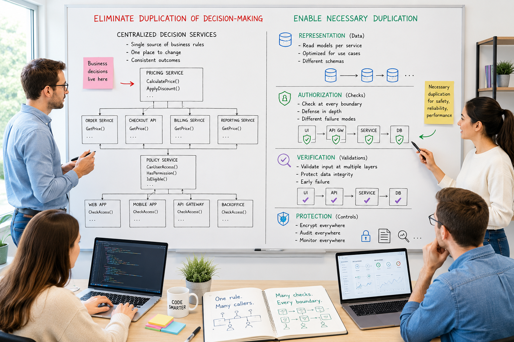

# Once and Only Once with Examples - Part 3: Where Duplication Is Simultaneously Necessary



_In Parts 1 and 2, I analysed various aspects of code duplication when created by programmers and AI._

_In Part 3, we'll focus on software engineering scenarios where duplication is both necessary and justified._

## Authorisation and Eligibility

> [!IMPORTANT]
> 👉 Authorisation is one of the best examples of where duplication is simultaneously necessary and dangerous.

Many architects spend years trying to remove authorisation duplication, only to discover that some duplication is actually a security requirement.

> [!NOTE]
> 📌 The question becomes: ___Which part of authorisation should be duplicated, and which part should exist exactly once?___


### The Most Common Enterprise Mistake

Imagine:

```
API
 ↓
Application Service
 ↓
Domain Service
 ↓
Database
```

Authorisation checks appear everywhere:

```csharp
if (!user.IsAdmin)
    throw new UnauthorizedException();
```

in:
- Controller
- Application Service
- Domain Service
- Repository
- SQL Stored Procedure

**This looks terrible.**

> [!NOTE]
> 👉 Yet many organisations have exactly this architecture.

Why Does It Happen?

> [!NOTE]
> 👉 Because authorisation serves multiple purposes.

People treat it as one concern. But it isn't.

There are actually several different concerns.
- Authentication
- Authorisation
- Data Visibility
- Business Permissions
- Audit Requirements
- Regulatory Requirements

Each belongs at a different level.

### Example: Banking

Consider: ___Approve Loan___

**API Layer**
- Check: _Is caller authenticated?_
- Example: `[Authorize]` 👉 This belongs here.

**Application Layer**
- Check: _Can loan officers approve loans?_
- Example:

```csharp
if (!user.HasRole("LoanOfficer"))
    throw new ForbiddenException();
```

**Domain Layer**
- Check: _Can THIS loan be approved?_
- Example:

```csharp
if (loan.Amount > approvalLimit)
    throw new ForbiddenException();
```

or

```csharp
Loan.State == PendingApproval
```

Notice something important:
- 👉 The domain layer does not care about JWTs.
- 👉 The API layer does not care about loan states.

> [!NOTE]
> 📌 Different responsibilities. No duplication.

### The AI Duplication Trap

AI frequently generates everywhere:

```
if(user.IsAdmin)
```

Example:

```
Controller
Service
Handler
Validator
```

Because each prompt is independent, soon:
- Admin
- Manager
- Supervisor
- Approver

all mean slightly different things.

> [!WARNING]
> ❗️ Now the organisation has **Authorisation Drift** rather than authorisation.

### Authorisation as Business Logic

> [!WARNING]
> ❗️ Many senior developers still view authorisation as infrastructure.

> [!NOTE]
> 📌 In modern systems it often isn't.

Example: ___Doctor can view patient record.___

- 👉 Is that security?
- 👉 Or business policy?
- 👉 Or legal compliance?

> [!NOTE]
> 📌  The answer is all three.

> [!NOTE]
> ✔  That means: **Authorisation = Domain Knowledge** not merely middleware.

### The Four-Level Model

A useful architecture:

```
Level 1 - Identity
Level 2 - Role
Level 3 - Permission
Level 4 - Business Policy
```

**Identity** - Who are you?

Example: 
```
UserId
TenantId
```

**Role** - What group are you in?

Example:

```
Admin
Trader
ComplianceOfficer
```

**Permission** - What operations may you perform?

Example:

```
ApproveLoan
CreateTrade
ViewClaim
```

**Business Policy** - Under what circumstances?

Example:

```
Loan amount below threshold
Customer belongs to region
Market open
Trading limit not exceeded
```

> [!NOTE]
> ✔  Only the first three belong in traditional authorisation systems.

> [!NOTE]
> 📌 The fourth belongs in the domain.

### The Real Duplication Problem

> [!NOTE]
> 👉  Most organisations duplicate ___Permission Logic___ everywhere.

Example:

```
Claims Service
Payments Service
Reporting Service
Portal
```

all independently calculate:

```
CanViewClaim
```

Eventually:

```
Service A = YES
Service B = NO
Report = YES
Portal = MAYBE
```

> [!WARNING]
> ❗️ Nobody knows which answer is correct.

### Centralised Policy Evaluation

A mature pattern:

```
User
 ↓
Policy Engine
 ↓
Decision
```

Example:

```csharp
var allowed =
    await policyEngine.AuthorizeAsync(
        user,
        claim,
        Permissions.ViewClaim);
```

- 👉  Everything delegates.
- 👉  Only one place decides.

### Modern Enterprise Pattern

Large systems increasingly separate:

```
Authentication
      ↓
Identity Provider

Authorisation
      ↓
Policy Engine

Business Rules
      ↓
Domain Model
```

Examples include:
- Open Policy Agent
- Cedar
- Keycloak
- Microsoft Entra ID

> [!NOTE]
> 👉 The goal is not removing all checks.

> [!NOTE]
> 📌 The goal is removing duplicated decisions.

### Defense in Depth vs Duplication

> [!NOTE]
> ✔ Security architects intentionally duplicate some checks.

Example:

```
API Gateway
     ↓
API
     ↓
Service
```

All three validate identity.

Why?
- Because: **Security assumes failure.**
- If one layer is bypassed: **Second layer survives.**

> [!NOTE]
> 📌 This is called **Defence in Depth** and is good duplication.

### A Useful Rule

> [!NOTE]
> ✔ Authorisation duplication is healthy when it duplicates **Verification**.

> [!WARNING]
> ❗️ Authorisation duplication is harmful when it duplicates **Decision Making**.

Good:
- Gateway verifies token.
- API verifies token.
- Service verifies token.

**Same fact checked multiple times.**

Bad:
- Gateway decides eligibility.
- API decides eligibility.
- Service decides eligibility.

**Same business decision implemented multiple times.**

### The AI Era Version

> [!NOTE]
> 📌 In AI-assisted development, one of the most important architectural assets becomes ___Authorisation Ontology___.

Example:

```
Permission:
    ApproveLoan

Owner:
    Lending Domain

Policy Engine:
    LoanAuthorisationService

Consumers:
    API
    Worker
    Report Generator
```

AI-generated code must call:

```
loanAuthorisationService.CanApprove(...)
```

rather than inventing:

```
if(user.Role == ...)
```

inside every prompt-generated component.


## A new game rule

**A lot of duplication is not a bug**. It is a consequence of physics, security, reliability, or organisational boundaries.

This is where much of the discussion about DRY becomes confusing, as the "once and only once" principle isn't always the best approach.
Taking this principle too literally often leads many teams to misdefine the goal of eliminating code duplication, instead of:

> [!IMPORTANT]
> 👉 **Eliminate duplicated decisions while allowing necessary duplication of representation, verification, and protection**

### A Useful Classification

There are at least five kinds of duplication:

<table>
<tr>
    <th>Type</th>
    <th>Necessary?</th>
    <th>Example</th>
</tr>
<tr>
    <td>Code</td>
    <td>❌ Usually No</td>
    <td>Same method in 5 services</td>
</tr>
<tr>
    <td>Business Rules</td>
    <td>❗️ Almost Never</td>
    <td>VAT calculated differently</td>
</tr>
<tr>
    <td>Data</td>
    <td>✅ Often Yes</td>
    <td>Read models, caches</td>
</tr>
<tr>
    <td>Validation</td>
    <td>⚠️ Sometimes Yes</td>
    <td>Input validation at API and DB</td>
</tr>
<tr>
    <td>Security Checks</td>
    <td>✅ Often Yes</td>
    <td>Defense in depth</td>
</tr>
</table>

> [!IMPORTANT]
> Most AI discussions treat all duplication as the same thing.
> 👉 **They are not.**

### Category 1: Necessary Security Duplication

Consider:

```
Internet
    ↓
API Gateway
    ↓
API
    ↓
Worker
    ↓
Database
```

> [!NOTE]
> 📌 Authentication check: `Verify JWT` appears multiple times.

> [!NOTE]
> 👉 Why? Because every trust boundary is a potential attack surface.

Example:

```csharp
gateway.ValidateToken();
```

and

```csharp
api.ValidateToken();
```

> [!IMPORTANT]
> 📌 These appear duplicated.

> [!IMPORTANT]
> 👉 But they protect different boundaries.

Security architects **intentionally duplicate**:
- Identity verification
- Input validation
- Audit logging
- Encryption

> [!IMPORTANT]
> 📌 This is good duplication.

### Category 2: Necessary Validation Duplication

Example:

```
Email must not be empty
```

Validation exists in:
- UI
- API
- Database

Why?
- UI: **User experience**
- API: **Business protection**
- Database: **Data integrity**

> [!NOTE]
> 👉 Three checks.

> [!NOTE]
> 👉 One rule.

> [!NOTE]
> 👉 Different failure modes.

> [!IMPORTANT]
> 📌 This is legitimate duplication.

### Category 3: Necessary Data Duplication

> [!IMPORTANT]
> 📌 Microservices intentionally duplicate data.

Customer Service owns:

```json
{
  "customerId": "123",
  "name": "John"
}
```

Order Service stores again:

```json
{
  "customerId": "123",
  "customerName": "John"
}
```

> [!IMPORTANT]
> 📌 This is not a bug.

> [!NOTE]
> 👉 Without duplication, **every query requires a network call**
> which destroys availability.

### Category 4: Necessary Process Duplication

> [!NOTE]
> 👉 Sometimes regulation demands duplication.

Example: ___Trading Approval___ **must check**:
- Trading System
- Compliance System
- Settlement System

**even if logic is identical**.

> [!IMPORTANT]
> 📌 Reason: Independent controls are required by auditors.

In banking this is common. In healthcare too.

### Category 5: Harmful Duplication

___This is where AI becomes dangerous.___

Imagine:

```
Prompt:
    Generate invoice service
```

AI creates:

```csharp
CalculateTax();
```

Later:

```
Prompt:
    Generate reporting service
```

AI creates again:

```csharp
CalculateTax();
```

Now:

> [!WARNING]
> ❌ Business decision duplicated

- 👉 No regulatory reason.
- 👉 No security reason.
- 👉 No availability reason.
- 👉 Pure architectural debt.

### Category 6: Temporal Duplication

> [!WARNING]
> ❗️ **A rule can be implemented once, but drift over time.**

Example:
``` 
PricingPolicy v1

→ later copied to ReportingPolicy v1
→ PricingPolicy evolves to v3
→ ReportingPolicy remains effectively v1
``` 

> [!WARNING]
> ❗️ This is not simultaneous duplication; it is **historical semantic drift**.

### Category 7: Representation Duplication

Example: ___Customer___

represented as:
- API DTO
- Domain Model
- Read Model
- Search Index
- Report Projection

> [!NOTE]
> 👉 All represent the same concept.

> [!IMPORTANT]
> 📌 All are intentionally duplicated.

> [!WARNING]
> ❗️ This would fit naturally between:
> _Necessary Data Duplication_ and _Necessary Process Duplication_

Why? Because it is extremely common in:
- CQRS
- Event Sourcing
- Microservices
- AI-generated systems


### The Key Principle

> [!IMPORTANT]
> 📌 Ask: **Is this duplication protecting a boundary or making a decision?**

Protection duplication:
- Validate
- Verify
- Authenticate
- Encrypt
- Audit

> [!NOTE]
> ✔ Usually good.

Decision duplication:
- Price
- Discount
- Eligibility
- Risk Score
- Compliance Status

> [!WARNING]
> ❌ Usually bad.


### What AI Changes

Historically:
- Humans copied code.

Now:
- AI regenerates code.

> [!IMPORTANT]
> 📌 This is actually worse because **copies are no longer visible**.

Example:

```
Service A:
    customer.IsPremium

Service B:
    subscription.Level == Gold

Service C:
    account.Type == VIP
```

- 👉 Different code.
- 👉 Same decision.
- ❌ AI created semantic duplication.

## How To Handle Necessary Duplication With AI

- ❌ The answer is not: Generate less code.
- ✔ The answer is: **Generate from authoritative models**.

### Pattern 1: Decision Source + Generated Enforcement

Example: ___Loan Approval Policy___

Business rule: exists once.

```csharp
public interface ILoanApprovalPolicy
{
    bool CanApprove(Loan loan);
}
```

AI generates:
- API Filter
- Worker Check
- Audit Rule
- Monitoring Rule

that all call:

```
policy.CanApprove(...)
```

Result:
- Many checks
- One decision

> [!NOTE]
> 📌 This is ideal.

### Pattern 2: Policy-as-Code

Instead of:

```csharp
if(user.Role == "Manager")
```

appearing everywhere, store policy separately:

```yaml
approveLoan:
  roles:
    - Manager
    - Director
```

AI generates everywhere:

```csharp
policyEngine.Evaluate(...)
```

Decision:

```yaml
single source
```

Enforcement:

```
many locations
```

### Pattern 3: State Machine Ownership

_This is particularly relevant to our Azure/Service Bus projects._

Instead of:

```csharp
if(order.Status == Submitted)
```

generated in:
- API
- Function
- Worker
- Saga

create, using a framework such as the Stateless:

```csharp
OrderStateMachine
```

> [!WARNING]
> ❗️ AI-generated components never decide state transitions.

They ask:

```csharp
orderStateMachine.Fire(...)
```

> [!NOTE]
> 📌 Now duplication becomes **Transition enforcement**, not **Transition definition**

### Pattern 4: Domain Knowledge Layer for AI

_This is where most organizations will evolve._

Instead of:

```
Prompt
    ↓
LLM
```

use:

```
Prompt
    ↓
Domain Ontology
    ↓
Architecture Rules
    ↓
Generation Policy
    ↓
LLM
```

Example:

```
Pricing decisions belong only to Pricing Domain.

Risk decisions belong only to Risk Domain.

Order transitions belong only to Order State Machine.
```

> [!NOTE]
> 📌 Every AI generation session receives these rules.


## Testing Duplication

### 1. Testing Code Duplication

The code duplication answers: **Did we implement the same code multiple times?**

Here tools can help. For instance:
- SonarQube
- ReSharper DupFinder
- NDepend
- PMD CPD
- Simian

The tools detect code appearing in multiple places.

```csharp
public decimal CalculateDiscount(decimal amount)
{
    if (amount > 1000)
        return amount * 0.1m;

    return 0;
}
```

> [!NOTE]
> ✔ This is the easy problem.

### 2. Testing Decision Duplication

This answers: _Did we implement the same business decision multiple times?_

Example:

```
Service A:
    customer.IsPremium

Service B:
    account.Level == Gold

Service C:
    subscription.Tier == Premium
```

- 👉 No code duplication exists.
- 👉 Yet all three answer: ___Is this customer entitled?___

> [!WARNING]
> ❗️ This is semantic duplication and static analysis cannot easily find it.


### The Architecture Test

Before accepting AI-generated code, ask:

**Question 1: Does this duplication protect a boundary?**

Examples:
- Authentication
- Validation
- Auditing

✔ **Usually acceptable.**

**Question 2: Does this duplicate a business decision?**

Examples:
- Pricing
- Risk
- Eligibility
- Authorisation policy

❌ **Usually not acceptable.**

**Question 3: If the rule changes tomorrow, how many places must change?**

✔ Good answer: **1**

✔ Acceptable answer: **1 decision source + many generated enforcers**

❌ Dangerous answer:

```
5 services
+
3 reports
+
2 workflows
```

**Architecture-Level Testing**

> [!NOTE]
> ✔  A useful technique is to **create a table of business decisions** and then inspect the codebase.

Example:

```
Decision           Owner
----------------------------------
Pricing            Pricing Service
Discount           Pricing Service
Eligibility        Eligibility Service
Authorisation      Policy Engine
State Transition   State Machine
```


- Question: Who calculates discounts?
- Expected answer: Pricing Service
- Actual answer: 
  [Pricing Service, Checkout Service, Reporting Service, ETL Job]
- 👉 We found decision duplication.

### The Change Test

_It is one of the most effective tests._

- Ask: _If this rule changes tomorrow, how many components change?_

Example: ___Discount changes from 10% to 15%.___

Search through repositories:
- 10%
- 0.10
- discount
- premium

Results:

```
Pricing Service
API
Worker
Report
Dashboard
```

> [!WARNING]
> ❗️ Decision duplication exists in five places.

> [!NOTE]
> 📌 Healthy architecture ___DiscountPolicy___ changes.
> Everything else remains untouched.

### Mutation Testing for Decisions

> [!NOTE]
> ✔ Very powerful. Change a business rule deliberately.

Example: ```const decimal Discount = 0.10m;```
becomes: ```const decimal Discount = 0.15m;```

❗️ Observe failing tests.

Expected: **Pricing tests fail**

Danger sign:
- Pricing tests fail
- Reporting tests fail
- ETL tests fail
- Invoice tests fail

independently because each system has its own implementation.

### Decision Ownership Test

For each business concept ask: ___Where is the authoritative implementation?___

Example: `CanApproveLoan`

Expected: `LoanAuthorisationPolicy` 

Then search the codebase for:
- ApproveLoan
- CanApprove
- Role == Manager
- Role == Director

> [!NOTE]
> ✔  If dozens of implementations appear then **decision duplication detected**.

### Architecture Fitness Functions

_This is where teams like ThoughtWorks and large banks often go._

> [!NOTE]
> ✔ Create automated architecture rules.

Example using NDepend: `Application cannot reference Infrastructure`

Another: `Only Pricing Service may calculate discounts.`

We can even build Roslyn analysers.

Example:

```csharp
[OwnedBy("Pricing")]
public class DiscountPolicy
{
}
```

Analyser: `Detect discount calculations outside Pricing assembly.`

- ❗️Build fails.

### Contract Testing

> [!NOTE]
> ✔ In distributed systems, contract testing can reveal duplication.

Example ___Pricing Service___ returns:

```json
{
  "discount": 15
}
```

- ✔ Consumers must use it.

Bad sign:
- Consumer recalculates `discount = amount * 0.15m;` instead of trusting contract.

- ❗️Now duplication exists.

### State Machine Testing

_This is especially relevant to our .NET / Stateless interests._

> [!WARNING]
> ❗️ Many duplicated decisions hide in workflows.

Example:

```
Draft
Submitted
Approved
Rejected
```

Test: ___Who defines transitions?___

Expected: ___OrderStateMachine___

Search: `if(status == Submitted)` across all repositories.

Finding:
- API
- Worker
- Function
- Saga

👉 all contain transition logic.

> [!WARNING]
> ❗️ Decision duplication exists.

### Event Testing

For event-driven systems ___OrderSubmitted___ 
should contain ___Fact___ not ___Decision___.

**Bad**:
`if(order.Amount > 50000)` 
inside:
- Publisher
- Consumer
- Reporting Service

**Good**:
`OrderRequiresReview` published once.

> [!NOTE]
> 📌 Consumers simply react.

### AI-Specific Testing

> [!IMPORTANT]
> 📌 This is becoming increasingly important.

_Suppose developers generate code using LLMs._

Before merging:

- Step 1 - Identify keywords:

```
discount
eligibility
approval
authorisation    
risk
compliance
pricing
```

- Step 2 - Search newly generated code.

- Step 3 - Ask: _Is this component making a business decision or consuming one?_

> [!NOTE]
> 📌 Business decisions should be rare.

Most generated code should be:

```
Consumer
Adapter
Mapper
Handler
Controller
```

Not:

```
Policy
Rule
Decision
Eligibility
Pricing
Authorisation
```

### The Most Useful Metric

> [!NOTE]
> 📌 Most teams measure: ___Duplicate Lines of Code___

> [!NOTE]
> 📌 A more valuable metric is: ___Decision Change Radius___

Example:

```
Rule	    Files Changed
-------------------------
Discount              1
Authorisation Policy  1
Loan Approval         1
VAT                   7
Compliance Check     12
```

> [!WARNING]
> ❗️ The last two are architectural smells.

A mature architecture drives this metric toward:

```
1 decision
=
1 owner
=
1 change location
```

while still allowing:
- Many verifications
- Many security checks
- Many representations
- Many read models

to exist safely throughout the system. 

> [!NOTE]
> 📌 That distinction is often the clearest practical test for whether duplication is healthy or harmful.

## Takeaways

> [!NOTE]
> 📌 Testing code duplication and testing decision duplication are two very different activities.

> [!WARNING]
> ❗️ Most teams are reasonably good at the first and terrible at the second.

```
AI frequently creates representation duplication,
decision duplication, and protection duplication
without distinguishing between them.

Architectural governance exists to determine
which forms are acceptable.
```

> [!NOTE]
> 📌 The organisations that succeed with AI at scale will not be those that generate the most code. 
> They will be those that make authorisation, pricing, compliance, risk, and workflow decisions explicit, centralised, 
> and machine-consumable, so AI can reuse them instead of silently recreating them hundreds of times across the architecture.

The most mature AI-assisted architectures are converging on a simple idea:

```
Duplicate enforcement.
Duplicate protection.
Duplicate data.

Never duplicate ownership.
Never duplicate decisions.
Never duplicate domain truth.
```

> [!IMPORTANT]
> 📌 This idea is strong enough to stand on its own as an architectural principle, independent of DRY, AI, microservices, or any specific technology stack.


> [!NOTE]
> 📌 Once that distinction is understood, AI can safely generate thousands of classes, handlers, APIs, Functions, workers, and tests without causing an explosion of architectural debt.


## See also:
- [Once and Only Once with Examples - Part 1: Is It Obvious?](https://www.linkedin.com/pulse/once-only-examples-part-1-obvious-marek-kubis-nyebe/)
- [Once and Only Once with Examples - Part 2: And AI-generated Code](https://www.linkedin.com/pulse/once-only-examples-part-2-ai-generated-code-marek-kubis-kn9ie/)

- [Mutation testing - Part 1: is it outdated?](https://lnkd.in/eDbVukCf)
- [Mutation testing - Part 2: Turn into a production-ready tool](https://lnkd.in/eSx9b6pB)
- [Mutation testing - Part 3: Mutation testing limits and how to go beyond it](https://lnkd.in/e3qsTXBy)
- [Mutation testing - Part 4: mutation testing and LLM-written code](https://lnkd.in/eKfvJfbp)

- [Underestimated and Annoying, or the "Dirty Dozen" of Programmers - Part 1: The Problem Space](https://www.linkedin.com/pulse/underestimated-annoying-dirty-dozen-programmers-marek-kubis-mcfxe)
- [Underestimated and Annoying, that is "The Dirty Dozen" of Programmers - Part 2: AI-Generated Software](https://www.linkedin.com/pulse/underestimated-annoying-dirty-dozen-programmers-part-2-marek-kubis-tqkme/)
- [Underestimated and Annoying, that is "The Dirty Dozen" of Programmers - Part 3: I. Organizational Problems](https://www.linkedin.com/pulse/underestimated-annoying-dirty-dozen-programmers-part-marek-kubis-h9y3e/)
- [Underestimated and Annoying, that is "The Dirty Dozen" of Programmers - Part 4: II. Human Problems](https://www.linkedin.com/pulse/underestimated-annoying-dirty-dozen-programmers-part-marek-kubis-mn5ve/)
- [Underestimated and Annoying, that is "The Dirty Dozen" of Programmers - Part 5: III. Process Problems](https://www.linkedin.com/pulse/underestimated-annoying-dirty-dozen-vibe-coding-part-marek-kubis-83jre/)
- [Underestimated and Annoying, that is "The Dirty Dozen" of Programmers - Part 6: IV. Architecture Problems](https://www.linkedin.com/pulse/underestimated-annoying-dirty-dozen-programmers-part-marek-kubis-remze/)
- [Underestimated and Annoying, that is "The Dirty Dozen" of Programmers - Part 7: V. Validation Problems](https://www.linkedin.com/pulse/underestimated-annoying-dirty-dozen-programmers-part-marek-kubis-dqk2e/)
- [Underestimated and Annoying, that is "The Dirty Dozen" of Programmers - Part 8: VI. Economic Problems](https://www.linkedin.com/pulse/underestimated-annoying-dirty-dozen-programmers-part-marek-kubis-7bb6e/)

- [Murphy’s law and more in AI time - one by one with examples](https://www.linkedin.com/pulse/murphys-law-more-ai-time-one-examples-marek-kubis-fkaze)
- [The Agile Vibe Coding and Conway's Law](https://www.linkedin.com/pulse/agile-vibe-coding-conways-law-marek-kubis-m0wpe)
- [Using a digital banking solution to prove Conway’s Law in AI-Driven engineering - example 1](https://www.linkedin.com/pulse/using-digital-banking-solution-prove-conways-law-ai-driven-kubis-xqlre/)
- [Using a .NET 10 migration project to prove Conway’s Law in AI-Driven engineering - example 2](https://www.linkedin.com/pulse/using-net-10-migration-project-prove-conways-law-ai-driven-kubis-abqae)

- [Where traditional Agile breaks in AI-driven systems](https://www.linkedin.com/pulse/where-traditional-agile-breaks-ai-driven-systems-marek-kubis-4wq6e/)
- [AI - It seems nobody has it fully figured out yet](https://www.linkedin.com/pulse/ai-nobody-has-figured-out-marek-kubis-bkyge)
- [Internal Development Platform and Agile Vibe Coding](https://www.linkedin.com/pulse/internal-development-platform-agile-vibe-coding-marek-kubis-kyhqe/?trackingId=5w3lWKp%2F0BLUpwNdrSmAcg%3D%3D&lipi=urn%3Ali%3Apage%3Ad_flagship3_pulse_read%3BqH%2FwqbkZRkmo%2Fagtxvqyrw%3D%3D)
- [Everyone will be vibe coders](https://www.linkedin.com/pulse/everyone-vibe-coders-marek-kubis-tlgze)
- [The Structural problems AI introduces into the SDLC](https://www.linkedin.com/pulse/structural-problems-ai-introduces-sdlc-marek-kubis-qyt6e)
- [Signals That Reveal the True Maturity of Organisations Claiming “AI-Driven Development”](https://www.linkedin.com/pulse/signals-reveal-true-maturity-organisations-claiming-ai-driven-kubis-urule)

- [Agile Vibe Coding positioning and if this works, what changes?](https://www.linkedin.com/pulse/agile-vibe-coding-positioning-works-what-changes-marek-kubis-r4ate)
- [Agile Vibe Coding – Ceremony Modes](https://www.linkedin.com/pulse/agile-vibe-coding-ceremony-modes-marek-kubis-meq9e)
- [Agile Vibe Coding ceremonies approach compared to a simple one-prompt-per-task approach](https://www.linkedin.com/pulse/agile-vibe-coding-ceremonies-approach-compared-simple-marek-kubis-ecx5e)
- [Agile Vibe Coding Maturity Model](https://www.linkedin.com/pulse/agile-vibe-coding-maturity-model-marek-kubis-bbtqe)
- [The Agile Vibe Coding - the 4-level adaptive ceremony system](https://www.linkedin.com/pulse/agile-vibe-coding-4-level-adaptive-ceremony-system-marek-kubis-jizke)

- [Agile Vibe Coding Manifesto](https://agilevibecoding.org/)
- [Principles Behind the Agile Vibe Coding Manifesto - extended version](https://github.com/marekartur-dev/agilevibecoding/blob/main/Docs/Home/Principles.md)

- [Agile Vibe Coding](https://www.reddit.com/r/AgileVibeCoding/)
- [Marek Kubis - blog](https://github.com/marekartur-dev/agilevibecoding/tree/main)