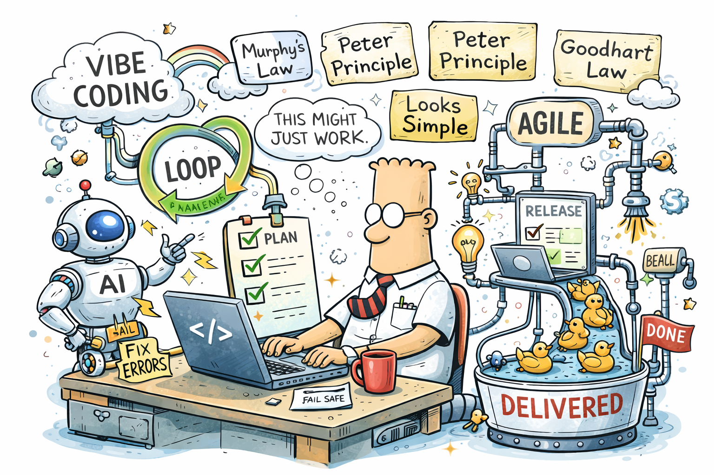

# This Isn’t Rebranding. It’s a Structural Shift in Software Development.

> I’ve been reflecting on how today’s uncertainty is influencing IT professionals. 
> Even those of us who typically operate in a world of precision and logic are increasingly being pushed to think more imaginatively — 
> especially when considering how to organize teams, shape organizations, and plan what comes next in the IT industry.

## Towards Structural Change

Part of this shift stems from the evolving role of AI in the developer ecosystem. There is still a noticeable gap in understanding its full impact. 
Even experienced practitioners sometimes downplay what is happening, suggesting that we are merely witnessing rebranding—new job titles, 
updated organizational structures, or revised processes — while the core work remains unchanged.

Of course, continuous upskilling is nothing new. Learning and adapting have always been essential in our profession. From that perspective, it may seem that little has changed.

> I believe this view underestimates the scale of what is happening.

## This Is Not a Superficial Adjustment

This is not a matter of relabelling or incremental improvement. If we treat the current evolution in software development as superficial, we risk missing meaningful opportunities.

However, if we recognize the growing role of AI—combined with creative problem-solving — we open the door to fundamentally rethinking processes, 
organizational structures, and even how we define success. This mindset significantly increases the likelihood of remaining relevant in a rapidly changing market.

A useful historical parallel comes from **Thomas Watson**, who in 1943 suggested that the global demand for computers might be limited to just a few machines. 
Today, this statement makes us smile — but it also highlights how easy it is to misjudge transformational change.

### What do we actually consider a “computer” today?

Are personal devices still computers in the traditional sense, or merely terminals connected to something larger? Could vast cloud infrastructures — 
such as those operated by Microsoft Azure, Amazon AWS, or Google Cloud — be seen as the real “computers” of our time?

### If so, how many computers truly exist today?

These questions become even more relevant as AI systems — particularly **large language models LLM** — reshape how we think about programming. 
We understand how traditional software works, but that understanding is already being challenged. Our existing mental models are starting to show their limits.

So, is this really rebranding — or the beginning of something far more fundamental?

## Example: A Law Firm

Consider a law firm operating across a broad spectrum of services — from business transactions to personal legal matters.

Today, many such organizations underutilize software due to strict requirements around confidentiality, regulatory compliance, and trust. 
Technology often remains limited to a website or basic systems, falling short of supporting core business operations.

AI introduces a new possibility.

A significant portion of legal work could be supported or augmented by software, provided that confidentiality, compliance, and reliability are ensured.

At the same time, modern platforms (for example, evolving ecosystems around .NET and cloud-native tooling) are enabling new organizational models, such as platform teams and service teams:
- **Platform teams** focus on infrastructure, automation, and environments (often using Infrastructure as Code)
- **Service teams** focus directly on business capabilities and domain-specific solutions

However, despite decades of progress in software engineering, many real-world business problems still lack simple, effective digital solutions.

Why?

Because most of our methodologies — Agile frameworks, design patterns, and engineering practices — optimize how we build software, 
not necessarily what we build or how closely it aligns with domain reality.

## Where the Real Shift Happens

> The most significant transformation is not technological, it is organisational.

In an AI-enabled model, a service team in a law firm could include:
- software engineers
- AI specialists
- legal experts working directly with AI systems

This changes the dynamic fundamentally.

Instead of a linear model — `requirements → implementation` — we move toward **collaborative**, **iterative problem-solving,** where domain experts (e.g., lawyers) 
can directly interact with and guide AI systems.

This approach:
- reduces information barriers
- protects sensitive data more effectively
- shortens feedback loops
- increases alignment between software and real-world needs

## The Critical Question: Trust

All of this leads to one essential issue: **trust**.

On what basis can professionals trust AI-generated results?
- Outputs are based on complex inference mechanisms
- The logic is often non-transparent
- Results may rely on probabilistic models rather than deterministic rules

> [!IMPORTANT]
> Rejecting AI is not the answer. **Testing is.**

But testing must evolve.

Beyond traditional approaches, we will need:
- new validation methods for AI-generated outputs
- explainability mechanisms
- secure and privacy - preserving test environments
- controlled visibility of sensitive results

Experience from security, compliance, and audit domains will become increasingly valuable.

> [!IMPORTANT]
> Trust will not be given to AI — it will be **engineered**.

## What Should We Do Today?

If this shift is as significant as it appears, incremental adjustments will not be enough. We should:
- Rethink team structures—not just roles, but how value is created
- Develop AI fluency across entire organizations
- Reevaluate Agile practices in an AI-assisted context
- Focus on outcomes (business impact), not output (lines of code)

The developer’s role is already evolving — from writing code to validating, orchestrating, and guiding AI-generated solutions.

## Key Takeaway

The real challenge is not technological — it is organizational and conceptual.

- How should teams be structured?
- Are current methodologies still sufficient?
- How do we interpret failure in increasingly complex systems?

When multiple skilled individuals fail to solve the same problem, the issue may not be competence—but system design, collaboration, or process.

Software development has always required more than technical skill. Creativity, critical thinking, and collaboration are essential—and becoming even more so in an AI-driven world.

The question is no longer whether change is happening, but how we respond to it.

## A Final Thought

When Thomas Watson underestimated the future of computing, it was not due to a lack of intelligence — but a limitation of perspective.

> [!IMPORTANT]
> The real question is:
> **Are we seeing clearly what is in front of us today —or are we repeating the same mistake in a different form?**

What is your perspective?

   
[Agile Vibe Coding Manifesto](https://agilevibecoding.org/)