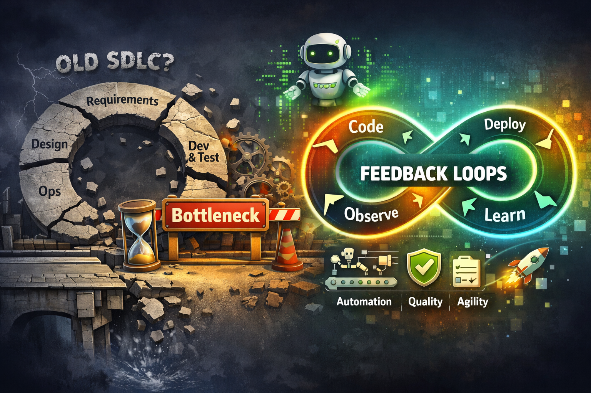

# The_Secrets_of_Feedback_Loops

> AI didn’t just accelerate development — it challenged its foundations.

The 25th anniversary of the **Agile Manifesto** and the uncompromising entry of AI into the world of software engineering 
have prompted the IT community to revisit truly existential questions — of a kind I have not seen discussed so intensely in years. 
I would even argue that neither the emergence of OOP nor Agile had as profound an impact on software development as AI is having today. 
Reflections from Martin Fowler following the February conference in Utah are further encouraging developers, administrators, 
and managers to re-examine the foundations of programming.

There are many doubts. In this article, I would like to share my perspective on feedback loops and address the question: 
has the SDLC really died with the rise of AI?

## Prolegomena

Charity Majors wrote about [feedback loops](https://www.honeycomb.io/blog/you-had-one-job-why-twenty-years-of-devops-has-failed-to-do-it), 
arguing that DevOps has failed in this area. While I appreciate the analogy of feedback loops and agree with many of her observations, 
I am not fully convinced that **DevOps** failed due to insufficient technology or tooling. The argument seems incomplete.

Similarly, the thesis that [“Production Is Where the Rigor Goes”](https://www.honeycomb.io/blog/production-is-where-the-rigor-goes) 
is intellectually provocative, but difficult to validate in practice. It is unlikely that production leaders would fully agree. 
What does seem true is that in many organizations, **production has historically been the place where discipline ends**.

A comparable level of overstatement appears in the claim that the 
[The Software Development Lifecycle Is Dead](https://boristane.com/blog/the-software-development-lifecycle-is-dead/). 
While I disagree with this conclusion, the article does highlight several important shifts:
- SDLC phases are indeed collapsing
- The bottleneck is shifting from execution to specification and context definition
- Process overhead is often not scalable
- Pull Requests and approval queues can become bottlenecks
- Ticket-driven workflows are frequently overcomplicated
- Rituals are sometimes disconnected from value

> However, describing the SDLC as “dead” is, in my view, an overgeneralization. It is not dead — it is **transforming**.

## Feedback loops

I strongly agree that feedback loops are where value is generated — and that problems arise when system responses are not properly observed. 
However, instead of blaming technology, we should focus on understanding what observability truly means.

> A production error discovered after 6 months is not observability — it is absence of a feedback loop.

Similarly, dismissing tests as providing no business value, or claiming that learning only happens in production, 
effectively undermines the entire CI/CD paradigm. This reflects a misunderstanding of the **Plan–Do–Check–Act (PDCA) **
continuous improvement cycle.

Yes, the potential for errors is endless — but that is precisely why **software quality management** is essential. 
Technology alone is not sufficient.

A feedback loop that detects an error a year after deployment — or fails to notify developers about production issues — 
is not a technological limitation. It is a **failure of quality management**.

It is easy to attribute such failures to “hidden infrastructure complexity”, but that does not solve the problem. 

The real question is:
> Have we truly implemented observability correctly?

The reality is that both past and current technologies are fully capable of enabling effective feedback loops 
between developers and production systems. The fact that this often does not happen is not due to technological limitations.

Expecting AI to automatically solve this problem is optimistic at best. AI introduces non-determinism, 
which can increase complexity and elevate abstraction levels. However, it also brings meaningful improvements — especially in telemetry:
- standardized instrumentation
- consistent patterns
- improved documentation
- richer analysis through **LLM** inference

As a result, the development model is shifting:

> _from_: `code → test → review → merge → hope` 
> 
> _to_: `code (with AI) → implement → observe → validate → learn → iterate`

**This shift is real and significant**. However, key challenges remain:
- Operations and development still have different perspectives
- Instrumenting systems effectively remains difficult
- Discovering and interpreting telemetry is still non-trivial

So where is true observability? In my view, it lies in **quality management**.

Software development is accelerating rapidly. It is time for observability practices to catch up.

And this raises an important question:

> Does the feedback loop — and by extension the SDLC — also include senior management?

In many organizations, only leadership has the authority to say:

> “Stop. Observe. Investigate.”

Technology alone will not solve this. Effective feedback loops require organizational discipline, 
as seen in frameworks like ISO 9001 or the Toyota Production System.

## Software Development Lifecycle Management, SDLC

This brings us to software lifecycle management and the claim that **SDLC** is obsolete in the age of AI.

The SDLC exists because it solves real problems:
- coordination across teams
- auditability and compliance
- risk management
- knowledge transfer

A formal lifecycle provides **traceability, predictability, and repeatability**. AI does not eliminate these needs — 
it **relocates and reshapes them**.

> With AI, the SDLC becomes compressed, automated, and partially implicit.

The “SDLC is dead” argument overlooks several critical realities:
- organizational scale and complexity
- the necessity of code review
- the long-term nature of software maintenance
- the difference between anecdotal observation and systemic evidence

It also implicitly assumes:
- small teams
- greenfield systems
- low regulatory pressure

### In real-world environments — especially large enterprises:

- multiple teams coordinate dependencies
- APIs and contracts must remain stable
- releases impact millions of users

In regulated industries (e.g., finance or healthcare), additional requirements apply:
- formal approvals
- audit trails
- segregation of duties

> In such environments, software cannot simply be “shipped by an agent”.

### Code review and validation

The idea that code reviews should disappear is provocative — but incomplete.

AI introduces new risks:
1) **Hallucinations and subtle errors** - AI can generate plausible but incorrect logic
2) **Security and compliance risks** - Automated checks do not replace human judgment
3) **Architectural consistency challenges** - Requires shared understanding, not just validation

Even proponents of “no review” models often reintroduce it implicitly through:
- secondary agents
- human exception handling

> This is still a review system — just under a different name.

### The long-term perspective

The SDLC is not only about building software — it is about sustaining it:
- managing technical debt
- evolving systems over time
- onboarding engineers
- handling incidents

AI supports these activities, but does not eliminate:
- documentation needs
- architectural coherence
- lifecycle thinking

### Hidden assumptions

The “SDLC is dead” argument relies on several assumptions:

1) Near-perfect AI reliability
2) Easily regenerable systems
3) Low cost of errors
4) Humans acting primarily as overseers

None of these assumptions universally hold.

### A more realistic interpretation

The SDLC is evolving toward:
1) **Continuous, AI-supported loops** → faster iteration, less rigid phases
2) **Automated guardrails replacing manual gates, CI/CD** → AI-driven validation, static rules & dynamic enforcement
3) **Shifting human roles** from implementers → reviewers, architects, constraint designers
4) **Observability as a central pillar feedback** → drives iteration production informs development

> The SDLC is not disappearing — it is being redefined.

### Agile Vibe Coding vs “SDLC is dead”

Agile Vibe Coding (AVC) perspective provides a more structured response to these changes:
- AVC promotes **process evolution**, not removal
- Focus shifts from velocity → validation, regeneration, governance
- Feedback loops operate at **the system level**, not just coding level
- Ceremonies evolve into **control systems**, not rituals

Key contrasts:
- Article → _collapse model_
- AVC → _systems model_
- Article → structure slows iteration
- AVC → structure must evolve to remain valuable
- Article assumes AI reliability
- AVC explicitly addresses drift systemic risk black-box behaviour
- Article removes validation
- AVC makes validation **continuous and systemic**
- Article offers no transition model
- AVC provides maturity levels risk profiles progression paths
- Article dismisses ceremonies
- AVC redefines them as feedback mechanisms alignment tools governance structures

> The article optimizes for speed. AVC optimizes for controlled learning.

### Areas for improvement

AVC is a strong conceptual model, but still evolving.

Risks:
- ceremonies may drift into “Agile theatre”
- over-structuring remains a possibility
- learning velocity is difficult to measure and quantify
These challenges are typical for maturity models and require further operationalization.

### Memorable core line

> We cannot remove the lifecycle. We must evolve it into a learning system.
> 
> **The question is no longer whether SDLC survives — but who will redesign it first.**

## See also:
- [Down the rabbit holes of AI-based software development process ](https://www.linkedin.com/pulse/down-rabbit-holes-ai-based-software-development-process-marek-kubis-fsyue)
- [Is there a need to change the way software is developed today?](https://www.linkedin.com/pulse/need-change-way-software-developed-today-marek-kubis-dntie)
- [This Isn’t Rebranding. It’s a Structural Shift in Software Development](https://www.linkedin.com/pulse/isnt-rebranding-its-structural-shift-software-marek-kubis-sanpe)
- [Murphy’s law and more in AI time - one by one with examples](https://www.linkedin.com/pulse/murphys-law-more-ai-time-one-examples-marek-kubis-fkaze)
- [The Agile Vibe Coding and Conway's Law](https://www.linkedin.com/pulse/agile-vibe-coding-conways-law-marek-kubis-m0wpe)
- [Using a digital banking solution to prove Conway’s Law in AI-Driven engineering - example 1](https://www.linkedin.com/pulse/using-digital-banking-solution-prove-conways-law-ai-driven-kubis-xqlre/)
- [Using a .NET 10 migration project to prove Conway’s Law in AI-Driven engineering - example 2](https://www.linkedin.com/pulse/using-net-10-migration-project-prove-conways-law-ai-driven-kubis-abqae)
- [Where traditional Agile breaks in AI-driven systems](https://www.linkedin.com/pulse/where-traditional-agile-breaks-ai-driven-systems-marek-kubis-4wq6e/)
- [AI - It seems nobody has it fully figured out yet](https://www.linkedin.com/pulse/ai-nobody-has-figured-out-marek-kubis-bkyge)
- [Internal Development Platform and Agile Vibe Coding](https://www.linkedin.com/pulse/internal-development-platform-agile-vibe-coding-marek-kubis-kyhqe)
- [Everyone will be vibe coders](https://www.linkedin.com/pulse/everyone-vibe-coders-marek-kubis-tlgze)
- [The Structural problems AI introduces into the SDLC](https://www.linkedin.com/pulse/structural-problems-ai-introduces-sdlc-marek-kubis-qyt6e)
- [Signals That Reveal the True Maturity of Organisations Claiming “AI-Driven Development”](https://www.linkedin.com/pulse/signals-reveal-true-maturity-organisations-claiming-ai-driven-kubis-urule)
- [AI - It seems nobody has it fully figured out yet](https://www.linkedin.com/pulse/ai-nobody-has-figured-out-marek-kubis-bkyge)
- [Agile Vibe Coding positioning and if this works, what changes?](https://www.linkedin.com/pulse/agile-vibe-coding-positioning-works-what-changes-marek-kubis-r4ate)
- [Agile Vibe Coding – Ceremony Modes](https://www.linkedin.com/pulse/agile-vibe-coding-ceremony-modes-marek-kubis-meq9e)
- [Agile Vibe Coding ceremonies approach compared to a simple one-prompt-per-task approach](https://www.linkedin.com/pulse/agile-vibe-coding-ceremonies-approach-compared-simple-marek-kubis-ecx5e)
- [Agile Vibe Coding Maturity Model](https://www.linkedin.com/pulse/agile-vibe-coding-maturity-model-marek-kubis-bbtqe)
- [The Agile Vibe Coding - the 4-level adaptive ceremony system](https://www.linkedin.com/pulse/agile-vibe-coding-4-level-adaptive-ceremony-system-marek-kubis-jizke)

- [Agile Vibe Coding Manifesto](https://agilevibecoding.org/)
- [Principles Behind the Agile Vibe Coding Manifesto - extended version](https://github.com/marekartur-dev/agilevibecoding/blob/main/Docs/Home/Principles.md)

- [Agile Vibe Coding](https://www.reddit.com/r/AgileVibeCoding/)
- [Marek Kubis - blog](https://github.com/marekartur-dev/agilevibecoding/tree/main)
