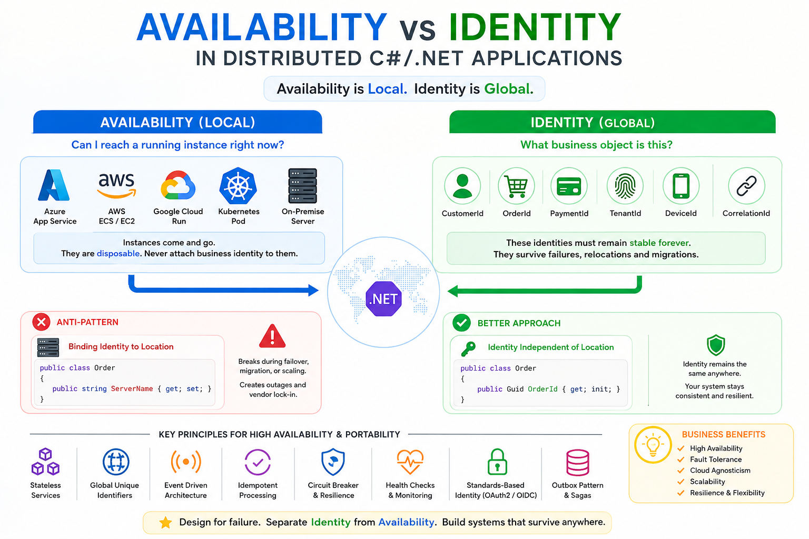
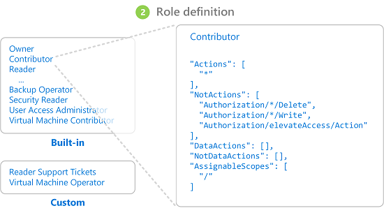
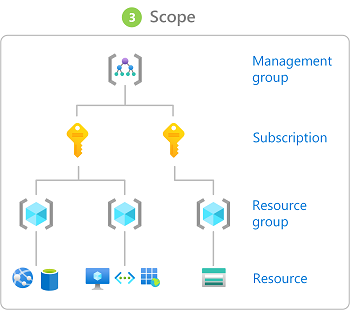
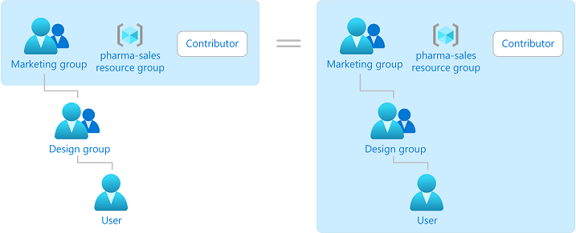
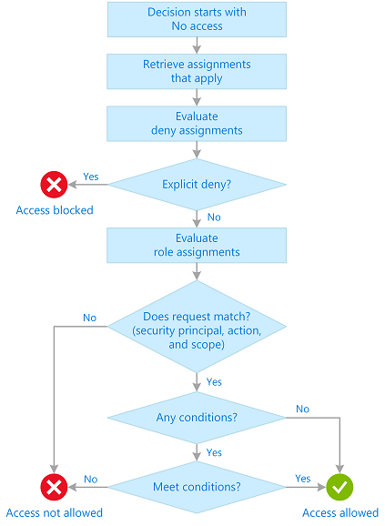

# Availability vs Identity in Distributed C#/.NET Applications - Part 1: The Role of Availability and Identity 



_When applications are deployed simultaneously across multiple environments—Azure, AWS, Google Cloud, on-premise datacentres, Kubernetes clusters,_ 
_and edge locations - the biggest architectural mistake is treating availability and identity as the same concern._

_Many systems accidentally bind identity to a specific location, database, server, or cloud provider._ 
_The result is poor scalability, difficult failover, vendor lock-in, and outages during migrations._

## The key principle

In distributed systems these are four different concerns:

```
Concern         Question                      Example
---------------------------------------------------------------------
Identity        Who are you?                  UserId = 12345
Authentication  Can you prove it?             JWT, OAuth2, OIDC
Authorisation   What may you do?              Admin, Manager, Auditor
Availability    Where is the request served?  Azure UK, AWS Ireland
```

> [!WARNING]
> ❗️ A common mistake is: ___"The user is an Admin because they authenticated against Azure."___

> [!IMPORTANT]
> 📌 Availability is local. Identity is global. Authorisation is consistent enough. Ownership is bounded. 

> [!NOTE]
> ✔ **Identity must survive failures, relocations, cloud migrations, and horizontal scaling.**

> [!WARNING]
> ❗️ Authentication provider and Authorisation policy become coupled.

## Availability vs Identity

### Availability

> [!NOTE]
> 👉 Availability answers: ___"Can I currently reach an instance capable of serving this request?"___

**Examples**:
- Azure App Service instance
- AWS ECS container
- Kubernetes pod
- On-premise server
- Google Cloud Run instance

These are disposable. Instances come and go.

> [!WARNING]
> ❗️ Never attach business identity to them.

### Identity

> [!NOTE]
> 👉 Identity answers: ___"What business object is this?"___

**Examples**:
- CustomerId
- OrderId
- PaymentId
- CorrelationId
- TenantId
- DeviceId

> [!WARNING]
> ❗️ These must remain stable forever.

> [!IMPORTANT]
> 📌 _CorrelationId_ is often more important operationally than _UserId_ because it allows tracing a request across clouds and services.

### Workload Identity

> [!NOTE]
> 👉 Today, users are not the only identities. Services have identities too.

A service identity covers:

```
Human Identity
    UserId

Machine Identity
    ServiceId

Workload Identity
    Kubernetes Pod Identity
    Managed Identity
    Service Account
```

Examples:
- [Azure Managed Identity](https://learn.microsoft.com/en-us/azure/active-directory/managed-identities-azure-resources/overview)
- [AWS IAM Roles](https://docs.aws.amazon.com/IAM/latest/UserGuide/id_roles.html)
- [GCP Workload Identity](https://cloud.google.com/kubernetes-engine/docs/how-to/workload-identity)

### Infrastructure Authorisation (Azure RBAC)

> [!NOTE]
> 👉 Infrastructure authorisation answers:
> ___"Who may access cloud resources?"___
> 
> [Access management](https://learn.microsoft.com/en-us/azure/role-based-access-control/overview) is a critical function.

Examples:

```
User
    |
Azure RBAC
    |
Subscription

Managed Identity
    |
Azure RBAC
    |
Key Vault

Managed Identity
    |
Azure RBAC
    |
Storage Account
```

> [!IMPORTANT]
> 📌 Using RBAC feature is free and does not require a license.

The pod receives `Key Vault Secrets User` role.

- No secrets stored in code.
- No client secrets.
- No certificates.

> [!NOTE]
> 👉 This is a very modern cloud-native pattern.


Examples of Azure roles:

```
Reader
Contributor
Owner
Key Vault Secrets User
Storage Blob Data Reader
```



Important principle:

```
Application Permissions
≠
Infrastructure Permissions
```

> [!NOTE]
> ✔ Example `Invoice.Approve` belongs to application authorisation.
> 
> ✔ Example: `Key Vault Secrets User` belongs to infrastructure authorisation.

### Multi-Cloud Extension

```
Cloud	Infrastructure Authorisation   
------------------------------------
Azure       Azure RBAC
AWS         IAM
GCP         Cloud IAM
Kubernetes  RBAC
On-Prem     Active Directory Groups
```



> [!NOTE]
> 📌 Application Authorisation should be cloud independent.
> 
> 📌 Infrastructure Authorisation is cloud specific.


### Identity Anti-Pattern

```csharp
public class Order
{
    public string ServerName { get; set; }
}

or

public class Order
{
    public string AzureRegion { get; set; }
}
```

> [!WARNING]
> ❗️ The identity now depends on deployment location.

> [!WARNING]
> ❌ A disaster recovery failover breaks assumptions.


Better:

```csharp
public class Order
{
    public Guid OrderId { get; init; }
}
```

> [!NOTE]
> 👉 This makes identity independent of location.

### Distributed Auditing

> [!NOTE]
> 👉 When identity is global, auditing becomes global.

```
Who?
Did What?
When?
From Where?
Using Which Identity?
```

In answering the above questions, the audit should include checking:
- CorrelationId
- CausationId
- UserId
- TenantId


## Identity vs Role

### Azure RBAC

Answers:

```
Can this user deploy a service?
Can this engineer restart AKS?
Can this workload read a Key Vault secret?
Can this service access Storage Account?
```

Examples:
- Contributor
- Reader
- Owner
- Key Vault Secrets User
- Storage Blob Data Reader

These are infrastructure permissions.


> [!NOTE]
> 📌 Identity should be globally stable

```csharp
public record UserIdentity(
    Guid UserId,
    string Email);
```

> [!NOTE]
> 👉  Roles should be changeable

```csharp
public record UserRole(
    Guid UserId,
    string Role);
```



> [!IMPORTANT]
> 📌 A user may be **today: Admin**, **tomorrow: Auditor** and their **Identity remains unchanged**.
> It is the same, single user.


### Anti-Pattern #1: Roles Inside Application Logic

```csharp
if(user.Email == "admin@company.com")
{
    DeleteEverything();
}
```

Problems:
- not scalable
- impossible to audit
- impossible to delegate

Better:

```csharp
if(user.IsInRole("Administrator"))
{
    DeleteEverything();
}
```

### Anti-Pattern #2: Local Role Storage

Imagine:

```
Azure UK
    Role = Admin

AWS Ireland
    Role = User
```

Now failover occurs.

- ❌ The same user suddenly loses permissions.
- ❌ Authorisation becomes location dependent.
- ❌ This violates rule: Identity is Global.

Better Architecture:

```
                    Entra ID
                        |
                 JWT Access Token
                        |
      +-----------------+-----------------+
      |                                   |
 Azure UK                         AWS Ireland
      |                                   |
      +-----------------+-----------------+
                        |
                  Authorisation
                   Policy Engine
```

> [!NOTE]
> 👉  The same token and claims work everywhere.

### Claims-Based Authorisation

Instead of:

```csharp
Role = Admin
```

Prefer:

```csharp
Department = Finance
Region = Europe
Permission = Invoice.Approve
```

JWT:

```json
{
  "sub":"12345",
  "department":"Finance",
  "permissions":[
      "Invoice.Read",
      "Invoice.Approve"
  ]
}
```

> [!NOTE]
> 👉  More flexible than role hierarchies.

## RBAC vs ABAC

### RBAC

Role-Based Access Control:
- Admin
- Manager
- User
- Auditor

.NET:

```csharp
[Authorize(Roles = "Admin")]
```

> [!NOTE]
> 👉  Simple. Works well for small systems.

### ABAC

Attribute-Based Access Control:
- Department = Finance
- Country = UK
- Clearance = High

Policy:

```
Finance users in UK can approve invoices up to £100,000
```

.NET:

```csharp
[Authorize(Policy="ApproveInvoice")]
```

Policy:

```csharp
options.AddPolicy(
    "ApproveInvoice",
    policy =>
    {
        policy.RequireClaim(
            "Permission",
            "Invoice.Approve");
    });
```

> [!NOTE]
> 👉  Much better for large distributed systems.

### How Azure RBAC determines if a user has access to a resource



### Policy-Based Authorisation

> [!NOTE]
> ✔  Recommended for enterprise systems.

```csharp
builder.Services.AddAuthorisation(options =>
{
    options.AddPolicy(
        "CanApproveOrder",
        policy =>
            policy.RequireAssertion(context =>
            {
                return context.User.HasClaim(
                    c => c.Type == "Region"
                      && c.Value == "Europe");
            });
});
```

Usage:

```csharp
[Authorize(Policy="CanApproveOrder")]
public IActionResult Approve()
{
}
```

Benefits:
- centralised
- testable
- cloud agnostic


## Multi-Tenant Systems

### Tenant Isolation Requirements

> [!WARNING]
> ❗️ Identity alone is insufficient.

Need:

```csharp
{
   UserId
   TenantId
}
```

Example:

```csharp
{
   "sub":"123",
   "tenant":"ABC"
}
```

Authorisation must validate:

```
User belongs to Tenant ABC
AND
User may access Order XYZ
```

> [!NOTE]
> 👉  Otherwise tenant isolation breaks.

Additionally, a mature SaaS solution must also solve the following problems:

```
Shared Database
Shared Schema

Shared Database
Separate Schema

Separate Database

Separate Region
```

### Fine-Grained Permissions

Instead of `Admin` use:

```
Customer.Read
Customer.Update

Invoice.Read
Invoice.Create
Invoice.Approve

Order.Read
Order.Cancel
```

JWT:

```json
{
   "permissions":[
      "Order.Read",
      "Order.Cancel"
   ]
}
```

> [!NOTE]
> 👉  This scales much better in microservices.

### Distributed Authorisation Service

For large organizations:

```
               Identity Provider
                    |
                    v
             Authentication
                    |
                    v
             Authorisation API
                    |
      +-------------+-------------+
      |                           |
Service A                   Service B
```

Examples include centralized policy engines such as:
- Open Policy Agent
- Keycloak
- Microsoft Entra ID

> [!NOTE]
> 👉  This prevents permission logic duplication.

### Zero Trust Model

Modern distributed systems assume `Network = Untrusted`.
Also, modern zero-trust systems increasingly authenticate services rather than users.

> [!IMPORTANT]
> 👉 Even internal services should validate identity.

```
Internet
    |
API Gateway
    |
Trust Boundary
    |
Internal Services
```

Then:

```
Authentication Boundary creates trust.
Authorisation Boundary controls trust.
Data Ownership Boundary limits trust.
```

Every request must carry:
- Identity
- Claims
- Permissions

Never trust:
- Because request came from AWS
- Because request came from Azure
- Because request came from VPN
- Because request came from Kubernetes cluster

Therefore:

```
Authentication Boundary
     +
Identity Propagation
```

- is more accurate than simple perimeter security.

> [!IMPORTANT]
> ✔  Trust only verified identity and authorisation.

### Authentication Boundary

> [!IMPORTANT]
> ✔  The authentication boundary answers: ___Who is allowed to enter the system?___

**Anti-Pattern**

> [!NOTE]
> 👉  Every service authenticates users independently.

```
Internet
    |
    +--> Service A
    |
    +--> Service B
    |
    +--> Service C
```

Each service:

```
Validate Username
Validate Password
Generate Token
```

Problems:
- duplicated logic
- inconsistent security
- impossible auditing
- difficult rotation

**Mature Approach**

> [!NOTE]
> 👉  Authentication occurs once.

```
                Entra ID
                     |
                Authenticate
                     |
                 JWT Token
                     |
                 Gateway
                     |
      +--------------+--------------+
      |                             |
  Service A                    Service B
```

> [!NOTE]
> 👉  Services trust the identity provider.

> [!NOTE]
> 👉  Services typically do not perform primary user authentication.
> Services validate identities established by the identity provider.

Reason:
- service-to-service auth exists
- workload identity exists
- Mutual Transport Layer Security, mTLS exists

> [!NOTE]
> 👉  Services validate tokens.

> [!IMPORTANT]
> ✔  Rule: Authentication should occur at the edge.

```
Internet
     |
Authentication Boundary
     |
Trusted Identity
     |
Internal Services
```

> [!NOTE]
> 👉  Inside the boundary: **Identity is already known.**

### Authorisation Boundary

- Authentication says: Who are you?
- Authorisation says: What may you do?

> [!WARNING]
> ❗️ These boundaries are often incorrectly combined.

Application Authorisation answers (example):

```
Can Marek approve an invoice?
Can Marek cancel an order?
Can Marek read customer data?
```

Example code:

```csharp
[Authorize(Policy="CanApproveInvoice")]
```

Example

Bad:

```
Gateway
   |
   +--> Allow everything
```

Then:

```
Order Service
```

contains everywhere:

```
if(role == "Admin")
```

Result:
- ❌ Authorisation Logic duplicated across 50 Services


> [!NOTE]
> 👉  This is a classic distributed monolith problem.


### Authorisation Boundary Mature Model

```
Identity Provider
        |
Authentication
        |
Authorisation Engine
        |
     Policies
        |
   Services
        |
Infrastructure Authorisation
        |
  Azure Resources
```

Example:

```
User:
    Finance Director

Application permission:
    Invoice.Approve

Azure RBAC:
    Reader

The same person may:
    Approve invoices

but:
    Cannot deploy production
    → because those permissions are unrelated.
```

Services ask:

```
Can User X approve invoice Y?
```

rather than:

```
Is User X an Admin?
```

Why?
- Roles evolve.
- Policies evolve.
- Business rules evolve.
- Identity usually does not.

Example

Bad:

```csharp
[Authorize(Roles="Manager")]
```

Good:

```csharp
[Authorize(Policy="CanApproveInvoice")]
```

> [!WARNING]
> ❗️ **Policy hides implementation.**

Tomorrow:

```
Manager
OR

Finance Director

OR

Regional Approver
```

> [!WARNING]
> ❗️ **without changing service code.**

### Data Ownership Boundary

**Anti-Pattern**

```
Service A
Service B
Service C

       |
       |
       ↓

 Shared Database
```

Eventually inside Service A:

```sql
SELECT * FROM ServiceBTable
```

Now:

```
Database
=
Integration Contract
```

> [!WARNING]
> ❗️ which is dangerous.

**Mature Model**

```
Service A
    |
 Own Database

Service B
    |
 Own Database

Service C
    |
 Own Database
```

> [!NOTE]
> 👉  Ownership becomes clear.

**Rule**

A service owns:
- Schema
- Tables
- Data
- Business Rules

> [!NOTE]
> 👉  Other services own none of these.

**Access Pattern**

Bad:

```
Service A
     |
 Direct SQL
     |
Service B Database
```

Good:

```
Service A
     |
 API/Event
     |
Service B
```

### Data Ownership Boundary and Identity

> [!NOTE]
> 👉  Identity should cross boundaries. **Data should not.**

Example: `CustomerId` can appear everywhere.

But: `Customer Table` belongs to exactly one bounded context.


### Relationship to Availability vs Identity

**The extended principle becomes**:

```
Availability = Local
Identity = Global
Authorisation = Consistent Enough
```

A user should have the same permissions when a request is served from:
- Azure UK South
- AWS Ireland
- Google Cloud Belgium
- On-Premise London
- Kubernetes cluster

> [!WARNING]
> ❗️ If failover changes permissions, then authorisation has become tied to availability, which is a design flaw.

So let's discuss the permission change scenarios.

Example:

```
09:00 User is Admin

09:01 Admin removed

09:02 JWT still valid
```

> [!WARNING]
> ❗️ **Perfect consistency is impossible.**

Distributed systems trade:
- consistency
- latency
- availability

even in authorisation.

For modern .NET distributed systems, the preferred stack is:

```
OIDC/OAuth2
        +
JWT Claims
        +
Policy-Based Authorisation
        +
Fine-Grained Permissions
        +
Zero Trust
```

> [!NOTE]
> 👉  This provides cloud independence, high availability, auditability, security, and scalability while keeping **Identity**, **Authorisation**, and **Availability** properly separated.

_...tbc..._

_/* Images are from Microsoft learning site._

## See also:
- [Availability vs Identity in Distributed C#/.NET Applications - Part 2: Lock-in on Use Cases and on Cloud](https://www.linkedin.com/pulse/availability-vs-identity-distributed-cnet-part-2-lock-in-kubis-zhmee/)

- [What is managed identities for Azure resources?](https://learn.microsoft.com/en-us/azure/active-directory/managed-identities-azure-resources/overview)
- [IAM Roles](https://docs.aws.amazon.com/IAM/latest/UserGuide/id_roles.html)
- [Authenticate to Google Cloud APIs from GKE workloads](https://cloud.google.com/kubernetes-engine/docs/how-to/workload-identity)
- [What is Azure role-based access control (Azure RBAC)?](https://learn.microsoft.com/en-us/azure/role-based-access-control/overview)

- [Once and Only Once with Examples - Part 1: Is It Obvious?](https://www.linkedin.com/pulse/once-only-examples-part-1-obvious-marek-kubis-nyebe/)
- [Once and Only Once with Examples - Part 2: And AI-generated Code](https://www.linkedin.com/pulse/once-only-examples-part-2-ai-generated-code-marek-kubis-kn9ie/)
- [Once and Only Once with Examples - Part 3: Where Duplication Is Simultaneously Necessary](https://www.linkedin.com/pulse/once-only-examples-part-3-where-duplication-necessary-marek-kubis-vpxce/)

- [Mutation testing - Part 1: is it outdated?](https://lnkd.in/eDbVukCf)
- [Mutation testing - Part 2: Turn into a production-ready tool](https://lnkd.in/eSx9b6pB)
- [Mutation testing - Part 3: Mutation testing limits and how to go beyond it](https://lnkd.in/e3qsTXBy)
- [Mutation testing - Part 4: mutation testing and LLM-written code](https://lnkd.in/eKfvJfbp)

- [Underestimated and Annoying, or the "Dirty Dozen" of Programmers - Part 1: The Problem Space](https://www.linkedin.com/pulse/underestimated-annoying-dirty-dozen-programmers-marek-kubis-mcfxe)
- [Underestimated and Annoying, that is "The Dirty Dozen" of Programmers - Part 2: AI-Generated Software](https://www.linkedin.com/pulse/underestimated-annoying-dirty-dozen-programmers-part-2-marek-kubis-tqkme/)
- [Underestimated and Annoying, that is "The Dirty Dozen" of Programmers - Part 3: I. Organizational Problems](https://www.linkedin.com/pulse/underestimated-annoying-dirty-dozen-programmers-part-marek-kubis-h9y3e/)
- [Underestimated and Annoying, that is "The Dirty Dozen" of Programmers - Part 4: II. Human Problems](https://www.linkedin.com/pulse/underestimated-annoying-dirty-dozen-programmers-part-marek-kubis-mn5ve/)
- [Underestimated and Annoying, that is "The Dirty Dozen" of Programmers - Part 5: III. Process Problems](https://www.linkedin.com/pulse/underestimated-annoying-dirty-dozen-vibe-coding-part-marek-kubis-83jre/)
- [Underestimated and Annoying, that is "The Dirty Dozen" of Programmers - Part 6: IV. Architecture Problems](https://www.linkedin.com/pulse/underestimated-annoying-dirty-dozen-programmers-part-marek-kubis-remze/)
- [Underestimated and Annoying, that is "The Dirty Dozen" of Programmers - Part 7: V. Validation Problems](https://www.linkedin.com/pulse/underestimated-annoying-dirty-dozen-programmers-part-marek-kubis-dqk2e/)
- [Underestimated and Annoying, that is "The Dirty Dozen" of Programmers - Part 8: VI. Economic Problems](https://www.linkedin.com/pulse/underestimated-annoying-dirty-dozen-programmers-part-marek-kubis-7bb6e/)

- [Murphy’s law and more in AI time - one by one with examples](https://www.linkedin.com/pulse/murphys-law-more-ai-time-one-examples-marek-kubis-fkaze)
- [The Agile Vibe Coding and Conway's Law](https://www.linkedin.com/pulse/agile-vibe-coding-conways-law-marek-kubis-m0wpe)
- [Using a digital banking solution to prove Conway’s Law in AI-Driven engineering - example 1](https://www.linkedin.com/pulse/using-digital-banking-solution-prove-conways-law-ai-driven-kubis-xqlre/)
- [Using a .NET 10 migration project to prove Conway’s Law in AI-Driven engineering - example 2](https://www.linkedin.com/pulse/using-net-10-migration-project-prove-conways-law-ai-driven-kubis-abqae)

- [Where traditional Agile breaks in AI-driven systems](https://www.linkedin.com/pulse/where-traditional-agile-breaks-ai-driven-systems-marek-kubis-4wq6e/)
- [AI - It seems nobody has it fully figured out yet](https://www.linkedin.com/pulse/ai-nobody-has-figured-out-marek-kubis-bkyge)
- [Internal Development Platform and Agile Vibe Coding](https://www.linkedin.com/pulse/internal-development-platform-agile-vibe-coding-marek-kubis-kyhqe/?trackingId=5w3lWKp%2F0BLUpwNdrSmAcg%3D%3D&lipi=urn%3Ali%3Apage%3Ad_flagship3_pulse_read%3BqH%2FwqbkZRkmo%2Fagtxvqyrw%3D%3D)
- [Everyone will be vibe coders](https://www.linkedin.com/pulse/everyone-vibe-coders-marek-kubis-tlgze)
- [The Structural problems AI introduces into the SDLC](https://www.linkedin.com/pulse/structural-problems-ai-introduces-sdlc-marek-kubis-qyt6e)
- [Signals That Reveal the True Maturity of Organisations Claiming “AI-Driven Development”](https://www.linkedin.com/pulse/signals-reveal-true-maturity-organisations-claiming-ai-driven-kubis-urule)

- [Agile Vibe Coding positioning and if this works, what changes?](https://www.linkedin.com/pulse/agile-vibe-coding-positioning-works-what-changes-marek-kubis-r4ate)
- [Agile Vibe Coding – Ceremony Modes](https://www.linkedin.com/pulse/agile-vibe-coding-ceremony-modes-marek-kubis-meq9e)
- [Agile Vibe Coding ceremonies approach compared to a simple one-prompt-per-task approach](https://www.linkedin.com/pulse/agile-vibe-coding-ceremonies-approach-compared-simple-marek-kubis-ecx5e)
- [Agile Vibe Coding Maturity Model](https://www.linkedin.com/pulse/agile-vibe-coding-maturity-model-marek-kubis-bbtqe)
- [The Agile Vibe Coding - the 4-level adaptive ceremony system](https://www.linkedin.com/pulse/agile-vibe-coding-4-level-adaptive-ceremony-system-marek-kubis-jizke)

- [Agile Vibe Coding Manifesto](https://agilevibecoding.org/)
- [Principles Behind the Agile Vibe Coding Manifesto - extended version](https://github.com/marekartur-dev/agilevibecoding/blob/main/Docs/Home/Principles.md)

- [Agile Vibe Coding](https://www.reddit.com/r/AgileVibeCoding/)
- [Marek Kubis - blog](https://github.com/marekartur-dev/agilevibecoding/tree/main)