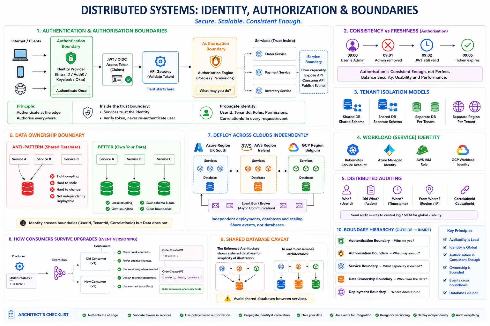
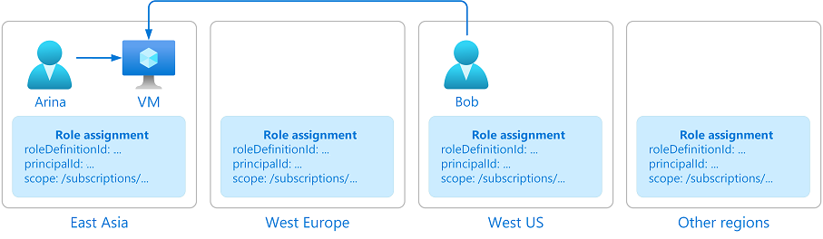

# Availability vs Identity in Distributed C#/.NET Applications - Part 2: Lock-in on Use Cases and on Cloud



_In Part 1 of this series, we explored the challenges of balancing availability and identity in distributed C#/.NET applications._ 

_In this section, we will take a closer look at the consequences of dependence on specific use cases and cloud environments._

## Identity use cases

### Global Unique IDs

For multi-cloud systems:
- Avoid using `int OrderId`, because **different regions can generate duplicates**.
- Use `Guid` or `Ulid` or `Snowflake ID`

Example ULID:

```csharp
using NUlid;

var id = Ulid.NewUlid();
```

Benefits:
- globally unique
- sortable
- region independent


### Stateless Services

> [!WARNING]
> ❗️ A service instance must be replaceable.

**Bad**:

```csharp
public class ShoppingCartService
{
    private readonly Dictionary<string, Cart> _carts;
}
```

> [!NOTE]
> 👉 Cart disappears when instance dies.

**Good**:

```csharp
public class ShoppingCartService
{
    private readonly ICartRepository _repository;

    public Task<Cart> GetCartAsync(string customerId)
        => _repository.GetAsync(customerId);
}
```

> [!IMPORTANT]
> 📌 State stored externally.

> [!NOTE]
> 👉 Service becomes stateless.

### Identity Through JWT

> [!NOTE]
> ✔ Multi-cloud applications should rely on tokens rather than server sessions.

Example:

```csharp
builder.Services
    .AddAuthentication("Bearer")
    .AddJwtBearer();
```

Controller:

```csharp
[Authorize]
[HttpGet]
public IActionResult Get()
{
    var userId = User.FindFirst("sub")?.Value;

    return Ok(userId);
}
```

Works equally on:
- Azure
- AWS
- GCP
- On-Prem


## Lock-in, Dependence and Independence on Cloud Service Providers

### Distributed Configuration

Avoid:
```csharp
if(Environment.MachineName=="SERVER1")
```

Use:

```csharp
public class ApplicationSettings
{
    public string Region { get; set; }
}
```

Inject:

```csharp
builder.Services.Configure<ApplicationSettings>(
    builder.Configuration.GetSection("Application"));
```

Can come from:
- Azure App Configuration
- AWS Systems Manager
- HashiCorp
- Kubernetes ConfigMaps

### Multi-Region Event Driven Architecture

Instead of synchronous dependencies:

```
Service A -> Service B -> Service C
```

Use events:

```
Service A
    |
 Event
    |
Broker
    |
Service B
    |
Service C
```

Benefits:
- regional independence
- fault isolation
- retry capability

**C# Example**

Event:

```csharp
public record OrderCreated(
    Guid OrderId,
    DateTime CreatedAt);
```

Publisher:

```csharp
await publisher.PublishAsync(
    new OrderCreated(
        orderId,
        DateTime.UtcNow));
```

Subscriber:

```csharp
public class OrderCreatedHandler
{
    public Task Handle(OrderCreated evt)
    {
        return Task.CompletedTask;
    }
}
```

### Event Versioning

Until now we discussed events but not evolution. We cannot ignore versioning:

```
OrderCreatedV1
OrderCreatedV2
```

Very mature questions are:
- How do consumers survive upgrades?
- How do we deploy across clouds independently?

> [!NOTE]
> 👉 Prefer additive changes over version creation whenever possible.

Example:

```json
{
  "orderId": "123",
  "total": 100
}
```

is often safer than creating V2.

> [!NOTE]
> 👉  Many mature event platforms prefer schema evolution over version proliferation.

### Idempotency

> [!IMPORTANT]
> 📌 Distributed systems always generate duplicates.

> [!NOTE]
> 👉 Design for ___at Least Once Delivery___ not for ___Exactly Once Delivery___

Example

```csharp
public async Task ProcessAsync(OrderCreated evt)
{
    if(await repository.Exists(evt.OrderId))
        return;

    await repository.Save(evt);
}
```

- The handler can execute 100 times.
- Result remains correct.

### Region-Aware Routing

> [!IMPORTANT]
> 📌 Requests should go to nearest healthy location.

Architecture:

```
London
  |
Global Load Balancer
  |
+-----------+-----------+
|                       |
Azure UK      AWS Ireland
```

Examples:
- Cloudflare
- Microsoft
- Amazon Web Services
- Google

> [!NOTE]
> 👉 Application does not know where it runs.

### Circuit Breaker

> [!IMPORTANT]
> 📌 External dependencies fail.

> [!WARNING]
> ❗️ Protect against cascading failures.

Using Polly:

```csharp
builder.Services
    .AddHttpClient("Payments")
    .AddTransientHttpErrorPolicy(policy =>
        policy.CircuitBreakerAsync(
            5,
            TimeSpan.FromMinutes(1)));
```

If payment provider fails `Fail Fast` instead of exhausting resources.

### Retry + Jitter

Bad:

```
Retry 5 times immediately
```

Creates thundering herd.

Good:

```csharp
WaitAndRetryAsync(
    5,
    retry =>
        TimeSpan.FromSeconds(
            Math.Pow(2,retry))
);
```

Even better: `Decorrelated Jitter` via Polly extensions.

### Health Checks

> [!IMPORTANT]
> 📌 Every deployment platform should monitor health.

```csharp
builder.Services.AddHealthChecks();
```

Map endpoint:

```csharp
app.MapHealthChecks("/health");
```

Used by:
- Kubernetes
- Azure
- AWS
- GCP
- Load Balancers

### Multi-Cloud Identity Federation

> [!WARNING]
> ❗️ Avoid provider-specific authentication.

Use standards:
- OAuth2
- OpenID Connect
- JWT

Providers:
- Microsoft Entra ID
- Okta
- Auth0
- Keycloak

> [!IMPORTANT]
> ✔  Determine if roles are consistent across clouds and regions.



> [!IMPORTANT]
> **✔  Application code remains portable.**

### Outbox Pattern

Without the outbox we have an inconsistent state:

```
- DB Save
- FAIL
- Event Publish

or
- DB Save
- SUCCESS
- Event Publish FAIL
```

Outbox Table

```csharp
public class OutboxMessage
{
    public Guid Id { get; set; }

    public string Payload { get; set; }

    public DateTime CreatedAt { get; set; }
}
```

Transaction:

```csharp
await db.Orders.AddAsync(order);

await db.Outbox.AddAsync(message);

await db.SaveChangesAsync();
```

> [!NOTE]
> 👉 Background publisher sends events later.

### Sagas Instead of Distributed Transactions

> [!IMPORTANT]
> ❌ Never use **2-Phase Commit** across clouds.

> [!NOTE]
> ✔  Use **Saga** orchestration.

Example:

```
Order Created
      |
Reserve Stock
      |
Take Payment
      |
Arrange Shipment
```

Compensations:

```
Payment Failed
      |
Release Stock
```

### Reference Architecture
```

                Global DNS
                     |
          +----------+----------+
          |                     |
       Azure               AWS
          |                     |
      AKS Cluster         EKS Cluster
          |                     |
          +----------+----------+
                     |
               Event Bus
                     |
         +-----------+-----------+
         |                       |
      SQL Global           Cache
      Database
```

Characteristics:
- Stateless services
- Global identities
- Event driven
- Idempotent handlers
- Health checks
- Circuit breakers
- Multi-region deployment
- Cloud-independent authentication
- Outbox pattern
- Saga orchestration


### Data Ownership

"Traditional" architecture uses:
```
SQL Global Database
```

But, modern distributed systems usually prefer:

```
Service A -> Own Database
Service B -> Own Database
Service C -> Own Database
```

instead of `Global Shared Database`.

> [!NOTE]
> 👉  "The reference architecture uses a shared database for illustration. In mature microservice architectures each bounded context typically owns its data."

## How Do Consumers Survive Upgrades?

> [!NOTE]
> 👉  This is one of the hardest distributed systems problems.

### Anti-Pattern

Publisher:

```
public record OrderCreated(
    Guid OrderId);
```

Consumer:

```
evt.OrderId
```

Later:

```
public record OrderCreated(
    Guid OrderId,
    decimal Total);
```

> [!WARNING]
> ❗️ **Consumers fail.**

### Versioning Rule

> [!IMPORTANT]
> ❌ Never break contracts.

Instead:

```
public record OrderCreatedV1
```

Introduce:

```
public record OrderCreatedV2
```

> [!WARNING]
> ❗️ Keep both temporarily.

### Tolerant Readers

> [!IMPORTANT]
> 👉  Consumers should ignore unknown fields.

Good:

```json
{
  "orderId":"123",
  "total":100,
  "futureField":"xyz"
}
```

> [!NOTE]
> 👉 Consumer only reads: `orderId` and survives upgrades.

### Consumer-Driven Contracts

Advanced teams use:
- Pact (a formal agreement between individuals or parties)
- Contract Tests

Rule:

```
Producer changes must not break existing consumers.
```

### How Do We Deploy Across Clouds Independently?

> [!NOTE]
> 👉  This is where availability and ownership meet.

**Anti-Pattern**

```
Azure Deployment
     |
Requires
     |
AWS Deployment
     |
Requires
     |
GCP Deployment
```

- One release train.
- One outage.
- One rollback.

**Mature Model**

```
Azure Region
    |
Deploy Independently

AWS Region
    |
Deploy Independently

GCP Region
    |
Deploy Independently
```

### Requirements

**Stable Contracts**

- API `v1` must continue working.
- Stable Events `OrderCreatedV1` must continue working.

**Independent Databases**

Never:

```
Azure Service
     |
Writes
     |
AWS Database
```

**Eventual Consistency**

Instead:

```
Azure
    |
Publish Event
    |
Broker
    |
AWS
```

### How to Control All of the Above When Code is Generated by AI?

> [!IMPORTANT]
> 📌 The short answer is: 
> **We do not control AI-generated code directly. We control the decisions that AI is allowed to make.**

But I have already discussed the same topic in another series of articles entitled 
["Once and Only Once with Examples"](https://www.linkedin.com/posts/marek-kubis-236ab211_once-and-only-once-with-examples-part-activity-7472187860541054976-xtLM?utm_source=share&utm_medium=member_desktop&rcm=ACoAAAJ50coBftmEofSByamAvnvGT91B1RrlchE).

The key is: eliminate duplication of decisions while enabling necessary duplication of representation, verification, protection, and testing.

> [!NOTE]
> ✔  The same principle applies to AI.

## Takeaways

### The Boundary Hierarchy

One useful way to teach this is:

```
+------------------------------------------------+
| Authentication Boundary                        |
| Who are you?                                   |
+------------------------------------------------+

+------------------------------------------------+
| Authorization Boundary                         |
| What may you do?                               |
+------------------------------------------------+

+------------------------------------------------+
| Service Boundary                               |
| What business capability is owned?             |
+------------------------------------------------+

+------------------------------------------------+
| Data Ownership Boundary                         |
| Who owns this data?                            |
+------------------------------------------------+

+------------------------------------------------+
| Deployment Boundary                            |
| Where does this run?                           |
+------------------------------------------------+
```

A fundamental Domain-Driven Design and microservices principle and the key insight is:

```
Identity crosses boundaries.
Permissions cross boundaries.
Events cross boundaries.
Ownership does NOT cross boundaries.
Databases do NOT cross boundaries.
```

> [!NOTE]
> ✔  That single principle explains a surprisingly large percentage of successful multi-cloud, highly available, independently deployable .NET distributed systems.

### A Practical Rule for Senior .NET Architects

> [!NOTE]
> 👉 For every class, database table, API, queue message, and workflow, ask:
> 
> ✔  "If Azure UK South disappears right now and traffic moves to AWS Ireland or an on-premise datacentre, does the identity of my business objects remain unchanged?"

> [!IMPORTANT]
> ✔ If the answer is yes, you've separated identity from availability.

**That separation is one of the foundations of highly available, fault-tolerant, cloud-agnostic distributed systems in modern C#/.NET architectures.**

### A Principal Architect Rule for the AI Era

> [!NOTE]
> 👉 For every architectural decision ask: ___"Can an AI generate code that violates this decision?"___
> 
> ✔ If the answer is yes, then the decision exists only in documentation.

The next step is:

> [!IMPORTANT]
> 📌 Convert the decision into an executable constraint, architecture test, policy, CI/CD gate, analyzer, or code-generation template.

**When AI-generated code is involved, the objective is no longer controlling the code.**

> [!IMPORTANT]
> 📌 The objective is controlling the decisions that shape the code. That is becoming one of the defining responsibilities of software architects building distributed .NET systems.


_/* Images are from Microsoft learning site._


## See also:
- [Availability vs Identity in Distributed C#/.NET Applications - Part 1: The Role of Availability and Identity](https://www.linkedin.com/pulse/availability-vs-identity-distributed-cnet-part-1-role-marek-kubis-xvpze/)

- [What is managed identities for Azure resources?](https://learn.microsoft.com/en-us/azure/active-directory/managed-identities-azure-resources/overview)
- [IAM Roles](https://docs.aws.amazon.com/IAM/latest/UserGuide/id_roles.html)
- [Authenticate to Google Cloud APIs from GKE workloads](https://cloud.google.com/kubernetes-engine/docs/how-to/workload-identity)
- [What is Azure role-based access control (Azure RBAC)?](https://learn.microsoft.com/en-us/azure/role-based-access-control/overview)

- [Once and Only Once with Examples - Part 1: Is It Obvious?](https://www.linkedin.com/pulse/once-only-examples-part-1-obvious-marek-kubis-nyebe/)
- [Once and Only Once with Examples - Part 2: And AI-generated Code](https://www.linkedin.com/pulse/once-only-examples-part-2-ai-generated-code-marek-kubis-kn9ie/)
- [Once and Only Once with Examples - Part 3: Where Duplication Is Simultaneously Necessary](https://www.linkedin.com/pulse/once-only-examples-part-3-where-duplication-necessary-marek-kubis-vpxce/)

- [Mutation testing - Part 1: is it outdated?](https://lnkd.in/eDbVukCf)
- [Mutation testing - Part 2: Turn into a production-ready tool](https://lnkd.in/eSx9b6pB)
- [Mutation testing - Part 3: Mutation testing limits and how to go beyond it](https://lnkd.in/e3qsTXBy)
- [Mutation testing - Part 4: mutation testing and LLM-written code](https://lnkd.in/eKfvJfbp)

- [Underestimated and Annoying, or the "Dirty Dozen" of Programmers - Part 1: The Problem Space](https://www.linkedin.com/pulse/underestimated-annoying-dirty-dozen-programmers-marek-kubis-mcfxe)
- [Underestimated and Annoying, that is "The Dirty Dozen" of Programmers - Part 2: AI-Generated Software](https://www.linkedin.com/pulse/underestimated-annoying-dirty-dozen-programmers-part-2-marek-kubis-tqkme/)
- [Underestimated and Annoying, that is "The Dirty Dozen" of Programmers - Part 3: I. Organizational Problems](https://www.linkedin.com/pulse/underestimated-annoying-dirty-dozen-programmers-part-marek-kubis-h9y3e/)
- [Underestimated and Annoying, that is "The Dirty Dozen" of Programmers - Part 4: II. Human Problems](https://www.linkedin.com/pulse/underestimated-annoying-dirty-dozen-programmers-part-marek-kubis-mn5ve/)
- [Underestimated and Annoying, that is "The Dirty Dozen" of Programmers - Part 5: III. Process Problems](https://www.linkedin.com/pulse/underestimated-annoying-dirty-dozen-vibe-coding-part-marek-kubis-83jre/)
- [Underestimated and Annoying, that is "The Dirty Dozen" of Programmers - Part 6: IV. Architecture Problems](https://www.linkedin.com/pulse/underestimated-annoying-dirty-dozen-programmers-part-marek-kubis-remze/)
- [Underestimated and Annoying, that is "The Dirty Dozen" of Programmers - Part 7: V. Validation Problems](https://www.linkedin.com/pulse/underestimated-annoying-dirty-dozen-programmers-part-marek-kubis-dqk2e/)
- [Underestimated and Annoying, that is "The Dirty Dozen" of Programmers - Part 8: VI. Economic Problems](https://www.linkedin.com/pulse/underestimated-annoying-dirty-dozen-programmers-part-marek-kubis-7bb6e/)

- [Murphy’s law and more in AI time - one by one with examples](https://www.linkedin.com/pulse/murphys-law-more-ai-time-one-examples-marek-kubis-fkaze)
- [The Agile Vibe Coding and Conway's Law](https://www.linkedin.com/pulse/agile-vibe-coding-conways-law-marek-kubis-m0wpe)
- [Using a digital banking solution to prove Conway’s Law in AI-Driven engineering - example 1](https://www.linkedin.com/pulse/using-digital-banking-solution-prove-conways-law-ai-driven-kubis-xqlre/)
- [Using a .NET 10 migration project to prove Conway’s Law in AI-Driven engineering - example 2](https://www.linkedin.com/pulse/using-net-10-migration-project-prove-conways-law-ai-driven-kubis-abqae)

- [Where traditional Agile breaks in AI-driven systems](https://www.linkedin.com/pulse/where-traditional-agile-breaks-ai-driven-systems-marek-kubis-4wq6e/)
- [AI - It seems nobody has it fully figured out yet](https://www.linkedin.com/pulse/ai-nobody-has-figured-out-marek-kubis-bkyge)
- [Internal Development Platform and Agile Vibe Coding](https://www.linkedin.com/pulse/internal-development-platform-agile-vibe-coding-marek-kubis-kyhqe/?trackingId=5w3lWKp%2F0BLUpwNdrSmAcg%3D%3D&lipi=urn%3Ali%3Apage%3Ad_flagship3_pulse_read%3BqH%2FwqbkZRkmo%2Fagtxvqyrw%3D%3D)
- [Everyone will be vibe coders](https://www.linkedin.com/pulse/everyone-vibe-coders-marek-kubis-tlgze)
- [The Structural problems AI introduces into the SDLC](https://www.linkedin.com/pulse/structural-problems-ai-introduces-sdlc-marek-kubis-qyt6e)
- [Signals That Reveal the True Maturity of Organisations Claiming “AI-Driven Development”](https://www.linkedin.com/pulse/signals-reveal-true-maturity-organisations-claiming-ai-driven-kubis-urule)

- [Agile Vibe Coding positioning and if this works, what changes?](https://www.linkedin.com/pulse/agile-vibe-coding-positioning-works-what-changes-marek-kubis-r4ate)
- [Agile Vibe Coding – Ceremony Modes](https://www.linkedin.com/pulse/agile-vibe-coding-ceremony-modes-marek-kubis-meq9e)
- [Agile Vibe Coding ceremonies approach compared to a simple one-prompt-per-task approach](https://www.linkedin.com/pulse/agile-vibe-coding-ceremonies-approach-compared-simple-marek-kubis-ecx5e)
- [Agile Vibe Coding Maturity Model](https://www.linkedin.com/pulse/agile-vibe-coding-maturity-model-marek-kubis-bbtqe)
- [The Agile Vibe Coding - the 4-level adaptive ceremony system](https://www.linkedin.com/pulse/agile-vibe-coding-4-level-adaptive-ceremony-system-marek-kubis-jizke)

- [Agile Vibe Coding Manifesto](https://agilevibecoding.org/)
- [Principles Behind the Agile Vibe Coding Manifesto - extended version](https://github.com/marekartur-dev/agilevibecoding/blob/main/Docs/Home/Principles.md)

- [Agile Vibe Coding](https://www.reddit.com/r/AgileVibeCoding/)
- [Marek Kubis - blog](https://github.com/marekartur-dev/agilevibecoding/tree/main)