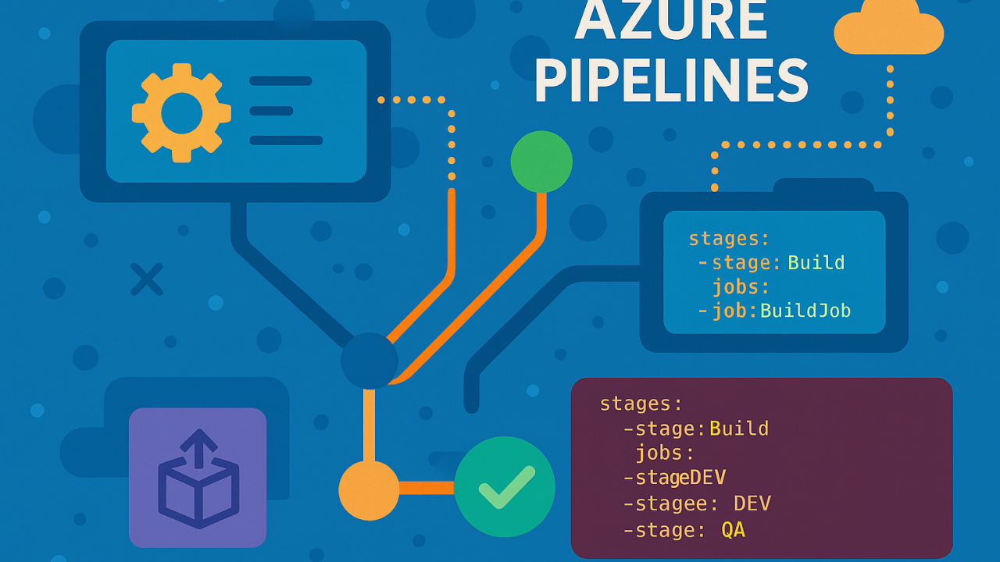
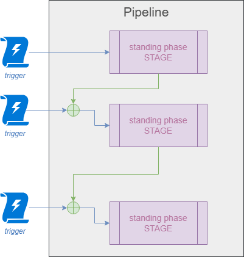
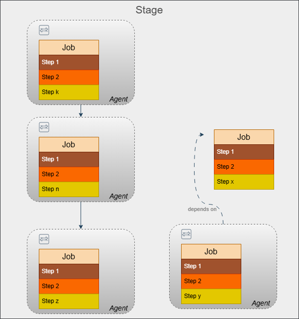

# Azure DevOps Pipelines Through the Eyes of a Developer



> The code of a program written by a programmer is saved to a file that, depending on the programming language used, receives a different extension, .cs, .vb, .js, .html, etc. But in addition to these files, the Azure DevOps repository also stores .yml, .yaml, .bicep files. 

> Of course, the solution to the task or problem contained in the program code is saved in files with the extensions .cs, etc. And what is in the files .yml, .bicep? Have you ever wondered what these files are, what kind of language they are, what can it be compared to and what do they represent? In what environment are they used and what need do such files meet, these are questions that programmers know the answers to.

> So let's start the introduction to the key concepts of the topic with what is known. What do such files really contain?


## Answering from the last question

**What does the .yml or .yaml file contain?** – two extensions, the same meaning, the file contains the configuration and the Infrastructure as Code, IaC code.

**What does the .bicep file contain?**  – the file contains the configuration and commands for managing Azure cloud resources.

**Satisfied met?** - the need to deliver the highest quality program to the recipient. And since the production of a computer program is a multi-step and repeatable process that consists of compilation, testing, and installation, it is no wonder that software developers decided to automate this process. And this is the answer. The code in the .yml and .bicep files automates the building, testing, and deployment of applications.

**In what environment is it used?** – Azure DevOps with its own parsing tool for reading configuration files, messages or expressions.

**What do the .yml, .bicep files represent?** - Continuous Integration/Continuous Deployment, CI/CD service

**What can they be compared to?** – to a program in JavaScript or html. Just as html code runs in a web browser environment, yml and .bicep code runs in an Azure DevOps environment.

**YAML, what language is this?** – YAML Ain’t Markup Language, YAML, which is a Unicode-based data serialization language. When YAML was first proposed in 2001, the creators explained that YAML stands for “yet another markup language.” Their intention was to develop a new markup language. However, it was later revealed that it is actually a data serialization language, i.e. a data-centric language. Hence the change of the official name “Are not markup language.”

**BICEP, what language is this?** - Bicep is a domain-specific language that uses declarative syntax.

**What is a .yml file?** – an ordered list of expressions, variables and parameters.

**What else is a .yml file?** – a file that provides a human-readable data exchange format. In this way, it has a lot in common with JSON files. In fact, YAML is implemented as a superset of JSON format. This means that you can parse JSON using a YAML parser. Although the practical implementation of this theory is a bit difficult.

**What is a .bicep file?** – In a Bicep file, we define the infrastructure we want to deploy to Azure and then use that file throughout the development lifecycle to repeatedly deploy that infrastructure. Our resources are deployed in a consistent manner.

## Introduction to pipeline

- **Pipeline** is a sequence of commands for the operating system of a computer, server, cloud or integrated development environment that allows for the creation and configuration of the appropriate infrastructure and the construction of an application, its testing and installation.
- **Pipeline** is a way of organizing a process of sequence of actions. Actions can be very different from each other, so they are performed in stages. For example: first we define the required infrastructure in the cloud (working memory, database, ..), then we add the program, then we test the whole thing, and finally we install it on the server so that users can use the application.
- The transition of a process from one phase to another can occur automatically after the previous actions have been completed. Such a transition can also be suspended by a human decision or waiting for some other, external pipeline to complete.
- An external trigger is responsible for starting the pipeline code. The trigger tells the pipeline to start.
- A **trigger** is an event that is triggered by a human request or triggered automatically, such as when an updated version of a program's source code is saved to a repository.



## Key concepts

- A standing phase of a pipeline is called a Stage in DevOpos terminology.
- Each pipeline can have one or more stages.
- A stage is a way of organizing what comes next in the pipeline and is called a job.
- Each stage can have one or more jobs.
- A job may or may not require a computing infrastructure with software installed.
- To build or deploy the code, each pipeline requires at least one or more daemon/client service called Agent.
- So, each job runs on one Agent, but can also be agentless.
- Each agent runs a job that contains one or more steps.
- A step can be a task or a list of tasks.
- A task is a pre-packaged script that performs an activity or sequence of actions.
- A step is the smallest building block of a pipeline.



## Understanding YAML language

### Data Types

The YAML file contains the following data types:
- **Scalars**: Scalars are values such as Strings, Integers, Booleans, etc.
- **Sequences**: Sequences are lists where each element starts with a dash (-). Lists can also be nested.
- **Mappings**: Mapping provides the ability to list keys along with values.

### Syntax
- **Indentation**: Indentation of whitespace is used to indicate nesting and overall structure.
- **Comments**: Comments are written starting with the symbol “#”.
- **Lists**: The hyphen (-) is used to indicate members of a list with each element on a separate line. List elements can also be enclosed in square brackets ([…]) with elements separated by commas (,).
- **Associative arrays**: An associative array is surrounded by curly braces ({…}). Keys and values are separated by a colon (:), and each pair is separated by a comma (,).
- **Strings**: A string can be written with or without double quotes (") or single quotes (’).
- **Scalar block content**: Scalar content can be written in block notation using: |: All live breaks are significant. >: Each line break is folded to space. It removes the leading whitespace for each line.
- **Multiple documents**: Multiple documents are separated by three hyphens (—) in a single stream. Hyphens indicate the start of a document. Hyphens are also used to separate directives from the document body. The end of a document is indicated by three dots (…).
- **Type**: To specify the type of value, double exclamation marks (!!) are used, i.e.   a: !!float 123, b: !! str. 123
- **Tag**: To assign a tag to a note, an ampersand (&) is used and to reference that node, an asterisk (*) is used.
- **Directives**: YAML documents can be preceded by directives in a stream. Directives begin with a percent sign (%) followed by the name and then the parameters separated by spaces.

## Understanding the pipeline file

The pipeline .yml file is very specific and syntax sensitive file, usually called azure-pipeline.yml.

Because inserting everything into a one file can result large, difficult to read and understand content, so it’s common practise to put selected group of instruction into separate files, i.e. azure-deployment-steps.yml, azure-deployment-steps-prod.yml, etc.

### Example 1 – pipeline

Based on above let’s see how software developers define pipelines.
- **Firstly**, we need to specify the sources of triggers.
- **Secondly**, we need to specify the operating system.
- **Next**, we can define variables.
- **Finally**, we can define stages.

```yaml
trigger:
  branches:
    include:
    - feature/*
    - develop
    - master

pool:
  vmImage: ubuntu-latest

variables:
  - name: projectFolder
    value: Service
  - name: projectTestFolder
    value: Service.Tests
  - name: projectName
    value: 'service-application'
  - name: buildId
    value: $(build.buildId)
  - name: solution
    value: '**/*.sln'

stages:
  - stage: RestoreBuildTest
    jobs:
      - job: …

  - stage: Dev
    condition: and(succeeded(), ne(variables['Build.Reason'], 'PullRequest'))
    dependsOn: RestoreBuildTest
    jobs:
      - deployment: …

  - stage: QA
    condition: and(succeeded(), eq(variables['Build.Reason'], 'PullRequest'), eq(variables['System.PullRequest.targetBranchName'], 'develop'))
    dependsOn: RestoreBuildTest
    jobs:
      - deployment: …
```

In the example above:
- The pipeline will be started when the code is updated in the master, develop or any other branch whose name starts with the word feature.
- Use Linux as the operating system in the ubuntu version.
- Global variables are defined such as: projectFolder, projectName, ..
- 3 stages are defined: RestoreBuildTest, Dev and QA
- The RestoreBuildTest stage is started immediately
- The Dev stage is started only after the program has been successfully built based on the PullRequest and will only start after the RestoreBuildTest is finished.
- The QA stage is started similarly to Dev, but the source code will be downloaded from the develop branch.


### Example 2 - job

Below is an example of defining one job.

```yaml
- job: TestAndBuild
        variables:
          - group: AppGlobal
        steps:
          - task: DotNetCoreInstaller@2
            inputs:
              version: "8.x"
          - task: DotNetCoreCLI@2
            displayName: "dotnet restore project into folder"
            inputs:
              command: restore
              projects: "$(solution)"
              vstsFeed: $(nugetFeedId)
              restoreDirectory: "packages"
          - task: DotNetCoreCLI@2
            displayName: "dotnet build project"
            inputs:
              command: "build"
              projects: "$(projectFolder)/*.csproj"
              arguments: '--no-restore'
          - task: DotNetCoreCLI@2
            displayName: "dotnet test project"
            inputs:
              command: "test"
              projects: "$(projectTestFolder)/*.csproj"
              arguments: '--no-restore'
```

In this example:
1. Defined variables have a scope limited to this job.
2. DotNetCoreInstaller@2 task maps to the dotnet command-line utility.
3. The pipeline uses DotNetCoreInstaller@2 three times:
    - one time to restore, or install, the .NET8 Framework in latest version with project's dependencies,
    - one time to build the project,
    - one time to test the project


### Example 3 – task

Only one task in detail, another version.

```yaml
task: DotNetCoreCLI@2
  displayName: 'Build the project'
  inputs:
    command: 'build'
    arguments: '--no-restore --configuration Release'
    projects: '**/*.csproj'
```

The pipeline might translate this task to this command:

```yaml
dotnet build MyProject.csproj --no-restore --configuration 
Release
```

Here is what we defined:
1. as in previous example DotNetCoreInstaller@2 task maps to the dotnet command but with different arguments.
2. displayName defines the task name 'Build the project' that's shown in the user interface.
3. inputs define arguments that are passed to the command
   - command specifies to run the dotnet build subcommand,
   - arguments specify additional arguments `--no-restore --configuration Release` to pass to the command,
   - projects specify which projects to build, in this case all projects from the current directory and child directories `**` with the file extension `.csproj`.

> [!NOTE]
> The "@" in the task name—for instance, DotNetCoreCLI@2—refers to the task's version.


### Example 4 – publish the build to the pipeline

```yaml
- task: DotNetCoreCLI@2
  displayName: 'Publish the project - Release'
  inputs:
    command: 'publish'
    projects: '**/*.csproj'
    publishWebProjects: false
    arguments: '--no-build --configuration Release --output $(Build.ArtifactStagingDirectory)/Release'
    zipAfterPublish: true

- task: PublishBuildArtifacts@1
  displayName: 'Publish Artifact: drop'
  condition: succeeded()
```

Here is what we defined:
- The first task uses the DotNetCoreCLI@2 task to publish or package the app's build results (including its dependencies) into a folder. The zipAfterPublish: true argument specifies to add the built results to a .zip file.
- The second task uses the PublishBuildArtifacts@1 task to publish the .zip file to Azure Pipelines. The condition argument specifies to run the task only when the previous task succeeds. succeeded() is the default condition

> [!NOTE]
> An **artifact** is a collection of files or packages published by a run.

### Example 5 - bicep

```bicep
param location string = resourceGroups().location
param functionAppName string
param serviceBusNamespace string
param gatewayName string

resource apiGateway 'Microsoft.Network/sites@2022-03-01' = {
  name: functionAppName
  location: location
  kind: 'functionapp'
  properties: {
    serverFarmId: resourceId('Microsoft.Web/serverfarms', '${functionAppName}-plan')
  }
}

resource serviceBus 'Microsoft.ServiceBus/namespaces@2022-01-01-preview' = {
  name: serviceBusNamespace
  location: location
  sku: {
    name: 'Standard'
    tier: 'Standard'
  }
}
 
resource apiGateway 'Microsoft.Network/frontdoors@2022-05-01' = {
  name: gatewayName
  location: location
  properties: {
    backendPools: [
      {
        name: 'functionBackendPool'
        properties: {
          backends: [
            {
                address: functionApp.properties.defaultHostName
            }
          ]
        }
      }
    ]
  }
}
```

In this example:
- We define Azure portal resources _apiGateway_ and _serviceBus_
- Azure resources are placed at `resourceGroups().location`
- The API Gateway redirects response to address: `functionApp.properties.defaultHostName`
- The price plan of service bus is `Standard`.

### Example 6 - policies

When creating pipelines, we may need to use xml files. A typical example is using policies. Since policies can contain many conditions, saving them in xml format is a good solution. 
Microsoft provides many examples of how to build such a structure. [Azure api-management-policy-snippets](https://github.com/Azure/api-management-policy-snippets/tree/master/examples). A template looks like the one below.
```
<policies>
	<inbound>
		<base />                             
		<!-- To do something .. -->
	</inbound>
	<backend>
		<base />                             
		<!-- To do something .. -->
	</backend>
	<outbound>
		<base />                             
		<!-- To do something .. -->
	</outbound>
	<on-error>
		<base />                             
		<!-- To do something .. -->
	</on-error>
</policies>
```

Typically a policy uses variables and contains many conditions. Sample syntax below.

```
<set-variable name="bearerToken" value="@((string)((JObject)context.Variables["accessToken"])["access_token"])" />

<cache-store-value key="bearerToken" value="@((string)context.Variables["bearerToken"])" duration="@((int)context.Variables["tokenDurationSeconds"])" />
```

Variables are of type object by default. But in many places we need the string type. Unfortunately, I have noticed that type conversion at runtime does not always work correctly and an exception is thrown. In such cases it may be helpful to use an expression that sets the variable instead of a variable, e.g.:
```
<cache-store-value key="bearerToken" value="@((string)((JObject)context.Variables["accessToken"])["access_token"])" duration="@((int)context.Variables["tokenDurationSeconds"])" /> 
```

This swap isn't a solution to every problem, but in some simple cases it may be good enough.

## Summary

There are many things I haven't mentioned, so I encourage you to continue learning, to not only know, but also understand software development in the cloud environment. For my part, I have selected what is important in my opinion. At the same time, I hope that I have clarified more than I have confused.

I wish much success.


## Appendix - Comparison of YAML and JSON

### YAML
- Complex and time-consuming process of parsing Serialized data
- Less community support
- Supports comments
- Ability to use reference of other data objects
Hierarchy is denoted by using double space characters. Tab characters are not allowed
String quotes are optional but it supports single and double quotes.
Root node can be any of the valid data types

### JSON
- Quickly and easily parse JSON serialized data with its simpler design
- Larger community support and popularity
- Doesn’t support comments
- Impossible to serialize complex structures with object references
- Objects and Arrays are denoted in braces and brackets.
- Strings must be in double quotes.
- Root node must either be an array or an object


## See also:
- [Azure Pipelines documentation](https://learn.microsoft.com/en-us/azure/devops/pipelines/?view=azure-devops)
- [Key concepts for new Azure Pipelines users](https://learn.microsoft.com/en-us/azure/devops/pipelines/get-started/key-pipelines-concepts?view=azure-devops)
- [Azure Pipelines agents](https://learn.microsoft.com/en-us/azure/devops/pipelines/agents/agents?view=azure-devops&tabs=yaml%2Cbrowser)
- [Pipeline runs](https://learn.microsoft.com/en-us/azure/devops/pipelines/process/runs?view=azure-devops)
- [Create a multi-stage release pipeline](https://learn.microsoft.com/en-us/azure/devops/pipelines/release/define-multistage-release-process?view=azure-devops)
- [YAML vs Classic Pipelines](https://learn.microsoft.com/en-us/azure/devops/pipelines/get-started/pipelines-get-started?view=azure-devops)
- [What is Bicep?](https://learn.microsoft.com/en-us/azure/azure-resource-manager/bicep/overview?tabs=bicep)
- [Bicep file structure and syntax](https://learn.microsoft.com/en-us/azure/azure-resource-manager/bicep/file)