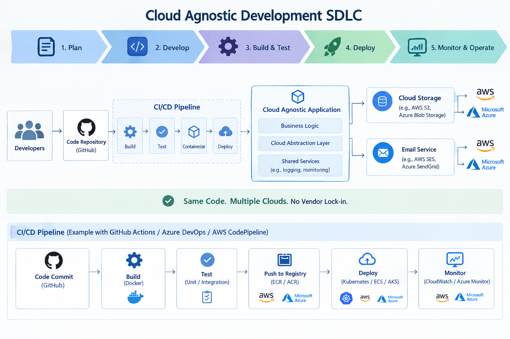
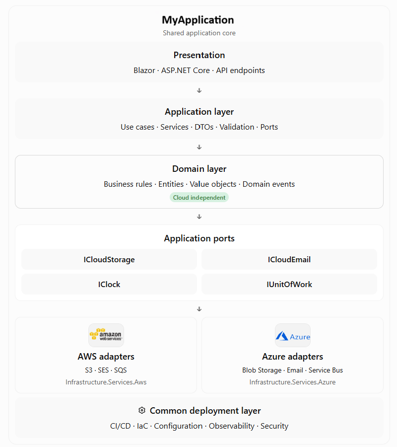
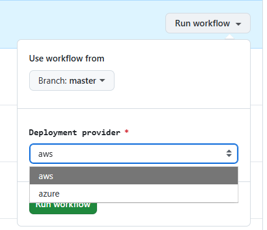
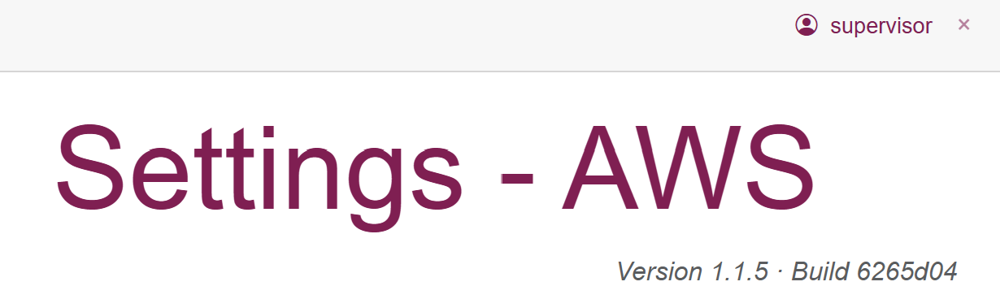

# Cloud-agnostic applications – Part 1: How To Do



_The essence of software development has always been addressing people's challenges, alleviating their concerns, and meeting their expectations._

_One such challenge is creating software that operates simultaneously across the platforms of multiple cloud service providers._

_The motivation behind creating such solutions is the desire to ensure service continuity in situations where_ 
_a chosen provider is grappling with a data center outage or unsatisfactory connection quality.

_It may also be the case that the software's output is so critical that the product owner wishes to examine_ 
_and compare application responses generated by independent operating systems, computers, databases, knowledge bases, and the like._

## By Way of Introduction

Regardless of whether the reasons for developing such software are technical, business-related, financial, 
or stem from a lack of trust in a cloud service provider, the question always arises: how should it be done?

Even if one has the resources to assemble independent teams—each building a solution 
for a different cloud platform—this approach is suitable only for specific use cases.

Typically, the goal is to maintain a single, shared business logic while using platform-specific implementations for resource access 
(e.g., storage) or services (e.g., email dispatch).

Theoretically, one could task artificial intelligence with generating code for each platform; 
in practice, however, I prefer to rely on the human mind to analyze the problem and manage the coding process—even when aided by AI.

For instance, over the past years, Microsoft has altered how localisation mechanisms function across versions:
- .NET 8
- .NET 9
- .NET 10
This results in the same code behaving differently on various platforms. AI can assist here with the implementation details.

This helps avoid situations where an application fails to function correctly and the developer has no idea why.

> [!NOTE]
> Continue reading if you are such kind of developer, who wants to understand the problem and solve it in a way that is not only effective but also elegant.


## How To Do

### Scaling 

It is a truism that scaling an application across multiple cloud providers is no trivial task. 
However, if we want to scale an application across a multi-cloud environment, 
we must address a series of questions regarding, how to ensure the application:
- handles the distinct configurations and settings of each cloud provider?
- manages the varying performance characteristics of each cloud provider?
- meets the diverse security and compliance requirements of each cloud provider?
- supports the different pricing models used by individual cloud providers?
- handles the varying availability and reliability characteristics of each cloud provider?
- accounts for the different geographic infrastructure locations of individual cloud providers?
- manages the varying network latencies associated with each cloud provider?
- supports the distinct data storage and retrieval mechanisms of each cloud provider?
- utilises the different monitoring and logging mechanisms employed by individual cloud providers?
- supports the various deployment and orchestration mechanisms of each cloud provider?
- handles the distinct disaster recovery and backup mechanisms of each cloud provider?
- accounts for the different Service Level Agreements (SLAs) of individual cloud providers?
- supports the various technical support and maintenance mechanisms of each cloud provider?

### From requirements to production

1. Define business capabilities, reliability, security, data residency, cost, and portability requirements.
2. Define interfaces for storage, email, identity, queues, and other external capabilities. Choose portable data formats and failure policies.
3. Build the domain and application layers in C#. Implement cloud adapters separately. Use mocks, emulators, and local infrastructure where practical.
4. Restore, compile, lint, test, scan, package, and publish immutable build artifacts.
5. Deploy the same application artifact to an environment configured for AWS, Azure, or another target. Run smoke, integration, and contract tests.
6. Monitor health, performance, cost, errors, and security. Feed incidents and lessons learned back into the backlog.


## Cloud-agnostic application development with C#

### 1. Reference architecture for a .NET application

> [!IMPORTANT]
> Reference architecture based on Clean Architecture or Ports and Adapters (Hexagonal Architecture).



### 2. Suggested solution structure

```
    src/
    ├── MyApplication.Domain/
    │   ├── Entities/
    │   ├── ValueObjects/
    │   └── Rules/
    ├── MyApplication.Application/
    │   ├── Interfaces/
    │   ├── Services/
    │   └── DTOs/
    ├── MyApplication.Infrastructure/
    │   ├── Aws/
    │   │   ├── Storage/
    │   │   ├── Email/
    │   │   └── ..
    │   ├── Azure/
    │   │   ├── Storage/
    │   │   ├── Email/
    │   │   └── ..
    │   └── DependencyInjection/
    └── MyApplication.Web/
        ├── Components/
        └── Program.cs
```

> [!WARNING]
> The domain and application projects should not reference AWS SDK or Azure SDK packages or any other cloud provider-specific libraries.

### 3. Core C# abstraction: example of ports and adapters in cloud storage and email

> [!IMPORTANT]
> The interface should express a **business capability**, not a cloud product.

- Application layer 

```yaml
public interface ICloudStorage
{
    Task UploadAsync(
        string key,
        Stream content,
        string contentType,
        CancellationToken cancellationToken = default);

    Task<Stream?> DownloadAsync(
        string key,
        CancellationToken cancellationToken = default);

    Task DeleteAsync(
        string key,
        CancellationToken cancellationToken = default);
}
```

```yaml
public sealed record EmailMessage(
    string To,
    string Subject,
    string Body,
    bool IsHtml = true);

public interface ICloudEmail
{
    Task SendAsync(
        EmailMessage message,
        CancellationToken cancellationToken = default);
}
```

> [!IMPORTANT]
> These interfaces deliberately avoid terms such as `S3Bucket`, `BlobContainerClient`, `SESConfigurationSet`, or `AzureEmailClient`.

- Application service

```yaml
public sealed class DocumentService(
    ICloudStorage storage,
    ICloudEmail email)
{
    public async Task SaveDocumentAsync(
        string documentId,
        Stream content,
        CancellationToken cancellationToken = default)
    {
        var key = $"documents/{documentId}.pdf";

        await storage.UploadAsync(
            key,
            content,
            "application/pdf",
            cancellationToken);

        await email.SendAsync(
            new EmailMessage(
                "customer@example.com",
                "Document received",
                "Your document has been received."),
            cancellationToken);
    }
}
```

> [!IMPORTANT]
> The application service knows _what_ must happen, not _how AWS or Azure makes it happen_.

- AWS example adapter implementation

```yaml
public sealed class AwsS3Storage(
    IAmazonS3 s3,
    IOptions<CloudStorageOptions> options)
    : ICloudStorage
{
    private readonly string _bucket =
        options.Value.ContainerName;

    public async Task UploadAsync(
        string key,
        Stream content,
        string contentType,
        CancellationToken cancellationToken = default)
    {
        var request = new PutObjectRequest
        {
            BucketName = _bucket,
            Key = key,
            InputStream = content,
            ContentType = contentType
        };

        await s3.PutObjectAsync(request, cancellationToken);
    }

    public async Task<Stream?> DownloadAsync(
        string key,
        CancellationToken cancellationToken = default)
    {
        try
        {
            var response = await s3.GetObjectAsync(
                _bucket, key, cancellationToken);

            var memory = new MemoryStream();
            await response.ResponseStream.CopyToAsync(
                memory, cancellationToken);

            memory.Position = 0;
            return memory;
        }
        catch (AmazonS3Exception ex)
            when (ex.StatusCode ==
                  System.Net.HttpStatusCode.NotFound)
        {
            return null;
        }
    }

    public Task DeleteAsync(
        string key,
        CancellationToken cancellationToken = default)
    {
        return s3.DeleteObjectAsync(
            _bucket, key, cancellationToken);
    }
}
```


### 4. Dependency injection and provider selection

> [!IMPORTANT]
> The provider should be selected at the **composition root**, not throughout the business code.

```yaml
var provider = builder.Configuration
    .GetValue<CloudProvider>("CloudProvider");

switch (provider)
{
    case CloudProvider.Aws:
        builder.Services.AddAwsInfrastructure(
            builder.Configuration);
        break;

    case CloudProvider.Azure:
        builder.Services.AddAzureInfrastructure(
            builder.Configuration);
        break;

    default:
        throw new InvalidOperationException(
            $"Unsupported cloud provider: {provider}");
}
```

```yaml
public enum CloudProvider
{
    Aws,
    Azure
}
```

### 5. Cloud-agnostic design principles

**1. Separate policy from mechanism**
   Business policy belongs in the domain and application layers. SDK calls, credentials, network details, and cloud configuration belong in infrastructure.

**2. Depend on stable contracts**
   Use interfaces and domain-specific types. Keep provider implementations replaceable without changing use cases.

**3. Build once, deploy many times**
   Produce an immutable artifact and promote it through environments. Do not rebuild different binaries for AWS and Azure.

**4. Make failure explicit**
   Define timeouts, cancellation, retry policies, idempotency, error contracts, and recovery behavior.

**5. Automate repeatability**   
   Infrastructure, permissions, configuration validation, tests, and deployments should be reproducible and auditable.


## The Pressure Code

### Portability is a spectrum

```
Level                     Example
------------------------------------------------------------------
Application portability   Same .NET application and business rules
Runtime portability       Same container image or published artifact
Data portability          Portable document formats, export/import, migration tooling
Operational portability   Common health checks, logs, metrics, deployment controls
Service portability       Replaceable storage, email, queue, and identity adapters
```

### Configuration principles

- Use strongly typed options:
```csharp
public sealed class CloudStorageOptions
{
    public required string ServiceName { get; init; }
    public required string ContainerName { get; init; }
}
```

> [!IMPORTANT]
> A provider-neutral `CloudStorageOptions` can contain common concepts, but it should not pretend that all provider features are identical.

- For provider-specific configuration, use separate options classes:
```csharp
public sealed class AwsStorageOptions : CloudStorageOptions
{
    public required string Region { get; init; }
}

public sealed class AzureStorageOptions : CloudStorageOptions
{
    public required string Endpoint { get; init; }
}
```

> [!IMPORTANT]
> ✔ Build Once, Promote Immutably.
> 
> ✔ Artifacts may differ between targets

The key distinction is that **the application lifecycle is common**, while infrastructure provisioning and 
provider-specific integration are implemented through separate deployment and adapter paths.



### CI/CD Pipeline for AWS and Azure

- Example `deploy.yml`

```yaml
name: Build and Deploy MyApplication.Web

on:
  push:
    branches:
      - master

  workflow_dispatch:
    inputs:
      provider:
        description: Deployment provider
        required: true
        type: choice
        default: aws
        options:
          - aws
          - azure

permissions:
  contents: read
  id-token: write

jobs:

  build:
    name: Build and Test
    runs-on: ubuntu-latest

    steps:
      - name: Checkout
        uses: actions/checkout@v5

      - name: Setup .NET
        uses: actions/setup-dotnet@v5
        with:
          dotnet-version: "10.0.x"

      - name: Restore
        run: dotnet restore

      - name: Build
        run: dotnet build --configuration Release --no-restore

      - name: Verify .NET test configuration
        run: |
          echo "=== DOTNET VERSION ==="
          dotnet --version

          echo "=== GLOBAL.JSON ==="
          cat global.json

          echo "=== DOTNET TEST RUNNER ==="
          dotnet test --help | grep -i "Microsoft.Testing.Platform" || true

      - name: Test
        run: |
          echo "=== SDK ==="
          dotnet --version

          echo "=== global.json ==="
          cat global.json

          echo "=== TEST ==="
          dotnet test --configuration Release --no-build


  deploy-aws:
    name: Deploy to AWS
    needs: build
    if: ${{ github.event_name == 'push' || (github.event_name == 'workflow_dispatch' && inputs.provider == 'aws') }}
    uses: ./.github/workflows/deploy-aws.yml
    secrets: inherit


  deploy-azure:
    name: Deploy to Azure
    needs: build
    if: ${{ github.event_name == 'workflow_dispatch' && inputs.provider == 'azure' }}
    uses: ./.github/workflows/deploy-azure.yml
    secrets: inherit

```

> [!IMPORTANT]
> These are illustrative adapter. Production implementations should also address stream ownership, metadata, concurrency, cancellation, retries, and provider-specific error translation.

### AWS Artifact 

- Example `deploy-aws.yml`

```yaml
name: Deploy on AWS - MyApplication.Web

on:
  workflow_call:

permissions:
  contents: read
  id-token: write

env:
  AWS_REGION: eu-west-2
  ECR_REPOSITORY: MyApplication
  LIGHTSAIL_SERVICE: MyApplication
  CONTAINER_NAME: app

jobs:
  deploy:
    name: Deploy
    runs-on: ubuntu-latest

    steps:
      - name: Checkout
        uses: actions/checkout@v5

      - name: Verify repository structure
        run: |
          echo "=== CURRENT DIRECTORY ==="
          pwd

          echo "=== ROOT FILES ==="
          ls -la

          echo "=== DOCKERFILE ==="
          if [ -f Dockerfile ]; then
            echo "Dockerfile found:"
            ls -l Dockerfile
          else
            echo "ERROR: Dockerfile not found in repository root."
            find . -maxdepth 3 -iname "Dockerfile" -print
            exit 1
          fi

      - name: Inspect GitHub OIDC claims
        run: |
          RESPONSE=$(curl -sSf \
            -H "Authorization: bearer $ACTIONS_ID_TOKEN_REQUEST_TOKEN" \
            "$ACTIONS_ID_TOKEN_REQUEST_URL&audience=sts.amazonaws.com")

          TOKEN=$(echo "$RESPONSE" | jq -r '.value')

          PAYLOAD=$(echo "$TOKEN" | cut -d '.' -f 2)

          PAYLOAD=$(python3 -c 'import sys,base64,json; s=sys.stdin.read().strip(); s += "=" * (-len(s) % 4); print(json.dumps(json.loads(base64.urlsafe_b64decode(s))))' <<< "$PAYLOAD")

          echo "$PAYLOAD" | jq '{
            sub,
            repository,
            repository_id,
            repository_owner,
            repository_owner_id,
            ref,
            aud,
            event_name
          }'

      - name: Configure AWS credentials
        uses: aws-actions/configure-aws-credentials@v6
        with:
          role-to-assume: arn:aws:iam::<ACCOUNT_ID>:role/MyApplicationGitHubActions
          aws-region: eu-west-2

      - name: Verify AWS identity
        run: |
          aws sts get-caller-identity

      - name: Login to Amazon ECR
        id: ecr-login
        uses: aws-actions/amazon-ecr-login@v2

      - name: Set image
        id: image
        env:
          REGISTRY: ${{ steps.ecr-login.outputs.registry }}
        run: |
          echo "image=$REGISTRY/$ECR_REPOSITORY:${GITHUB_SHA}" >> "$GITHUB_OUTPUT"

      - name: Build Docker image
        env:
          REGISTRY: ${{ steps.ecr-login.outputs.registry }}
        run: |
          docker build \
            --tag "$REGISTRY/$ECR_REPOSITORY:${GITHUB_SHA}" \
            --tag "$REGISTRY/$ECR_REPOSITORY:latest" \
            .

      - name: Push Docker image
        env:
          REGISTRY: ${{ steps.ecr-login.outputs.registry }}
        run: |
          docker push "$REGISTRY/$ECR_REPOSITORY:${GITHUB_SHA}"
          docker push "$REGISTRY/$ECR_REPOSITORY:latest"

      - name: Prepare Lightsail deployment
        env:
          IMAGE: ${{ steps.image.outputs.image }}
        run: |
          aws lightsail get-container-services \
            --service-name "$LIGHTSAIL_SERVICE" \
            --region "$AWS_REGION" \
            --query "containerServices[0].currentDeployment" \
            --output json > current-deployment.json

          jq '{
            containers: .containers,
            publicEndpoint: .publicEndpoint
          }' current-deployment.json > deployment.json

          jq \
            --arg image "$IMAGE" \
            --arg build "$GITHUB_SHA" \
            '.containers.app.image = $image
             | .containers.app.environment.CloudProvider = "AWS"
             | .containers.app.environment.BuildVersion = $build' \
            deployment.json > deployment-final.json

          echo "=== Deployment configuration ==="

          jq '{
            containers: .containers | with_entries(
              .value.environment = (
                if .value.environment then
                  (.value.environment | with_entries(
                    if (.key | ascii_downcase | test("password|secret|key|token"))
                    then .value = "***REDACTED***"
                    else .
                    end
                  ))
                else .
                end
              )
            ),
            publicEndpoint: .publicEndpoint
          }' deployment-final.json

      - name: Deploy to Lightsail
        run: |
          aws lightsail create-container-service-deployment \
            --service-name "$LIGHTSAIL_SERVICE" \
            --region "$AWS_REGION" \
            --cli-input-json file://deployment-final.json

      - name: Wait for Lightsail deployment
        shell: bash
        run: |
          echo "Waiting for Lightsail deployment..."

          for i in {1..30}; do
            STATE=$(aws lightsail get-container-service-deployments \
              --service-name "$LIGHTSAIL_SERVICE" \
              --region "$AWS_REGION" \
              --query "deployments[0].state" \
              --output text)

            VERSION=$(aws lightsail get-container-service-deployments \
              --service-name "$LIGHTSAIL_SERVICE" \
              --region "$AWS_REGION" \
              --query "deployments[0].version" \
              --output text)

            echo "Attempt $i/30: deployment version=$VERSION state=$STATE"

            if [ "$STATE" = "ACTIVE" ]; then
              echo "Lightsail deployment completed successfully."
              exit 0
            fi

            if [ "$STATE" = "FAILED" ]; then
              echo "Lightsail deployment FAILED."
              exit 1
            fi

            sleep 20
          done

          echo "Timed out waiting for Lightsail deployment."
          exit 1

      - name: Show deployment
        if: always()
        run: |
          aws lightsail get-container-service-deployments \
            --service-name "$LIGHTSAIL_SERVICE" \
            --region "$AWS_REGION" \
            --query "deployments[0]" \
            --output json
```


### Azure Artifact

- Example `deploy-azure.yml`

```yaml
name: Deploy on Azure - MyApplication.Web

on:
  workflow_call:

permissions:
  contents: read
  id-token: write

env:
  AZURE_LOCATION: uksouth
  AZURE_RESOURCE_GROUP: rg-myapplication-jm-uksouth
  AZURE_CONTAINER_APP: MyApplication
  AZURE_CONTAINER_REGISTRY: MyApplication
  CONTAINER_NAME: app

jobs:

  deploy:
    name: Deploy to Azure
    runs-on: ubuntu-latest

    environment:
      name: production-azure

    steps:

      # ------------------------------------------------------------
      # Checkout
      # ------------------------------------------------------------

      - name: Checkout
        uses: actions/checkout@v5


      # ------------------------------------------------------------
      # Azure authentication
      #
      # Recommended: GitHub OIDC -> Azure federated identity.
      # Store the following as GitHub Environment variables/secrets:
      #
      # AZURE_CLIENT_ID
      # AZURE_TENANT_ID
      # AZURE_SUBSCRIPTION_ID
      # ------------------------------------------------------------

      - name: Azure login
        uses: azure/login@v2
        with:
          client-id: ${{ secrets.AZURE_CLIENT_ID }}
          tenant-id: ${{ secrets.AZURE_TENANT_ID }}
          subscription-id: ${{ secrets.AZURE_SUBSCRIPTION_ID }}


      # ------------------------------------------------------------
      # Verify Azure identity
      # ------------------------------------------------------------

      - name: Verify Azure identity
        run: |
          echo "=== AZURE ACCOUNT ==="
          az account show \
            --query "{subscription:id, tenant:tenantId, name:name}" \
            --output table


      # ------------------------------------------------------------
      # Verify Azure resources
      # ------------------------------------------------------------

      - name: Verify Azure resources
        run: |
          echo "=== RESOURCE GROUP ==="
          az group show \
            --name "$AZURE_RESOURCE_GROUP" \
            --output table

          echo "=== CONTAINER REGISTRY ==="
          az acr show \
            --name "$AZURE_CONTAINER_REGISTRY" \
            --resource-group "$AZURE_RESOURCE_GROUP" \
            --output table

          echo "=== CONTAINER APP ==="
          az containerapp show \
            --name "$AZURE_CONTAINER_APP" \
            --resource-group "$AZURE_RESOURCE_GROUP" \
            --output table


      # ------------------------------------------------------------
      # Login to Azure Container Registry
      # ------------------------------------------------------------

      - name: Login to Azure Container Registry
        run: |
          az acr login \
            --name "$AZURE_CONTAINER_REGISTRY"


      # ------------------------------------------------------------
      # Set image
      # ------------------------------------------------------------

      - name: Set image
        id: image
        run: |
          REGISTRY="${AZURE_CONTAINER_REGISTRY}.azurecr.io"

          IMAGE="$REGISTRY/MyApplication:${GITHUB_SHA}"

          echo "registry=$REGISTRY" >> "$GITHUB_OUTPUT"
          echo "image=$IMAGE" >> "$GITHUB_OUTPUT"

          echo "Image: $IMAGE"


      # ------------------------------------------------------------
      # Build Docker image
      # ------------------------------------------------------------

      - name: Build Docker image
        env:
          REGISTRY: ${{ steps.image.outputs.registry }}
          IMAGE: ${{ steps.image.outputs.image }}
        run: |
          docker build \
            --tag "$IMAGE" \
            --tag "$REGISTRY/MyApplication:latest" \
            .


      # ------------------------------------------------------------
      # Push Docker image
      # ------------------------------------------------------------

      - name: Push Docker image
        env:
          REGISTRY: ${{ steps.image.outputs.registry }}
          IMAGE: ${{ steps.image.outputs.image }}
        run: |
          docker push "$IMAGE"
          docker push "$REGISTRY/MyApplication:latest"


      # ------------------------------------------------------------
      # Deploy to Azure Container Apps
      #
      # CloudProvider is explicitly injected here so the application
      # selects Azure infrastructure implementations.
      # ------------------------------------------------------------

      - name: Deploy to Azure Container App
        env:
          IMAGE: ${{ steps.image.outputs.image }}
        run: |
          az containerapp update \
            --name "$AZURE_CONTAINER_APP" \
            --resource-group "$AZURE_RESOURCE_GROUP" \
            --image "$IMAGE" \
            --set-env-vars \
              CloudProvider=Azure \
              BuildVersion="$GITHUB_SHA"

      # ------------------------------------------------------------
      # Wait for deployment
      # ------------------------------------------------------------

      - name: Wait for Azure deployment
        run: |
          echo "Waiting for Azure Container App deployment..."

          for i in {1..30}; do

            STATE=$(az containerapp show \
              --name "$AZURE_CONTAINER_APP" \
              --resource-group "$AZURE_RESOURCE_GROUP" \
              --query "properties.provisioningState" \
              --output tsv)

            REVISION=$(az containerapp show \
              --name "$AZURE_CONTAINER_APP" \
              --resource-group "$AZURE_RESOURCE_GROUP" \
              --query "properties.latestRevisionName" \
              --output tsv)

            echo "Attempt $i/30: provisioningState=$STATE revision=$REVISION"

            if [ "$STATE" = "Succeeded" ]; then
              echo "Azure Container App deployment completed successfully."
              exit 0
            fi

            if [ "$STATE" = "Failed" ]; then
              echo "Azure Container App deployment FAILED."
              exit 1
            fi

            sleep 20
          done

          echo "Timed out waiting for Azure deployment."
          exit 1


      # ------------------------------------------------------------
      # Show deployment
      # ------------------------------------------------------------

      - name: Show deployment
        if: always()
        run: |
          echo "=== CONTAINER APP ==="

          az containerapp show \
            --name "$AZURE_CONTAINER_APP" \
            --resource-group "$AZURE_RESOURCE_GROUP" \
            --query "{
              name:name,
              provisioningState:properties.provisioningState,
              latestRevision:properties.latestRevisionName,
              fqdn:properties.configuration.ingress.fqdn
            }" \
            --output json
```


## Final Recommendation

> [!NOTE]
> 📌 Each provider has its own set of APIs, services, and configurations that need to be managed.
>
> Cloud agnosticism does **not** mean every cloud service has identical behavior or that moving providers is free.

### So as not to get lost...

Software development involves the continuous updating of code and the release of milestones. 
If you add to this the fact that work is being done concurrently on code for multiple cloud providers, differences between instances are only natural.
However, differences between provider versions are not desirable if we want the implemented business logic to remain the same.

Therefore, it is worth displaying both the application version number and the build version number. 

The application version is stored in the source code metadata, whereas the build version is generated by the pipeline and can be saved in the configuration. 

The attached YAML files provide an example for AWS i Azure using the `$GITHUB_SHA` from GitHub as the build version.



### A subtle configuration trap

In .NET configuration, environment variables override JSON configuration when the same key is provided by a higher-priority configuration source.

```
appsettings.json:
CloudProvider = Azure

Environment:
CloudProvider = AWS
```

The effective value is `AWS` if the environment variable is included in the application configuration pipeline.

> [!IMPORTANT]
> 📌 Therefore, when displaying the active provider in an administration portal, read the **resolved configuration** 
> or a validated runtime options object - not the raw `appsettings.json` file.


## See:
- [JavaScript Everywhere – Part 1: Applications for Highly Regulated Industries (e.g., for Lawyers)](https://lnkd.in/eswGJAFa)
- [JavaScript Everywhere – Part 2: Applications for Highly Regulated Industries - Compliance and Governance](https://lnkd.in/e34pbEH5)
- [JavaScript Everywhere – Part 3: Applications for Highly Regulated Industries - Auditability, Testing, CI/CD, Observability](https://lnkd.in/eD5pTKzN)
- [JavaScript Everywhere – Part 4: Applications for Highly Regulated Industries - AI-Assisted Software Development and AI Governance](https://lnkd.in/ez8-xJP4)

- [Availability vs Identity in Distributed C#/.NET Applications - Part 1: The Role of Availability and Identity](https://www.linkedin.com/pulse/availability-vs-identity-distributed-cnet-part-1-role-marek-kubis-xvpze/)
- [Availability vs Identity in Distributed C#/.NET Applications - Part 2: Lock-in on Use Cases and on Cloud](https://www.linkedin.com/pulse/availability-vs-identity-distributed-cnet-part-2-lock-in-kubis-zhmee/)

- [What is managed identities for Azure resources?](https://learn.microsoft.com/en-us/azure/active-directory/managed-identities-azure-resources/overview)
- [IAM Roles](https://docs.aws.amazon.com/IAM/latest/UserGuide/id_roles.html)
- [Authenticate to Google Cloud APIs from GKE workloads](https://cloud.google.com/kubernetes-engine/docs/how-to/workload-identity)
- [What is Azure role-based access control (Azure RBAC)?](https://learn.microsoft.com/en-us/azure/role-based-access-control/overview)

- [Once and Only Once with Examples - Part 1: Is It Obvious?](https://www.linkedin.com/pulse/once-only-examples-part-1-obvious-marek-kubis-nyebe/)
- [Once and Only Once with Examples - Part 2: And AI-generated Code](https://www.linkedin.com/pulse/once-only-examples-part-2-ai-generated-code-marek-kubis-kn9ie/)
- [Once and Only Once with Examples - Part 3: Where Duplication Is Simultaneously Necessary](https://www.linkedin.com/pulse/once-only-examples-part-3-where-duplication-necessary-marek-kubis-vpxce/)

- [Mutation testing - Part 1: is it outdated?](https://lnkd.in/eDbVukCf)
- [Mutation testing - Part 2: Turn into a production-ready tool](https://lnkd.in/eSx9b6pB)
- [Mutation testing - Part 3: Mutation testing limits and how to go beyond it](https://lnkd.in/e3qsTXBy)
- [Mutation testing - Part 4: mutation testing and LLM-written code](https://lnkd.in/eKfvJfbp)

- [Underestimated and Annoying, or the "Dirty Dozen" of Programmers - Part 1: The Problem Space](https://www.linkedin.com/pulse/underestimated-annoying-dirty-dozen-programmers-marek-kubis-mcfxe)
- [Underestimated and Annoying, that is "The Dirty Dozen" of Programmers - Part 2: AI-Generated Software](https://www.linkedin.com/pulse/underestimated-annoying-dirty-dozen-programmers-part-2-marek-kubis-tqkme/)
- [Underestimated and Annoying, that is "The Dirty Dozen" of Programmers - Part 3: I. Organizational Problems](https://www.linkedin.com/pulse/underestimated-annoying-dirty-dozen-programmers-part-marek-kubis-h9y3e/)
- [Underestimated and Annoying, that is "The Dirty Dozen" of Programmers - Part 4: II. Human Problems](https://www.linkedin.com/pulse/underestimated-annoying-dirty-dozen-programmers-part-marek-kubis-mn5ve/)
- [Underestimated and Annoying, that is "The Dirty Dozen" of Programmers - Part 5: III. Process Problems](https://www.linkedin.com/pulse/underestimated-annoying-dirty-dozen-vibe-coding-part-marek-kubis-83jre/)
- [Underestimated and Annoying, that is "The Dirty Dozen" of Programmers - Part 6: IV. Architecture Problems](https://www.linkedin.com/pulse/underestimated-annoying-dirty-dozen-programmers-part-marek-kubis-remze/)
- [Underestimated and Annoying, that is "The Dirty Dozen" of Programmers - Part 7: V. Validation Problems](https://www.linkedin.com/pulse/underestimated-annoying-dirty-dozen-programmers-part-marek-kubis-dqk2e/)
- [Underestimated and Annoying, that is "The Dirty Dozen" of Programmers - Part 8: VI. Economic Problems](https://www.linkedin.com/pulse/underestimated-annoying-dirty-dozen-programmers-part-marek-kubis-7bb6e/)

- [Murphy’s law and more in AI time - one by one with examples](https://www.linkedin.com/pulse/murphys-law-more-ai-time-one-examples-marek-kubis-fkaze)
- [The Agile Vibe Coding and Conway's Law](https://www.linkedin.com/pulse/agile-vibe-coding-conways-law-marek-kubis-m0wpe)
- [Using a digital banking solution to prove Conway’s Law in AI-Driven engineering - example 1](https://www.linkedin.com/pulse/using-digital-banking-solution-prove-conways-law-ai-driven-kubis-xqlre/)
- [Using a .NET 10 migration project to prove Conway’s Law in AI-Driven engineering - example 2](https://www.linkedin.com/pulse/using-net-10-migration-project-prove-conways-law-ai-driven-kubis-abqae)

- [Where traditional Agile breaks in AI-driven systems](https://www.linkedin.com/pulse/where-traditional-agile-breaks-ai-driven-systems-marek-kubis-4wq6e/)
- [AI - It seems nobody has it fully figured out yet](https://www.linkedin.com/pulse/ai-nobody-has-figured-out-marek-kubis-bkyge)
- [Internal Development Platform and Agile Vibe Coding](https://www.linkedin.com/pulse/internal-development-platform-agile-vibe-coding-marek-kubis-kyhqe/?trackingId=5w3lWKp%2F0BLUpwNdrSmAcg%3D%3D&lipi=urn%3Ali%3Apage%3Ad_flagship3_pulse_read%3BqH%2FwqbkZRkmo%2Fagtxvqyrw%3D%3D)
- [Everyone will be vibe coders](https://www.linkedin.com/pulse/everyone-vibe-coders-marek-kubis-tlgze)
- [The Structural problems AI introduces into the SDLC](https://www.linkedin.com/pulse/structural-problems-ai-introduces-sdlc-marek-kubis-qyt6e)
- [Signals That Reveal the True Maturity of Organisations Claiming “AI-Driven Development”](https://www.linkedin.com/pulse/signals-reveal-true-maturity-organisations-claiming-ai-driven-kubis-urule)

- [Agile Vibe Coding positioning and if this works, what changes?](https://www.linkedin.com/pulse/agile-vibe-coding-positioning-works-what-changes-marek-kubis-r4ate)
- [Agile Vibe Coding – Ceremony Modes](https://www.linkedin.com/pulse/agile-vibe-coding-ceremony-modes-marek-kubis-meq9e)
- [Agile Vibe Coding ceremonies approach compared to a simple one-prompt-per-task approach](https://www.linkedin.com/pulse/agile-vibe-coding-ceremonies-approach-compared-simple-marek-kubis-ecx5e)
- [Agile Vibe Coding Maturity Model](https://www.linkedin.com/pulse/agile-vibe-coding-maturity-model-marek-kubis-bbtqe)
- [The Agile Vibe Coding - the 4-level adaptive ceremony system](https://www.linkedin.com/pulse/agile-vibe-coding-4-level-adaptive-ceremony-system-marek-kubis-jizke)

- [Agile Vibe Coding Manifesto](https://agilevibecoding.org/)
- [Principles Behind the Agile Vibe Coding Manifesto - extended version](https://github.com/marekartur-dev/agilevibecoding/blob/main/Docs/Home/Principles.md)

- [Agile Vibe Coding](https://www.reddit.com/r/AgileVibeCoding/)
- [Marek Kubis - blog](https://github.com/marekartur-dev/agilevibecoding/tree/main)