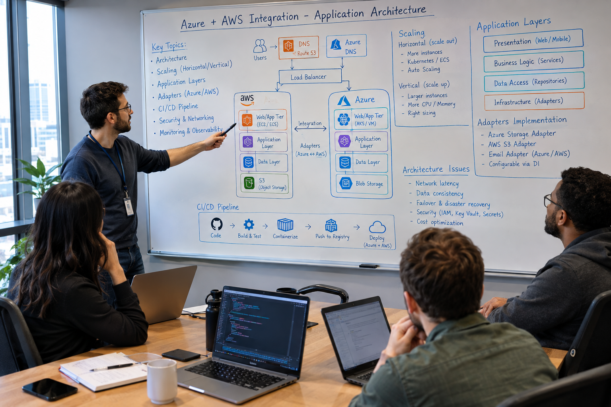
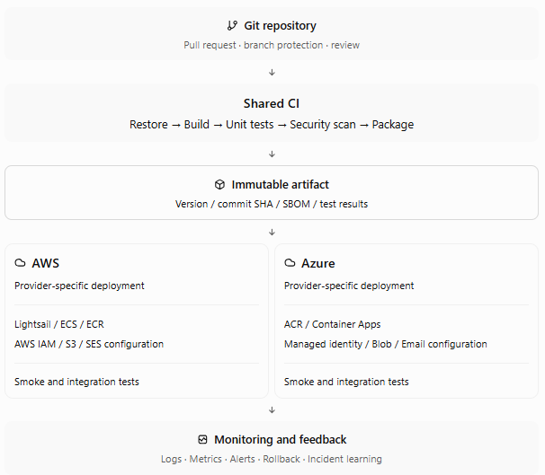
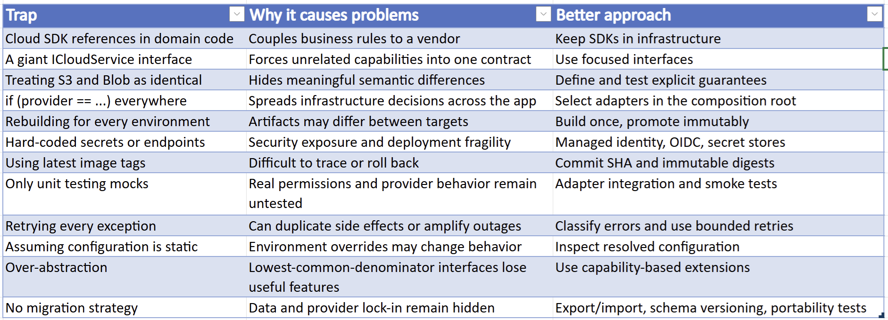
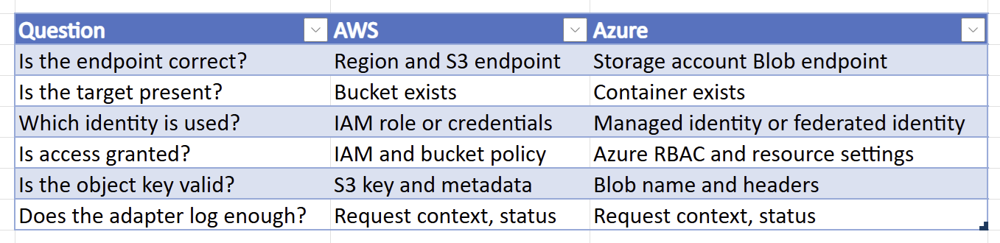

# Cloud-Agnostic Applications – Part 2: Design Considerations and Justification Why



_Some time ago, I wondered why containers, Docker, and Kubernetes are a bad idea._
_And now I am discussing cloud-agnostic applications and showing an example of packaging such a solution into a Docker container._
_Am I contradicting my earlier opinion?_

_Of course not. After all, right at the beginning of [that series of articles](https://www.linkedin.com/pulse/why-containers-docker-kubernetes-bad-idea-part-1-core-marek-kubis-zx4we),_
_I mentioned that containers work exceptionally well when cross-cloud portability is a real priority._
_And without a doubt, a cloud-agnostic application is one such case._

_Let us, then, add a few details to shed new light on what was previously said about the "how," and to make it easier to answer the question of "why" we act the way we do._


## CI/CD Pipeline for AWS and Azure

> [!NOTE]
> In Part 1 of this series, I presented a CI/CD pipeline that builds and deploys the same application artifact to both AWS and Azure.
> **What makes this a useful pipeline?** The example demonstrates how a pipeline can implement a shared build and test phase, followed by provider-specific deployment stages.

### One Source, Multiple Deployment Targets



### Best Practices

- **Build once**: Compile and package once; 
> [!IMPORTANT]
> 👉 **Why?** To promote the same artifact.
> Deploying the exact same version of an artifact prevents unexpected, and often baffling, changes in application behaviour during subsequent updates and improvements.

- **Version immutably**: Use commit SHA or an immutable image digest (cryptographic identifier representing the content of a Docker image) rather than latest.
> [!IMPORTANT]
> 👉 **Why?** To ensure that the production environment receives the secret through Secrets Manager/environment configuration.
> This matters because password storage isn't just a matter of choosing a hash algorithm. 
> A proper password-hashing scheme needs an appropriate work factor and a unique salt.
> We can implement this ourselves using: `SHA256(password + salt)` or `PasswordHasher<MyUser>`.
> The resulting value will look roughly like: `AQAAAAIAAYagAAAAE...`.

- **Separate credentials**: AWS and Azure deployment identities must have independent, least-privilege permissions.
> [!IMPORTANT]
> 👉 **Why?** To adhere to the principle of least privilege and limit the scope of the impact of a compromise of authentication credentials.

- **Use workload identity federation**: Prefer short-lived GitHub Actions OIDC credentials over long-lived cloud access keys.
> [!IMPORTANT]
> 👉 **Why?** To limit the risk of credential leakage and improve the security posture.

- **Validate configuration before deployment**: Fail early if required endpoints, sender identities, containers, or regions are missing.
> [!IMPORTANT]
> 👉 **Why?** To detect configuration errors at an early stage, preventing runtime failures and reducing debugging time.

- **Use environment approvals**: Production deployments should require appropriate review and authorisation.
> [!IMPORTANT]
> 👉 **Why?** To ensure that changes are verified and approved by the appropriate stakeholders, in order to prevent unauthorised or potentially harmful deployments.

- **Test the real adapters**: Unit tests do not prove that S3, Blob Storage, SES, or Azure Email permissions work.
> [!IMPORTANT]
> 👉 **Why?** To verify that the application can interact with actual cloud services as expected, ensuring that permissions and configurations are correct.

- **Support rollback**: Keep the previous working artifact and know how to restore the prior revision.
> [!IMPORTANT]
> 👉 **Why?** To enable quick recovery from failed deployments, minimizing downtime and impact on users.


### CI/CD Challenges and Solutions

> **≠ Challenge:** Works locally, fails in the cloud

- Differences in environment variables, permissions, operating system, networking, identity, or SDK configuration.
- **Solution:** Use environment parity, startup validation, deployment smoke tests, structured logs, and a reproducible container image.

> **⤵️ Challenge:** Authentication and authorization

- A valid identity may still lack access to a storage bucket, container, email resource, or registry.
- **Solution:** Treat identity, permissions, trust relationships, and resource policies as separate testable deployment concerns.

> **🔀 Challenge:** Provider differences

- S3 and Azure Blob Storage differ in metadata, consistency details, error codes, authentication, and conditional operations.
- **Solution:** Define a common minimum contract. Expose advanced capabilities through explicit optional interfaces or provider-specific application policies.

> **🧬 Challenge:** Retries and duplicate operations

- A network timeout can occur after a provider has completed an upload or email send.
- **Solution:** Use idempotency keys, deterministic object names, conditional writes, retry budgets, and an outbox pattern for important messages.

> **⛓ Challenge:** Divergent deployment pipelines

- AWS and Azure workflows may drift, use different variables, or deploy different application versions.
- **Solution:** Centralise shared build logic, use reusable workflows, and keep provider-specific deployment modules small and explicit.


## Advanced Design Considerations

### The Lowest Common Denominator Problem

An abstraction that only supports uploading and downloading files may be useful. But if the application needs:
- Object versioning
- Signed URLs
- Blob leases
- S3 multipart uploads
- Provider-specific queue semantics
- Advanced email delivery configuration

then forcing everything into one generic interface can make the design misleading.

> [!IMPORTANT]
> 👉 1. Use capability-oriented small interfaces that express the business capability, not the cloud product.
> 
> 👉 2. Only implementations that genuinely support versioning should implement `IObjectVersioning`.

```csharp
    public interface IObjectVersioning
    {
        Task<string?> GetVersionAsync(
            string key,
            CancellationToken cancellationToken = default);
    }
```

### DNS Problem

Regarding the DNS service, there is a significant difference between cloud service providers, particularly between AWS and Azure.

```
Capability                AWS                       Microsoft Azure
------------------------------------------------------------------------
Purchase/register domain  ✅ Yes, through          ❌ No
                             Route 53 Domains	
Transfer existing domain  ✅ Yes                   ❌ Not as a registrar
Manage DNS records        ✅ Route 53              ✅ Azure DNS
Host DNS zone             ✅ Route 53 Hosted Zone  ✅ Azure DNS Zone
Domain renewal            ✅ Yes, for domains      ❌ No
                             registered through 
                             Route 53	
DNSSEC                    ✅                       ✅
TLS certificates          ✅ AWS Certificate       ✅ Azure Key Vault / 
                             Manager                   App Service Managed 
                                                       Certificates etc.
```

> [!NOTE]
> So, **AWS offers both domain registration and DNS; Azure offers DNS but not domain registration.**

> [!IMPORTANT]
> For our cloud-agnostic application
> I would not make domain registration part of the application deployment architecture.
> I suggest treating these as separate issues; in that case, our application should simply use the DNS names obtained—for example, from **GoDaddy**.

```
                  DOMAIN OWNERSHIP
                         │
             ┌───────────┴───────────┐
             │                       │
       Domain Registrar          DNS Provider
             │                       │
       ┌─────┴─────┐           ┌─────┴─────┐
       │           │           │           │
      AWS       Third-party   AWS        Azure
    Route 53     registrar   Route 53   Azure DNS
```

> [!WARNING]
> ❗️ The application doesn't need to know whether the authoritative DNS is AWS Route 53 or Azure DNS or whatever. 
> It only needs to know the DNS name of the service.

### Deploy Service Dilemma 

Provider-specific deployment is a core concern. To solve it, we should take a few technical decisions, 
which is discussed in this articles, but also a business decision, which was not discussed yet.

That business decision focuses on the questions:
- What type of cloud-computing responsibility do we want to take? → On Premise | IaaS | PaaS | SaaS
- What deployment model do we want to use? → Public/Private cloud | Single/Multi cloud | Hybrid cloud
- Where are our customers? → What regions should we deploy to? 
- What Service Level Agreement (SLA) do we want to provide? → Should we deploy to multiple zones or multiple regions?
- What ability do we want to ensure a service remains highly available? → scalability and elasticity, failover, and redundancy?
- What fault-tolerance and disaster recovery strategy do we want to implement? → What is the RTO and RPO?
- Do we need advanced threat protection and security features? → Encryption, access control, monitoring, and auditing.

> [!IMPORTANT]
> 📌 The most important point is that implementation within a container service is a business decision, not a technical one.
> This decision significantly impacts both the project and the total cost of ownership (TCO); therefore, it must be made with due consideration.

> [!WARNING]
> ❗️ It is not a decision to be made lightly or without regard for the business consequences.
> Load balancing and hosted zones are brilliant technical solutions, but they are costly and require ongoing maintenance.

👉 **That gives us a genuinely cloud-agnostic arrangement:**
```
                   myapplication.com
                         │
                  External registrar
                         │
                    DNS delegation
                         │
              ┌──────────┴──────────┐
              │                     │
          AWS services          Azure services
              │                     │
          Route 53/S3/SES       DNS/Blob/Email
          Lightsail
```

### Manual Deployment Step 1 — Build a new Docker image

1. Check that Docker is running.
   `docker version`

2. Then go to the web project directory, if you aren't already there
   `cd <path/to/web/project>`

3. Check the Dockerfile is there
   `ls Dockerfile` | `dir Dockerfile`

4. Build a new Docker image locally.
   `docker build -t <myapplication>:<tag> .`

5. Verify the image.
   `docker images <myapplication>`

### Manual Deployment Step 2a — Push the image to Azure Container App

6. Push the image to the container service.
   ```powershell
     $tag = "<tag>"
     docker tag <myapplication>:latest <myapplication>.azurecr.io/<myapplication>:$tag
     docker push <myapplication>.azurecr.io/<myapplication>:$tag
   ```

7. Create a new deployment using that image.
   7.1 Then update the Azure Container App to use that image
   ```powershell
       az containerapp update `
         --name <myapplication> `
         --resource-group <myresourcegroup> `
         --image <myapplication>.azurecr.io/<myapplication>:$tag
   ```

### Manual Deployment Step 3a — Verify live site and container logs

8. Verify the deployment
   ```powershell
       az containerapp show `
         --name <myapplication> `
         --resource-group <myresourcegroup> `
         --query "properties.template.containers[0].properties.image" `
         --output tsv
   ```

   **Expected:** `<myapplication>.azurecr.io/<myapplication>:<tag>`

> [!IMPORTANT]
> 👉 Since **administrative access should be disabled** in our ACR registry and the container app uses a managed identity with the `AcrPull` permission, 
> the `az containerapp update` command does not require an ACR username or password.

9. Test the live website. Check the Application Insights logs.

> [!NOTE]
> Particularly no exceptions and look for:
> `Now listening on: http://[::]:8080`


### Manual Deployment Step 2b — Push the image to AWS Lightsail (sufficient for small applications)

6. Push the image to the container service.
   6.1. Make sure your AWS session is valid
   `aws sts get-caller-identity --profile <myapplication>`

   6.2 If not, log in to AWS ECR
   ` aws sso login --profile <myapplication>`

   6.3 Push the image to AWS ECR
    ```
   aws lightsail push-container-image `
    --service-name <myapplication> `
    --label <tag> `
    --image <myapplication>:<tag> `
    --region <region>`
    --profile <myapplication>
    ```

7. Create a new deployment using that image.
    7.1 Check the current Lightsail deployment configuration
    ```
    aws lightsail get-container-services `
        --service-name <myapplication> `
        --region <region> `
        --profile <myapplication> `
        --query "containerServices[0].currentDeployment" `
        --output json
    ```

    > [!NOTE]
    > **⁉ Why we're checking this first?** 
    > We don't want to accidentally create a deployment that only specifies the new image and loses something from the currently working deployment.

    7.2 Safely create a new deployment version
    ```
    aws lightsail create-container-service-deployment `
    --service-name <myapplication> `
    --region <region> `
    --profile <myapplication> `
    --containers '{
        "app": {
            "image": "<myapplication>:<tag>",
            "environment": {
                "ASPNETCORE_ENVIRONMENT": "Production",
                "ASPNETCORE_HTTP_PORTS": "8080"
            },
            "ports": {
                "8080": "HTTP"
            }
        }
    }' `
    --public-endpoint '{
        "containerName": "app",
        "containerPort": 8080,
        "healthCheck": {
            "healthyThreshold": 2,
            "unhealthyThreshold": 2,
            "timeoutSeconds": 2,
            "intervalSeconds": 5,
            "path": "/en",
            "successCodes": "200-399"
        }
    }'
    ```

    7.3 Knowing issue 1: PowerShell has stripped the JSON double quotes before passing the argument to AWS. 
       
       > [!IMPORTANT]
       > We can avoid that completely by putting the deployment configuration into a JSON file.

       - In your current directory create the deployment JSON file
       ```powershell
       @'
       {
          "app": {
            "image": ":<myapplication>.<tag>",
            "environment": {
              "ASPNETCORE_ENVIRONMENT": "Production",
              "ASPNETCORE_HTTP_PORTS": "8080"
            },
            "ports": {
              "8080": "HTTP"
            }
          }
        }
       '@ | Set-Content -Encoding utf8 containers.json
       ```

       - Then create the public endpoint configuration:
       ```powershell
       @'
       {
         "containerName": "app",
         "containerPort": 8080,
         "healthCheck": {
         "healthyThreshold": 2,
         "unhealthyThreshold": 2,
         "timeoutSeconds": 2,
         "intervalSeconds": 5,
         "path": "/en",
         "successCodes": "200-399"
         }
       }
       '@ | Set-Content -Encoding utf8 public-endpoint.json
       ```

       - Then create the deployment
       ```powershell
       aws lightsail create-container-service-deployment `
         --service-name <myapplication> `
         --region <region> `
         --profile <myapplication> `
         --containers file://containers.json `
         --public-endpoint file://public-endpoint.json
       ```

    7.4 Knowing issue 2: `Set-Content -Encoding utf8` has written a **UTF-8 BOM** (`EF BB BF`) at the beginning of the file: `{`

    - Recreate `containers.json` **without BOM**
    ```
    @'
    {
      "app": {
        "image": ":<myapplication>.<tag>",
        "environment": {
          "ASPNETCORE_ENVIRONMENT": "Production",
          "ASPNETCORE_HTTP_PORTS": "8080"
        },
        "ports": {
          "8080": "HTTP"
        }
      }
    }
    '@ | Set-Content -Encoding utf8NoBOM containers.json
    ```

    and:
    ```
    @'
    {
      "containerName": "app",
      "containerPort": 8080,
      "healthCheck": {
        "healthyThreshold": 2,
        "unhealthyThreshold": 2,
        "timeoutSeconds": 2,
        "intervalSeconds": 5,
        "path": "/en",
        "successCodes": "200-399"
      }
    }
    '@ | Set-Content -Encoding utf8NoBOM public-endpoint.json
    ```

    - Verify the first bytes
    ```powershell
    Format-Hex -Path containers.json | Select-Object -First 2
    ```

    > [!NOTE]
    > ❌ **That it must NOT start with** `EF BB BF`.

    - Create the deployment again
    ```powershell
    aws lightsail create-container-service-deployment `
        --service-name <myapplication> `
        --region <region> `
        --profile <myapplication> `
        --containers file://containers.json `
        --public-endpoint file://public-endpoint.json
    ```

    > [!IMPORTANT]
    > 👉 After running the command and successful creation, Lightsail will start deploying the new container. 

### Manual Deployment Step 3b — Verify live site and container logs

8. Monitor the deployment.

   ```
   aws lightsail get-container-services `
    --service-name <myapplication> `
    --region <region> `
    --profile <myapplication> `
    --query "containerServices[0].{State:state,DeploymentVersion:currentDeployment.version,Image:currentDeployment.containers.app.image,CreatedAt:currentDeployment.createdAt}" `
    --output table
   ```
 
   > [!IMPORTANT]
   > ❗️ **Don't test the website immediately** — first let's verify that the deployment reaches `ACTIVE`.

   - Wait for something like:
```
----------------------------------------------
|            GetContainerServices            |
+------------------+-------------------------+
| State            | ACTIVE                  |
| DeploymentVersion| 6                       |
| Image            | :<myapplication>.<tag>  |
| CreatedAt        | 2026-09-30...           |
+------------------+-------------------------+
```

9. Test the live website. Check the container logs

```powershell
aws lightsail get-container-log `
    --service-name <myapplication> `
    --container-name app `
    --region <region> `
    --profile <myapplication> `
    --start-time 2026-08-30T14:26:00+01:00
```

> [!NOTE]
> Particularly no exceptions and look for:
> `Now listening on: http://[::]:8080`

10. Confirm the new deployment is actually running.
```
Now listening on: http://[::]:8080
Application started.
Hosting environment: Production
[deployment:6] Reached a steady state
```

- Final deployment verification

```powershell
aws lightsail get-container-services `
    --service-name <myapplication> `
    --region <region> `
    --profile <myapplication> `
    --query "containerServices[0].{State:state,DeploymentVersion:currentDeployment.version,Image:currentDeployment.containers.app.image}" `
    --output table
```

- We want:
```
DeploymentVersion | 6
Image             | :<myapplication>.<tag>
State             | RUNNING
```


### Data portability

> [!IMPORTANT]
> 👉 Cloud-neutral code does not automatically make data portable.

Plan for:
- Portable document and image formats.
- Explicit schema and metadata versioning.
- Export/import tools.
- Provider-independent identifiers.
- Migration testing.
- Encryption key ownership and recovery.
- Backup and restore verification.

### Observability

Use common application telemetry fields:
- TraceId
- RequestId
- Provider
- Operation
- ResourceType
- DurationMs
- Success
- ErrorCategory

> [!NOTE]
> 📌 The provider adapter can add AWS request IDs or Azure request IDs as supplemental diagnostic information.

### Common traps




## Problem-Solving Methodology

### Step by Step Diagnostic Process

> [!NOTE]
> ⁉ If the deployment fails, there is no compelling reason to seek a complex, "magical" solution. 
> Let us simply apply a structured diagnostic process and avoid making multiple changes at once.

1. Observe the failure
> Capture timestamp, request ID, revision, provider, operation, exception type, and relevant status code.

2. Classify the failure
> Is it application logic, configuration, identity, permissions, networking, provider availability, or data?

3. Reproduce minimally
> Isolate the failing adapter or operation. Reproduce with the same identity and configuration where possible.

4. Check the effective environment
> Verify the deployed image, resolved provider, endpoints, region, resource names, identity, and permissions.

5. Apply the smallest corrective change
> Change one variable or one component. Record the hypothesis and expected result.

6. Verify and prevent recurrence
> Run the failing test, redeploy the immutable artifact, add a regression test, and update the runbook.

> [!WARNING]
> ❗️ Do not immediately assume that a `403` is an application bug. 
> First distinguish authentication, authorization, resource existence, network policy, and provider-specific restrictions.

### Example Diagnostic Matrix: Storage Upload Succeeds in One Cloud but Fails in Another




## Final Recommendation

### Cloud-Agnostic Practical Checklist

- ❌ ✅ Domain and application projects contain no cloud SDK references.
- ❌ ✅ Provider selection occurs in the composition root.
- ❌ ✅ Common interfaces describe capabilities rather than vendor products.
- ❌ ✅ AWS and Azure adapters have independent integration tests.
- ❌ ✅ Effective environment configuration is validated at startup.
- ❌ ✅ Credentials use workload identity or managed identity where possible.
- ❌ ✅ CI builds and tests a single immutable artifact.
- ❌ ✅ Deployment targets use environment-specific configuration, not source changes.
- ❌ ✅ Cloud resources and permissions are provisioned reproducibly.
- ❌ ✅ Retries, timeouts, cancellation, and idempotency are defined.
- ❌ ✅ Health checks and structured logging cover critical dependencies.
- ❌ ✅ Rollback and data migration procedures are tested.

> [!IMPORTANT]
> 📌 **Central principle:** 
> Build a cloud-independent application core, isolate provider-specific mechanisms behind explicit contracts, 
> and use a repeatable CI/CD process to deploy and verify the same artifact across cloud environments.


## See:
- [Cloud-agnostic applications – Part 1: How To Do](https://www.linkedin.com/pulse/cloud-agnostic-applications-part-1-how-do-marek-kubis-dt0xe/)

- [JavaScript Everywhere – Part 1: Applications for Highly Regulated Industries (e.g., for Lawyers)](https://lnkd.in/eswGJAFa)
- [JavaScript Everywhere – Part 2: Applications for Highly Regulated Industries - Compliance and Governance](https://lnkd.in/e34pbEH5)
- [JavaScript Everywhere – Part 3: Applications for Highly Regulated Industries - Auditability, Testing, CI/CD, Observability](https://lnkd.in/eD5pTKzN)
- [JavaScript Everywhere – Part 4: Applications for Highly Regulated Industries - AI-Assisted Software Development and AI Governance](https://lnkd.in/ez8-xJP4)

- [Availability vs Identity in Distributed C#/.NET Applications - Part 1: The Role of Availability and Identity](https://www.linkedin.com/pulse/availability-vs-identity-distributed-cnet-part-1-role-marek-kubis-xvpze/)
- [Availability vs Identity in Distributed C#/.NET Applications - Part 2: Lock-in on Use Cases and on Cloud](https://www.linkedin.com/pulse/availability-vs-identity-distributed-cnet-part-2-lock-in-kubis-zhmee/)

- [What is managed identities for Azure resources?](https://learn.microsoft.com/en-us/azure/active-directory/managed-identities-azure-resources/overview)
- [IAM Roles](https://docs.aws.amazon.com/IAM/latest/UserGuide/id_roles.html)
- [Authenticate to Google Cloud APIs from GKE workloads](https://cloud.google.com/kubernetes-engine/docs/how-to/workload-identity)
- [What is Azure role-based access control (Azure RBAC)?](https://learn.microsoft.com/en-us/azure/role-based-access-control/overview)

- [Once and Only Once with Examples - Part 1: Is It Obvious?](https://www.linkedin.com/pulse/once-only-examples-part-1-obvious-marek-kubis-nyebe/)
- [Once and Only Once with Examples - Part 2: And AI-generated Code](https://www.linkedin.com/pulse/once-only-examples-part-2-ai-generated-code-marek-kubis-kn9ie/)
- [Once and Only Once with Examples - Part 3: Where Duplication Is Simultaneously Necessary](https://www.linkedin.com/pulse/once-only-examples-part-3-where-duplication-necessary-marek-kubis-vpxce/)

- [Mutation testing - Part 1: is it outdated?](https://lnkd.in/eDbVukCf)
- [Mutation testing - Part 2: Turn into a production-ready tool](https://lnkd.in/eSx9b6pB)
- [Mutation testing - Part 3: Mutation testing limits and how to go beyond it](https://lnkd.in/e3qsTXBy)
- [Mutation testing - Part 4: mutation testing and LLM-written code](https://lnkd.in/eKfvJfbp)

- [Underestimated and Annoying, or the "Dirty Dozen" of Programmers - Part 1: The Problem Space](https://www.linkedin.com/pulse/underestimated-annoying-dirty-dozen-programmers-marek-kubis-mcfxe)
- [Underestimated and Annoying, that is "The Dirty Dozen" of Programmers - Part 2: AI-Generated Software](https://www.linkedin.com/pulse/underestimated-annoying-dirty-dozen-programmers-part-2-marek-kubis-tqkme/)
- [Underestimated and Annoying, that is "The Dirty Dozen" of Programmers - Part 3: I. Organizational Problems](https://www.linkedin.com/pulse/underestimated-annoying-dirty-dozen-programmers-part-marek-kubis-h9y3e/)
- [Underestimated and Annoying, that is "The Dirty Dozen" of Programmers - Part 4: II. Human Problems](https://www.linkedin.com/pulse/underestimated-annoying-dirty-dozen-programmers-part-marek-kubis-mn5ve/)
- [Underestimated and Annoying, that is "The Dirty Dozen" of Programmers - Part 5: III. Process Problems](https://www.linkedin.com/pulse/underestimated-annoying-dirty-dozen-vibe-coding-part-marek-kubis-83jre/)
- [Underestimated and Annoying, that is "The Dirty Dozen" of Programmers - Part 6: IV. Architecture Problems](https://www.linkedin.com/pulse/underestimated-annoying-dirty-dozen-programmers-part-marek-kubis-remze/)
- [Underestimated and Annoying, that is "The Dirty Dozen" of Programmers - Part 7: V. Validation Problems](https://www.linkedin.com/pulse/underestimated-annoying-dirty-dozen-programmers-part-marek-kubis-dqk2e/)
- [Underestimated and Annoying, that is "The Dirty Dozen" of Programmers - Part 8: VI. Economic Problems](https://www.linkedin.com/pulse/underestimated-annoying-dirty-dozen-programmers-part-marek-kubis-7bb6e/)

- [Murphy’s law and more in AI time - one by one with examples](https://www.linkedin.com/pulse/murphys-law-more-ai-time-one-examples-marek-kubis-fkaze)
- [The Agile Vibe Coding and Conway's Law](https://www.linkedin.com/pulse/agile-vibe-coding-conways-law-marek-kubis-m0wpe)
- [Using a digital banking solution to prove Conway’s Law in AI-Driven engineering - example 1](https://www.linkedin.com/pulse/using-digital-banking-solution-prove-conways-law-ai-driven-kubis-xqlre/)
- [Using a .NET 10 migration project to prove Conway’s Law in AI-Driven engineering - example 2](https://www.linkedin.com/pulse/using-net-10-migration-project-prove-conways-law-ai-driven-kubis-abqae)

- [Where traditional Agile breaks in AI-driven systems](https://www.linkedin.com/pulse/where-traditional-agile-breaks-ai-driven-systems-marek-kubis-4wq6e/)
- [AI - It seems nobody has it fully figured out yet](https://www.linkedin.com/pulse/ai-nobody-has-figured-out-marek-kubis-bkyge)
- [Internal Development Platform and Agile Vibe Coding](https://www.linkedin.com/pulse/internal-development-platform-agile-vibe-coding-marek-kubis-kyhqe/?trackingId=5w3lWKp%2F0BLUpwNdrSmAcg%3D%3D&lipi=urn%3Ali%3Apage%3Ad_flagship3_pulse_read%3BqH%2FwqbkZRkmo%2Fagtxvqyrw%3D%3D)
- [Everyone will be vibe coders](https://www.linkedin.com/pulse/everyone-vibe-coders-marek-kubis-tlgze)
- [The Structural problems AI introduces into the SDLC](https://www.linkedin.com/pulse/structural-problems-ai-introduces-sdlc-marek-kubis-qyt6e)
- [Signals That Reveal the True Maturity of Organisations Claiming “AI-Driven Development”](https://www.linkedin.com/pulse/signals-reveal-true-maturity-organisations-claiming-ai-driven-kubis-urule)

- [Agile Vibe Coding positioning and if this works, what changes?](https://www.linkedin.com/pulse/agile-vibe-coding-positioning-works-what-changes-marek-kubis-r4ate)
- [Agile Vibe Coding – Ceremony Modes](https://www.linkedin.com/pulse/agile-vibe-coding-ceremony-modes-marek-kubis-meq9e)
- [Agile Vibe Coding ceremonies approach compared to a simple one-prompt-per-task approach](https://www.linkedin.com/pulse/agile-vibe-coding-ceremonies-approach-compared-simple-marek-kubis-ecx5e)
- [Agile Vibe Coding Maturity Model](https://www.linkedin.com/pulse/agile-vibe-coding-maturity-model-marek-kubis-bbtqe)
- [The Agile Vibe Coding - the 4-level adaptive ceremony system](https://www.linkedin.com/pulse/agile-vibe-coding-4-level-adaptive-ceremony-system-marek-kubis-jizke)

- [Agile Vibe Coding Manifesto](https://agilevibecoding.org/)
- [Principles Behind the Agile Vibe Coding Manifesto - extended version](https://github.com/marekartur-dev/agilevibecoding/blob/main/Docs/Home/Principles.md)

- [Agile Vibe Coding](https://www.reddit.com/r/AgileVibeCoding/)
- [Marek Kubis - blog](https://github.com/marekartur-dev/agilevibecoding/tree/main)