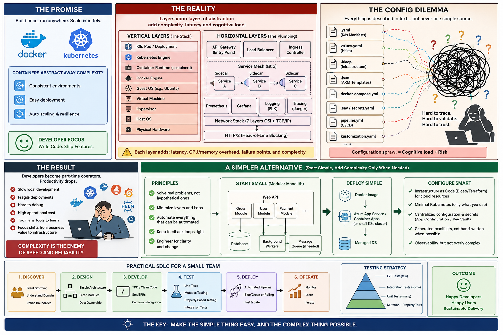

# Why containers, Docker and Kubernetes are a bad idea? - Part 1: The core problem of architecture patterns



_Containers, Docker, and Kubernetes solved real problems — but they also introduced an enormous amount of accidental complexity into software engineering. The industry often adopted them as defaults rather than tools._

## PROS

Containers and Kubernetes are excellent when we truly need:
- massive scale
- multi-region orchestration
- self-healing infrastructure
- multi-tenant isolation
- elastic workloads
- heterogeneous runtime environments
- rapid ephemeral deployments
- cloud portability

> [!NOTE]
> Kubernetes/microservices usually emerge from organisational communication structures, not technical necessity.

For companies operating at:
- Netflix scale
- Uber scale
- Spotify scale

they are rational. 

But many organisations **adopted** Facebook|Amazon|Apple|Netflix|Google, **FAANG infrastructure patterns without FAANG problems**.

> [!IMPORTANT]
> They are not “bad” universally. They are bad **when the operational cost exceeds the business value**.
> 
> Complex infrastructure increases fixed operational costs and raises the minimum engineering maturity required to safely deliver software.


## CONS

### 1. Massive Complexity Explosion

**A simple application became a distributed platform.**
<pre><code>
 -------------------------------- 
| Before:  | After:              |
|----------|---------------------|
| app  	   | container runtime	 |
| database | image registry      |
| server   | orchestrator        |
|          | overlay networking  |
|          | ingress controllers |
|          | service mesh        |
|          | Helm                |
|          | operators           |
|          | CI/CD pipelines     |
|          | secrets management  |
|          | observability stack |
|          | autoscaling         |
|          | YAML everywhere     |
 -------------------------------- 
</code></pre>
A developer who once needed:
<pre><code>
 -------------------------------- 
| Before:  | After:              |
|----------|---------------------|
| C#  	   | Docker              |
| SQL      | Kubernetes          |
| Linux    | networking          |
|          | TLS                 |
|          | DNS                 |
|          | distributed systems |
|          | cloud IAM           |
|          | Helm templating     |
|          | Prometheus          |
|          | Grafana             |
|          | GitOps              |
|          | security policies   |
 -------------------------------- 
</code></pre>

> The cognitive load is enormous.

### 2. Kubernetes behaves like a distributed control plane — not an app runtime

- Many teams think: **Kubernetes is “a deployment tool”**.
- It is actually: **“a distributed operating system”**.

And distributed systems are notoriously difficult:
- partial failures
- retries
- eventual consistency
- split brain
- network partitions
- cascading failures

> Most companies **do not need the diversity of distributed systems**.

Running Kubernetes often means:
- operating a miniature cloud provider
- without cloud-provider-level expertise

### 3. YAML-Driven Development Is Fragile

> Kubernetes replaced programming complicacy with configuration complicacy.

Application with Kubernetes requires additional debugging YAML syntax errors:
- indentation
- manifests
- Helm templates
- environment mismatches
- CRDs
- RBAC policies
- sidecars
- ingress rules

The system becomes **configuration-centric rather than software-centric**.

This also has consequences and **a typo can silently break production version** because: 
- our application is so fragile that even a tiny mistake — a single wrong character — can cause a production outage; 
  Especially if developer is not an expert in Kubernetes and YAML and added too much logic in configuration,
- such solution has **no compile-time guarantees** - can compile but behaves incorrectly,
- magic strings everywhere — no type safety, no refactoring support, no validation and typo silently breaks authentication,
- if our app doesn’t validate: config, environment variables, external dependencies, message schemas …then a typo slips through and explodes at runtime.

### 4. Hidden Infrastructure Costs

> Containers are advertised as “efficient.”

Reality in many enterprises:
- overprovisioned clusters
- idle pods
- duplicated services
- unnecessary microservices
- monitoring overhead
- network overhead.

Many Kubernetes clusters run at shockingly poor utilization.

A monolith on one VM can outperform:
- dozens of microservices
- spread across nodes
- communicating over the network.

### 5. Microservices Became a Cargo Cult

Containers enabled microservices. Microservices enabled:
- distributed monoliths
- RPC spaghetti
- debugging nightmares
- observability crises

Instead of: `function call`, now we have:
```
	HTTP + JSON + retries + auth + TLS + tracing + queues
```
for communication between components that used to live in the same process.

> The latency and failure surface exploded.

### 6. Local Development Became Worse

Developers used to:
```bash
	dotnet run
```
Now:
```bash
	docker compose up
	kubectl apply
	helm install
```

And then:
- wait for containers
- rebuild images
- troubleshoot networking
- fight volume mounts
- deal with ARM/x64 differences

> Developer productivity often drops dramatically. Especially for small teams.

### 7. Observability Became Mandatory

Monolith debugging `stack trace`.

Kubernetes debugging:
- distributed tracing
- centralised logging
- metrics correlation
- container logs
- pod restarts
- sidecar failures
- ephemeral instances

> [!IMPORTANT]
> Without a full observability platform **production diagnosis becomes nearly impossible**.

So, Kubernetes creates:
- more tooling
- more cost
- more specialists.

### 8. Security Surface Area Exploded

Containers added:
- image vulnerabilities
- supply-chain attacks
- registry security
- container escapes
- privilege escalation
- secrets sprawl

Kubernetes added:
- RBAC intricacy
- API server exposure
- admission controllers
- misconfigured ingress
- service-account abuse

> [!WARNING]
> Many teams are less secure after adopting Kubernetes because **they cannot operate it safely**.

### 9. DevOps Turned Developers Into Infrastructure Engineers

A backend developer now often needs knowledge of:
- Linux internals
- networking
- cloud infrastructure
- CI/CD
- IaC
- Kubernetes
- observability
- security.

This created:
- burnout
- role overload
- dilution of engineering focus.

> [!NOTE]
> So, if companies do not change their operating model on `Infrastructure Team + Business Services Teams` 
> then existing `DEV teams`, instead of building business value, maintain infrastructure ecosystems.	

### 10. Most Systems Do Not Need Kubernetes

**This is the biggest point.**

Many applications:
- are internal
- have moderate traffic
- scale vertically
- could run on:
	- a VM
	- App Service
	- ECS
	- Heroku-like platforms
	- plain Docker
	- even IIS

> Kubernetes often solves: problems companies hope to have someday.

**Premature scalability architecture is expensive**.

### 11. Containers can introduce measurable overhead in latency-sensitive systems

Containers introduce:
- overlay networking
- filesystem layers
- cgroup overhead
- orchestration latency
- service mesh overhead

For high-performance systems:
- HFT
- low-latency systems
- real-time systems
- HPC

containers can become counterproductive.

This aligns with your interest in mechanical sympathy because **abstraction layers hide hardware realities**.


### 12. Platform Engineering Teams Became Necessary

Kubernetes often requires dedicated teams:
- SRE
- DevOps
- platform engineering
- cloud governance

Small companies suddenly need:
- internal cloud platforms
- IDPs
- GitOps tooling
- cluster governance

Infrastructure became an entire product.

### 13. Failure Modes Became Extremely Hard to Understand

Example:
- pod healthy
- service unhealthy
- ingress misconfigured
- DNS stale
- readiness probe failing
- autoscaler oscillating
- sidecar crashing
- node pressure eviction

> [!NOTE]
> Application code may be fine. But the platform fails. This creates **operational opacity**.

### 14. The Industry Confused Scalability with Good Architecture

A properly designed monolith can:
- scale
- evolve
- deploy safely
- remain maintainable

Companies like GitHub, Shopify, and Basecamp have all discussed the value of modular monoliths at various points.

> [!NOTE]
> Microservices are not inherently superior.

```
As described by Conway’s Law, system architecture often mirrors communication structures inside organisations.

Microservices can therefore become a coordination strategy for large organisations rather than a purely technical optimisation.
```

### 15. Docker/Kubernetes Optimised for Cloud Providers

An uncomfortable truth, Kubernetes benefits:
- cloud vendors
- platform vendors
- consulting ecosystems

more than many engineering teams.

Why? Because it:
- increases infrastructure consumption
- increases operational dependency
- creates demand for managed services.

**The ecosystem became economically self-reinforcing.**

Additionally, modern platform-engineering theory emphasizes ___Team Topologies___.
Team Topologies introduces four essential team types—stream-aligned, enabling, complicated subsystem, and platform teams. 
Each has a defined purpose in helping organisations achieve “fast flow” of change from idea to production. 


## Take aways

Since its publication in 2019, "Team Topologies" has become a key reference point in the DevOps, platform engineering, and agile transformation communities.
The vocabulary of this publication — such as "stream-oriented team" and "team cognitive load" — is now widely used in discussions about organisational design.

Many enterprises are adopting this framework, along with concepts from Accelerate and The DevOps Handbook, to ensure continuous improvement in software delivery.

Recently, there has also been a trend toward moving away from microservices and toward the monolith.

One example is AmazonPrime Video, which is one of the world’s largest streaming services, serving millions of customers worldwide. 
AWS claims that the switch from a distributed microservice architecture to a monolithic application helps achieve greater scale, resilience and lower costs.

> [!NOTE]
> But it is worth noting that this trend is also an admission by companies that they made mistakes in the selection and/or implementation of architecture.

The five main reasons that switch back to monolith are: 
- cost, 
- complexity, 
- scalability, 
- performance, 
- organization.

_.. tbc_..

## See also:
- [Why containers, Docker and Kubernetes are a bad idea? - Part 2: When Containers and Kubernetes Become Architectural Debt](./Containers_K8s_Part_2.md)
- [Why containers, Docker and Kubernetes are a bad idea? - Part 3: The strangest outcomes of modern infrastructure engineering](./Containers_K8s_Part_3.md)
- [Why containers, Docker and Kubernetes are a bad idea? - Part 4: A Practical Small-Team Architecture](./Containers_K8s_Part_4.md)
- [Why containers, Docker and Kubernetes are a bad idea? - Part 5: Practical Engineering and Architecture Decision Framework](./Containers_K8s_Part_5.md)
- [Why containers, Docker and Kubernetes are a bad idea? - Part 6: Kubernetes Costs and When Kubernetes Is Justified](./Containers_K8s_Part_6.md)

- [Is there a need to change the way software is developed today?](https://www.linkedin.com/pulse/need-change-way-software-developed-today-marek-kubis-dntie)
- [Is there a need to change the way software is developed today? - Continuation](https://www.linkedin.com/pulse/need-change-way-software-developed-today-continuation-marek-kubis-uytye)
- [Deterministic Developers in a Non-Deterministic World](https://www.linkedin.com/pulse/deterministic-developers-non-deterministic-world-marek-kubis-fstte)
- [Down the rabbit holes of AI-based software development process ](https://www.linkedin.com/pulse/down-rabbit-holes-ai-based-software-development-process-marek-kubis-fsyue)
- [This Isn’t Rebranding. It’s a Structural Shift in Software Development](https://www.linkedin.com/pulse/isnt-rebranding-its-structural-shift-software-marek-kubis-sanpe)

- [Mutation testing - Part 1: is it outdated?](https://www.linkedin.com/pulse/mutation-testing-part-1-why-works-all-marek-kubis-rkdde/)
- [Mutation testing - Part 2: Turn into a production-ready tool](https://www.linkedin.com/pulse/mutation-testing-part-2-turn-production-ready-tool-marek-kubis-qymbe/)
- [Mutation testing - Part 3: Mutation testing limits and how to go beyond it](https://www.linkedin.com/pulse/mutation-testing-part-3-limits-how-go-beyond-marek-kubis-taeue/)
- [Mutation testing - Part 4: mutation testing and LLM-written code](https://www.linkedin.com/pulse/mutation-testing-part-4-llm-written-code-marek-kubis-pjpne/)

- [Kafka & Service Bus — Part 1: Two Philosophies of Event-Driven Systems](https://lnkd.in/eiE5dcVp)
- [Kafka & Service Bus — Part 2: In Business Solutions: Real-world Architectures](https://lnkd.in/eAg_R5SZ)
- [Kafka & Service Bus — Part 3: Technical Comparison](https://lnkd.in/eBKcczQF)

- [Murphy’s law and more in AI time - one by one with examples](https://www.linkedin.com/pulse/murphys-law-more-ai-time-one-examples-marek-kubis-fkaze)
- [The Agile Vibe Coding and Conway's Law](https://www.linkedin.com/pulse/agile-vibe-coding-conways-law-marek-kubis-m0wpe)
- [Using a digital banking solution to prove Conway’s Law in AI-Driven engineering - example 1](https://www.linkedin.com/pulse/using-digital-banking-solution-prove-conways-law-ai-driven-kubis-xqlre/)
- [Using a .NET 10 migration project to prove Conway’s Law in AI-Driven engineering - example 2](https://www.linkedin.com/pulse/using-net-10-migration-project-prove-conways-law-ai-driven-kubis-abqae)

- [Where traditional Agile breaks in AI-driven systems](https://www.linkedin.com/pulse/where-traditional-agile-breaks-ai-driven-systems-marek-kubis-4wq6e/)
- [AI - It seems nobody has it fully figured out yet](https://www.linkedin.com/pulse/ai-nobody-has-figured-out-marek-kubis-bkyge)
- [Internal Development Platform and Agile Vibe Coding](https://www.linkedin.com/pulse/internal-development-platform-agile-vibe-coding-marek-kubis-kyhqe/?trackingId=5w3lWKp%2F0BLUpwNdrSmAcg%3D%3D&lipi=urn%3Ali%3Apage%3Ad_flagship3_pulse_read%3BqH%2FwqbkZRkmo%2Fagtxvqyrw%3D%3D)
- [Everyone will be vibe coders](https://www.linkedin.com/pulse/everyone-vibe-coders-marek-kubis-tlgze)
- [The Structural problems AI introduces into the SDLC](https://www.linkedin.com/pulse/structural-problems-ai-introduces-sdlc-marek-kubis-qyt6e)
- [Signals That Reveal the True Maturity of Organisations Claiming “AI-Driven Development”](https://www.linkedin.com/pulse/signals-reveal-true-maturity-organisations-claiming-ai-driven-kubis-urule)
- [AI - It seems nobody has it fully figured out yet](https://www.linkedin.com/pulse/ai-nobody-has-figured-out-marek-kubis-bkyge)

- [Agile Vibe Coding positioning and if this works, what changes?](https://www.linkedin.com/pulse/agile-vibe-coding-positioning-works-what-changes-marek-kubis-r4ate)
- [Agile Vibe Coding – Ceremony Modes](https://www.linkedin.com/pulse/agile-vibe-coding-ceremony-modes-marek-kubis-meq9e)
- [Agile Vibe Coding ceremonies approach compared to a simple one-prompt-per-task approach](https://www.linkedin.com/pulse/agile-vibe-coding-ceremonies-approach-compared-simple-marek-kubis-ecx5e)
- [Agile Vibe Coding Maturity Model](https://www.linkedin.com/pulse/agile-vibe-coding-maturity-model-marek-kubis-bbtqe)
- [The Agile Vibe Coding - the 4-level adaptive ceremony system](https://www.linkedin.com/pulse/agile-vibe-coding-4-level-adaptive-ceremony-system-marek-kubis-jizke)

- [Agile Vibe Coding Manifesto](https://agilevibecoding.org/)
- [Principles Behind the Agile Vibe Coding Manifesto - extended version](https://github.com/marekartur-dev/agilevibecoding/blob/main/Docs/Home/Principles.md)

- [Agile Vibe Coding](https://www.reddit.com/r/AgileVibeCoding/)
- [Marek Kubis - blog](https://github.com/marekartur-dev/agilevibecoding/tree/main)