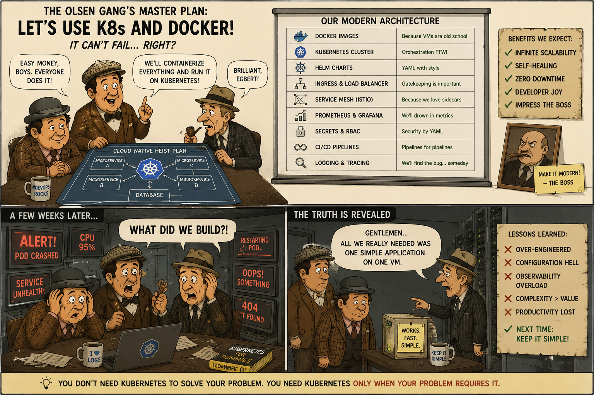

# Why containers, Docker and Kubernetes are a bad idea? - Part 2: When Containers and Kubernetes Become Architectural Debt



_In Part 1, we discussed uncomfortable truths about containers, Docker, and Kubernetes. Now, in Part 2, let's ask ourselves more questions about when these technologies become architectural debt._

The industry is slowly correcting itself:
- modular monoliths
- platform simplification
- serverless
- managed PaaS
- internal developer platforms
- reducing Kubernetes exposure
- “less YAML”
- simpler deployment models.

## Facts Exposed

> [!NOTE]
> Containers do not provide linear performance scalability automatically, especially once orchestration, networking, and distributed coordination overhead are included. 

- A Container uses a significant overhead to exist / orchestrate. 
- A Layer adds delays per request and kills Throughput; Total Requests / sec., so Containers make a bloated-Formation due to a multiple abstraction layers of disparate, inter-dependent, high operational expansion Horizontal- / Vertical- Layers; 
 
A) Vertical Layers: K8 pods on K8-engine, Docker Container/s on DockerEngine wrapping an OS Process from Guest OS on Virtual Machine on Hypervisor on Host OS on Real Hardware, along with extra layers (of "patterns, like) Saga and Circuit Breaker. 

B) Horizontal Layers: Istio, Promethius, Grafana, Load Balancer, API-Gateway as a "Single Entry-point"; 
   a bottleneck which introduces measurable latency of "Distributed Architecture", 
   a along with 7-layers of OSI based Network Layers (HTTP2 "with HoL Block" issue) around each Container, merely to pass data to a peer Container, even if it run on the same machine. 
	
> Above critique is not irrational. It is actually a very important systems-engineering perspective.

A lot of modern cloud-native architecture does trade:
- raw efficiency
- locality
- determinism
- simplicity

for:
- elasticity
- operability
- fault isolation
- deployment independence
- organisational scalability

> [!IMPORTANT]
> The mistake many people make is assuming **“cloud-native abstractions are free”**.

They are not.

They are a massive tax.

> [!IMPORTANT]
> The real question is **when is the tax worth paying?**


## Question 1: When does the “slow image copying mechanism” matter?

Mostly:
- startup time
- cold-start latency
- deployment churn
- autoscaling responsiveness
- CI/CD speed
- node recovery.

> Important nuance: **Containers are not VMs.**

A Docker container is usually:
- a Linux process
- with namespaces + cgroups
- using layered filesystems.

The “image-copying” criticism mainly refers to:
- OverlayFS
- AUFS
- layered copy-on-write filesystems
- image pulls from registries

This impacts:
- pod startup
- image extraction
- filesystem performance
- write amplification

### When it matters a lot

1) High-churn systems

If pods constantly restart:
- autoscaling
- spot-node recovery
- CI environments

then image pull/startup time matters greatly.

2) Serverless/container cold starts

Especially:
- huge container images
- Java/.NET warmup
- large dependency trees

> Cold starts become painful.

3) High-performance IO systems

Overlay filesystems are slower than:
- direct ext4/xfs access
- raw host filesystem access

This matters in:
- databases
- logging systems
- HPC
- analytics engines

### When it barely matters

For long-running stateless APIs:
- startup happens rarely
- request processing dominates runtime

Then the image-copying overhead is often negligible.


## Question 2: Do layers really add latency and reduce throughput?

**Yes. Absolutely. This is physics.**

Every layer introduces:
- context switches
- memory overhead
- serialization
- buffering
- copies
- scheduling
- network hops
- TLS handshakes
- queueing delays.

> The question is **how much?**

Typical latency stack

A monolith call `function()` - nanoseconds.

Microservice call:
```
	JSON serialize
	TCP
	HTTP
	TLS
	sidecar
	proxy
	service mesh
	load balancer
	deserialization
```
- milliseconds.

> Often several orders of magnitude slower for communication itself.

Throughput impact is real

Each layer consumes:
- CPU
- memory
- cache locality
- bandwidth

Especially harmful:
- service mesh sidecars
- excessive JSON
- chatty microservices
- synchronous HTTP chains

But **this does NOT automatically mean “bad”**.  We are trading _efficiency_ for:
- isolation
- deployability
- resilience
- team independence.

> [!NOTE]
> Sometimes this trade is rational.

## Question 3: Do horizontal and vertical layers have to be high operational overhead layers?

**No.** This is where many organisations fail.

### Thin-stack architecture exists

We can run:
- a small number of services
- minimal observability
- no service mesh
- no Istio
- direct gRPC
- host networking
- lightweight orchestration

Example:
- plain Docker
- Nomad
- ECS
- systemd
- even supervised processes

without 40 infrastructure products.

### The real issue is “architecture inflation”

Organisations accumulate:
- tools
- abstractions
- frameworks
- “best practices”

until **the platform becomes more complex than the business domain**.


## Question 4: Are vertical layers and patterns like Saga/Circuit Breaker wrong?

**No.** But they are often misapplied.

This is a crucial distinction.

### A Saga is not free

Saga introduces:
- eventual consistency
- retries
- compensation logic
- message ordering issues
- idempotency requirements

> [!NOTE]
> We should only use Saga when **distributed transactions are unavoidable**

Many systems could simply:
- use a monolith
- use a single database transaction

instead.

### Circuit Breakers are also not free

They:
- add intricacy
- create new failure modes
- may hide deeper issues

If our architecture needs:
- 17 circuit breakers
- retry storms
- bulkheads everywhere

then **the architecture itself may be the problem**.

### Patterns are not evil

- Patterns are **tools for specific failure modes**.
- The problem is **pattern-driven architecture**.


## Question 5: Are Istio, Prometheus, Grafana, API Gateways can become architectural bottlenecks?

**No**. But they are often:
- overused
-prematurely adopted
- badly operated

### Istio

Istio extends Kubernetes to establish a programmable, application-aware network and is excellent for:
- multi-tenant platforms
- zero-trust networking
- advanced traffic policies

Istio is terrible for:
- small teams
- simple systems
- latency-sensitive workloads

Istio can significantly increase:
- memory usage
- CPU usage
- latency
- operational intricacy.

> Our criticism here is technically justified.

### Prometheus/Grafana

These are actually among the least problematic layers.

Observability is necessary once systems become distributed.

> Without observability **distributed systems become opaque**.


### API Gateway

Not inherently evil. But:
- central bottlenecks
- over-centralized auth
- massive routing layers
- costly to operate at scale

can become architectural choke points.

### “Single entry point” criticism

Valid concern.

But gateways exist because:
- security
- auth
- rate limiting
- TLS termination
- routing

must exist somewhere.

## Question 6: Does the network stack undermine distributed architecture?	

_This is one of the strongest criticisms of microservices._

Yes:
- remote calls are expensive
- network stacks are expensive
- serialization is expensive
- same-machine HTTP is absurdly inefficient compared to in-process calls

> “The network is the computer” was only partially true

Distributed systems advocates often underestimated:
- latency
- packet loss
- queueing
- coordination cost

> The famous fallacies of distributed computing exist for a reason.

### HTTP/2 and HoL blocking

Our point is technically valid.

Although HTTP/2 improved multiplexing, TCP-level head-of-line blocking still exists.

Modern systems increasingly use:
- QUIC
- HTTP/3
- gRPC
- kernel bypass
- eBPF optimizations

to reduce these costs.

> Same-machine container communication is especially ironic

Two containers on the same host may communicate through:
- virtual NICs
- iptables
- proxies
- overlays
- TLS
- service meshes

instead of: _shared memory_ or: _function call_. 

> From a pure performance perspective **this is obviously inefficient**.


## Question 7: What’s the alternative?

This is the most important question.

**There is no single alternative.**

The correct architecture depends on:
- scale
- team size
- latency requirements
- deployment frequency
- fault tolerance needs
- organisational structure

### Alternative 1: Modular Monolith

This is increasingly popular again. Characteristics:
- one deployable unit
- clear internal boundaries
- modules
- strong architecture
- no network calls internally

Advantages:
- simpler debugging
- vastly better performance
- transactional consistency
- lower operational overhead

> [!NOTE]
> For many businesses **this is the optimal architecture**.

### Alternative 2: “Macroservices”

Instead of 500 microservices use 5–20 larger services.

This reduces:
- network chatter
- coordination complication
- observability chaos

while retaining some deployment independence.

### Alternative 3: Simpler Orchestration

Instead of Kubernetes:
- Docker Compose
- ECS
- Nomad
- systemd
- Azure App Service
- PaaS platforms.

> [!NOTE]
> We lose _some elasticity_ but gain ___sanity___.

### Alternative 4: Performance-Oriented Architecture

For latency-sensitive systems:
- shared memory
- actor systems
- colocated services
- binary protocols
- fewer hops
- fewer abstractions.

Examples:
- trading systems
- game engines
- telecom systems.

These often reject heavy cloud-native stacks.

### Alternative 5: Hybrid Architecture

Very common in mature companies:
- monolith core
- a few distributed edge services
- queues only where necessary
- containers only where useful.

> [!NOTE]
> This is often the pragmatic sweet spot.

_.. tbc_..

## See also:
- [Why containers, Docker and Kubernetes are a bad idea? - Part 1: The core problem of architecture patterns](./Containers_K8s_Part_1.md)
- [Why containers, Docker and Kubernetes are a bad idea? - Part 3: The strangest outcomes of modern infrastructure engineering](./Containers_K8s_Part_3.md)
- [Why containers, Docker and Kubernetes are a bad idea? - Part 4: A Practical Small-Team Architecture](./Containers_K8s_Part_4.md)

- [Is there a need to change the way software is developed today?](https://www.linkedin.com/pulse/need-change-way-software-developed-today-marek-kubis-dntie)
- [Is there a need to change the way software is developed today? - Continuation](https://www.linkedin.com/pulse/need-change-way-software-developed-today-continuation-marek-kubis-uytye)
- [Deterministic Developers in a Non-Deterministic World](https://www.linkedin.com/pulse/deterministic-developers-non-deterministic-world-marek-kubis-fstte)
- [Down the rabbit holes of AI-based software development process ](https://www.linkedin.com/pulse/down-rabbit-holes-ai-based-software-development-process-marek-kubis-fsyue)
- [This Isn’t Rebranding. It’s a Structural Shift in Software Development](https://www.linkedin.com/pulse/isnt-rebranding-its-structural-shift-software-marek-kubis-sanpe)

- [Mutation testing - Part 1: is it outdated?](https://www.linkedin.com/pulse/mutation-testing-part-1-why-works-all-marek-kubis-rkdde/)
- [Mutation testing - Part 2: Turn into a production-ready tool](https://www.linkedin.com/pulse/mutation-testing-part-2-turn-production-ready-tool-marek-kubis-qymbe/)
- [Mutation testing - Part 3: Mutation testing limits and how to go beyond it](https://www.linkedin.com/pulse/mutation-testing-part-3-limits-how-go-beyond-marek-kubis-taeue/)
- [Mutation testing - Part 4: mutation testing and LLM-written code](https://www.linkedin.com/pulse/mutation-testing-part-4-llm-written-code-marek-kubis-pjpne/)

- [Kafka & Service Bus — Part 1: Two Philosophies of Event-Driven Systems](https://lnkd.in/eiE5dcVp)
- [Kafka & Service Bus — Part 2: In Business Solutions: Real-world Architectures](https://lnkd.in/eAg_R5SZ)
- [Kafka & Service Bus — Part 3: Technical Comparison](https://lnkd.in/eBKcczQF)

- [Murphy’s law and more in AI time - one by one with examples](https://www.linkedin.com/pulse/murphys-law-more-ai-time-one-examples-marek-kubis-fkaze)
- [The Agile Vibe Coding and Conway's Law](https://www.linkedin.com/pulse/agile-vibe-coding-conways-law-marek-kubis-m0wpe)
- [Using a digital banking solution to prove Conway’s Law in AI-Driven engineering - example 1](https://www.linkedin.com/pulse/using-digital-banking-solution-prove-conways-law-ai-driven-kubis-xqlre/)
- [Using a .NET 10 migration project to prove Conway’s Law in AI-Driven engineering - example 2](https://www.linkedin.com/pulse/using-net-10-migration-project-prove-conways-law-ai-driven-kubis-abqae)

- [Where traditional Agile breaks in AI-driven systems](https://www.linkedin.com/pulse/where-traditional-agile-breaks-ai-driven-systems-marek-kubis-4wq6e/)
- [AI - It seems nobody has it fully figured out yet](https://www.linkedin.com/pulse/ai-nobody-has-figured-out-marek-kubis-bkyge)
- [Internal Development Platform and Agile Vibe Coding](https://www.linkedin.com/pulse/internal-development-platform-agile-vibe-coding-marek-kubis-kyhqe/?trackingId=5w3lWKp%2F0BLUpwNdrSmAcg%3D%3D&lipi=urn%3Ali%3Apage%3Ad_flagship3_pulse_read%3BqH%2FwqbkZRkmo%2Fagtxvqyrw%3D%3D)
- [Everyone will be vibe coders](https://www.linkedin.com/pulse/everyone-vibe-coders-marek-kubis-tlgze)
- [The Structural problems AI introduces into the SDLC](https://www.linkedin.com/pulse/structural-problems-ai-introduces-sdlc-marek-kubis-qyt6e)
- [Signals That Reveal the True Maturity of Organisations Claiming “AI-Driven Development”](https://www.linkedin.com/pulse/signals-reveal-true-maturity-organisations-claiming-ai-driven-kubis-urule)
- [AI - It seems nobody has it fully figured out yet](https://www.linkedin.com/pulse/ai-nobody-has-figured-out-marek-kubis-bkyge)

- [Agile Vibe Coding positioning and if this works, what changes?](https://www.linkedin.com/pulse/agile-vibe-coding-positioning-works-what-changes-marek-kubis-r4ate)
- [Agile Vibe Coding – Ceremony Modes](https://www.linkedin.com/pulse/agile-vibe-coding-ceremony-modes-marek-kubis-meq9e)
- [Agile Vibe Coding ceremonies approach compared to a simple one-prompt-per-task approach](https://www.linkedin.com/pulse/agile-vibe-coding-ceremonies-approach-compared-simple-marek-kubis-ecx5e)
- [Agile Vibe Coding Maturity Model](https://www.linkedin.com/pulse/agile-vibe-coding-maturity-model-marek-kubis-bbtqe)
- [The Agile Vibe Coding - the 4-level adaptive ceremony system](https://www.linkedin.com/pulse/agile-vibe-coding-4-level-adaptive-ceremony-system-marek-kubis-jizke)

- [Agile Vibe Coding Manifesto](https://agilevibecoding.org/)
- [Principles Behind the Agile Vibe Coding Manifesto - extended version](https://github.com/marekartur-dev/agilevibecoding/blob/main/Docs/Home/Principles.md)

- [Agile Vibe Coding](https://www.reddit.com/r/AgileVibeCoding/)
- [Marek Kubis - blog](https://github.com/marekartur-dev/agilevibecoding/tree/main)