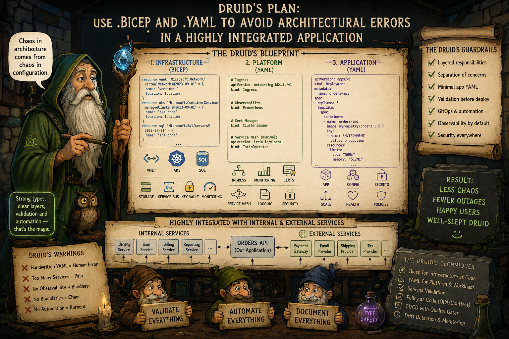

# Why containers, Docker and Kubernetes are a bad idea? - Part 3: The strangest outcomes of modern infrastructure engineering



_In Parts 1 and 2, we discussed the uncomfortable truths and facts about architectural debt related to using containers, Docker, and Kubernetes. _
_Now, in Part 3, we'll discuss architectural flaws and the real-world problems of modern infrastructure engineering when it becomes application code._

We increasingly describe entire systems using:
- YAML
- Bicep
- Terraform
- Helm templates
- Kustomize overlays

instead of:
- programming languages
- type systems
- compile-time verification

> This creates what many engineers now call **“configuration-driven distributed systems”**.

And yes — this becomes deeply problematic when:
- Kubernetes YAML
- Helm YAML
- Azure DevOps YAML
- GitHub Actions YAML
- Docker Compose YAML
- Istio YAML
- Prometheus YAML
- Bicep/Terraform

all start interacting.

> The result is often **an untyped, loosely validated meta-programming ecosystem**.


## The biggest architectural mistake

One of the biggest architectural mistakes is mixing:
- infrastructure
- deployment
- application topology
- runtime config
- business logic

inside the same YAML ecosystem.

> [!IMPORTANT]
> We should think in layers and **first separate the layers properly**.

Below is a recommended separation of concerns.

## Layer 1 — Infrastructure Provisioning

Provision:
- networks
- AKS/EKS clusters
- databases
- storage
- service bus
- key vaults
- monitoring infrastructure

using:
- Bicep
- Terraform
- Pulumi

> [!NOTE]
> This is **cloud infrastructure definition**.

Example:
```
	infra/
	  main.bicep
	  aks.bicep
	  sql.bicep
	  networking.bicep
```

This layer should:
- rarely change
- be strongly governed
- versioned independently

## Layer 2 — Platform Services

Define:
- ingress
- observability
- cert-manager
- service mesh
- monitoring stack

using:
- Helm
- Kubernetes manifests

Example:
```
	platform/
	  ingress/
	  monitoring/
	  security/
```

> [!IMPORTANT]
> This is: **platform architecture**.
>
> Not **application deployment**.


## Layer 3 — Application Deployment

This should be as small as possible.

Ideally:
- image name
- replicas
- env vars
- ports
- resource limits

NOT:
- 5000 lines of Helm templates

Example:
```yaml
	apiVersion: apps/v1
	kind: Deployment
	metadata:
	  name: orders-api
	spec:
	  replicas: 2
```
- Simple.
- Minimal.

## Layer 4 — Application Configuration

Separate:
- runtime config
- feature flags
- secrets
- environment settings

from infrastructure.

Use:
- Azure App Configuration
- Key Vault
- Consul
- etcd

NOT:
- giant YAML blobs.

## The Real Problem Is YAML as a Programming Language

YAML was never meant to become:
- a distributed systems language
- a templating engine
- an orchestration DSL
- a policy language
- a deployment framework

But Kubernetes forced the industry there. This leads to:
- Helm templating madness
- duplicated config
- inheritance chaos
- poor validation
- unreadable pipelines

### Why Bicep Is Better Than Raw YAML

Bicep improves several things:
- type safety
- modules
- symbolic references
- dependency tracking

Compared to raw ARM JSON/YAML:
- it is far more maintainable.

But:
- **Bicep should provision infrastructure**,
- **not encode application runtime behavior**.

## Configuration mistake

Many teams do this:
```
	Bicep
	  deploys AKS

	Helm
	  deploys app

	Helm values.yaml
	  contains business configuration

	CI YAML
	  injects env vars

	Secrets YAML
	  overrides values

	Customise overlays
	  override Helm

	Istio YAML
	  modifies routing
```

> [!IMPORTANT]
> This creates the biggest problem of all configuration-driven distributed systems:  
> **distributed configuration spaghetti**.


### Better Approach: Option 1 — Thin Kubernetes

Use Kubernetes minimally.

Avoid:
- Istio unless necessary
- excessive CRDs
- complex operators
- massive Helm abstraction layers

Use:
- plain Deployments
- Services
- Ingress

> [!NOTE]
> This dramatically reduces YAML chaos.

### Better Approach: Option 2 — Generate YAML, Don’t Handcraft It

> [!NOTE]
> Treat YAML as a build artifact. NOT: a source language.

Good approaches:
- CUE
- Dhall
- Jsonnet
- CDK
- Pulumi
- typed generators

These introduce:
- abstraction
- reuse
- validation
- type checking

before YAML generation.

### Better Approach: Option 3 — Use Pulumi Instead of YAML-Centric Systems

Pulumi allows IaC in:
- C#
- TypeScript
- Go
- Python

This is a huge improvement because:
- loops
- conditions
- abstractions
- type safety
- unit tests

become normal programming constructs.

As a .NET engineer, we may find this far more natural.

Example:

```csharp
	var app = new Kubernetes.Apps.V1.Deployment(...);
```

instead of:
```yaml
	spec:
	  template:
		metadata:
```

### Better Approach: Option 4 — Platform Engineering

> [!NOTE]
> This is where modern industry is heading.

Instead of every team writing Kubernetes YAML:
- platform team owns infrastructure
- developers define only:
  - app name
  - image
  - scaling rules
  - dependencies

The platform generates:
- manifests
- networking
- policies
- observability

This reduces:
- overload
- YAML duplication
- security mistakes

## An Important Architectural Principle

> [!NOTE]
> We do NOT want: application developers managing distributed systems plumbing directly.

**That is one of the major failures of early DevOps/Kubernetes culture**.

### The Emerging Trend

The industry is slowly moving toward:
- higher-level abstractions
- Internal Developer Platforms (IDPs)
- opinionated platforms
- “golden paths”
- less raw Kubernetes exposure.

> [!NOTE]
> Because many companies realised **Kubernetes YAML does not scale cognitively**.


## How to avoid a drastic drop in developer productivity

If you are a large technology company, feel free to choose the best option. But a small team must optimise for:
- simplicity
- feedback speed
- maintainability
- operational clarity
- low coordination cost
— not theoretical scalability.

### The Real Goal of a Small-Team SDLC

> [!NOTE]
> Not: “cloud-native maturity.”
> 
> But: fast, safe, understandable delivery.

The most productive teams usually have:
- fewer layers
- fewer services
- fewer repos
- fewer deployment units
- fewer meetings
- fewer abstractions

while maintaining:
- strong engineering discipline.

_.. tbc_..

## See also:
- [Why containers, Docker and Kubernetes are a bad idea? - Part 1: The core problem of architecture patterns](./Containers_K8s_Part_1.md)
- [Why containers, Docker and Kubernetes are a bad idea? - Part 2: When Containers and Kubernetes Become Architectural Debt](./Containers_K8s_Part_2.md)
- [Why containers, Docker and Kubernetes are a bad idea? - Part 4: A Practical Small-Team Architecture](./Containers_K8s_Part_4.md)
- [Why containers, Docker and Kubernetes are a bad idea? - Part 5: Practical Engineering and Architecture Decision Framework](./Containers_K8s_Part_5.md)
- [Why containers, Docker and Kubernetes are a bad idea? - Part 6: Kubernetes Costs and When Kubernetes Is Justified](./Containers_K8s_Part_6.md)

- [Is there a need to change the way software is developed today?](https://www.linkedin.com/pulse/need-change-way-software-developed-today-marek-kubis-dntie)
- [Is there a need to change the way software is developed today? - Continuation](https://www.linkedin.com/pulse/need-change-way-software-developed-today-continuation-marek-kubis-uytye)
- [Deterministic Developers in a Non-Deterministic World](https://www.linkedin.com/pulse/deterministic-developers-non-deterministic-world-marek-kubis-fstte)
- [Down the rabbit holes of AI-based software development process ](https://www.linkedin.com/pulse/down-rabbit-holes-ai-based-software-development-process-marek-kubis-fsyue)
- [This Isn’t Rebranding. It’s a Structural Shift in Software Development](https://www.linkedin.com/pulse/isnt-rebranding-its-structural-shift-software-marek-kubis-sanpe)

- [Mutation testing - Part 1: is it outdated?](https://www.linkedin.com/pulse/mutation-testing-part-1-why-works-all-marek-kubis-rkdde/)
- [Mutation testing - Part 2: Turn into a production-ready tool](https://www.linkedin.com/pulse/mutation-testing-part-2-turn-production-ready-tool-marek-kubis-qymbe/)
- [Mutation testing - Part 3: Mutation testing limits and how to go beyond it](https://www.linkedin.com/pulse/mutation-testing-part-3-limits-how-go-beyond-marek-kubis-taeue/)
- [Mutation testing - Part 4: mutation testing and LLM-written code](https://www.linkedin.com/pulse/mutation-testing-part-4-llm-written-code-marek-kubis-pjpne/)

- [Kafka & Service Bus — Part 1: Two Philosophies of Event-Driven Systems](https://lnkd.in/eiE5dcVp)
- [Kafka & Service Bus — Part 2: In Business Solutions: Real-world Architectures](https://lnkd.in/eAg_R5SZ)
- [Kafka & Service Bus — Part 3: Technical Comparison](https://lnkd.in/eBKcczQF)

- [Murphy’s law and more in AI time - one by one with examples](https://www.linkedin.com/pulse/murphys-law-more-ai-time-one-examples-marek-kubis-fkaze)
- [The Agile Vibe Coding and Conway's Law](https://www.linkedin.com/pulse/agile-vibe-coding-conways-law-marek-kubis-m0wpe)
- [Using a digital banking solution to prove Conway’s Law in AI-Driven engineering - example 1](https://www.linkedin.com/pulse/using-digital-banking-solution-prove-conways-law-ai-driven-kubis-xqlre/)
- [Using a .NET 10 migration project to prove Conway’s Law in AI-Driven engineering - example 2](https://www.linkedin.com/pulse/using-net-10-migration-project-prove-conways-law-ai-driven-kubis-abqae)

- [Where traditional Agile breaks in AI-driven systems](https://www.linkedin.com/pulse/where-traditional-agile-breaks-ai-driven-systems-marek-kubis-4wq6e/)
- [AI - It seems nobody has it fully figured out yet](https://www.linkedin.com/pulse/ai-nobody-has-figured-out-marek-kubis-bkyge)
- [Internal Development Platform and Agile Vibe Coding](https://www.linkedin.com/pulse/internal-development-platform-agile-vibe-coding-marek-kubis-kyhqe/?trackingId=5w3lWKp%2F0BLUpwNdrSmAcg%3D%3D&lipi=urn%3Ali%3Apage%3Ad_flagship3_pulse_read%3BqH%2FwqbkZRkmo%2Fagtxvqyrw%3D%3D)
- [Everyone will be vibe coders](https://www.linkedin.com/pulse/everyone-vibe-coders-marek-kubis-tlgze)
- [The Structural problems AI introduces into the SDLC](https://www.linkedin.com/pulse/structural-problems-ai-introduces-sdlc-marek-kubis-qyt6e)
- [Signals That Reveal the True Maturity of Organisations Claiming “AI-Driven Development”](https://www.linkedin.com/pulse/signals-reveal-true-maturity-organisations-claiming-ai-driven-kubis-urule)
- [AI - It seems nobody has it fully figured out yet](https://www.linkedin.com/pulse/ai-nobody-has-figured-out-marek-kubis-bkyge)

- [Agile Vibe Coding positioning and if this works, what changes?](https://www.linkedin.com/pulse/agile-vibe-coding-positioning-works-what-changes-marek-kubis-r4ate)
- [Agile Vibe Coding – Ceremony Modes](https://www.linkedin.com/pulse/agile-vibe-coding-ceremony-modes-marek-kubis-meq9e)
- [Agile Vibe Coding ceremonies approach compared to a simple one-prompt-per-task approach](https://www.linkedin.com/pulse/agile-vibe-coding-ceremonies-approach-compared-simple-marek-kubis-ecx5e)
- [Agile Vibe Coding Maturity Model](https://www.linkedin.com/pulse/agile-vibe-coding-maturity-model-marek-kubis-bbtqe)
- [The Agile Vibe Coding - the 4-level adaptive ceremony system](https://www.linkedin.com/pulse/agile-vibe-coding-4-level-adaptive-ceremony-system-marek-kubis-jizke)

- [Agile Vibe Coding Manifesto](https://agilevibecoding.org/)
- [Principles Behind the Agile Vibe Coding Manifesto - extended version](https://github.com/marekartur-dev/agilevibecoding/blob/main/Docs/Home/Principles.md)

- [Agile Vibe Coding](https://www.reddit.com/r/AgileVibeCoding/)
- [Marek Kubis - blog](https://github.com/marekartur-dev/agilevibecoding/tree/main)