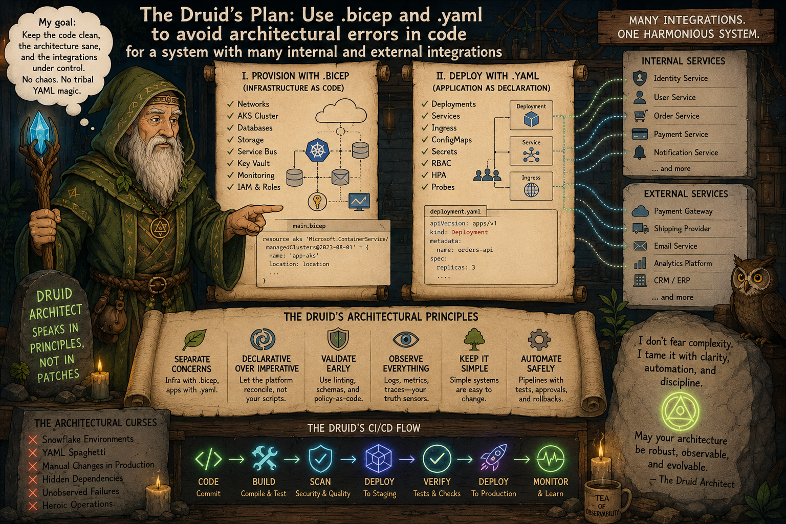

# Why containers, Docker and Kubernetes are a bad idea? - Part 4: A Practical Small-Team Architecture




_In Parts 1, 2 and 3, we discussed the uncomfortable truths and facts about architectural debt related to using containers, Docker, and Kubernetes. _
_Now, in Part 4, we'll discuss a realistic high-productivity SDLC flow and the recommended technical stack._


For most business systems start here:
```
Modular Monolith
+
Single Database
+
Background Workers
+
Message Queue only if truly needed
+
CI/CD
+
Automated Testing
+
Minimal Cloud Infrastructure
```

This is enough for an enormous number of systems.

## Recommended Technical Stack

_For .NET/Azure-like ecosystem._

**Application**
- C#
- ASP.NET Core
- Modular monolith
- Vertical slices where useful

**Database**
- PostgreSQL or SQL Server

**Deployment** - choose ONE:
- Azure App Service
- Azure Container Apps
- ECS
- Docker Compose
- very small Kubernetes cluster only if justified

### Avoid initially unless proven necessary
- service mesh
- Istio
- Saga orchestration
- event sourcing everywhere
- CQRS everywhere
- dozens of microservices
- excessive async communication
- distributed transactions
- 40 observability products

## A realistic high-productivity SDLC flow

### Phase 1 — Discovery & Domain Understanding

**Participants**:
- developers
- business stakeholders
- testers
- architect/lead

This is where DDD actually helps.

> [!NOTE]
> Not as: _“enterprise ceremony”_
> 
> but as: ___structured domain understanding___.

#### Activities

___Event Storming___ (lightweight)

Discuss:
- commands
- business events
- workflows
- invariants
- failure scenarios

**Even on a whiteboard.**

This often eliminates huge future mistakes.

#### Goal

Find:
- true domain boundaries
- transactional consistency requirements
- complexity hotspots

before writing infrastructure.

> [!IMPORTANT]
> Most architecture mistakes happen because teams:
>
> - 👉 design infrastructure first
> - 👉 understand the domain later

___This is backwards.___

### Phase 2 — Define Simplicity Boundaries

- 👉 Now decide: **What MUST be distributed?**
- 👉 Usually: almost nothing initially

#### Good default

Start with:
```
	1 deployable application
	1 database
	modular boundaries internally
```

This preserves:
- performance
- simplicity
- debuggability
- transactional consistency

### Phase 3 — Architecture Design

_This is where developers MUST participate heavily._

Architecture should NOT be:
- handed down by architects
- decided only by managers
- designed in isolation

Because developers understand:
- implementation cost
- debugging enlargement
- operational realities
- framework limitations

#### Practical Architecture Questions

Ask:

- 1. What are the consistency boundaries?
```
	Need ACID?
	Then keep together.
```
- 2. What requires independent scaling?
```
	Most modules do not.
```
- 3. What are latency-sensitive paths?
```
	Keep local:
	- pricing
	- authorization
	- transactional workflows
```
- 4. What changes frequently?
```
	Separate unstable modules.
```

### Phase 4 — Testing Strategy Design

> [!NOTE]
> ___This is where testers should be involved early. Not after implementation.___

**Modern Testing Reality**:
- Manual testers alone cannot scale modern systems.

Testing becomes:
- engineering
- automation
- specification design

Recommended testing strategy:
- 👉 Level 1 — Domain Tests 
- 👉 Level 2 — Integration Tests
- 👉 Level 3 — End-to-End Tests 

```markdown
Then:
	Additional techniques used when appropriate:
	- mutation testing
	- chaos testing
	- contract testing
	- load testing
	- security testing
	- exploratory testing
much stronger.
```


#### Level 1 — Domain Tests

Pure business logic tests. No:
- DB
- HTTP
- infrastructure

**Fast**

**Deterministic**

Thousands can run in seconds.

This is where:
- TDD
- property testing
- mutation testing

shine.

#### Level 2 — Integration Tests

Test:
- DB
- APIs
- queues
- external integrations

But:
- fewer tests
- focused tests

Avoid:
- giant fragile integration suites.

#### Level 3 — End-to-End Tests

Keep minimal.

E2E tests are:
- expensive
- flaky
- slow

Use them only for:
- critical business flows


#### Mutation Testing

Stryker.NET is extremely valuable here.

Because it detects:
- weak assertions
- fake coverage
- missing behavioural verification

Mutation testing works best on:
- domain logic
- deterministic behaviour
- algorithms
- invariants

#### Property-Based Testing

This is often even more powerful.

Example:
- invariants
- financial calculations
- state machines
- workflow transitions

Using:
- FsCheck

can uncover:
- missing logic
- edge cases
- invalid assumptions

This complements mutation testing extremely well.

#### Best Combination

For small teams:
```
	Unit Tests
	+
	Mutation Testing
	+
	Property-Based Testing

	Mutation Testing
	+
	Property-Based Testing
```
gives enormous quality leverage.


### Phase 5 — CI/CD

> [!NOTE]
> The most productive pipelines are - boring.

#### Good CI/CD for Small Teams

On PR run:
- build
- unit tests
- mutation smoke tests
- static analysis

Fast feedback: <10 minutes ideally.

Nightly run:
- full mutation testing
- property fuzzing
- extended integration tests
- performance regression tests

Deployment - automated:
- blue/green
or
- rolling deployment

But simple.

#### Keep Environments Minimal

Usually:
```
	local
	test
	production
```

Too many environments create:
- drift
- deployment friction
- debugging enlargement

#### The Most Important Productivity Principle

> [!NOTE]
> Optimise Feedback Loops

Developer productivity collapses when:
- builds slow down
- deployments slow down
- debugging becomes distributed
- environments diverge
- failures become opaque

> This Is Why Monoliths Often Win: **Because feedback loops stay tight**.

#### When to Introduce Distribution?

> ONLY **after** measurable **pain appears**. **Not before**.

**_Legitimate Reasons_**

> [!NOTE]
> Many distributed architectures are not driven primarily by technical scaling requirements, but by organisational scaling constraints, by organisational communication patterns.

Examples:
- team scaling problems
- deployment bottlenecks
- independent scaling needs
- fault isolation requirements
- compliance isolation

**NOT Legitimate Reasons**

Examples:
- resume-driven development
- “FAANG does it”
- “microservices are modern”
- “Kubernetes is industry standard”

#### Is DDD the Right Paradigm?

DDD is excellent IF:
- used pragmatically
- domain complexity is real

DDD is terrible when:
- applied ceremonially
- everything becomes aggregates/factories/repositories/events
- architecture becomes academic theatre

**_Pragmatic DDD_**

Use:
- ubiquitous language
- clear boundaries
- explicit invariants
- domain-centric thinking

Avoid:
- unnecessary abstraction layers
- over-engineering tactical patterns

**_A Better Mental Model_**

> [!NOTE]
> The best architecture is usually:
> **the simplest architecture that preserves future options**.


### Pragmatic Recommendation for Our Kind of Engineering

Given our background:
- .NET
- Azure
- distributed systems
- architecture
- performance concerns

a pragmatic stack is often:

**_Infrastructure_**
- Bicep or Terraform

**_Application packaging_**
- Docker only where useful

**_Orchestration_**
- minimal Kubernetes
OR
- Azure Container Apps
OR
- Azure App Service
OR
- ECS/Nomad

**_Config generation_**
- strongly typed generators
- avoid handwritten mega-YAML

**_Architecture_**
- modular monolith first
- distribute only where necessary

> [!IMPORTANT]
> Small teams actually need: 
> - ✔️ understandable systems
> - ✔️ fast feedback
> - ✔️ strong tests
> - ✔️ clear boundaries
> - ✔️ operational simplicity
> - ✔️ disciplined engineering


## The Deeper Truth

> [!IMPORTANT]
> The real problem is: **encoding enormous distributed-system intricacy into loosely validated configuration layers**.

That complexity exists whether:
- ❌ hidden in YAML
- ❌ hidden in GUIs
- ❌ hidden in operators
- ❌ hidden in frameworks

The best systems:
- ✔️ minimise layers
- ✔️ minimise hops
- ✔️ minimise configuration
- ✔️ preserve locality
- ✔️ preserve simplicity

while introducing elaborateness only where it delivers measurable value.

> [!IMPORTANT]
> ⚠️ Containers and Kubernetes primarily solve **organisational scaling problems**
> not just technical scaling problems.

They help when:
- ⚖️ hundreds of developers
- ⚖️ independent teams
- ⚖️ frequent deployments
- ⚖️ multi-region infra
- ⚖️ huge operational scale

exist.

> [!IMPORTANT]
> But for smaller systems **the infrastructure intricacy can exceed the application intricacy**.
> 
> 📌 Small teams do not really need **“enterprise architecture”**.

❗️ That is the central criticism. And it is often correct.

> [!NOTE]
> Today operational simplicity is a feature. 
> 📌 Probably our biggest lesson from software engineering history should be:
> **every abstraction layer trades simplicity in one place for complexity somewhere else**.


## See also:
- [Why containers, Docker and Kubernetes are a bad idea? - Part 1: The core problem of architecture patterns](./Containers_K8s_Part_1.md)
- [Why containers, Docker and Kubernetes are a bad idea? - Part 2: When Containers and Kubernetes Become Architectural Debt](./Containers_K8s_Part_2.md)
- [Why containers, Docker and Kubernetes are a bad idea? - Part 3: The strangest outcomes of modern infrastructure engineering](./Containers_K8s_Part_3.md)

- [Is there a need to change the way software is developed today?](https://www.linkedin.com/pulse/need-change-way-software-developed-today-marek-kubis-dntie)
- [Is there a need to change the way software is developed today? - Continuation](https://www.linkedin.com/pulse/need-change-way-software-developed-today-continuation-marek-kubis-uytye)
- [Deterministic Developers in a Non-Deterministic World](https://www.linkedin.com/pulse/deterministic-developers-non-deterministic-world-marek-kubis-fstte)
- [Down the rabbit holes of AI-based software development process ](https://www.linkedin.com/pulse/down-rabbit-holes-ai-based-software-development-process-marek-kubis-fsyue)
- [This Isn’t Rebranding. It’s a Structural Shift in Software Development](https://www.linkedin.com/pulse/isnt-rebranding-its-structural-shift-software-marek-kubis-sanpe)

- [Mutation testing - Part 1: is it outdated?](https://www.linkedin.com/pulse/mutation-testing-part-1-why-works-all-marek-kubis-rkdde/)
- [Mutation testing - Part 2: Turn into a production-ready tool](https://www.linkedin.com/pulse/mutation-testing-part-2-turn-production-ready-tool-marek-kubis-qymbe/)
- [Mutation testing - Part 3: Mutation testing limits and how to go beyond it](https://www.linkedin.com/pulse/mutation-testing-part-3-limits-how-go-beyond-marek-kubis-taeue/)
- [Mutation testing - Part 4: mutation testing and LLM-written code](https://www.linkedin.com/pulse/mutation-testing-part-4-llm-written-code-marek-kubis-pjpne/)

- [Kafka & Service Bus — Part 1: Two Philosophies of Event-Driven Systems](https://lnkd.in/eiE5dcVp)
- [Kafka & Service Bus — Part 2: In Business Solutions: Real-world Architectures](https://lnkd.in/eAg_R5SZ)
- [Kafka & Service Bus — Part 3: Technical Comparison](https://lnkd.in/eBKcczQF)

- [Murphy’s law and more in AI time - one by one with examples](https://www.linkedin.com/pulse/murphys-law-more-ai-time-one-examples-marek-kubis-fkaze)
- [The Agile Vibe Coding and Conway's Law](https://www.linkedin.com/pulse/agile-vibe-coding-conways-law-marek-kubis-m0wpe)
- [Using a digital banking solution to prove Conway’s Law in AI-Driven engineering - example 1](https://www.linkedin.com/pulse/using-digital-banking-solution-prove-conways-law-ai-driven-kubis-xqlre/)
- [Using a .NET 10 migration project to prove Conway’s Law in AI-Driven engineering - example 2](https://www.linkedin.com/pulse/using-net-10-migration-project-prove-conways-law-ai-driven-kubis-abqae)

- [Where traditional Agile breaks in AI-driven systems](https://www.linkedin.com/pulse/where-traditional-agile-breaks-ai-driven-systems-marek-kubis-4wq6e/)
- [AI - It seems nobody has it fully figured out yet](https://www.linkedin.com/pulse/ai-nobody-has-figured-out-marek-kubis-bkyge)
- [Internal Development Platform and Agile Vibe Coding](https://www.linkedin.com/pulse/internal-development-platform-agile-vibe-coding-marek-kubis-kyhqe/?trackingId=5w3lWKp%2F0BLUpwNdrSmAcg%3D%3D&lipi=urn%3Ali%3Apage%3Ad_flagship3_pulse_read%3BqH%2FwqbkZRkmo%2Fagtxvqyrw%3D%3D)
- [Everyone will be vibe coders](https://www.linkedin.com/pulse/everyone-vibe-coders-marek-kubis-tlgze)
- [The Structural problems AI introduces into the SDLC](https://www.linkedin.com/pulse/structural-problems-ai-introduces-sdlc-marek-kubis-qyt6e)
- [Signals That Reveal the True Maturity of Organisations Claiming “AI-Driven Development”](https://www.linkedin.com/pulse/signals-reveal-true-maturity-organisations-claiming-ai-driven-kubis-urule)
- [AI - It seems nobody has it fully figured out yet](https://www.linkedin.com/pulse/ai-nobody-has-figured-out-marek-kubis-bkyge)

- [Agile Vibe Coding positioning and if this works, what changes?](https://www.linkedin.com/pulse/agile-vibe-coding-positioning-works-what-changes-marek-kubis-r4ate)
- [Agile Vibe Coding – Ceremony Modes](https://www.linkedin.com/pulse/agile-vibe-coding-ceremony-modes-marek-kubis-meq9e)
- [Agile Vibe Coding ceremonies approach compared to a simple one-prompt-per-task approach](https://www.linkedin.com/pulse/agile-vibe-coding-ceremonies-approach-compared-simple-marek-kubis-ecx5e)
- [Agile Vibe Coding Maturity Model](https://www.linkedin.com/pulse/agile-vibe-coding-maturity-model-marek-kubis-bbtqe)
- [The Agile Vibe Coding - the 4-level adaptive ceremony system](https://www.linkedin.com/pulse/agile-vibe-coding-4-level-adaptive-ceremony-system-marek-kubis-jizke)

- [Agile Vibe Coding Manifesto](https://agilevibecoding.org/)
- [Principles Behind the Agile Vibe Coding Manifesto - extended version](https://github.com/marekartur-dev/agilevibecoding/blob/main/Docs/Home/Principles.md)

- [Agile Vibe Coding](https://www.reddit.com/r/AgileVibeCoding/)
- [Marek Kubis - blog](https://github.com/marekartur-dev/agilevibecoding/tree/main)
