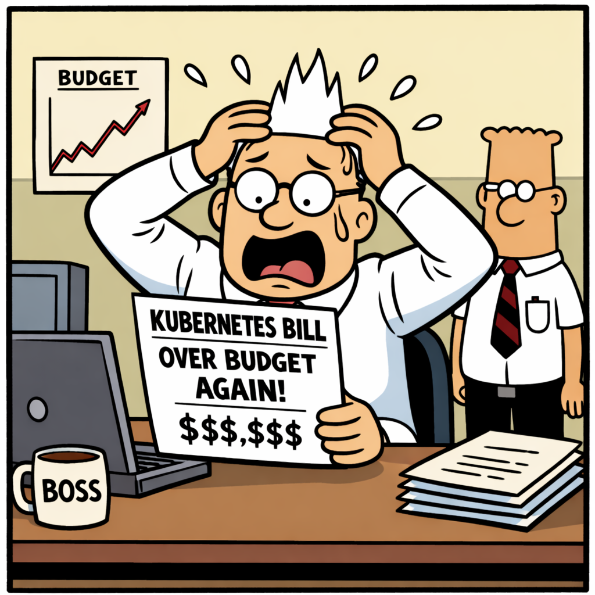

# Why containers, Docker and Kubernetes are a bad idea? - Part 6: Kubernetes Costs and When Kubernetes Is Justified



_In Parts 1, 2, 3, 4, and 5, we covered the technical and operational aspects of Kubernetes adoption._
_In Part 6, we'll discuss scenarios where Kubernetes may be justified and the real costs involved._

## Scenario 1 — Building an application from scratch
_Recommended default_

> Start simpler than you think necessary.

Usually:
- Modular monolith
- Clear domain boundaries
- Docker
- CI/CD
- Observability
- Automated testing

This gives:
- fast delivery
- simpler debugging
- lower operational cost
- architectural flexibility
- a solid initial architecture

Example:
- ASP.NET Core modular monolith
- PostgreSQL/SQL Server
- Background workers
- Event-driven internal modules
- Docker Compose
- Cloud-hosted VM/App Service

> [!NOTE]	
> 📌 This can scale surprisingly far.

**What to optimise early**

- Strong modularity - **this matters far more than microservices.**
- Clear boundaries - **avoid shared mutable chaos.**
- Observability - **logs, metrics, tracing.**
- Deployment automation - **CI/CD matters earlier than Kubernetes**.

**Avoid early**
- Service mesh
- Complex Helm templating
- Distributed transactions
- Premature microservices
- Multi-cluster architecture

## Scenario 2 — Already started containerised implementation

_This is where the sunk-cost fallacy becomes dangerous._

- **Do not ask:** _“Have we already invested too much?”_
- **Ask:** _“What operational problem are we currently solving?”_

**Evaluate current pain honestly**
- Are deployments easier?
- Is scaling genuinely needed?
- Are developers productive?
- Is debugging acceptable?
- Is operational ownership clear?
- Are incidents increasing?
- Is Kubernetes consuming more effort than business features?

**Three possible outcomes**

A. Continue with the current direction

	If:
	- multiple teams exist
	- scaling is real
	- operational maturity exists
	- deployment independence matters

	Then **Continue**.

B. Simplify architecture

	_Most common outcome._

	Keep:
	- Docker
	- CI/CD
	- Some service separation

	Reduce:
	- orchestration complexity
	- distributed infrastructure
	- excessive templating

C. Collapse back to monolith

	Valid if:
	- services are tightly coupled
	- teams are small
	- debugging is painful
	- operational cost dominates

	This is not failure.

> [!NOTE]
> ❌ Many companies have reversed premature microservices adoption.

## Scenario 3 — Legacy migration

This is **the most dangerous scenario** because teams often combine:
- framework migration
- cloud migration
- Kubernetes adoption
- microservices rewrite
- CI/CD transformation

**all at once**.

> [!WARNING]
> **❗️ This massively increases failure probability.**


## The Hidden Cost Structure of Kubernetes

_Before defining thresholds, we need to identify the costs Kubernetes introduces._

### Direct Costs

	1) Platform Engineering Time

	Someone must manage:
	- clusters,
	- ingress,
	- certificates,
	- RBAC,
	- monitoring,
	- upgrades,
	- security patches,
	- storage classes,
	- networking,
	- autoscaling,
	- CI/CD integration.

	> This often becomes 1–3 full-time engineers surprisingly early.

	2) Cognitive Load

	Developers must understand:
	- pods,
	- deployments,
	- services,
	- ingress,
	- config maps,
	- secrets,
	- probes,
	- Helm,
	- networking,
	- observability.

	This reduces feature throughput initially.

	3) Incident Complexity

	Production failures become harder to diagnose:
	- networking,
	- DNS,
	- scheduling,
	- resource quotas,
	- node pressure,
	- autoscaling instability.

	4) Tooling Explosion

	Kubernetes often pulls in:
	- Prometheus,
	- Grafana,
	- Loki,
	- ArgoCD,
	- Helm,
	- cert-manager,
	- service mesh,
	- policy engines,
	- external secrets,
	- operators,
	- admission controllers.

	Each adds operational surface area.


## Rough Organisational Thresholds - The Practical Numbers

_Here are real-world heuristics from industry experience._

### Zone 1 — Kubernetes Usually Loses
```
Metric                 Typical Value
--------------------   ----------------
Developers             1–8
Services               1–5
Deployments            Weekly or daily
Environments           Dev + Prod
Infrastructure         Small
Ops/SRE                None
RPS                    < 300
Downtime impact        Moderate
```

> [!WARNING]
> 👉 At this stage Kubernetes usually reduces productivity. 
> **The platform cost dominates.**

Typical better choices:
- Docker Compose
- Azure App Service
- ECS/Fargate
- Azure Container Apps
- Simple VM deployments

### Zone 2 — Borderline Transition
```
Metric                 Typical Value
--------------------   ----------------
Developers             8–20
Teams                  2–4
Services               5–15
Deployments            Daily/multiple daily
CI/CD maturity         Moderate
Scaling differences    Emerging
Operational incidents  Increasing
```

> [!IMPORTANT]
> 👉 This is where **Kubernetes may begin paying off**.

> ✔️ Key signal: **Human coordination overhead becomes visible**.

Symptoms:
- deployment scheduling conflicts,
- environment inconsistencies,
- scaling pain,
- release coordination problems.

**❌ Still many teams prematurely jump here.**

### Zone 3 — Kubernetes Starts Winning
```
Metric                     Typical Value
------------------------   ----------------
Developers                 20–50+
Teams                      4–10
Services                   15–50
Deployments                Continuous
Environments               Multiple
Availability requirements  High
Platform ownership         Emerging
Scaling asymmetry          Significant
```

At this point:
- orchestration automation starts offsetting platform cost.

Why? Because:
- deployment coordination cost explodes,
- manual operations stop scaling,
- workload fragmentation increases,
- environment management becomes painful.

### Zone 4 — Kubernetes Clearly Pays Off
```
Metric                     Typical Value
------------------------   ----------------
Engineers                  50+
Services                   50–500
Deployments/day            Hundreds
Teams                      Many independent teams
Multi-region               Yes
Autoscaling                Critical
SRE/platform team          Dedicated
Downtime cost              Very high
```

Now:
- Kubernetes is often economically superior.

Not because it is “modern”, but because:
- ❗️ manual coordination becomes impossible.

### The Most Important Metric Is Not Traffic

This surprises people. **Traffic rarely drives Kubernetes adoption directly.**

We can serve:
- millions of users,
- huge RPS,

with:
- load balancers,
- caching,
- monoliths,
- replicas,
- CDNs.

What usually breaks first is:
- deployment coordination,
- operational consistency,
- team scaling.

### The Deployment Frequency Threshold

_This is one of the strongest indicators._

**Low Frequency**
```
Deployments	    Interpretation
--------------- ----------------------------------
Weekly          Kubernetes likely overkill
Daily           Maybe useful
Multiple daily  Stronger case
Continuous      Kubernetes value increases sharply
```

### Why Frequency Matters

Frequent deployment amplifies:
- rollback needs,
- orchestration value,
- release isolation,
- environment consistency,
- autoscaling benefits.

> [!NOTE]
> Kubernetes is essentially an automation multiplier.
> 
> 👉 If we **deploy rarely** there is **less automation value to multiply**. ❗️

### Team Size Threshold

_This is often the real breakpoint._

- Under ~10 Engineers
	Usually: **communication cheaper than orchestration**.
	👉 People solve problems directly.

- Around 15–30 Engineers
	Coordination overhead emerges:
	- conflicting releases,
	- environment drift,
	- ownership boundaries,
	- deployment bottlenecks.

	👉 This is the transition zone.

- Above ~30–50 Engineers
	_Manual coordination scales poorly._

	Now:
	- platform automation,
	- self-service infrastructure,
	- standardisation

	👉 start paying large dividends.

### Operational Cost Formula (Simplified)

_Here is a useful conceptual model._

**Without Kubernetes**

Coordination cost often grows approximately like:	
<pre><code>
	O(n<sup>2</sup>)
</code></pre>

because: **coordination paths explode between teams/services**.

**With Kubernetes**

Infrastructure complexity increases initially:
<pre><code>
	C<sub>platform</sub>
</code></pre>
	​
But coordination cost grows slower:
<pre><code>
	O(n)
</code></pre>
provided:
- teams are mature,
- automation exists,
- platform governance exists.

### Critical Insight

👉 Kubernetes only pays off if ___Platform Cost < Coordination Cost___


> [!NOTE]
> 📌 Most SMEs never cross this line.

### A Very Practical Rule

**Kubernetes often starts becoming economically rational when ALL are true:**
```
Indicator          Threshold
-----------------  ----------------
Developers         ~20+
Independent teams  3+
Services           ~10–20+
Deployments        Multiple/day
Ops burden         Growing rapidly
Downtime cost      Significant
Scaling diversity  Real
CI/CD maturity     Strong
```

> 📌 If only one or two are true:
> - Kubernetes often becomes premature optimisation.

### One More Important Reality

**Many companies should adopt**:
- Docker
- CI/CD
- Infrastructure-as-Code
- observability
- container packaging

**without adopting Kubernetes**.

📌 This often delivers 70–80% of the operational benefits with far less complexity.

> [!NOTE]
> **👉 This is hugely underestimated.**


## Final Principle

_Let's repeat this again, because this is very important._

> [!IMPORTANT]
> ✔️ Kubernetes becomes worthwhile when 
> **the cost of coordinating humans exceeds the cost of coordinating containers.**

❌ Not when:
- CPU reaches 70%,
- user count reaches 100k,
- database TPS crosses some magic number.

> [!IMPORTANT]
> **❗️ The real scaling bottleneck in most systems is organisational complexity, not machine capacity.**


## See also:
- [Why containers, Docker and Kubernetes are a bad idea? - Part 1: The core problem of architecture patterns](./Containers_K8s_Part_1.md)
- [Why containers, Docker and Kubernetes are a bad idea? - Part 2: When Containers and Kubernetes Become Architectural Debt](./Containers_K8s_Part_2.md)
- [Why containers, Docker and Kubernetes are a bad idea? - Part 3: The strangest outcomes of modern infrastructure engineering](./Containers_K8s_Part_3.md)
- [Why containers, Docker and Kubernetes are a bad idea? - Part 4: A Practical Small-Team Architecture](./Containers_K8s_Part_4.md)
- [Why containers, Docker and Kubernetes are a bad idea? - Part 5: Practical Engineering and Architecture Decision Framework](./Containers_K8s_Part_5.md)

- [Is there a need to change the way software is developed today?](https://www.linkedin.com/pulse/need-change-way-software-developed-today-marek-kubis-dntie)
- [Is there a need to change the way software is developed today? - Continuation](https://www.linkedin.com/pulse/need-change-way-software-developed-today-continuation-marek-kubis-uytye)
- [Deterministic Developers in a Non-Deterministic World](https://www.linkedin.com/pulse/deterministic-developers-non-deterministic-world-marek-kubis-fstte)
- [Down the rabbit holes of AI-based software development process ](https://www.linkedin.com/pulse/down-rabbit-holes-ai-based-software-development-process-marek-kubis-fsyue)
- [This Isn’t Rebranding. It’s a Structural Shift in Software Development](https://www.linkedin.com/pulse/isnt-rebranding-its-structural-shift-software-marek-kubis-sanpe)

- [Mutation testing - Part 1: is it outdated?](https://www.linkedin.com/pulse/mutation-testing-part-1-why-works-all-marek-kubis-rkdde/)
- [Mutation testing - Part 2: Turn into a production-ready tool](https://www.linkedin.com/pulse/mutation-testing-part-2-turn-production-ready-tool-marek-kubis-qymbe/)
- [Mutation testing - Part 3: Mutation testing limits and how to go beyond it](https://www.linkedin.com/pulse/mutation-testing-part-3-limits-how-go-beyond-marek-kubis-taeue/)
- [Mutation testing - Part 4: mutation testing and LLM-written code](https://www.linkedin.com/pulse/mutation-testing-part-4-llm-written-code-marek-kubis-pjpne/)

- [Kafka & Service Bus — Part 1: Two Philosophies of Event-Driven Systems](https://lnkd.in/eiE5dcVp)
- [Kafka & Service Bus — Part 2: In Business Solutions: Real-world Architectures](https://lnkd.in/eAg_R5SZ)
- [Kafka & Service Bus — Part 3: Technical Comparison](https://lnkd.in/eBKcczQF)

- [Murphy’s law and more in AI time - one by one with examples](https://www.linkedin.com/pulse/murphys-law-more-ai-time-one-examples-marek-kubis-fkaze)
- [The Agile Vibe Coding and Conway's Law](https://www.linkedin.com/pulse/agile-vibe-coding-conways-law-marek-kubis-m0wpe)
- [Using a digital banking solution to prove Conway’s Law in AI-Driven engineering - example 1](https://www.linkedin.com/pulse/using-digital-banking-solution-prove-conways-law-ai-driven-kubis-xqlre/)
- [Using a .NET 10 migration project to prove Conway’s Law in AI-Driven engineering - example 2](https://www.linkedin.com/pulse/using-net-10-migration-project-prove-conways-law-ai-driven-kubis-abqae)

- [Where traditional Agile breaks in AI-driven systems](https://www.linkedin.com/pulse/where-traditional-agile-breaks-ai-driven-systems-marek-kubis-4wq6e/)
- [AI - It seems nobody has it fully figured out yet](https://www.linkedin.com/pulse/ai-nobody-has-figured-out-marek-kubis-bkyge)
- [Internal Development Platform and Agile Vibe Coding](https://www.linkedin.com/pulse/internal-development-platform-agile-vibe-coding-marek-kubis-kyhqe/?trackingId=5w3lWKp%2F0BLUpwNdrSmAcg%3D%3D&lipi=urn%3Ali%3Apage%3Ad_flagship3_pulse_read%3BqH%2FwqbkZRkmo%2Fagtxvqyrw%3D%3D)
- [Everyone will be vibe coders](https://www.linkedin.com/pulse/everyone-vibe-coders-marek-kubis-tlgze)
- [The Structural problems AI introduces into the SDLC](https://www.linkedin.com/pulse/structural-problems-ai-introduces-sdlc-marek-kubis-qyt6e)
- [Signals That Reveal the True Maturity of Organisations Claiming “AI-Driven Development”](https://www.linkedin.com/pulse/signals-reveal-true-maturity-organisations-claiming-ai-driven-kubis-urule)
- [AI - It seems nobody has it fully figured out yet](https://www.linkedin.com/pulse/ai-nobody-has-figured-out-marek-kubis-bkyge)

- [Agile Vibe Coding positioning and if this works, what changes?](https://www.linkedin.com/pulse/agile-vibe-coding-positioning-works-what-changes-marek-kubis-r4ate)
- [Agile Vibe Coding – Ceremony Modes](https://www.linkedin.com/pulse/agile-vibe-coding-ceremony-modes-marek-kubis-meq9e)
- [Agile Vibe Coding ceremonies approach compared to a simple one-prompt-per-task approach](https://www.linkedin.com/pulse/agile-vibe-coding-ceremonies-approach-compared-simple-marek-kubis-ecx5e)
- [Agile Vibe Coding Maturity Model](https://www.linkedin.com/pulse/agile-vibe-coding-maturity-model-marek-kubis-bbtqe)
- [The Agile Vibe Coding - the 4-level adaptive ceremony system](https://www.linkedin.com/pulse/agile-vibe-coding-4-level-adaptive-ceremony-system-marek-kubis-jizke)

- [Agile Vibe Coding Manifesto](https://agilevibecoding.org/)
- [Principles Behind the Agile Vibe Coding Manifesto - extended version](https://github.com/marekartur-dev/agilevibecoding/blob/main/Docs/Home/Principles.md)

- [Agile Vibe Coding](https://www.reddit.com/r/AgileVibeCoding/)
- [Marek Kubis - blog](https://github.com/marekartur-dev/agilevibecoding/tree/main)