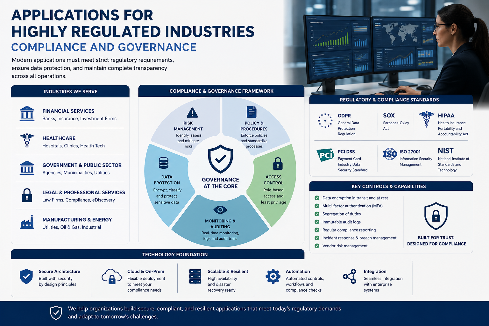
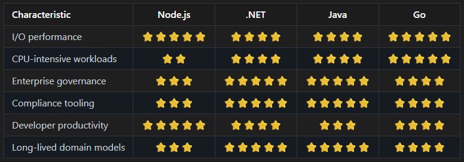

# JavaScript Everywhere – Part 2: Applications for Highly Regulated Industries - Compliance and Governance



_In Part 1, we discussed the general principles and challenges of using JavaScript in various applications in highly regulated industries._
_Now, in Part 2, we will focus on its applications in highly regulated industries, specifically addressing compliance and governance._

## How to make JavaScript compliant in regulated legal apps

> [!IMPORTANT]
> 📌 If we do use JavaScript/Node.js, we must add architectural controls that compensate for its flexibility.

### 1. Enforce strict typing (non-negotiable) and use:

- TypeScript
- runtime schema validation (e.g., Zod / Joi)
- strict compiler settings (noImplicitAny, strict: true)

> [!IMPORTANT]
> 👉 Goal: **Remove “dynamic chaos” from the system.**

### 2. Make Node stateless

Never store:
- case state
- legal decisions
- audit-critical data in memory

All state must be in:
- PostgreSQL / SQL Server
- event store
- document store with versioning

### 3. Audit logging must be immutable

We need:
- append-only logs
- tamper-evident storage
- correlation IDs across services

Node should:
- emit events
- NOT interpret final legal meaning

### 4. Separate “decision services” from “orchestration services”

A good legal architecture looks like:

```
Node.js (API Gateway / Orchestrator)
        ↓
C# / Java (Domain Services - rules, validation)
        ↓
PostgreSQL (System of Record)
        ↓
Audit/Event Store (immutable log)
```

> [!NOTE]
> 👉 Node is the “front desk”, not the “judge”.

### 5. Strong security model

Required controls:
- OAuth2 / OpenID Connect
- Role-based access control (RBAC)
- Fine-grained authorization (ABAC if needed)
- Full request tracing (correlation IDs)
- Encryption at rest + in transit

### 6. Deterministic business logic isolation

If legal decisions matter, isolate them into:
- C# services (.NET is common in regulated industries)
- Java services (banking-style systems)
- Rule engines (Drools, custom policy engines)

_Node only calls them._

## When JavaScript, Node.js should not be used or is NOT compatible

> [!NOTE]
> ✔ There are two cases: A - unsuitable & B - incompatible.

**📌 Case A: Technically unsuitable (hard exclusion)**

Avoid Node.js when:

### 1. Hard real-time constraints

- trading-style systems
- deterministic sub-millisecond responses

### 2. CPU-bound processing

- document OCR pipelines
- encryption-heavy workflows
- large batch validation

### 3. Strong formal verification requirements

- mission-critical legal automation
- systems requiring reproducible execution proofs

**📌 Case B: Architecturally incompatible (soft exclusion)**

Even if Node could work, avoid it when:

### 1. Solution need strict enterprise governance

- heavy auditing
- long-term legal traceability
- multi-year reproducibility requirements

### 2. Multiple teams over long lifecycle

- JS ecosystems drift faster without strict governance

### 3. Domain complexity is high

- many interdependent legal rules
- versioned legal logic (laws change over time)


## Target Architecture for a Regulated Legal Platform

### A Compliance Maturity Model

**Level 1** - JavaScript only - Not sufficient for Highly Regulated Industries.
- Express
- PostgreSQL

**Level 2** - Node.js + TypeScript + Runtime Validation - a little better.
- TypeScript
- Validation
- Tests

**Level 3** - Enterprise-grade - Now compliance becomes realistic.
- TypeScript
- Clean Architecture
- Audit Logs
- RBAC
- Encryption
- CI/CD Controls
- SBOM
- Secrets Management

**Level 4** - Regulated-industry grade - This is where legal, financial, and government systems typically operate.
- TypeScript
- DDD
- Event Sourcing
- Immutable Audit
- ABAC
- Threat Modeling
- Pen Testing
- SOC2 Controls
- PCI Controls
- GDPR Controls

### IDEs

There is no universally best IDE—there are different leaders depending on whether you're building enterprise applications, 
cloud-native microservices, or working within a specific platform like Servoy.

1. **Visual Studio Code** (Most Popular) - best for: Most Node.js backend development
2. **WebStorm** (Most Feature-Rich) - best for: Large enterprise JavaScript/TypeScript projects
3. **Visual Studio** - although excellent for .NET, it's not the preferred environment for Node.js development.
4. **Servoy IDE** - is designed to build Servoy applications using its own application framework and JavaScript environment.

> [!NOTE]
> ✔ Visual Studio Code and Visual Studio are well known and the most popular IDEs for Node.js development, 
with a large ecosystem of extensions and plugins that support various frameworks, libraries, and tools. 

> [!NOTE]
> ✔ WebStorm is a commercial IDE that offers advanced features for JavaScript and TypeScript development, including code analysis, refactoring, and debugging capabilities. 

Worth to mention strengths of WebStorm:
- Outstanding refactoring
- Deep code analysis
- Superior navigation in large codebases
- Excellent TypeScript support
- Integrated database tools
- Built-in test runners
- Docker and Kubernetes integration

Compared WebStorm to VS Code:
- More features out of the box
- Better static analysis
- Better refactoring
- Paid license

> [!NOTE]
> ✔ Servoy IDE is a specialized IDE for building applications using the Servoy platform, which includes its own application framework and JavaScript environment.

Servoy is not intended as a general-purpose Node.js backend IDE. 
With this IDE is possible to use for example:
- ✔ Servoy Forms
- ✔ Foundsets
- ✔ Relations
- ✔ Security
- ✔ Database abstraction
- ✔ Rapid application development

but not:
- npm package management
- Express/NestJS project creation
- Native Node.js debugging
- Modern Node.js build tooling

### Servoy IDE 

Servoy uses server-side JavaScript running inside the Servoy application platform, which is built on Java. 
Historically, Servoy scripts execute through a Java-based JavaScript engine and have direct access to Servoy APIs, forms, foundsets, relations, security, etc.

Think of it like this:

```
Servoy JavaScript
       ≠
Node.js JavaScript
```

> [!WARNING]
> ❗️ Both use JavaScript syntax, but they run in different environments.

**What is compatible?**

Most core JavaScript concepts are compatible:

```javascript
var customer = {
    id: 1,
    name: "John"
};

function calculateTotal(items) {
    return items.reduce((sum, item) => sum + item.price, 0);
}
```

Business logic such as:
- validation
- calculations
- string manipulation
- date handling
- utility functions

can often be ported with little effort.

**What is NOT compatible?**

Example of Servoy-specific code:

```javascript
foundset.loadRecords();
forms.customerForm.controller.show();
databaseManager.saveData();
```

These APIs only exist inside Servoy.

Node.js has no idea what mean:
- _foundset_
- _forms_
- _databaseManager_
- _plugins_
- _solutionModel_

> [!WARNING]
> ❌  A direct copy/paste will fail.

**Database Access**

In Servoy:

```javascript
foundset.find();
foundset.customerid = 123;
foundset.search();
```

In Node.js:

```javascript
const result = await pool.query(
    'SELECT * FROM customer WHERE customerid = $1',
    [123]
);
```

> [!NOTE]
> 👉  Completely different programming model.

**Module System**

Modern Node.js uses:

```javascript
import express from 'express';

or
    const express = require('express');
```

> [!NOTE]
> 👉  Traditional Servoy code typically doesn't use the Node.js module ecosystem.

**Asynchronous Programming**

Node.js is heavily asynchronous:

```javascript
const customer = await repository.getCustomer(id);
```

Many Servoy APIs are synchronous from the developer's perspective:

```javascript
foundset.search();
```

> [!IMPORTANT]
> 📌  When migrating code, this is often one of the largest changes.

**NPM Ecosystem**

Node.js provides access to:
- Express
- NestJS
- Fastify
- Prisma
- TypeORM
- thousands of npm packages

> [!NOTE]
> 👉  Servoy applications generally operate within the Servoy framework and plugin ecosystem.

**Can Servoy call Node.js services?**

Absolutely. A common architecture is:

```
Servoy Frontend/Application
          │
          ▼
      REST API
          │
          ▼
       Node.js
          │
          ▼
     PostgreSQL

or
    Servoy
       │
       ▼
    .NET API
       │
       ▼
    PostgreSQL
```

> [!NOTE]
> 👉  This is often preferable to trying to move all logic into Servoy.

**Can Node.js run inside Servoy?**

Not natively in the sense that Servoy code automatically executes in the Node.js runtime.

> [!NOTE]
> 👉  However, modern Servoy versions support NG Client technologies and integration patterns that can communicate with external Node.js services.

> [!IMPORTANT]
> 📌  The Node.js process and the Servoy application server remain separate runtimes.

**For Enterprise Architecture**

> [!NOTE]
> 👉 In this article, enterprise architecture refers to the organisation of software into independently governed, maintainable, secure, 
> and evolvable components that support long-term business objectives while satisfying operational, regulatory, and organisational constraints.

Looking at the kinds of systems we've been discussing - Azure, Service Bus, Kubernetes, state machines, legal/compliance systems - I would generally separate responsibilities like this:

```
Servoy
  ├─ UI
  ├─ Forms
  ├─ Reporting
  └─ User workflows

.NET / Node.js Services
  ├─ APIs
  ├─ Integrations
  ├─ Message processing
  ├─ Domain logic
  └─ External systems

PostgreSQL
```

> [!NOTE]
> 👉  This keeps Servoy focused on rapid application development while placing complex backend services, CI/CD pipelines, automated testing, scalable messaging, and cloud deployment into dedicated service layers.

So the answer is:
> [!WARNING]
> ❗️ JavaScript syntax is largely compatible, but Servoy JavaScript code is generally not directly compatible with Node.js because it depends on Servoy-specific APIs and a different runtime environment. 
> Simple business logic can often be reused, but data access, forms, plugins, and framework APIs usually need to be rewritten.

> [!NOTE]
> 📌  Servoy IDE is best suited for developers who are building applications using the Servoy platform and want to leverage its features for rapid application development,
> rather than for general-purpose Node.js backend development.


### What to use instead or alongside JavaScript, Node.js

In legal-grade systems, JavaScript, Node.js is usually paired with 
strong backend alternatives:
- .NET (very common in government/legal systems)
- Java (enterprise governance, long-term stability)
- Go (performance + simplicity)
- Python (only for controlled workflows, not core logic)

### Recommended architecture for a legal application

A realistic enterprise design:

**Node.js layer (allowed)**
- API gateway
- authentication gateway
- request validation
- orchestration
- UI backend (BFF)

**Core services (trusted layer)**
- case management service (.NET / Java)
- rules engine (legal logic)
- document service
- audit service

**Data layer**
- PostgreSQL (system of record)
- event store (append-only audit trail)
- document storage (versioned)

**Messaging**
- event bus (Service Bus / Kafka)
- immutable event propagation

### Key mindset shift

> [!IMPORTANT]
> 📌 In regulated legal systems:
> JavaScript, Node.js is NOT the system of truth. It is the system of coordination.

If we treat JavaScript, Node.js as the “brain” of legal logic, **we will struggle** with:
- audit compliance
- reproducibility
- long-term governance

> [!IMPORTANT]
> ✔ If we treat JavaScript, Node.js as:
>    - a controlled entry point to deterministic backend systems
>    - **…it becomes very effective**.

### Polyglot architecture with clear responsibility boundaries

```
                Internet
                    │
                    ▼
             Azure Front Door
                    │
                    ▼
              API Gateway
          (Node.js or .NET)
                    │
      ┌─────────────┼─────────────┐
      ▼             ▼             ▼
 Authentication   Case API     Document API
   Service        Service       Service
     (.NET)        (.NET)        (.NET)
      │             │             │
      └──────┬──────┴──────┬──────┘
             ▼             ▼
       Azure Service Bus / Kafka
                    │
                    ▼
        Workflow / State Machine
              Worker Services
                 (.NET)
                    │
                    ▼
         PostgreSQL / SQL Server
            System of Record
                    │
                    ▼
             Immutable Audit
                Event Store
```

### Selected languages comparison

| Characteristic          | Node.js | .NET    | Java    | Go      |
|:------------------------|:-------:|:-------:|:-------:|:-------:|
| I/O performance         |⭐⭐⭐⭐⭐|⭐⭐⭐⭐|⭐⭐⭐⭐|⭐⭐⭐⭐⭐|
| CPU-intensive workloads |⭐⭐    |⭐⭐⭐⭐ |⭐⭐⭐⭐|⭐⭐⭐⭐⭐|
| Enterprise governance   |⭐⭐⭐   |⭐⭐⭐⭐⭐|⭐⭐⭐⭐⭐|⭐⭐⭐⭐|
| Compliance tooling      |⭐⭐⭐   |⭐⭐⭐⭐⭐|⭐⭐⭐⭐⭐|⭐⭐⭐⭐|
| Developer productivity  |⭐⭐⭐⭐⭐|⭐⭐⭐⭐ |⭐⭐⭐|⭐⭐⭐⭐|
| Long-lived domain models|⭐⭐⭐   |⭐⭐⭐⭐⭐|⭐⭐⭐⭐⭐|⭐⭐⭐⭐|

<!-- > <> <-->


## Legal applications under strict regulation

### Key Question

> [!IMPORTANT]
> 📌  Do not ask: ___Can I use JavaScript in a regulated environment?___

> [!WARNING]
> ❗️ Ask instead: ___Can I prove correctness, traceability, security, and control over execution?___

### Node.js (Allowed)

> [!NOTE]
> ✔ Use JavaScript only for **API Gateway**

Examples:

```javascript
    POST /cases
    POST /documents
    GET /timeline
```

Responsibilities:
- Authentication
- Request validation
- Rate limiting
- Response transformation
- Calling backend services

> [!NOTE]
> 👉 No legal decisions.

> [!NOTE]
> 👉 No business rules.

> [!NOTE]
> 👉 No persistence.

### .NET Core Services

> [!NOTE]
> ✔ Use C# for ___Case Management___

```
    Open Case
    Assign Lawyer
    Submit Evidence
    Review Evidence
    Close Case
    Archive Case
```

**Legal Rules**

```csharp
if (caseType == Criminal &&
    evidence.Count == 0)
{
    throw new ValidationException();
}
```

These rules must be:
- Versioned
- Tested
- Auditable
- Traceable

### Why .NET Wins Here

For legal systems we need:
- **Strong Typing**
```
use c#:
    public record CaseId(Guid Value);

instead of JavaScript:
    const caseId = something;
```
- **Compile-Time Validation**
```
Many defects become impossible to deploy.
```
- **Better Refactoring**
```
- Legal systems live 10–20 years.
- Refactoring safety matters enormously.
```


..tbc..

## See also:
1. [Open Standards for Government](https://www.gov.uk/government/publications/open-standards-for-government)
2. [Open standards for government data and technology](https://www.gov.uk/government/collections/open-standards-for-government-data-and-technology)
3. [A guide to good practice for digital and data-driven health technologies](https://www.gov.uk/government/publications/code-of-conduct-for-data-driven-health-and-care-technology/initial-code-of-conduct-for-data-driven-health-and-care-technology)
4. [UK Government Publishes Guidelines for Artificial Intelligence Procurement](https://www.bevanbrittan.com/insights/articles/2020/uk-government-publishes-guidelines-for-artificial-intelligence-procurement/)
5. [Dependabot quickstart guide](https://docs.github.com/en/code-security/tutorials/secure-your-dependencies/dependabot-quickstart)

## See:
- [JavaScript Everywhere – Part 1: Applications for Highly Regulated Industries (e.g., for Lawyers)](https://www.linkedin.com/pulse/javascript-everywhere-part-1-applications-highly-regulated-kubis-dcxie/)
- [JavaScript Everywhere – Part 3: Applications for Highly Regulated Industries - Auditability, Testing, CI/CD, Observability](https://www.linkedin.com/pulse/javascript-everywhere-part-3-applications-highly-regulated-kubis-ruwne/)

- [Availability vs Identity in Distributed C#/.NET Applications - Part 1: The Role of Availability and Identity](https://www.linkedin.com/pulse/availability-vs-identity-distributed-cnet-part-1-role-marek-kubis-xvpze/)
- [Availability vs Identity in Distributed C#/.NET Applications - Part 2: Lock-in on Use Cases and on Cloud](https://www.linkedin.com/pulse/availability-vs-identity-distributed-cnet-part-2-lock-in-kubis-zhmee/)

- [What is managed identities for Azure resources?](https://learn.microsoft.com/en-us/azure/active-directory/managed-identities-azure-resources/overview)
- [IAM Roles](https://docs.aws.amazon.com/IAM/latest/UserGuide/id_roles.html)
- [Authenticate to Google Cloud APIs from GKE workloads](https://cloud.google.com/kubernetes-engine/docs/how-to/workload-identity)
- [What is Azure role-based access control (Azure RBAC)?](https://learn.microsoft.com/en-us/azure/role-based-access-control/overview)

- [Once and Only Once with Examples - Part 1: Is It Obvious?](https://www.linkedin.com/pulse/once-only-examples-part-1-obvious-marek-kubis-nyebe/)
- [Once and Only Once with Examples - Part 2: And AI-generated Code](https://www.linkedin.com/pulse/once-only-examples-part-2-ai-generated-code-marek-kubis-kn9ie/)
- [Once and Only Once with Examples - Part 3: Where Duplication Is Simultaneously Necessary](https://www.linkedin.com/pulse/once-only-examples-part-3-where-duplication-necessary-marek-kubis-vpxce/)

- [Mutation testing - Part 1: is it outdated?](https://lnkd.in/eDbVukCf)
- [Mutation testing - Part 2: Turn into a production-ready tool](https://lnkd.in/eSx9b6pB)
- [Mutation testing - Part 3: Mutation testing limits and how to go beyond it](https://lnkd.in/e3qsTXBy)
- [Mutation testing - Part 4: mutation testing and LLM-written code](https://lnkd.in/eKfvJfbp)

- [Underestimated and Annoying, or the "Dirty Dozen" of Programmers - Part 1: The Problem Space](https://www.linkedin.com/pulse/underestimated-annoying-dirty-dozen-programmers-marek-kubis-mcfxe)
- [Underestimated and Annoying, that is "The Dirty Dozen" of Programmers - Part 2: AI-Generated Software](https://www.linkedin.com/pulse/underestimated-annoying-dirty-dozen-programmers-part-2-marek-kubis-tqkme/)
- [Underestimated and Annoying, that is "The Dirty Dozen" of Programmers - Part 3: I. Organizational Problems](https://www.linkedin.com/pulse/underestimated-annoying-dirty-dozen-programmers-part-marek-kubis-h9y3e/)
- [Underestimated and Annoying, that is "The Dirty Dozen" of Programmers - Part 4: II. Human Problems](https://www.linkedin.com/pulse/underestimated-annoying-dirty-dozen-programmers-part-marek-kubis-mn5ve/)
- [Underestimated and Annoying, that is "The Dirty Dozen" of Programmers - Part 5: III. Process Problems](https://www.linkedin.com/pulse/underestimated-annoying-dirty-dozen-vibe-coding-part-marek-kubis-83jre/)
- [Underestimated and Annoying, that is "The Dirty Dozen" of Programmers - Part 6: IV. Architecture Problems](https://www.linkedin.com/pulse/underestimated-annoying-dirty-dozen-programmers-part-marek-kubis-remze/)
- [Underestimated and Annoying, that is "The Dirty Dozen" of Programmers - Part 7: V. Validation Problems](https://www.linkedin.com/pulse/underestimated-annoying-dirty-dozen-programmers-part-marek-kubis-dqk2e/)
- [Underestimated and Annoying, that is "The Dirty Dozen" of Programmers - Part 8: VI. Economic Problems](https://www.linkedin.com/pulse/underestimated-annoying-dirty-dozen-programmers-part-marek-kubis-7bb6e/)

- [Murphy’s law and more in AI time - one by one with examples](https://www.linkedin.com/pulse/murphys-law-more-ai-time-one-examples-marek-kubis-fkaze)
- [The Agile Vibe Coding and Conway's Law](https://www.linkedin.com/pulse/agile-vibe-coding-conways-law-marek-kubis-m0wpe)
- [Using a digital banking solution to prove Conway’s Law in AI-Driven engineering - example 1](https://www.linkedin.com/pulse/using-digital-banking-solution-prove-conways-law-ai-driven-kubis-xqlre/)
- [Using a .NET 10 migration project to prove Conway’s Law in AI-Driven engineering - example 2](https://www.linkedin.com/pulse/using-net-10-migration-project-prove-conways-law-ai-driven-kubis-abqae)

- [Where traditional Agile breaks in AI-driven systems](https://www.linkedin.com/pulse/where-traditional-agile-breaks-ai-driven-systems-marek-kubis-4wq6e/)
- [AI - It seems nobody has it fully figured out yet](https://www.linkedin.com/pulse/ai-nobody-has-figured-out-marek-kubis-bkyge)
- [Internal Development Platform and Agile Vibe Coding](https://www.linkedin.com/pulse/internal-development-platform-agile-vibe-coding-marek-kubis-kyhqe/?trackingId=5w3lWKp%2F0BLUpwNdrSmAcg%3D%3D&lipi=urn%3Ali%3Apage%3Ad_flagship3_pulse_read%3BqH%2FwqbkZRkmo%2Fagtxvqyrw%3D%3D)
- [Everyone will be vibe coders](https://www.linkedin.com/pulse/everyone-vibe-coders-marek-kubis-tlgze)
- [The Structural problems AI introduces into the SDLC](https://www.linkedin.com/pulse/structural-problems-ai-introduces-sdlc-marek-kubis-qyt6e)
- [Signals That Reveal the True Maturity of Organisations Claiming “AI-Driven Development”](https://www.linkedin.com/pulse/signals-reveal-true-maturity-organisations-claiming-ai-driven-kubis-urule)

- [Agile Vibe Coding positioning and if this works, what changes?](https://www.linkedin.com/pulse/agile-vibe-coding-positioning-works-what-changes-marek-kubis-r4ate)
- [Agile Vibe Coding – Ceremony Modes](https://www.linkedin.com/pulse/agile-vibe-coding-ceremony-modes-marek-kubis-meq9e)
- [Agile Vibe Coding ceremonies approach compared to a simple one-prompt-per-task approach](https://www.linkedin.com/pulse/agile-vibe-coding-ceremonies-approach-compared-simple-marek-kubis-ecx5e)
- [Agile Vibe Coding Maturity Model](https://www.linkedin.com/pulse/agile-vibe-coding-maturity-model-marek-kubis-bbtqe)
- [The Agile Vibe Coding - the 4-level adaptive ceremony system](https://www.linkedin.com/pulse/agile-vibe-coding-4-level-adaptive-ceremony-system-marek-kubis-jizke)

- [Agile Vibe Coding Manifesto](https://agilevibecoding.org/)
- [Principles Behind the Agile Vibe Coding Manifesto - extended version](https://github.com/marekartur-dev/agilevibecoding/blob/main/Docs/Home/Principles.md)

- [Agile Vibe Coding](https://www.reddit.com/r/AgileVibeCoding/)
- [Marek Kubis - blog](https://github.com/marekartur-dev/agilevibecoding/tree/main)