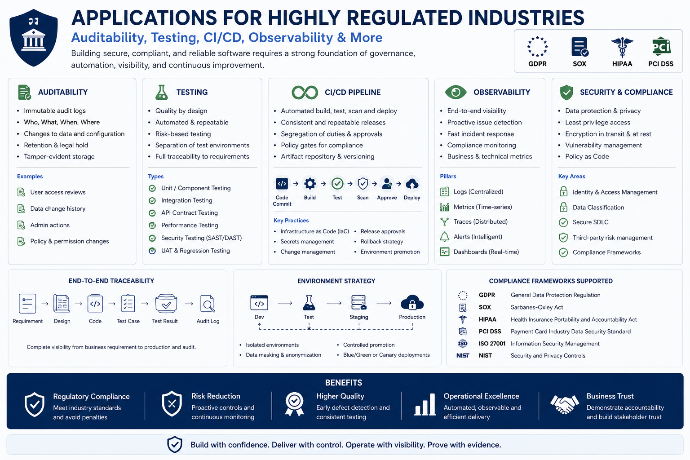
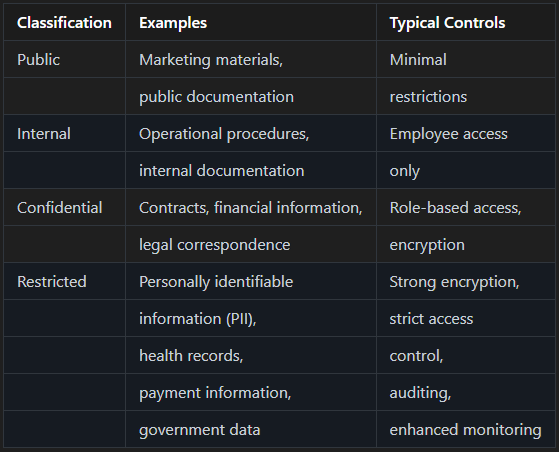

# JavaScript Everywhere – Part 3: Applications for Highly Regulated Industries - Auditability, Testing, CI/CD, Observability



_In Part 1 and Part 2, we discussed the general principles, compliance and governance in highly regulated environments._
_Now, in Part 3, we will continue discussion, specifically addressing responsibility allocation, auditability, and application CI/CD._

## Event Sourcing for Auditability

Law firms often need answers like:

```
- Who changed this?
- When?
- Why?
- What was the previous value?
```

Classic CRUD struggles here. So, instead:
- `CaseOpened`
- `LawyerAssigned`
- `EvidenceAdded`
- `EvidenceReviewed`
- `CaseClosed`

> [!NOTE]
> 📌  Store events permanently.

Example:

```json
{
  "eventType":"EvidenceAdded",
  "caseId":"123",
  "performedBy":"lawyerA",
  "timestamp":"2026-06-25T12:30:00Z"
}
```

> [!NOTE]
> 👉 Nothing gets deleted.

> [!NOTE]
> 👉 Only new events are added.

### Immutable Audit Trail

Separate audit database:

```
Operational DB
    +
Audit Store
```

> [!WARNING]
> ❗️ Never trust application logs alone.

Auditors typically require:
- tamper evidence
- retention policies
- historical reconstruction

### State Machine for Legal Workflows

This aligns perfectly with our previous interest in Stateless.

Example:

```
    Draft
      ↓
    Submitted
      ↓
    Under Review
      ↓
    Approved
      ↓
    Closed
```

In C#:

```csharp
stateMachine.Configure(State.Submitted)
    .Permit(Trigger.Review, State.UnderReview);
```

Benefits:
- explicit transitions
- auditability
- easier compliance reviews
- easier testing


### Role-Based Access Control

> [!NOTE]
> 👉 Legal applications usually require more than simple RBAC.

**RBAC**

```
    Administrator
    Lawyer
    Paralegal
    Auditor
    Client
```

**ABAC**

Attribute-based controls:

```
Lawyer can access only:
    Cases assigned to them
or
    Cases belonging to their office
```

Policy example:

```csharp
CanViewCase =
    User.Office == Case.Office
```

> [!WARNING]
> ❗️ This becomes critical for confidentiality.

### Versioning Legal Rules

- A common mistake: _Law changes in 2028_
- Developer modifies: _CalculateTax()_
- Now old cases produce different results.

> [!WARNING]
> ❗️ Disaster.

Instead of:

```
    TaxRule_2026
    TaxRule_2028
    TaxRule_2030
```

> [!NOTE]
> ✔  Each case stores ___RuleVersion___, so historical decisions remain reproducible.

## Testing and Continuous Verification

> [!IMPORTANT]
> 📌 In regulated environments, testing provides objective evidence that software satisfies specified requirements and continues to behave correctly as it evolves.

> [!WARNING]
> ❗️ Testing should be performed at multiple levels, with each level addressing different classes of defects.

> [!NOTE]
> 👉  No single testing technique is sufficient.


### Unit Testing

> [!NOTE]
> ✔ Unit tests verify individual classes or functions in isolation.

They should be:
- deterministic
- repeatable
- independent
- fast

Typical candidates include:
- domain models
- business rules
- validation logic
- calculations
- mapping functions

```
[Fact]
public void CriminalCaseWithoutEvidenceMustFail()
```

### Integration Testing

> [!NOTE]
> ✔  Integration tests verify interactions between components.
> 
> ✔  State Transition Tests must verify illegal transitions fail.

Typical examples include:
- database access
- REST APIs
- authentication providers
- message brokers
- cloud storage

```
Submitted
    → UnderReview
    → Approved
```

> [!NOTE]
> 👉  These tests confirm that independently correct components operate correctly together.

### Contract Testing

Distributed systems frequently evolve independently.

> [!NOTE]
> ✔  Contract testing verifies that communication between services remains compatible without requiring full end-to-end environments.
> 
> ✔  Contract Tests must cover `service-to-service` validation.

This is particularly valuable for:
- microservices
- public APIs
- partner integrations

```
Useful with:
    Service Bus
    REST APIs
```

### End-to-End Testing

> [!NOTE]
> ✔  ___End-to-end tests___ validate complete business workflows.
> 
> ✔ Also, as an ___Audit Tests___ must verify every action emits events with no exceptions.

Typical examples include:
- user registration
- legal case creation
- document approval
- payment processing

```
Create Case
    ↓
Audit Event Produced
```

> [!NOTE]
> 👉  Although slower than lower-level tests, they provide confidence that critical business processes function correctly.

### Security Testing

> [!WARNING]
> ❗️  Security should be verified continuously rather than assessed only before release.

Typical activities include:
- Static Application Security Testing (SAST)
- Dynamic Application Security Testing (DAST)
- dependency vulnerability scanning
- secret detection
- container image scanning
- penetration testing

### Performance Testing

> [!NOTE]
> ✔  Performance testing verifies that systems continue to satisfy operational requirements under realistic workloads.

Typical scenarios include:
- load testing
- stress testing
- endurance testing
- scalability testing
- failover testing

### Resilience Testing

> [!NOTE]
> ✔  Modern cloud applications should tolerate infrastructure failures.

Typical resilience tests include:
- service outages
- network latency
- message duplication
- partial failures
- database failover

> [!WARNING]
> 📌 Chaos engineering can help validate these behaviours under controlled conditions.

### Compliance Verification

Highly regulated systems often require additional verification, including:

- audit trail validation
- access control verification
- segregation of duties
- data retention policies
- encryption verification
- GDPR compliance testing

> [!IMPORTANT]
> 📌  These tests confirm not only that the application works, but also that it satisfies regulatory obligations.

### Test Pyramid
```
                 End-to-End
                      ▲
               Contract Tests
                      ▲
           Integration Tests
                      ▲
               Unit Tests
```

> [!IMPORTANT]
> 📌  A healthy test suite contains many fast unit tests, fewer integration tests, and a limited number of end-to-end tests covering critical business scenarios.

### Continuous Verification in CI/CD

Every code change should automatically trigger:

```
Source Code
      │
      ▼
Compilation
      │
      ▼
Static Analysis
      │
      ▼
Unit Tests
      │
      ▼
Integration Tests
      │
      ▼
Security Scanning
      │
      ▼
Contract Tests
      │
      ▼
Performance Smoke Tests
      │
      ▼
Artifact Signing
      │
      ▼
Deployment
```

> [!WARNING]
> ❗️ Failures at any stage should prevent deployment until resolved.

> [!NOTE]
> ✔ Enterprise testing is not a single activity but a continuous verification process spanning development, deployment, and production. 
> When combined with observability, automated governance, secure software supply chains, and disciplined architecture, 
> comprehensive testing provides the evidence required to support reliability, maintainability, and regulatory compliance over the lifetime of the application.

## CI/CD for Legal Compliance

Our Azure DevOps pipeline should produce:

```
Build
 ├─ Unit Tests
 ├─ Integration Tests
 ├─ Security Scan
 ├─ SBOM
 ├─ Container Scan
 ├─ Deployment Approval
 └─ Production Release
```

### Audit Every Deployment

For every release store:
- Commit
- Branch
- Build Number
- Approver
- Deployment Time
- Environment

> [!WARNING]
> ❗️ Auditors often ask: _Which version handled this case?_
> 
> Application must be able to answer instantly.

### Multi-Region High Availability

For legal platforms handling critical workloads ___Active-Active___ or ___Active-Passive___.

```
UK South
    │
UK West
    │
Europe West
```

In every message store:
- CorrelationId
- TenantId
- CaseId
- UserId

Example:

```json
{
  "correlationId":"..."
}
```

> [!NOTE]
> ✔  This becomes invaluable during investigations.

### Where JavaScript Fits Safely

**Green zone**:
- ✅ API Gateway
- ✅ BFF
- ✅ Real-time notifications
- ✅ WebSocket hubs
- ✅ Document preview services
- ✅ UI orchestration
- ✅ External integrations

**Yellow zone**:
- ⚠️ Workflow orchestration
- ⚠️ Reporting
- ⚠️ Search indexing

**Red zone**:
- ❌ Legal decision engine
- ❌ Case lifecycle rules
- ❌ Compliance calculations
- ❌ Audit generation
- ❌ Financial settlements
- ❌ Evidence integrity validation
- ❌ Regulatory reporting

### Legal SaaS deployed on Azure

We would to build:

```
Frontend
    React/Angular

Gateway
    Node.js or ASP.NET

Core Domain
    ASP.NET Core

Workflows
    .NET Worker Services
    Stateless State Machines

Messaging
    Azure Service Bus

Storage
    PostgreSQL

Search
    Elasticsearch/OpenSearch

Audit
    Event Store

Deployment
    AKS Kubernetes

CI/CD
    Azure DevOps
```

This gives us:
- ✔  strong auditability
- ✔  long-term maintainability
- ✔  regulatory traceability
- ✔  horizontal scalability
- ✔  cloud portability
- ✔  easier compliance reviews
- ✔  lower operational risk than a pure `JavaScript/Node.js` solution

> [!IMPORTANT]
> 📌 Though, let us note that this is not an environment where JavaScript is used everywhere. 
> Let us note that the typical backend is not JavaScript's domain.


## Observability and Operational Compliance

Observability is crucial for legal applications to ensure compliance and detect issues early. Key aspects include:

- **Logging**: Capture detailed logs of all actions and decisions.
- **Metrics**: Monitor system performance and usage patterns.
- **Tracing**: Track the flow of requests through the system to identify bottlenecks and failures.

> [!IMPORTANT]
> 📌 Compliance does not end when software is deployed. Highly regulated systems must continuously demonstrate correct behaviour, 
> provide traceability, and support incident investigation throughout their operational lifetime.

Modern enterprise applications should be designed to be ___observable___, enabling engineers, security teams, and auditors to understand what the system is doing without modifying its code.

> [!NOTE]
> 👉 Observability complements testing by providing evidence of system behaviour in production.

### Structured Logging

Traditional free-text log messages are difficult to search, correlate, and analyse.

Instead, applications should produce structured logs using formats such as JSON.

Example:

```json
{
    "timestamp": "2026-06-25T10:15:42Z",
    "level": "Information",
    "service": "CaseManagement",
    "operation": "CreateCase",
    "caseId": "CA-10452",
    "correlationId": "6f91d2e8-53b5-4d83-b4e3-f4f17c2f7d3f",
    "userId": "USR-421"
}
```

Structured logging enables:
- efficient searching
- automated monitoring
- security analysis
- forensic investigations
- compliance reporting

> [!NOTE]
> ✔ Log messages should describe business events rather than implementation details whenever possible.

### Correlation IDs

Enterprise requests often traverse multiple services.

```
Client
   │
   ▼
API Gateway
   │
   ▼
Service A
   │
   ▼
Service B
   │
   ▼
Database
```

Without correlation identifiers, reconstructing a single business transaction across distributed systems becomes extremely difficult.

Every incoming request should receive a unique ___Correlation ID___, which should be propagated through:
- ___HTTP headers___
- ___message queues___
- ___background workers___
- ___scheduled jobs___
- ___external API calls___

This enables complete end-to-end traceability.

### Distributed Tracing

Logs alone rarely explain where latency or failures occur.

Distributed tracing records the complete execution path of a request across services.

Typical trace information includes:
- ___request duration___
- ___service boundaries___
- ___database calls___
- ___external API calls___
- ___message processing___
- ___exceptions___

Tracing significantly reduces incident investigation time in distributed architectures.

### Metrics

Metrics provide continuous visibility into system health.

Typical enterprise metrics include:
- ___request throughput___
- ___response time___
- ___error rate___
- ___queue length___
- ___CPU utilisation___
- ___memory consumption___
- ___database connection usage___
- ___cache hit ratio___

Unlike logs, metrics are designed for trend analysis and proactive alerting.

### Immutable Audit Logs

Operational logs and audit logs serve different purposes.
- ___Operational logs___ assist developers in diagnosing technical issues.
- ___Audit logs___ provide legally defensible evidence of business activities.

Audit records should include:
- who performed an action
- what changed
- when it occurred
- where the request originated
- previous values (where appropriate)
- new values
- business justification, if required

> [!WARNING]
> ❗️ Audit logs should be immutable. They should not be editable or deletable by application users or administrators.

In regulated industries, audit records frequently form part of legal evidence and must therefore be protected against tampering.

### OpenTelemetry

Modern enterprise systems increasingly standardise observability using ___OpenTelemetry___ (___OTel___).

___OpenTelemetry___ provides a vendor-neutral framework for collecting:
- logs
- metrics
- traces

This enables consistent observability across cloud providers and monitoring platforms.

A single instrumentation approach can export telemetry to systems such as Azure Monitor, Grafana, Jaeger, Zipkin, Elastic, or Datadog without changing application code.

### Enterprise Observability Pipeline

```
Application
      │
      ▼
Structured Logging
      │
      ▼
Metrics
      │
      ▼
Distributed Traces
      │
      ▼
OpenTelemetry
      │
      ▼
Monitoring Platform
      │
      ├────────► Dashboards
      ├────────► Alerts
      ├────────► Incident Response
      └────────► Compliance Reporting
```

## Data Governance and Information Protection

> [!IMPORTANT]
> 📌 In highly regulated industries, protecting the application's source code is only part of the challenge. 
> Equal attention must be given to governing the data that the application stores, processes, transmits, and archives throughout its lifecycle.

Data governance establishes the policies, controls, and technical safeguards that ensure information remains accurate, secure, available, and compliant with applicable legal and regulatory requirements.

### Data Classification

Not all information requires the same level of protection.

Organisations should classify data according to its sensitivity and business impact.

A typical classification model includes:

| Classification | Examples                         | Typical Controls |
|:---------------|:---------------------------------|:----------------|
| Public         |Marketing materials,              |Minimal |
|                |public documentation              |restrictions |
| Internal       |Operational procedures,           |Employee access |
|                |internal documentation            |only |
| Confidential   |Contracts, financial information, |Role-based access, |
|                |legal correspondence              |encryption |
| Restricted     |Personally identifiable           |Strong encryption, |
|                |information (PII),                |strict access |
|                |health records,                   |control,   |
|                |payment information,              |auditing,|
|                |government data                   |enhanced monitoring|

<>

Data classification should determine:
- access permissions
- retention periods
- encryption requirements
- backup policies
- audit requirements
- monitoring intensity

> [!NOTE]
> ✔ Security controls should be proportional to the sensitivity of the information being protected.

### Data Minimisation

Applications should collect only the information necessary to perform their intended business functions.

For example, if a legal case requires only a client's name and contact details, collecting additional personal information without a legitimate purpose increases both compliance obligations and organisational risk.

Data minimisation reduces:
- regulatory exposure
- storage costs
- breach impact
- long-term maintenance

> [!NOTE]
> ✔ This principle is central to privacy regulations such as GDPR.

### Encryption in Transit

Sensitive information should always be encrypted while travelling between systems.

Typical communication channels include:
- browsers
- mobile applications
- APIs
- message brokers
- databases
- cloud services

Transport Layer Security (TLS) should be enforced for all external and internal communications carrying confidential information.

> [!WARNING]
> ❌  Unencrypted communication channels should never be used for transmitting regulated data.

### Encryption at Rest

Data stored in databases, file systems, object storage, and backups should also be encrypted.

Typical examples include:
- relational databases
- document storage
- cloud storage
- backup repositories
- archival media

> [!NOTE]
> ✔ Encryption at rest helps protect information against unauthorised access when storage media are compromised.

### Key Management

> [!WARNING]
> ❗️ Encryption is only as secure as the protection of its cryptographic keys.

> [!IMPORTANT]
> ❌ Enterprise applications should never embed encryption keys directly within source code or configuration files.

Instead, organisations should use dedicated key management solutions capable of:
- secure key storage
- automated key rotation
- access auditing
- version management
- hardware-backed protection where appropriate

> [!NOTE]
> ✔ Compromise of encryption keys effectively compromises encrypted data.

### Access Control

Data protection depends not only on encryption but also on ensuring that only authorised users and services can access sensitive information.

> [!WARNING]
> ❗️ Access should follow the principle of least privilege, granting users and services only the permissions necessary to perform their responsibilities.

Enterprise systems should support:
- Role-Based Access Control (RBAC)
- Attribute-Based Access Control (ABAC), where appropriate
- separation of duties
- privileged access management
- periodic access reviews

> [!WARNING]
> ❗️ Authorisation decisions should be centrally managed, consistently enforced, and fully auditable.

### Data Integrity

> [!WARNING]
> ❗️Protecting confidentiality alone is insufficient.

> [!IMPORTANT]
> ❌ Enterprise applications must also ensure that information cannot be modified without authorisation.

Integrity controls may include:
- database constraints
- optimistic concurrency control
- cryptographic hashes
- digital signatures
- immutable audit trails
- version history

> [!WARNING]
> ❗️ These controls help detect accidental corruption and unauthorised modifications.

### Backup and Recovery

Business continuity depends upon the ability to recover data following failures, cyber-attacks, or operational incidents.

Backup strategies should define:
- backup frequency
- retention periods
- geographic redundancy
- recovery procedures
- restoration testing

> [!IMPORTANT]
> 📌 A backup that has never been successfully restored should not be considered a reliable backup.

> [!WARNING]
> ❗️ Recovery procedures should be exercised regularly rather than assumed to function correctly.

### Data Retention and Secure Disposal

> [!WARNING]
> ❗️ Information should not be retained indefinitely.

Retention policies should define:
- what information is retained
- how long it is retained
- legal justification
- archival procedures
- secure deletion methods

> [!WARNING]
> ❗️ When retention periods expire, data should be securely removed from production systems, backups, and archives where required by law.

Proper disposal reduces compliance risk while limiting unnecessary storage costs.

### Data Residency and Sovereignty

Many organisations operate across multiple jurisdictions.

Applications should therefore consider:
- where data is stored
- where backups are located
- where disaster recovery environments operate
- applicable national and regional regulations
- contractual obligations regarding data location

> [!NOTE]
> ✔  Cloud-native architectures should be designed with jurisdictional requirements in mind rather than treating location as an infrastructure concern alone.

### Privacy by Design

Privacy considerations should be incorporated throughout the software development lifecycle rather than introduced after implementation.

Examples include:
- data minimisation
- pseudonymisation
- encryption
- purpose limitation
- least-privilege access
- consent management
- auditability

> [!IMPORTANT]
> 📌 Embedding privacy into system architecture reduces compliance risk while improving long-term maintainability.

### Data Governance Lifecycle

```
Business Requirements
          │
          ▼
Data Classification
          │
          ▼
Collection
          │
          ▼
Validation
          │
          ▼
Storage
          │
          ▼
Encryption
          │
          ▼
Access Control
          │
          ▼
Audit Logging
          │
          ▼
Backup & Recovery
          │
          ▼
Retention
          │
          ▼
Secure Disposal
```

### Enterprise Data Governance Checklist

A mature enterprise application should provide:
- data classification
- data minimisation
- encryption in transit
- encryption at rest
- secure key management
- least-privilege access control
- comprehensive audit logging
- integrity verification
- tested backup and recovery procedures
- documented retention policies
- secure disposal processes
- privacy by design

> [!IMPORTANT]
> 📌 No individual control is sufficient on its own. 
> Effective data governance requires multiple complementary safeguards operating together throughout the application's lifecycle.

## Takeaways

### Software for Lawyers – Key Characteristics

Legal software differs significantly from many other business applications because it operates within a highly regulated environment where correctness, traceability, and long-term maintainability are essential.

Typical characteristics include:
- Regulatory compliance is mandatory rather than optional.
- Software is frequently **mission-critical** and **compliance-critical**.
- Some legal automation solutions may also be **safety-critical**, depending on their application domain.
- Business logic is often highly complex, reflecting legislation, regulations, contracts, case law, and organisational policies.
- Long-lived legal rules frequently coexist with rapidly changing legislation and regulatory guidance.
- Long-running business processes and transactional workflows are common.
- Every business decision should be explainable, traceable, auditable and reproducible.
- The system should provide sufficient evidence to demonstrate how, when, and why a particular decision was reached.
- Many business processes require complete historical traceability rather than simply recording the current system state.
- Regulatory non-compliance may result in significant financial penalties, civil liability, professional misconduct proceedings, or, in some jurisdictions, criminal sanctions.
- Personally identifiable information (PII) and other confidential data require strong protection throughout their lifecycle.
- High availability, disaster recovery, and business continuity are often mandatory rather than desirable.
- Applications frequently integrate with courts, government agencies, financial institutions, identity providers, document management systems, and other external services.
- Software frequently remains in production for many years, requiring maintainable architecture and controlled evolution.
- Backend business logic typically dominates overall system complexity, while user interfaces primarily facilitate interaction with that logic.
- Deterministic business behaviour is essential, ensuring that identical inputs consistently produce identical business outcomes.
- Enterprise legal systems require comprehensive observability, including structured logging, distributed tracing, metrics, and immutable audit trails.
- Compliance maturity should be continuously assessed and improved using an appropriate compliance maturity model, with mature organisations typically targeting **Level 4 (Managed)** or higher.

### A simple mental model

> [!WARNING]
> ❗️ JavaScript is compliant-capable, but it introduces certain risks.

**Think of JavaScript backend as**:
> [!NOTE]
> ✔  “A high-concurrency orchestration engine for I/O systems”

**Not**:
> [!IMPORTANT]
> ❌  “A high-performance computation engine”

### Final assessment

```
| Area                          | JavaScript / Node.js          |
| ----------------------------- | ----------------------------- |
| GDPR                          | ✅ Fully achievable           |
| SOC 2                         | ✅ Fully achievable           |
| SRA requirements              | ✅ Fully achievable           |
| PCI DSS                       | ✅ Fully achievable           |
| Long-term maintainability     | ⚠️ Requires strong discipline |
| Complex legal/business rules  | ⚠️ Possible but not ideal     |
| Audit-critical domain logic   | ⚠️ Better in C# or Java       |
| API gateways and integrations | ✅ Good choice                |
| Real-time features            | ✅ Good choice                |
```

### Final Recommendation

> [!NOTE]
> ✔ For highly regulated software, plain ___JavaScript___ should generally be avoided.

___TypeScript___, configured in strict mode and combined with runtime validation, static analysis, comprehensive testing, 
and disciplined architecture, should be regarded as the minimum acceptable baseline for enterprise Node.js development.

This does not eliminate the need for secure architecture, governance, or compliance controls, but it substantially reduces an entire class of avoidable implementation defects before software reaches production.


> [!NOTE]
> ✔ Observability should be considered a core architectural capability rather than an operational afterthought.

Structured logging, distributed tracing, metrics, immutable audit trails, and standardised telemetry enable organisations to 
- demonstrate compliance, 
- detect anomalies, 
- investigate incidents, 
- and continuously improve system reliability.


> [!NOTE]
> ✔ Data governance should be regarded as a fundamental architectural concern rather than solely an operational or regulatory responsibility.

Well-designed enterprise systems protect information throughout its entire lifecycle—from initial collection and validation to: 
- storage, 
- transmission, 
- backup, 
- archival, 
- secure disposal. 

When combined with:
- disciplined architecture, 
- comprehensive testing, 
- secure software supply chain management, 
- robust observability, 
effective data governance provides the foundation for building trustworthy applications in highly regulated environments.


### Final thoughts

> [!NOTE]
> ✔  The user interface of an application for lawyers typically consists of a form for entering a legal inquiry and a window displaying the answer to the question asked.
> 
> [!IMPORTANT]
> ❌  Nevertheless, to provide a response, the backend system often needs to query the APIs of multiple industry services, evaluate various alternatives, and resolve conflicting suggestions.

A user unfamiliar with legal regulations will likely be satisfied with a standard response from the database.

However, it is doubtful that such a software-generated answer would satisfy a professional lawyer - who typically deals with complex scenarios, 
given that they likely know the answers to simple questions by heart.


> [!IMPORTANT]
> ❌  Given that using JavaScript entails the following:
- ensuring and maintaining software compliance with formal requirements is difficult or extremely difficult,
- dynamic typing and runtime type determination are not advantageous in a highly regulated environment,
- the developer lacks control over hundreds of library packages that are frequently updated and implicitly included in the application,
- application testing can become significantly more difficult,
- even minor code updates usually require very thorough, deep application testing,
- highly regulated software is a frequent target for hackers and therefore requires particularly rigorous and frequent testing—not just during version updates,

**therefore, for systems whose primary challenge is highly regulated, long-lived domain logic, I believe JavaScript should generally not be the primary implementation language.** 

It excels as an orchestration, integration, and API layer, while languages with stronger type systems and mature enterprise tooling are often a better fit for the system of record.
This view is also supported by the choices made by leaders in the software industry.

> [!NOTE]
> 👉 Let’s face it. Today, back-end software for lawyers will always center on complex business logic. 
> There are already plenty of "apps for the dummies" on the market, and we probably don't need any more of them.

And what do you think, dear reader?

## See also:
1. [Open Standards for Government](https://www.gov.uk/government/publications/open-standards-for-government)
2. [Open standards for government data and technology](https://www.gov.uk/government/collections/open-standards-for-government-data-and-technology)
3. [A guide to good practice for digital and data-driven health technologies](https://www.gov.uk/government/publications/code-of-conduct-for-data-driven-health-and-care-technology/initial-code-of-conduct-for-data-driven-health-and-care-technology)
4. [UK Government Publishes Guidelines for Artificial Intelligence Procurement](https://www.bevanbrittan.com/insights/articles/2020/uk-government-publishes-guidelines-for-artificial-intelligence-procurement/)
5. [Dependabot quickstart guide](https://docs.github.com/en/code-security/tutorials/secure-your-dependencies/dependabot-quickstart)

## See:
- [JavaScript Everywhere – Part 1: Applications for Highly Regulated Industries (e.g., for Lawyers)](https://www.linkedin.com/pulse/javascript-everywhere-part-1-applications-highly-regulated-kubis-dcxie/)
- [JavaScript Everywhere – Part 2: Applications for Highly Regulated Industries - Compliance and Governance](https://www.linkedin.com/pulse/javascript-everywhere-part-2-applications-highly-regulated-kubis-wc0je/)

- [Availability vs Identity in Distributed C#/.NET Applications - Part 1: The Role of Availability and Identity](https://www.linkedin.com/pulse/availability-vs-identity-distributed-cnet-part-1-role-marek-kubis-xvpze/)
- [Availability vs Identity in Distributed C#/.NET Applications - Part 2: Lock-in on Use Cases and on Cloud](https://www.linkedin.com/pulse/availability-vs-identity-distributed-cnet-part-2-lock-in-kubis-zhmee/)

- [What is managed identities for Azure resources?](https://learn.microsoft.com/en-us/azure/active-directory/managed-identities-azure-resources/overview)
- [IAM Roles](https://docs.aws.amazon.com/IAM/latest/UserGuide/id_roles.html)
- [Authenticate to Google Cloud APIs from GKE workloads](https://cloud.google.com/kubernetes-engine/docs/how-to/workload-identity)
- [What is Azure role-based access control (Azure RBAC)?](https://learn.microsoft.com/en-us/azure/role-based-access-control/overview)

- [Once and Only Once with Examples - Part 1: Is It Obvious?](https://www.linkedin.com/pulse/once-only-examples-part-1-obvious-marek-kubis-nyebe/)
- [Once and Only Once with Examples - Part 2: And AI-generated Code](https://www.linkedin.com/pulse/once-only-examples-part-2-ai-generated-code-marek-kubis-kn9ie/)
- [Once and Only Once with Examples - Part 3: Where Duplication Is Simultaneously Necessary](https://www.linkedin.com/pulse/once-only-examples-part-3-where-duplication-necessary-marek-kubis-vpxce/)

- [Mutation testing - Part 1: is it outdated?](https://lnkd.in/eDbVukCf)
- [Mutation testing - Part 2: Turn into a production-ready tool](https://lnkd.in/eSx9b6pB)
- [Mutation testing - Part 3: Mutation testing limits and how to go beyond it](https://lnkd.in/e3qsTXBy)
- [Mutation testing - Part 4: mutation testing and LLM-written code](https://lnkd.in/eKfvJfbp)

- [Underestimated and Annoying, or the "Dirty Dozen" of Programmers - Part 1: The Problem Space](https://www.linkedin.com/pulse/underestimated-annoying-dirty-dozen-programmers-marek-kubis-mcfxe)
- [Underestimated and Annoying, that is "The Dirty Dozen" of Programmers - Part 2: AI-Generated Software](https://www.linkedin.com/pulse/underestimated-annoying-dirty-dozen-programmers-part-2-marek-kubis-tqkme/)
- [Underestimated and Annoying, that is "The Dirty Dozen" of Programmers - Part 3: I. Organizational Problems](https://www.linkedin.com/pulse/underestimated-annoying-dirty-dozen-programmers-part-marek-kubis-h9y3e/)
- [Underestimated and Annoying, that is "The Dirty Dozen" of Programmers - Part 4: II. Human Problems](https://www.linkedin.com/pulse/underestimated-annoying-dirty-dozen-programmers-part-marek-kubis-mn5ve/)
- [Underestimated and Annoying, that is "The Dirty Dozen" of Programmers - Part 5: III. Process Problems](https://www.linkedin.com/pulse/underestimated-annoying-dirty-dozen-vibe-coding-part-marek-kubis-83jre/)
- [Underestimated and Annoying, that is "The Dirty Dozen" of Programmers - Part 6: IV. Architecture Problems](https://www.linkedin.com/pulse/underestimated-annoying-dirty-dozen-programmers-part-marek-kubis-remze/)
- [Underestimated and Annoying, that is "The Dirty Dozen" of Programmers - Part 7: V. Validation Problems](https://www.linkedin.com/pulse/underestimated-annoying-dirty-dozen-programmers-part-marek-kubis-dqk2e/)
- [Underestimated and Annoying, that is "The Dirty Dozen" of Programmers - Part 8: VI. Economic Problems](https://www.linkedin.com/pulse/underestimated-annoying-dirty-dozen-programmers-part-marek-kubis-7bb6e/)

- [Murphy’s law and more in AI time - one by one with examples](https://www.linkedin.com/pulse/murphys-law-more-ai-time-one-examples-marek-kubis-fkaze)
- [The Agile Vibe Coding and Conway's Law](https://www.linkedin.com/pulse/agile-vibe-coding-conways-law-marek-kubis-m0wpe)
- [Using a digital banking solution to prove Conway’s Law in AI-Driven engineering - example 1](https://www.linkedin.com/pulse/using-digital-banking-solution-prove-conways-law-ai-driven-kubis-xqlre/)
- [Using a .NET 10 migration project to prove Conway’s Law in AI-Driven engineering - example 2](https://www.linkedin.com/pulse/using-net-10-migration-project-prove-conways-law-ai-driven-kubis-abqae)

- [Where traditional Agile breaks in AI-driven systems](https://www.linkedin.com/pulse/where-traditional-agile-breaks-ai-driven-systems-marek-kubis-4wq6e/)
- [AI - It seems nobody has it fully figured out yet](https://www.linkedin.com/pulse/ai-nobody-has-figured-out-marek-kubis-bkyge)
- [Internal Development Platform and Agile Vibe Coding](https://www.linkedin.com/pulse/internal-development-platform-agile-vibe-coding-marek-kubis-kyhqe/?trackingId=5w3lWKp%2F0BLUpwNdrSmAcg%3D%3D&lipi=urn%3Ali%3Apage%3Ad_flagship3_pulse_read%3BqH%2FwqbkZRkmo%2Fagtxvqyrw%3D%3D)
- [Everyone will be vibe coders](https://www.linkedin.com/pulse/everyone-vibe-coders-marek-kubis-tlgze)
- [The Structural problems AI introduces into the SDLC](https://www.linkedin.com/pulse/structural-problems-ai-introduces-sdlc-marek-kubis-qyt6e)
- [Signals That Reveal the True Maturity of Organisations Claiming “AI-Driven Development”](https://www.linkedin.com/pulse/signals-reveal-true-maturity-organisations-claiming-ai-driven-kubis-urule)

- [Agile Vibe Coding positioning and if this works, what changes?](https://www.linkedin.com/pulse/agile-vibe-coding-positioning-works-what-changes-marek-kubis-r4ate)
- [Agile Vibe Coding – Ceremony Modes](https://www.linkedin.com/pulse/agile-vibe-coding-ceremony-modes-marek-kubis-meq9e)
- [Agile Vibe Coding ceremonies approach compared to a simple one-prompt-per-task approach](https://www.linkedin.com/pulse/agile-vibe-coding-ceremonies-approach-compared-simple-marek-kubis-ecx5e)
- [Agile Vibe Coding Maturity Model](https://www.linkedin.com/pulse/agile-vibe-coding-maturity-model-marek-kubis-bbtqe)
- [The Agile Vibe Coding - the 4-level adaptive ceremony system](https://www.linkedin.com/pulse/agile-vibe-coding-4-level-adaptive-ceremony-system-marek-kubis-jizke)

- [Agile Vibe Coding Manifesto](https://agilevibecoding.org/)
- [Principles Behind the Agile Vibe Coding Manifesto - extended version](https://github.com/marekartur-dev/agilevibecoding/blob/main/Docs/Home/Principles.md)

- [Agile Vibe Coding](https://www.reddit.com/r/AgileVibeCoding/)
- [Marek Kubis - blog](https://github.com/marekartur-dev/agilevibecoding/tree/main)
